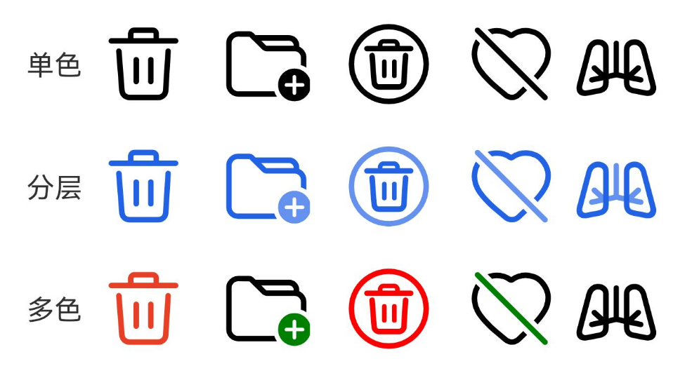
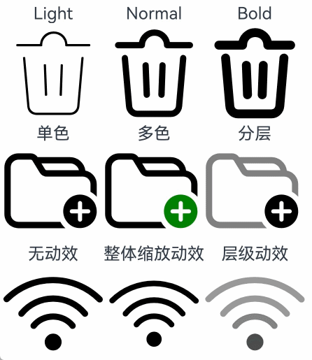

# SymbolSpan

作为Text组件的子组件，用于显示图标小符号的组件。

>  **说明：**
>
> - 该组件从API Version 20开始支持跨平台。后续版本如有新增内容，则采用上角标单独标记该内容的起始版本。
> - 该组件支持继承父组件Text的属性，即如果子组件未设置属性且父组件设置属性，则继承父组件设置的全部属性。
> - SymbolSpan拖拽不会置灰显示
> 
## 子组件

不支持子组件。

##  接口

SymbolSpan(value: Resource)

**支持平台：** Android、iOS

**参数:**

| 参数名     | 参数类型                                        | 必填 | 描述                                                         |
| ---------- | ----------------------------------------------- | ---- | ------------------------------------------------------------ |
| value | [Resource](ts-types.md#resource) | 是   | SymbolSpan组件的资源名，如 $r(‘sys.symbol.ohos_wifi’)。       |

**说明:**

$r(‘sys.symbol.ohos_wifi’)中引用的资源为系统预置，SymbolSpan仅支持系统预置的symbol资源名，引用非symbol资源将显示异常。

## 属性

不支持[通用属性](README.md)，支持以下属性：

### fontColor
fontColor(value: Array<ResourceColor>)

设置SymbolSpan组件颜色。

**支持平台：** Android、iOS

参数：

| 参数名     | 参数类型                                        | 必填 | 描述                                                         |
| ---------- | ----------------------------------------------- | ---- | ------------------------------------------------------------ |
| value | Array<[ResourceColor](ts-types.md#resourcecolor)> | 是   | SymbolSpan组件颜色。<br/>默认值：不同渲染策略下默认值不同。       |


### fontSize
fontSize(value: number | string | Resource)

设置SymbolSpan组件大小。设置string类型时，支持number类型取值的字符串形式，可以附带单位，例如"10"、“10fp”。

**支持平台：** Android、iOS

参数：
| 参数名     | 参数类型                                        | 必填 | 描述                                                         |
| ---------- | ----------------------------------------------- | ---- | ------------------------------------------------------------ |
| value | number \| string \| [Resource](ts-types.md#resource) | 是   | SymbolSpan组件大小。<br/>默认值：16fp <br/>单位：fp      |


### fontWeight
fontWeight(value: number | FontWeight | string)

设置SymbolSpan组件粗细。number类型取值[100,900]，取值间隔为100，默认为400，取值越大，字体越粗。string类型仅支持number类型取值的字符串形式，例如“400”，以及“bold”、“bolder”、“lighter”、“regular” 、“medium”分别对应FontWeight中相应的枚举值。

sys.symbol.ohos_lungs图标不支持设置fontWeight。

**支持平台：** Android、iOS

参数：
| 参数名     | 参数类型                                        | 必填 | 描述                                                         |
| ---------- | ----------------------------------------------- | ---- | ------------------------------------------------------------ |
| value | number \| [FontWeight](ts-appendix-enums.md#fontweight) \| string | 是   | SymbolSpan组件粗细。<br/>默认值：FontWeight.Normal      |


### renderingStrategy
renderingStrategy(value: SymbolRenderingStrategy)

设置SymbolSpan渲染策略。

**支持平台：** Android、iOS

参数：

| 参数名     | 参数类型                                        | 必填 | 描述                                                         |
| ---------- | ----------------------------------------------- | ---- | ------------------------------------------------------------ |
| value | [SymbolRenderingStrategy](ts-basic-components-symbolglyph.md#symbolrenderingstrategy枚举说明) | 是   | SymbolSpan渲染策略。<br/>默认值：SymbolRenderingStrategy.SINGLE      |

不同渲染策略效果可参考以下示意图。



### effectStrategy
effectStrategy(value: SymbolEffectStrategy)

设置SymbolSpan动效策略。

**支持平台：** Android、iOS

参数：

| 参数名     | 参数类型                                        | 必填 | 描述                                                         |
| ---------- | ----------------------------------------------- | ---- | ------------------------------------------------------------ |
| value | [SymbolEffectStrategy](ts-basic-components-symbolglyph.md#symboleffectstrategy枚举说明) | 是   | SymbolSpan动效策略。<br/>默认值：SymbolEffectStrategy.NONE      |

### attributeModifier
attributeModifier(modifier: AttributeModifier&lt;SymbolSpanAttribute&gt;)

设置组件的动态属性。

**支持平台：** Android、iOS

参数：
| 参数名     | 参数类型                                        | 必填 | 描述                                                         |
| ---------- | ----------------------------------------------- | ---- | ------------------------------------------------------------ |
| modifier | AttributeModifier&lt;SymbolSpanAttribute&gt; | 是   | 动态设置组件的属性。     |

## 事件
不支持[通用事件](README.md)。

## 示例

示例1（设置渲染和动效策略）
该示例通过renderingStrategy、effectStrategy属性展示了不同的渲染和动效策略。

```ts
// xxx.ets
@Entry
@Component
struct Index {
  build() {
    Column() {
      Row() {
        Column() {
          Text("Light")
          Text() {
            SymbolSpan($r('sys.symbol.ohos_trash'))
              .fontWeight(FontWeight.Lighter)
              .fontSize(96)
          }
        }

        Column() {
          Text("Normal")
          Text() {
            SymbolSpan($r('sys.symbol.ohos_trash'))
              .fontWeight(FontWeight.Normal)
              .fontSize(96)
          }
        }

        Column() {
          Text("Bold")
          Text() {
            SymbolSpan($r('sys.symbol.ohos_trash'))
              .fontWeight(FontWeight.Bold)
              .fontSize(96)
          }
        }
      }

      Row() {
        Column() {
          Text("单色")
          Text() {
            SymbolSpan($r('sys.symbol.ohos_folder_badge_plus'))
              .fontSize(96)
              .renderingStrategy(SymbolRenderingStrategy.SINGLE)
              .fontColor([Color.Black, Color.Green, Color.White])
          }
        }

        Column() {
          Text("多色")
          Text() {
            SymbolSpan($r('sys.symbol.ohos_folder_badge_plus'))
              .fontSize(96)
              .renderingStrategy(SymbolRenderingStrategy.MULTIPLE_COLOR)
              .fontColor([Color.Black, Color.Green, Color.White])
          }
        }

        Column() {
          Text("分层")
          Text() {
            SymbolSpan($r('sys.symbol.ohos_folder_badge_plus'))
              .fontSize(96)
              .renderingStrategy(SymbolRenderingStrategy.MULTIPLE_OPACITY)
              .fontColor([Color.Black, Color.Green, Color.White])
          }
        }
      }

      Row() {
        Column() {
          Text("无动效")
          Text() {
            SymbolSpan($r('sys.symbol.ohos_wifi'))
              .fontSize(96)
              .effectStrategy(SymbolEffectStrategy.NONE)
          }
        }

        Column() {
          Text("整体缩放动效")
          Text() {
            SymbolSpan($r('sys.symbol.ohos_wifi'))
              .fontSize(96)
              .effectStrategy(1)
          }
        }

        Column() {
          Text("层级动效")
          Text() {
            SymbolSpan($r('sys.symbol.ohos_wifi'))
              .fontSize(96)
              .effectStrategy(2)
          }
        }
      }
    }
  }
}
```



示例2（设置动态属性）
该示例通过attributeModifier属性创建指定样式图标。

```ts
import { SymbolSpanModifier } from '@kit.ArkUI';

@Entry
@Component
struct Index {
  @State modifier: SymbolSpanModifier =
    new SymbolSpanModifier($r("sys.symbol.ohos_wifi")).fontColor([Color.Blue]).fontSize(100);

  build() {
    Row() {
      Column() {
        Text() {
          SymbolSpan(undefined).attributeModifier(this.modifier)
        }
      }
      .width('100%')
    }
    .height('100%')
  }
}
```

