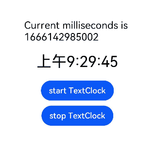

# TextClock

TextClock组件通过文本将当前系统时间显示在设备上。支持不同时区的时间显示，最高精度到秒级。

>**说明：**
>
>该组件从API Version 8开始支持。后续版本如有新增内容，则采用上角标单独标记该内容的起始版本。

## 子组件

无

## 接口

TextClock(options?: { timeZoneOffset?: number, controller?: TextClockController })

**参数：** 

| 参数名            | 参数类型      | 必填     | 参数描述                                                     |
| -------------- | -------- | ------ | --------------------------------------------------------------------------- |
| timeZoneOffset | number   | 否     | 设置时区偏移量。<br>取值范围为[-14, 12]，表示东十二区到西十二区，其中负值表示东时区，正值表示西时区，比如东八区为-8。<br>对横跨国际日界线的国家或地区，用-13（UTC+13）和-14（UTC+14）来保证整个国家或者区域处在相同的时间，当设置的值不在取值范围内时，将使用当前系统的时区偏移量。<br/>默认值：当前系统的时区偏移量 |
| controller     | [TextClockController](#textclockcontroller) | 否      | 绑定一个控制器，用来控制文本时钟的状态。|

## 属性

除支持[通用属性](ts-universal-attributes-size.md)外，还支持以下属性：

| 名称   | 参数类型 | 描述                                                         |
| ------ | -------- | ------------------------------------------------------------ |
| format | string   | y：年（yyyy表示完整年份，yy表示年份后两位）<br />M：月（若想使用01月则使用MM）<br />d：日（若想使用01日则使用dd）<br />E：星期（若想使用星期六则使用EEEE，若想使用周六则使用E、EE、EEE）<br />H：小时（24小时制）   h：小时（12小时制）    <br/>m：分钟<br/>s：秒<br/>SS：厘秒(format中S个数<3，全部按厘秒处理)<br />SSS：毫秒(format中S个数>=3，全部按毫秒处理<br/>a：上午/下午（当设置小时制式为H时，该参数不生效）<br />日期间隔符："年月日"、“/”、"-"、"."（可以自定义间隔符样式，间隔符不可以为字母，汉字则作为间隔符处理）<br />允许自行拼接组合显示格式，即：年、月、日、星期、时、分、秒、毫秒可拆分为子元素，可自行排布组合。<br />当设置无效字母时（非上述字母被认为是无效字母，多个有效字母会识别其中的有效组合进行匹配，例：yyyyy会匹配其中的yyyy为有效组合，多余的y认为是无效字母），该字母会被忽略。如果format全是无效字母时，显示为格式yyyy/MM/dd aa hh:mm:ss.SS<br />若format为空或者undefined，则使用默认值。<br />默认值：aa hh:mm:ss |

以下是format输入的格式样式及对应的显示效果：

| 输入格式              | 显示效果 |
| ------------------------------------------------------------ | ------ |
| yyyy年M月d日 EEEE       | 2023年2月4日 星期六 |
| yyyy年M月d日            | 2023年2月4日        |
| M月d日 EEEE             | 2月4日 星期六       |
| M月d日                  | 2月4日              |
| MM/dd/yyyy              | 02/04/2023          |
| EEEE MM月dd日           | 星期六 02月04日     |
| yyyy（完整年份）        | 2023年              |
| yy（年份后两位）        | 23年                |
| MM（完整月份）          | 02月                |
| M（月份）               | 2月 |
| dd（完整日期） | 04日 |
| d（日期） | 4日 |
| EEEE（完整星期） | 星期六 |
| E、EE、EEE（简写星期） | 周六 |
| yyyy年M月d日 | 2023年2月4日 |
| yyyy/M/d | 2023/2/4 |
| yyyy-M-d | 2023-2-4 |
| yyyy.M.d | 2023.2.4 |
| HH:mm:ss（时:分:秒） | 17:00:04 |
| aa hh:mm:ss（时:分:秒） | 上午 5:00:04 |
| hh:mm:ss（时:分:秒） | 5:00:04 |
| HH:mm（时:分） | 17:00 |
| aa hh:mm（时:分） | 上午 5:00 |
| hh:mm（时:分） | 5:00 |
| mm:ss（分:秒） | 00:04 |
| mm:ss.SS（分:秒.厘秒） | 00:04.91 |
| mm:ss.SSS（分:秒.毫秒） | 00:04.536 |
| hh:mm:ss aa | 5:00:04 上午 |
| HH | 17 |

## 事件

除支持[通用事件](ts-universal-events-click.md)外，还支持以下事件：

| 名称                                         | 功能描述                                                     |
| -------------------------------------------- | ------------------------------------------------------------ |
| onDateChange(event: (value: number) => void) | 提供时间变化回调，该事件回调间隔为秒。<br/>- value: Unix Time Stamp，即自1970年1月1日（UTC）起经过的秒数。 |

## TextClockController

TextClock容器组件的控制器，可以将该控制器绑定到TextClock组件，通过它控制文本时钟的启动与停止。一个TextClock组件仅支持绑定一个控制器。

### 导入对象

```ts
controller: TextClockController = new TextClockController();
```

### start

start()

启动文本时钟。

### stop

stop()

停止文本时钟。

## 示例

```ts
@Entry
@Component
struct Second {
  @State accumulateTime: number = 0
  // 导入对象
  controller: TextClockController = new TextClockController()
  build() {
    Flex({ direction: FlexDirection.Column, alignItems: ItemAlign.Center, justifyContent: FlexAlign.Center }) {
      Text('Current milliseconds is ' + this.accumulateTime)
        .fontSize(20)
      // 以12小时制显示东八区的系统时间，精确到秒。
      TextClock({ timeZoneOffset: -8, controller: this.controller })
        .format('aa hh:mm:ss')
        .onDateChange((value: number) => {
          this.accumulateTime = value
        })
        .margin(20)
        .fontSize(30)
      Button("start TextClock")
        .margin({ bottom: 10 })
        .onClick(() => {
          // 启动文本时钟
          this.controller.start()
        })
      Button("stop TextClock")
        .onClick(() => {
          // 停止文本时钟
          this.controller.stop()
        })
    }
    .width('100%')
    .height('100%')
  }
}
```

