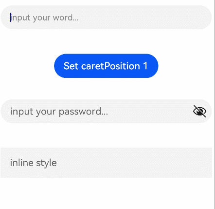

# TextInput

单行文本输入框组件。

>  **说明：**
>
>  该组件从API Version 7开始支持。后续版本如有新增内容，则采用上角标单独标记该内容的起始版本。


## 子组件

无


## 接口

TextInput(value?:{placeholder?: ResourceStr, text?: ResourceStr, controller?: TextInputController})

**参数：**

| 参数名                     | 参数类型                                     | 必填   | 参数描述            |
| ----------------------- | ---------------------------------------- | ---- | --------------- |
| placeholder   | [ResourceStr](ts-types.md#resourcestr)       | 否    | 设置无输入时的提示文本。      |
| text          | [ResourceStr](ts-types.md#resourcestr)       | 否    | 设置输入框当前的文本内容。</br>当组件设置[stateStyles](ts-universal-attributes-polymorphic-style.md)等刷新属性时，建议通过onChange事件将状态变量与文本实时绑定，</br>避免组件刷新时TextInput中的文本内容异常。<br />从API version 10开始，该参数支持[$$](../../quick-start/arkts-two-way-sync.md)双向绑定变量。 |
| controller<sup>8+</sup> | [TextInputController](#textinputcontroller8) | 否    | 设置TextInput控制器。 |


## 属性

除支持[通用属性](ts-universal-attributes-size.md)和[文本通用属性](ts-universal-attributes-text-style.md)的fontColor、fontSize、fontStyle、fontWeight、fontFamily外，还支持以下属性：

| 名称                       | 参数类型                                     | 描述                                       |
| ------------------------ | ---------------------------------------- | ---------------------------------------- |
| type                     | [InputType](#inputtype枚举说明)     | 设置输入框类型。<br/>默认值：InputType.Normal        |
| placeholderColor         | [ResourceColor](ts-types.md#resourcecolor)     | 设置placeholder文本颜色。<br/>默认值跟随主题。   |
| placeholderFont          | [Font](ts-types.md#font) | 设置placeholder文本样式。 |
| enterKeyType             | [EnterKeyType](#enterkeytype枚举说明) | 设置输入法回车键类型，目前仅支持默认类型显示。<br/>默认值：EnterKeyType.Done |
| caretColor               | [ResourceColor](ts-types.md#resourcecolor)    | 设置输入框光标颜色。<br/>默认值：'#007DFF'。                                |
| maxLength                | number                                   | 设置文本的最大输入字符数。                            |
| inputFilter<sup>8+</sup> | {<br/>value:&nbsp;[ResourceStr](ts-types.md#resourcestr),<br/>error?:&nbsp;(value:&nbsp;string)&nbsp;=&gt;&nbsp;void<br/>} | 正则表达式，匹配表达式的输入允许显示，不匹配的输入将被过滤。目前仅支持单个字符匹配，不支持字符串匹配。<br/>-&nbsp;value：设置正则表达式。<br/>-&nbsp;error：正则匹配失败时，返回被过滤的内容。 |
| copyOption<sup>9+</sup>  | [CopyOptions](ts-appendix-enums.md#copyoptions9) | 设置输入的文本是否可复制。<br/>默认值：CopyOptions.LocalDevice，支持设备内复制。<br/>设置CopyOptions.None时，当前TextInput中的文字无法被复制或剪切，仅支持粘贴。 |
| showPasswordIcon<sup>9+</sup> | boolean | 密码输入模式时，输入框末尾的图标是否显示。<br/>默认值：true |
| style<sup>9+</sup> | [TextInputStyle](#textinputstyle9枚举说明) \| [TextContentStyle](ts-appendix-enums.md#textcontentstyle10) | 设置输入框为默认风格或内联输入风格。<br/>默认值：TextInputStyle.Default |
| textAlign<sup>9+</sup>   | [TextAlign](ts-appendix-enums.md#textalign) | 设置文本在输入框中的水平对齐方式。<br/>默认值：TextAlign.Start<br/>**说明：**<br/>仅支持TextAlign.Start、TextAlign.Center和TextAlign.End。<br/>可通过[align](ts-universal-attributes-location.md)属性控制文本段落在垂直方向上的位置，此组件中不可通过align属性控制文本段落在水平方向上的位置，即align属性中Alignment.TopStart、Alignment.Top、Alignment.TopEnd效果相同，控制内容在顶部，Alignment.Start、Alignment.Center、Alignment.End效果相同，控制内容垂直居中，Alignment.BottomStart、Alignment.Bottom、Alignment.BottomEnd效果相同，控制内容在底部。  |
| selectedBackgroundColor<sup>10+</sup> | [ResourceColor](ts-types.md#resourcecolor) | 设置文本选中底板颜色。<br/>如果未设置透明度，默认为不透明（例如：“0x80000000”为50%透明度黑色）。 |
| caretStyle<sup>10+</sup> | {<br/>width:&nbsp;[Length](ts-types.md#length)<br/>} | 设置光标风格。                                        |
| caretPosition<sup>10+</sup> | number | 设置光标位置。 |
| enableKeyboardOnFocus<sup>10+</sup> | boolean | TextInput获焦时，是否绑定输入法<br/>默认值：true。从API version 10开始，获焦默认绑定输入法。 |

>  **说明：**
>
>  [通用属性padding](ts-universal-attributes-size.md)的默认值为：<br>{<br>&nbsp;top: 8 vp,<br>&nbsp;right: 16 vp,<br>&nbsp;bottom: 8 vp,<br>&nbsp;left: 16 vp<br> }

## EnterKeyType枚举说明

| 名称                  | 描述        |
| ------------------- | --------- |
| Go     | 显示为前往样式。   |
| Search | 显示为搜索样式。  |
| Send   | 显示为发送样式。  |
| Next   | 显示为下一个样式。 |
| Done   | 显示为确认样式。     |

## InputType枚举说明

| 名称                 | 描述            |
| ------------------ | ------------- |
| Normal   | 基本输入模式。<br/>支持输入数字、字母、下划线、空格、特殊字符。 |
| Password | 密码输入模式。支持输入数字、字母、下划线、空格、特殊字符。密码显示小眼睛图标并且默认会将文字变成圆点。 |
| Email    | 邮箱地址输入模式。支持数字，字母，下划线，以及@字符（只能存在一个@字符）。 |
| Number   | 纯数字输入模式。      |
| PhoneNumber<sup>9+</sup> | 电话号码输入模式。<br/>支持输入数字、+ 、-、*、#，长度不限。 |

## TextInputStyle<sup>9+</sup>枚举说明

| 名称                 | 描述            |
| ------------------ | ------------- |
| Default   | 默认风格，光标宽1.5vp，光标高度与文本选中底板高度和字体大小相关。   |
| Inline    | 内联输入风格。文本选中底板高度与输入框高度相同。      |

## 事件

除支持[通用事件](ts-universal-events-click.md)外，还支持以下事件：

| 名称                                                         | 功能描述                                                     |
| ------------------------------------------------------------ | ------------------------------------------------------------ |
| onChange(callback:&nbsp;(value:&nbsp;string)&nbsp;=&gt;&nbsp;void) | 输入内容发生变化时，触发该回调。<br/>value：输入的文本内容。<br/>触发该事件的条件：<br/>1、键盘输入。<br/>2、粘贴、剪切。<br/>3、键盘快捷键Ctrl+v。 |
| onSubmit(callback:&nbsp;(enterKey:&nbsp;EnterKeyType)&nbsp;=&gt;&nbsp;void) | 按下输入法回车键触发该回调，返回值为当前输入法回车键的类型。<br/>enterKeyType：输入法回车键类型。具体类型见[EnterKeyType枚举说明](#enterkeytype枚举说明)。 |
| onEditChange(callback:&nbsp;(isEditing:&nbsp;boolean)&nbsp;=&gt;&nbsp;void)<sup>8+</sup> | 输入状态变化时，触发该回调。有光标时为编辑态，无光标时为非编辑态。isEditing为true表示正在输入。 |
| onCopy(callback:(value:&nbsp;string)&nbsp;=&gt;&nbsp;void)<sup>8+</sup> | 长按输入框内部区域弹出剪贴板后，点击剪切板复制按钮，触发该回调。<br/>value：复制的文本内容。 |
| onCut(callback:(value:&nbsp;string)&nbsp;=&gt;&nbsp;void)<sup>8+</sup> | 长按输入框内部区域弹出剪贴板后，点击剪切板剪切按钮，触发该回调。<br/>value：剪切的文本内容。 |
| onPaste(callback:(value:&nbsp;string)&nbsp;=&gt;&nbsp;void)<sup>8+</sup> | 长按输入框内部区域弹出剪贴板后，点击剪切板粘贴按钮，触发该回调。<br/>value：粘贴的文本内容。 |

## TextInputController<sup>8+</sup>

TextInput组件的控制器。

### 导入对象
```
controller: TextInputController = new TextInputController()
```
### caretPosition<sup>8+</sup>

caretPosition(value:&nbsp;number): void

设置输入光标的位置。

**参数：**

| 参数名 | 参数类型 | 必填 | 参数描述                               |
| ------ | -------- | ---- | -------------------------------------- |
| value  | number   | 是   | 从字符串开始到光标所在位置的字符长度。 |
### setTextSelection<sup>10+</sup>

setTextSelection(selectionStart:&nbsp;number, selectionStart:&nbsp;number): void

设置文本选择区域并高亮显示。

**参数：**

| 参数名         | 参数类型 | 必填 | 参数描述               |
| -------------- | -------- | ---- | ---------------------- |
| selectionStart | number   | 是   | 文本选择区域起始位置，文本框中文字的起始位置为0。 |
| selectionEnd   | number   | 是   | 文本选择区域结束位置。 |

## 示例

```ts
// xxx.ets
@Entry
@Component
struct TextInputExample {
  @State text: string = ''
  controller: TextInputController = new TextInputController()

  build() {
    Column() {
      TextInput({ text: this.text, placeholder: 'input your word...', controller: this.controller })
        .placeholderColor(Color.Grey)
        .placeholderFont({ size: 14, weight: 400 })
        .caretColor(Color.Blue)
        .width(400)
        .height(40)
        .margin(20)
        .fontSize(14)
        .fontColor(Color.Black)
        .inputFilter('[a-z]', (e) => {
          console.log(JSON.stringify(e))
        })
        .onChange((value: string) => {
          this.text = value
        })
      Text(this.text)
      Button('Set caretPosition 1')
        .margin(15)
        .onClick(() => {
          // 将光标移动至第一个字符后
          this.controller.caretPosition(1)
        })
      // 密码输入框
      TextInput({ placeholder: 'input your password...' })
        .width(400)
        .height(40)
        .margin(20)
        .type(InputType.Password)
        .maxLength(9)
        .showPasswordIcon(true)
      // 内联风格输入框
      TextInput({ placeholder: 'inline style' })
        .width(400)
        .height(50)
        .margin(20)
        .borderRadius(0)
        .style(TextInputStyle.Inline)
    }.width('100%')
  }
}
```


