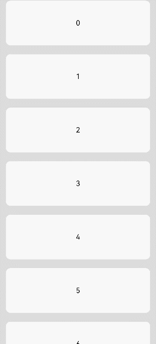

# ListItem

用来展示列表具体item，必须配合List来使用。

>  **说明：**
>
>  该组件从API Version 7开始支持。后续版本如有新增内容，则采用上角标单独标记该内容的起始版本。


## 子组件

可以包含单个子组件。

## 接口

从API version 9开始，该接口支持在ArkTS卡片中使用。

### ListItem<sup>10+</sup>

ListItem()

## 属性

除支持[通用属性](ts-universal-attributes-size.md)外，还支持以下属性：

| 名称 | 参数类型 | 描述 |
| -------- | -------- | -------- |
| selectable<sup>8+</sup> | boolean | 当前ListItem元素是否可以被鼠标框选。<br/>**说明：**<br/>外层List容器的鼠标框选开启时，ListItem的框选才生效。<br/>默认值：true |
| selected<sup>10+</sup> | boolean | 设置当前ListItem选中状态。该属性支持[$$](../../quick-start/arkts-two-way-sync.md)双向绑定变量。<br/>**说明：**<br/>该属性需要在设置[选中态样式](./ts-universal-attributes-polymorphic-style.md)前使用才能生效选中态样式。<br/>默认值：false|
| swipeAction<sup>9+</sup> | {<br/>start?:&nbsp;CustomBuilder&nbsp;,<br/>end?:CustomBuilder&nbsp;,<br/>edgeEffect?:&nbsp;[SwipeEdgeEffect](#swipeedgeeffect9枚举说明),<br/>} | 用于设置ListItem的划出组件。<br/>- start:&nbsp;ListItem向右划动时item左边的组件（List垂直布局时）或ListItem向下划动时item上方的组件（List水平布局时）。<br/>- end:&nbsp;ListItem向左划动时item右边的组件（List垂直布局时）或ListItem向上划动时item下方的组件（List水平布局时）。<br/>- edgeEffect:&nbsp;滑动效果。<br/>**说明：** <br/>- start和end对应的@builder函数中顶层必须是单个组件，不能是if/else、ForEach、LazyForEach语句。<br/> - 滑动手势只在listItem区域上，如果子组件划出ListItem区域外，在ListItem以外部分不会响应划动手势。所以在多列模式下，建议不要将划出组件设置太宽。 |

## SwipeEdgeEffect<sup>9+</sup>枚举说明
| 名称 | 描述 |
| -------- | -------- |
| Spring | ListItem划动距离超过划出组件大小后可以继续划动。如果设置了删除区域，ListItem划动距离超过删除阈值后可以继续划动，松手后按照弹簧阻尼曲线回弹。 |
| None | ListItem划动距离不能超过划出组件大小。如果设置了删除区域，ListItem划动距离不能超过删除阈值，并且在设置删除回调的情况下，达到删除阈值后松手触发删除回调。 |


## 事件

| 名称 | 功能描述 |
| -------- | -------- |
| onSelect(event:&nbsp;(isSelected:&nbsp;boolean)&nbsp;=&gt;&nbsp;void)<sup>8+</sup> | ListItem元素被鼠标框选的状态改变时触发回调。<br/>isSelected：进入鼠标框选范围即被选中返回true，&nbsp;移出鼠标框选范围即未被选中返回false。 |


## 示例

### 示例1 

```ts
// xxx.ets
@Entry
@Component
struct ListItemExample {
  private arr: number[] = [0, 1, 2, 3, 4, 5, 6, 7, 8, 9]

  build() {
    Column() {
      List({ space: 20, initialIndex: 0 }) {
        ForEach(this.arr, (item) => {
          ListItem() {
            Text('' + item)
              .width('100%').height(100).fontSize(16)
              .textAlign(TextAlign.Center).borderRadius(10).backgroundColor(0xFFFFFF)
          }
        }, item => item)
      }.width('90%')
      .scrollBar(BarState.Off)
    }.width('100%').height('100%').backgroundColor(0xDCDCDC).padding({ top: 5 })
  }
}
```



