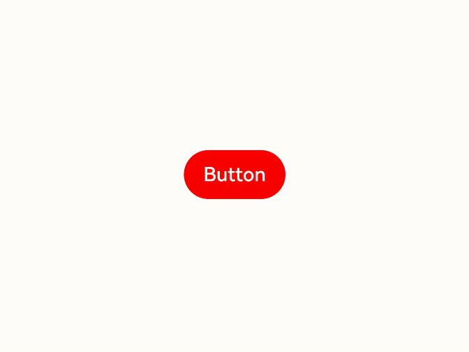

# 动态属性设置

动态设置组件的属性，支持开发者在属性设置时使用if/else语法，且根据需要使用多态样式设置属性。

> **说明：**
>
> 在attributeModifier中已设置的属性应避免与通过代码直接设置的属性重复，以防止页面刷新时attributeModifier失效。
>
> 从API version 20开始支持跨平台，attributeModifier支持自定义组件。

## attributeModifier

attributeModifier(modifier: AttributeModifier\<T>)

动态设置组件的属性方法。

**系统能力：** SystemCapability.ArkUI.ArkUI.Full

**参数：**

| 参数名   | 类型                  | 必填 | 说明                                                                                                                                 |
| -------- | --------------------- | ---- | ------------------------------------------------------------------------------------------------------------------------------------ |
| modifier | AttributeModifier\<T> | 是   | 在当前组件上，动态设置属性方法，支持使用if/else语法。modifier：属性修改器，开发者需要自定义class实现AttributeModifier接口。 |

## AttributeModifier\<T>

开发者需要自定义class实现AttributeModifier接口。

**系统能力：** SystemCapability.ArkUI.ArkUI.Full

> **说明：**
>
> 在以下回调函数中，当对instance对象的同一个属性重复设置相同的值或对象时，不会触发该属性的更新。

### applyNormalAttribute

applyNormalAttribute(instance: T) : void

组件普通状态时的样式。

**系统能力：** SystemCapability.ArkUI.ArkUI.Full

**参数：**

| 参数     | 描述                                                                                                         |
| -------- | ------------------------------------------------------------------------------------------------------------ |
| instance | 组件的属性类，用来标识进行属性设置的组件的类型，比如Button组件的ButtonAttribute，Text组件的TextAttribute等。 |

**instance参数支持范围：**

| 组件的属性类             | Android | iOS  |
| ------------------------ | ------- | ---- |
| AlphabetIndexerModifier  | 支持    | 支持 |
| AttributeUpdater         | 支持    | 支持 |
| BlankModifier            | 支持    | 支持 |
| ButtonModifier           | 支持    | 支持 |
| CalendarPickerModifier   | 支持    | 支持 |
| CheckboxModifier         | 支持    | 支持 |
| CheckboxGroupModifier    | 支持    | 支持 |
| ColumnModifier           | 支持    | 支持 |
| ColumnSplitModifier      | 支持    | 支持 |
| CommonModifier           | 支持    | 支持 |
| CounterModifier          | 支持    | 支持 |
| ContainerSpanModifier    | 支持    | 支持 |
| DataPanelModifier        | 支持    | 支持 |
| DatePickerModifier       | 支持    | 支持 |
| DividerModifier          | 支持    | 支持 |
| GaugeModifier            | 支持    | 支持 |
| GridModifier             | 支持    | 支持 |
| GridColModifier          | 支持    | 支持 |
| GridItemModifier         | 支持    | 支持 |
| GridRowModifier          | 支持    | 支持 |
| HyperlinkModifier        | 支持    | 支持 |
| ImageAnimatorModifier    | 支持    | 支持 |
| ImageModifier            | 支持    | 支持 |
| ImageSpanModifier        | 支持    | 支持 |
| LineModifier             | 支持    | 支持 |
| ListModifier             | 支持    | 支持 |
| ListItemModifier         | 支持    | 支持 |
| ListItemGroupModifier    | 支持    | 支持 |
| LoadingProgressModifier  | 支持    | 支持 |
| MarqueeModifier          | 支持    | 支持 |
| MenuModifier             | 支持    | 支持 |
| MenuItemModifier         | 支持    | 支持 |
| NavDestinationModifier   | 支持    | 支持 |
| NavigationModifier       | 支持    | 支持 |
| PathModifier             | 支持    | 支持 |
| PatternLockModifier      | 支持    | 支持 |
| PolygonModifier          | 支持    | 支持 |
| PolylineModifier         | 支持    | 支持 |
| ProgressModifier         | 支持    | 支持 |
| RadioModifier            | 支持    | 支持 |
| RatingModifier           | 支持    | 支持 |
| RectModifier             | 支持    | 支持 |
| RefreshModifier          | 支持    | 支持 |
| RichEditorModifier       | 支持    | 支持 |
| RowModifier              | 支持    | 支持 |
| RowSplitModifier         | 支持    | 支持 |
| ScrollModifier           | 支持    | 支持 |
| SearchModifier           | 支持    | 支持 |
| SelectModifier           | 支持    | 支持 |
| ShapeModifier            | 支持    | 支持 |
| SideBarContainerModifier | 支持    | 支持 |
| SliderModifier           | 支持    | 支持 |
| SpanModifier             | 支持    | 支持 |
| StackModifier            | 支持    | 支持 |
| StepperItemModifier      | 支持    | 支持 |
| SwiperModifier           | 支持    | 支持 |
| SymbolGlyphModifier      | 支持    | 支持 |
| SymbolSpanModifier       | 支持    | 支持 |
| TabsModifier             | 支持    | 支持 |
| TextAreaModifier         | 支持    | 支持 |
| TextModifier             | 支持    | 支持 |
| TextClockModifier        | 支持    | 支持 |
| TextInputModifier        | 支持    | 支持 |
| TextPickerModifier       | 支持    | 支持 |
| TextTimerModifier        | 支持    | 支持 |
| TimePickerModifier       | 支持    | 支持 |
| ToggleModifier           | 支持    | 支持 |
| VideoModifier            | 支持    | 支持 |
| WaterFlowModifier        | 支持    | 支持 |

**属性支持范围：**

1. 不支持入参或者返回值为[CustomBuilder](ts-types.md#custombuilder8)的属性。<br>
2. 不支持入参为modifier类型的属性。<br>
3. 不支持[animation](./ts-animatorproperty.md)属性。<br>
4. 不支持[gesture](./ts-gesture-settings.md)类型的属性。<br>
5. 不支持[stateStyles](./ts-universal-attributes-polymorphic-style.md)属性。<br>
6. 不支持已废弃属性。<br>
7. 不支持系统组件属性。<br>

## 自定义Modifier

从API version 12开始，开发者可使用自定义Modifier构建组件并配置属性，通过此自定义的Modifier可调用所封装组件的属性和样式接口。

**自定义Modifier支持范围：**

| 组件的属性类             | Android | iOS  |
| ------------------------ | ------- | ---- |
| AlphabetIndexerModifier  | 支持    | 支持 |
| AttributeUpdater         | 支持    | 支持 |
| BlankModifier            | 支持    | 支持 |
| ButtonModifier           | 支持    | 支持 |
| CalendarPickerModifier   | 支持    | 支持 |
| CheckboxModifier         | 支持    | 支持 |
| CheckboxGroupModifier    | 支持    | 支持 |
| ColumnModifier           | 支持    | 支持 |
| ColumnSplitModifier      | 支持    | 支持 |
| CommonModifier           | 支持    | 支持 |
| CounterModifier          | 支持    | 支持 |
| ContainerSpanModifier    | 支持    | 支持 |
| DataPanelModifier        | 支持    | 支持 |
| DatePickerModifier       | 支持    | 支持 |
| DividerModifier          | 支持    | 支持 |
| GaugeModifier            | 支持    | 支持 |
| GridModifier             | 支持    | 支持 |
| GridColModifier          | 支持    | 支持 |
| GridItemModifier         | 支持    | 支持 |
| GridRowModifier          | 支持    | 支持 |
| HyperlinkModifier        | 支持    | 支持 |
| ImageAnimatorModifier    | 支持    | 支持 |
| ImageModifier            | 支持    | 支持 |
| ImageSpanModifier        | 支持    | 支持 |
| LineModifier             | 支持    | 支持 |
| ListModifier             | 支持    | 支持 |
| ListItemModifier         | 支持    | 支持 |
| ListItemGroupModifier    | 支持    | 支持 |
| LoadingProgressModifier  | 支持    | 支持 |
| MarqueeModifier          | 支持    | 支持 |
| MenuModifier             | 支持    | 支持 |
| MenuItemModifier         | 支持    | 支持 |
| NavDestinationModifier   | 支持    | 支持 |
| NavigationModifier       | 支持    | 支持 |
| PathModifier             | 支持    | 支持 |
| PatternLockModifier      | 支持    | 支持 |
| PolygonModifier          | 支持    | 支持 |
| PolylineModifier         | 支持    | 支持 |
| ProgressModifier         | 支持    | 支持 |
| RadioModifier            | 支持    | 支持 |
| RatingModifier           | 支持    | 支持 |
| RectModifier             | 支持    | 支持 |
| RefreshModifier          | 支持    | 支持 |
| RichEditorModifier       | 支持    | 支持 |
| RowModifier              | 支持    | 支持 |
| RowSplitModifier         | 支持    | 支持 |
| ScrollModifier           | 支持    | 支持 |
| SearchModifier           | 支持    | 支持 |
| SelectModifier           | 支持    | 支持 |
| ShapeModifier            | 支持    | 支持 |
| SideBarContainerModifier | 支持    | 支持 |
| SliderModifier           | 支持    | 支持 |
| SpanModifier             | 支持    | 支持 |
| StackModifier            | 支持    | 支持 |
| StepperItemModifier      | 支持    | 支持 |
| SwiperModifier           | 支持    | 支持 |
| SymbolGlyphModifier      | 支持    | 支持 |
| SymbolSpanModifier       | 支持    | 支持 |
| TabsModifier             | 支持    | 支持 |
| TextAreaModifier         | 支持    | 支持 |
| TextModifier             | 支持    | 支持 |
| TextClockModifier        | 支持    | 支持 |
| TextInputModifier        | 支持    | 支持 |
| TextPickerModifier       | 支持    | 支持 |
| TextTimerModifier        | 支持    | 支持 |
| TimePickerModifier       | 支持    | 支持 |
| ToggleModifier           | 支持    | 支持 |
| VideoModifier            | 支持    | 支持 |
| WaterFlowModifier        | 支持    | 支持 |

**注意事项**

1. 设置自定义Modifier给一个组件，该组件对应属性生效。
2. 自定义Modifier属性值变化，组件对应属性也会变化。自定义Modifier类型为基类，构造的对象为子类对象，使用时要通过as进行类型断言为子类。
3. 一个自定义Modifier设置给两个组件，Modifier属性变化的时候对两个组件同时生效。
4. 一个Modifier设置了属性A和属性B，再设置属性C和属性D，4个属性同时在组件上生效。
5. 自定义Modifier不支持@State标注的状态数据的变化感知。
6. 多次通过attributeModifier设置属性时，生效的属性为所有属性的并集，相同属性按照设置顺序生效。

## Attribute支持范围

未在表格中列举的属性默认为支持。

**表** CommonAttribute属性接口支持例外范围

| 属性                     | Android支持情况 | iOS支持情况 | 告警信息                 | 备注                                      |
| ------------------------ | --------------- | ----------- | ------------------------ | ----------------------------------------- |
| accessibilityChecked     | 不支持          | 不支持      | is not callable          | -                                         |
| accessibilitySelected    | 不支持          | 不支持      | is not callable          | -                                         |
| accessibilityTextHint    | 不支持          | 不支持      | is not callable          | -                                         |
| accessibilityVirtualNode | 不支持          | 不支持      | is not callable          | 不支持入参为CustomBuilder。               |
| animation                | 不支持          | 不支持      | Method not implemented.  | 不支持animation相关属性。                 |
| attributeModifier        | 不支持          | 不支持      | -                        | attributeModifier不支持嵌套使用，不生效。 |
| background               | 不支持          | 不支持      | Method not implemented.  | 不支持入参为CustomBuilder。               |
| backgroundFilter         | 不支持          | 不支持      | is not callable          | -                                         |
| bindContentCover         | 不支持          | 不支持      | Method not implemented.  | 不支持入参为CustomBuilder。               |
| bindContextMenu          | 不支持          | 不支持      | Method not implemented.  | 不支持入参为CustomBuilder。               |
| bindPopup                | 不支持          | 不支持      | Method not implemented.  | 不支持入参为CustomBuilder。               |
| bindSheet                | 不支持          | 不支持      | Method not implemented.  | 不支持入参为CustomBuilder。               |
| chainWeight              | 不支持          | 不支持      | is not callable          | -                                         |
| compositingFilter        | 不支持          | 不支持      | is not callable          | -                                         |
| drawModifier             | 不支持          | 不支持      | is not callable          | 不支持modifier相关的属性。                |
| foregroundFilter         | 不支持          | 不支持      | is not callable          | -                                         |
| freeze                   | 不支持          | 不支持      | is not callable          | -                                         |
| gesture                  | 不支持          | 不支持      | Method not implemented.  | 不支持gesture相关的属性。                 |
| gestureModifier          | 不支持          | 不支持      | is not callable          | 不支持modifier相关的属性。                |
| onAccessibilityHover     | 不支持          | 不支持      | is not callable          | -                                         |
| onDragStart              | 不支持          | 不支持      | Method not implemented.  | 不支持返回值为CustomBuilder。             |
| parallelGesture          | 不支持          | 不支持      | Method not implemented.  | 不支持gesture相关的属性。                 |
| priorityGesture          | 不支持          | 不支持      | Method not implemented.  | 不支持gesture相关的属性。                 |
| reuseId                  | 不支持          | 不支持      | Method not implemented.  | -                                         |
| stateStyles              | 不支持          | 不支持      | Method not implemented.  | 不支持stateStyles相关的属性。             |
| useSizeType              | 不支持          | 不支持      | Method not implemented.  | 不支持已废弃属性。                        |
| visualEffect             | 不支持          | 不支持      | is not callable          | -                                         |
| bindMenu                 | 不支持          | 不支持      | -                        | 不支持入参为CustomBuilder。               |
| dragPreview              | 不支持          | 不支持      | uilder is not supported. | 不支持入参为CustomBuilder。               |

## 示例

该示例通过Button绑定Modifier实现了点击切换背景颜色的效果。

```ts
// xxx.ets
class MyButtonModifier implements AttributeModifier<ButtonAttribute> {
  isDark: boolean = false;

  applyNormalAttribute(instance: ButtonAttribute): void {
    if (this.isDark) {
      instance.backgroundColor(Color.Black);
    } else {
      instance.backgroundColor(Color.Red);
    }
  }
}

@Entry
@Component
struct attributeDemo {
  @State modifier: MyButtonModifier = new MyButtonModifier();

  build() {
    Row() {
      Column() {
        Button("Button")
          .attributeModifier(this.modifier)
          .onClick(() => {
            this.modifier.isDark = !this.modifier.isDark;
          })
      }
      .width('100%')
    }
    .height('100%')
  }
}
```


