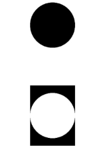

# 前景色设置

设置组件的前景色。

>  **说明：**
>
>  从API Version 10开始支持。后续版本如有新增内容，则采用上角标单独标记该内容的起始版本。

## 属性

| 名称 | 参数类型 | 描述 |
| -------- | -------- | -------- |
| foregroundColor | [ResourceColor](ts-types.md#resourcecolor)&nbsp;\|&nbsp;[ColoringStrategy](ts-types.md#coloringstrategy) | 设置组件的前景颜色或者根据智能取色策略设置前景颜色。 |

## 示例

### 示例1
```ts
// xxx.ets
@Entry
@Component
struct ForegroundColorExample {
  build() {
    Column({ space: 100 }) {
      // 绘制一个直径为150的圆,默认填充色为黑色
      Circle({ width: 150, height: 200 })
      // 绘制一个直径为150的圆，
      Circle({ width: 150, height: 200 }).foregroundColor(Color.Red)
    }.width('100%').backgroundColor(Color.Blue)
  }
}
```


### 示例2

```ts
// xxx.ets
@Entry
@Component
struct ColoringStrategyExample {
  build() {
    Column({ space: 100 }) {
      // 绘制一个直径为150的圆,默认填充色为黑色
      Circle({ width: 150, height: 200 })
      // 绘制一个直径为150的圆，设置前景色为组件背景色的反色
      Circle({ width: 150, height: 200 })
        .backgroundColor(Color.Black)
        .foregroundColor(ColoringStrategy.INVERT)
    }.width('100%')
  }
}
```


### 示例3

```ts
// xxx.ets
@Entry
@Component
struct foregroundColorInherit {
  build() {
    Column() {
      Button('设置前景色为橘色').fontSize(20).foregroundColor(Color.Orange).backgroundColor(Color.Gray)
      Divider()
      Button('未设置前景色继承自父组件').fontSize(20).backgroundColor(Color.Gray)
    }.foregroundColor(Color.Red)
  }
}
```

