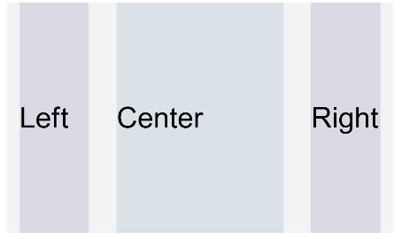
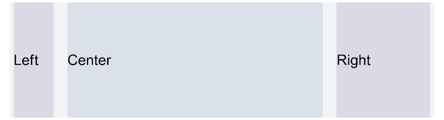
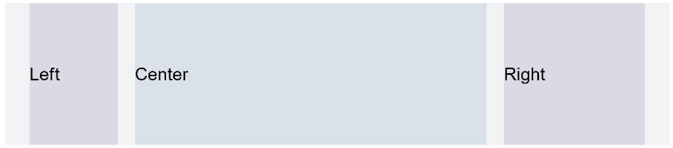

# 栅格设置

>  **说明：**
>
>  - 从API Version 7开始支持。后续版本如有新增内容，则采用上角标单独标记该内容的起始版本。
>
>  - 栅格布局的列宽、列间距由距离最近的GridContainer父组件决定。使用栅格属性的组件树上至少需要有1个GridContainer容器组件。

>  - gridSpan、gridOffset属性调用时其父组件或祖先组件必须是GridContainer。

## 属性


| 名称        | 参数类型                                                     | 描述                                                         |
| ----------- | ------------------------------------------------------------ | ------------------------------------------------------------ |
| gridSpan    | number                                                       | 默认占用列数，指useSizeType属性没有设置对应尺寸的列数(span)时，占用的栅格列数。<br/>**说明：**<br/>设置了栅格span属性，组件的宽度由栅格布局决定。<br>默认值：1 |
| gridOffset  | number                                                       | 默认偏移列数，指useSizeType属性没有设置对应尺寸的偏移(offset)时，&nbsp;当前组件沿着父组件Start方向，偏移的列数，也就是当前组件位于第n列。<br/>**说明：**<br/>- 配置该属性后，当前组件在父组件水平方向的布局不再跟随父组件原有的布局方式，而是沿着父组件的Start方向偏移一定位移。<br/>- 偏移位移&nbsp;=&nbsp;（列宽&nbsp;+&nbsp;间距）\*&nbsp;列数。<br/>- 设置了偏移(gridOffset)的组件之后的兄弟组件会根据该组件进行相对布局，类似相对布局。<br>默认值：0 |


## 示例

```ts
// xxx.ets
@Entry
@Component
struct GridContainerExample1 {
  build() {
    Column() {
      // 单独设置组件的span和offset,在sm尺寸大小的设备上使用useSizeType中sm的数据实现一样的效果
      Text('gridSpan,gridOffset').fontSize(15).fontColor(0xCCCCCC).width('90%')
      GridContainer() {
        Row() {
          Row() {
            Text('Left').fontSize(25)
          }
          .gridSpan(1)
          .height("100%")
          .backgroundColor(0x66bbb2cb)

          Row() {
            Text('Center').fontSize(25)
          }
          .gridSpan(2)
          .gridOffset(1)
          .height("100%")
          .backgroundColor(0x66b6c5d1)

          Row() {
            Text('Right').fontSize(25)
          }
          .gridSpan(1)
          .gridOffset(3)
          .height("100%")
          .backgroundColor(0x66bbb2cb)
        }.height(200)
      }
    }
  }
}
```

**图1** 设备宽度为SM



**图2** 设备宽度为MD



**图3** 设备宽度为LG


