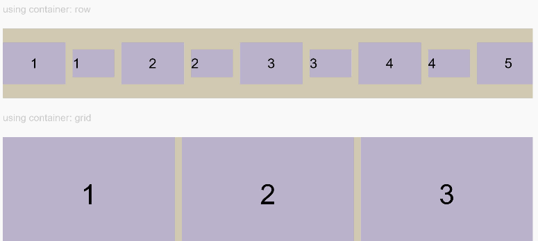

# 布局约束

通过组件的宽高比和显示优先级约束组件显示效果。

>  **说明：**
>
>  从API Version 7开始支持。后续版本如有新增内容，则采用上角标单独标记该内容的起始版本。


## 属性

| 名称            | 参数说明 | 描述                                                         |
| --------------- | -------- | ------------------------------------------------------------ |
| aspectRatio     | number   | 指定当前组件的宽高比，aspectRatio = width/height。<br/>从API version 9开始，该接口支持在ArkTS卡片中使用。 |
| displayPriority | number   | 设置当前组件在布局容器中显示的优先级，当父容器空间不足时，低优先级的组件会被隐藏。<br/>小数点后的数字不作优先级区分，即区间为[x, x + 1)内的数字视为相同优先级。例如：1.0与1.9为同一优先级。<br/>从API version 9开始，该接口支持在ArkTS卡片中使用。<br/>**说明：**<br/>仅在Row/Column/Flex(单行)容器组件中生效。 |


## 示例

```ts
// xxx.ets
@Entry
@Component
struct AspectRatioExample {
  private children: string[] = ['1', '2', '3', '4', '5', '6']

  build() {
    Column({ space: 20 }) {
      Text('using container: row').fontSize(14).fontColor(0xCCCCCC).width('100%')
      Row({ space: 10 }) {
        ForEach(this.children, (item) => {
          // 组件宽度 = 组件高度*1.5 = 90
          Text(item)
            .backgroundColor(0xbbb2cb)
            .fontSize(20)
            .aspectRatio(1.5)
            .height(60)
          // 组件高度 = 组件宽度/1.5 = 60/1.5 = 40
          Text(item)
            .backgroundColor(0xbbb2cb)
            .fontSize(20)
            .aspectRatio(1.5)
            .width(60)
        }, item => item)
      }
      .size({ width: "100%", height: 100 })
      .backgroundColor(0xd2cab3)
      .clip(true)

      // grid子元素width/height=3/2
      Text('using container: grid').fontSize(14).fontColor(0xCCCCCC).width('100%')
      Grid() {
        ForEach(this.children, (item) => {
          GridItem() {
            Text(item)
              .backgroundColor(0xbbb2cb)
              .fontSize(40)
              .width('100%')
              .aspectRatio(1.5)
          }
        }, item => item)
      }
      .columnsTemplate('1fr 1fr 1fr')
      .columnsGap(10)
      .rowsGap(10)
      .size({ width: "100%", height: 165 })
      .backgroundColor(0xd2cab3)
    }.padding(10)
  }
}
```

**图1** 竖屏显示<br>


**图2** 横屏显示<br>


```ts
class ContainerInfo {
  label: string = '';
  size: string = '';
}

class ChildInfo {
  text: string = '';
  priority: number = 0;
}

@Entry
@Component
struct DisplayPriorityExample {
  // 显示容器大小
  private container: ContainerInfo[] = [
    { label: 'Big container', size: '90%' },
    { label: 'Middle container', size: '50%' },
    { label: 'Small container', size: '30%' }
  ]
  private children: ChildInfo[] = [
    { text: '1\n(priority:2)', priority: 2 },
    { text: '2\n(priority:1)', priority: 1 },
    { text: '3\n(priority:3)', priority: 3 },
    { text: '4\n(priority:1)', priority: 1 },
    { text: '5\n(priority:2)', priority: 2 }
  ]
  @State currentIndex: number = 0;

  build() {
    Column({ space: 10 }) {
      // 切换父级容器大小
      Button(this.container[this.currentIndex].label).backgroundColor(0x317aff)
        .onClick(() => {
          this.currentIndex = (this.currentIndex + 1) % this.container.length;
        })
      // 通过变量设置Flex父容器宽度
      Flex({ justifyContent: FlexAlign.SpaceBetween }) {
        ForEach(this.children, (item) => {
          // 使用displayPriority给子组件绑定显示优先级
          Text(item.text)
            .width(120)
            .height(60)
            .fontSize(24)
            .textAlign(TextAlign.Center)
            .backgroundColor(0xbbb2cb)
            .displayPriority(item.priority)
        }, item => item.text)
      }
      .width(this.container[this.currentIndex].size)
      .backgroundColor(0xd2cab3)
    }.width("100%").margin({ top: 50 })
  }
}

```

横屏显示


