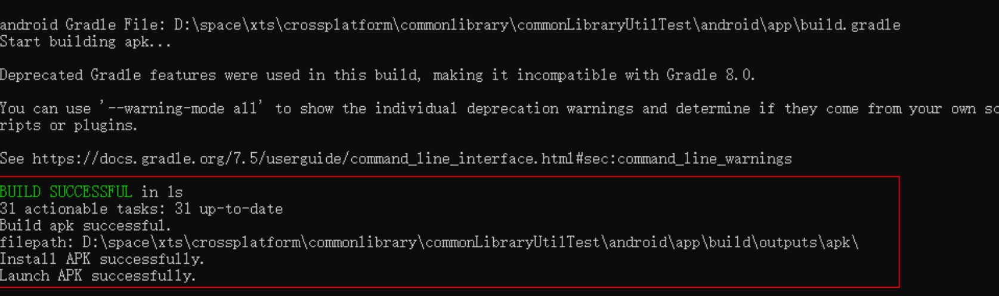

# 跨平台单元测试脚本开发指南

## 创建跨平台工程
创建跨平台工程

- 通过Ace create命令[创建](../quick-start/start-with-ace-tools.md#创建应用)跨平台项目，ACE工具具体使用方法请见[ACE工具使用指南](../quick-start/start-with-ace-tools.md#使用说明)。

跨平台工程目录

```
ace_project 
  |-----andrioid
  |-----ios
  |-----ohos 
  |-----source/entry/src
    |-----main
    |-----ohosTest
      |-----ets
        |-----Application
        |-----test  
        |-----testability
        |-----testRunner
      |-----resources
```


| 文件目录      | 说明                                                     |
| ---------- | ------------------------------------------------------------ |
| android | Android平台测试时进行配置的文件夹   |
| ios        | ios平台测试时进行配置的文件夹       |
| ohos       | 编译过程生成文件                   |
| Application| 系统生成文件，无需修改              |
| test       | 存放测试代码文件            |
| testability| 系统生成文件，无需修改             |
| testRunner | 系统生成文件，无需修改             |
| resources  | 资源文件夹                        |

## 编写测试代码
### 创建测试代码文件

- 进入ohosTest\ets\test目录，创建demo.test.ets文件。测试代码编写可参考创建工程时自动生成的Ability.test.ets中内容。


测试用例采用通用语法，describe定义测试套， it定义测试用例。

| No.  | API        | 功能说明                                                     |
| ---- | ---------- | ------------------------------------------------------------ |
| 1    | describe   | 定义一个测试套，支持两个参数：测试套名称和测试套函数。       |
| 2    | beforeAll  | 在测试套内定义一个预置条件，在所有测试用例开始前执行且仅执行一次，支持一个参数：预置动作函数。 |
| 3    | beforeEach | 在测试套内定义一个单元预置条件，在每条测试用例开始前执行，执行次数与it定义的测试用例数一致，支持一个参数：预置动作函数。 |
| 4    | afterEach  | 在测试套内定义一个单元清理条件，在每条测试用例结束后执行，执行次数与it定义的测试用例数一致，支持一个参数：清理动作函数。 |
| 5    | afterAll   | 在测试套内定义一个清理条件，在所有测试用例结束后执行且仅执行一次，支持一个参数：清理动作函数。 |
| 6    | it         | 定义一条测试用例，支持三个参数：用例名称，过滤参数和用例函数。 |
| 7    | expect     | 支持bool类型判断等多种断言方法。                             |

### 导入依赖模块

在测试文件导入依赖模块，如被测试模块或辅助模块等，如下为导入ohos.util示例。

```js
import { describe, beforeAll, beforeEach, afterEach, afterAll, it, expect } from '@ohos/hypium'
import util from '@ohos.util'

export default function abilityTest() {
  describe('ActsDemoTest', function () {
    ...
  })
}
```

### 编写测试代码

```js
import { describe, beforeAll, beforeEach, afterEach, afterAll, it, expect } from '@ohos/hypium'
import util from '@ohos.util'
export default function UtilFunTest() {
  describe('UtilTest', function () {
    it("testIsNumberObject001", 0, function () {
      let proc = new util.types();
      let result = proc.isNumberObject(new Number(0));
      expect(result).assertEqual(true);
    });

    it("testIsNumberObject002", 0, function () {
      let proc = new util.types();
      let result = proc.isNumberObject(new Number(10));
      expect(result).assertEqual(true);
    });

    it("testIsNumberObject003", 0, function () {
      let proc = new util.types();
      let result = proc.isNumberObject(15);
      expect(result).assertEqual(false);
    });
  })
}
```

| 测试用例编号       |   测试API  | 测试目的                                              |
| ---- | ---------- | ------------------------------------------------------------ |
|testIsNumberObject001    | isNumberObject   | 当传入Number对象类型的参数`new Number(0)`时，返回值为true    |
|testIsNumberObject002    | isNumberObject  | 当传入Number对象类型的参数`new Number(10)`时，返回值为true    |
| testIsNumberObject003   | isNumberObject | 当传入Number类型的参数`15`时，返回值为false   |

### 使用断言

```js
import { describe, it, expect } from '@ohos/hypium'
export default function UtilFunTest() {
  describe('UtilTest', function () {
    it("testIsNumberObject001", 0, function () {
      let proc = new util.types();
      let result = proc.isNumberObject(new Number(0));
      expect(result).assertEqual(true);
    });
  })
}
```

| 测试用例编号       |   测试API  | 测试断言                            |
| ---- | ---------- | ------------------------------------------------------------ |
|testIsNumberObject001    | isNumberObject   | isNumberObject方法传入Number对象类型的参数' new Number(0) '时，返回值为true，使用expect断言result值为true |

- 更多断言使用方式可参考[单元测试框架断言说明](https://gitee.com/openharmony/testfwk_arkxtest#断言库)。

### 修改List.test.ets文件

- 在ohosTest\ets\test\List.test.ets中，导入创建的测试文件


```js
import abilityTest from './Ability.test'

export default function testsuite() {
  abilityTest()
}
```

### 执行测试代码

- 支持在Android和IOS平台执行测试用例，两平台的测试运行指令如下。    


| 平台    | 测试运行指令                                                 |
| ------- | ------------------------------------------------------------ |
| Android | ace test **apk** --b `bundle name` --m `entryTest` --unittest OpenHarmonyTestRunner  --timeout 10000 |
| ios     | ace test **app** --b `bundle name` --m `entryTest` --unittest OpenHarmonyTestRunner  --timeout 10000 |

- 在所创建工程目录下进入cmd命令行，运行上述测试执行指令，命令会触发测试工程编译、打包、安装并运行测试用例。其中，bundle name为ohos\AppScope\app.json5文件中的"bundleName"值，entryTest为ohosTest\module.json5文件中module下定义的"name"值。

### 查看测试结果

- 测试执行过程中，上述执行测试用例的窗口会显示测试执行信息。
- 测试结束后，上述执行测试用例的窗口会显示所有的测试结果信息。


图中run表示测试的用例总数，Failure表示测试的用例失败数，Error表示测试的用例错误数，Pass表示测试的用例通过数，Ignore表示测试的用例忽略数。

##  常见问题

**so文件缺失导致异常**

**问题描述**

ace test 运行异常终止，未能获取到最终结果，如下图所示：



**可能原因**

so文件缺失导致异常

**解决方法**

使用 adb logcat > E:/xxx.txt 命令抓取ace test命令运行时的日志，在日志中搜索dlopen，查看缺失的so文件，如下图所示。其中，" xxx.z.so "文件非缺失文件， " xxx.so "文件为缺失文件，依次将缺失文件添加到 demotest\android\app\libs\arm64-v8a 和 demotest\android\app\libs\armeabi-v7a 文件夹中，再次进行测试。

	


