## ArkUI-X应用支持Appium测试

### 简介

Appium是一个开源的、跨平台的移动应用自动化测试框架。ArkUI-X SDK V7.0 开始支持Appium测试ArkUI-X应用。

Appium采用客户端-服务器框架：

- Appium Server：Appium服务器，接收来自客户端的测试脚本
- Client：Appium客户端，测试人员使用Python语言编写测试脚本

### 基于Android平台的Appium环境搭建

以在Win11平台上安装Appium为例。

#### 1. 安装Node.js

- 官方网站 [下载](https://nodejs.org/en/download/) 最新版本，按提示进行安装即可
- 检查是否安装成功：在命令行窗口中运行node -v，出现具体版本（本例为 v22.16.0），说明安装成功，如下图

​      


#### 2. 安装JDK

在 `Appium` 中，`UiAutomator2` 通过 `Java` 编写与 `Android` 应用程序进行交互，因此需要配置 JDK 环境：

- 安装JDK：可以通过在线方式（ [JDK下载](https://www.oracle.com/java/technologies/downloads/#java8) ）或离线方式（手动下载）安装JDK，但JDK的大版本为1.8.0即可，小版本可以不同

- 环境变量配置：确认JDK的安装路径后，通过  “我的电脑”右键菜单--->属性--->高级--->环境变量--->系统变量-->新建
  - 变量名：JAVA_HOME  变量值：C:\Program Files (x86)\Java\jdk1.8.0_471
  - 变量名：CLASSPATH 变量值：.;%JAVA_HOME%\lib\dt.jar;%JAVA_HOME%\lib\tools.jar;
  - 选择 path变量，点击 “编辑” 添加：	
    变量名：PATH 变量值：%JAVA_HOME%\bin;%JAVA_HOME%\jre\bin;

- 检查JDK是否安装成功：在命令行窗口中运行java -version，出现具体版本（本例为 1.8.0_131），说明安装成功，如下图

  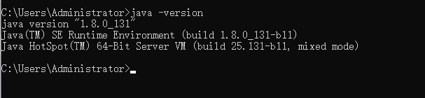

#### 3. 安装 Android SDK

- 最简单的方式是安装 [Android Studio](https://developer.android.google.cn/studio?hl=zh-cn#downloads)。推荐使用 Android Studio 安装 Android SDK。

- 安装时会进行环境的初始化，使用标准安装即可。

- 安装后，打开 Android Studio，进入 `SDKmanager` ，在 `SDK Tools` 目录下安装如下进行安装：

  - SDK Platforms 标签页：至少安装一个版本的 Android平台（例如 Android API 36）

  - SDK Tools 标签页：勾选 "Android SDK Build-Tools"、"Android SDK Platform-Tools" 和"Android SDK Tools"，如下图：

​	             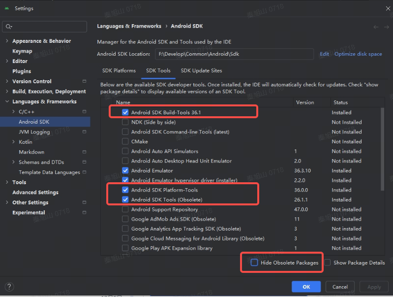
​	

- 设置环境变量：	
  ​		ANDROID_HOME ：指向 Android SDK 根目录（例如 C:\Users\YourName\AppData\Local\Android\Sdk ）。
  ​		将 ;%ANDROID_HOME%\platform-tools;%ANDROID_HOME%\tools;%ANDROID_HOME%\tools\bin

   添加到 PATH 中。

- 检查SDK是否安装成功：命令行窗口中运行adb version，出现下图信息，说明安装成功。

​             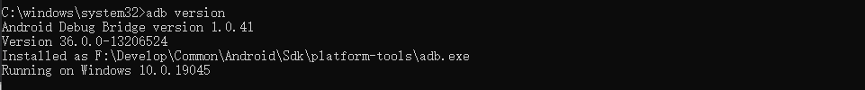


#### 4. 安装 Appium 服务端

Appium 命令行版本的服务端目前官方已经更新到了 3.x 版本，以下会以 3.x 版本为例介绍命令行版本服务端的安装方式。

>  Appium 服务端也有 GUI 版本，但目前 GUI 版本官方已经停止更新，对应的是 Appium 1.x 版本的服务端。
>
> 推荐使用命令行版本。

- Appium Server 3.x 安装：

  在命令行窗口执行如下命令：

```shell
npm i appium -g
```

如下图：

​             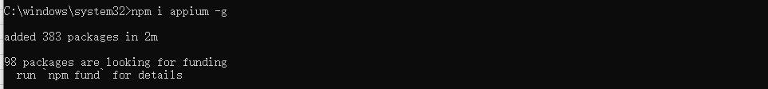

- 安装Appium driver，它是Android平台自动化的UiAutomator2驱动程序：

  在命令行窗口执行如下命令：

```shell
appium driver install uiautomator2
```

如下图：

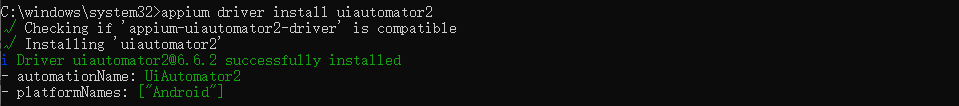

安装完毕后，可通过如下命令验证安装是否成功：

```shell
appium driver list --installed
```

如下图：

​             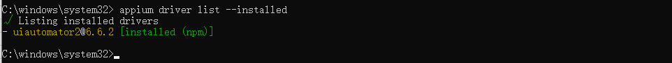


#### 5. 安装 Appium 客户端

- 安装python（由于选用Python语言作为客户端的脚本开发语言，所以优先安装Python）

​       可以直接从Python的官方网站下载Python 3对应的[Windows安装程序](https://www.python.org/downloads/windows/)，推荐下载`Windows installer (64-bit)`，然后运行下载的`python-3.x-amd64.exe`安装包。在安装向导界面，**务必勾选 “Add Python to PATH”** 选项。


- 安装Appium的python 客户端

  在命令行窗口执行如下命令：

```shell
pip install Appium-Python-Client
```

如下图：

​             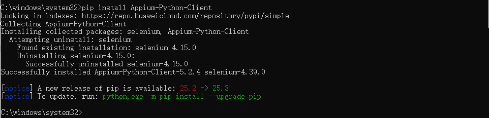


至此，Android平台的Appium环境搭建完成。下面使用示例验证Appium。

#### 6. 验证示例代码

- 获取代码

​       示例代码 test.py 可从 [GitHub Appium 仓库](https://github.com/appium/appium/tree/master/packages/appium/sample-code/quickstarts/py) 获取。下载后保存到本地的任意位置。

- 启动Appium服务

  在命令行窗口执行如下命令：

  ```shell
  appium
  ```

  如下图：

​             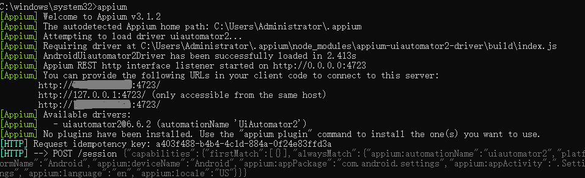


- 运行示例代码

  通过cmd进入到命令行窗口，进入到test.py所在目录，执行如下命令：

  ```shell
  python test.py
  ```

   如下图：

​             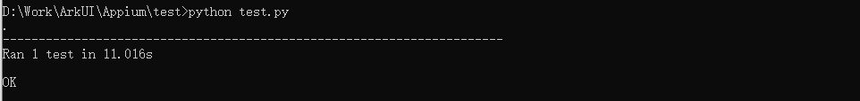

​	执行成功的情况下，手机上可以看到：自动点击【settings】后，在设置界面中又点击了【Apps】，然后退出。


  **注意：执行代码出错的情况，可能是示例代码与测试手机的设置不一致导致的。** 需要手动修改test.py，方法有两种：

**方法一：注释掉如下代码：**

​             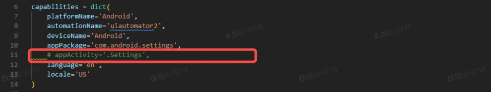


**方法二：设定正确的值**

​            通过以下查询命令打印并筛选 `adb` 的日志，等待日志刷新结束，重新打开需要测试的APP，即可得到 `package` 和 `activity`。

​			查询命令：

```shell
adb logcat ActivityManager:I | findstr "START"
```

​          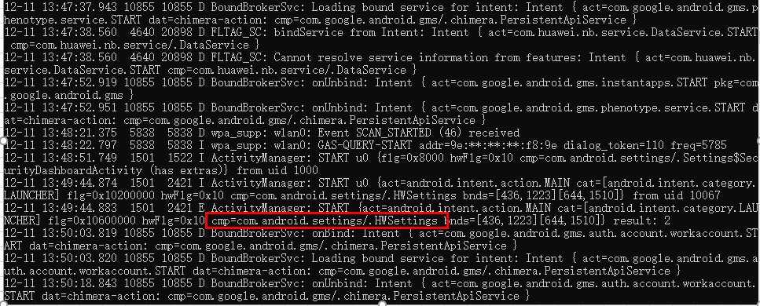

​           将查询到的正确的activity的值替换示例中的设定值

​          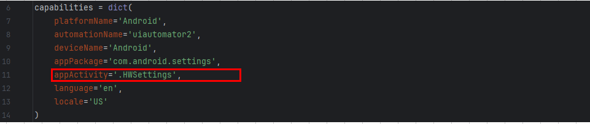

​         

### 基于iOS平台的Appium环境搭建

#### 1. 安装Node.js

- 官方网站 [下载](https://nodejs.org/en/download/) 最新版本，按提示进行安装即可
- 检查是否安装成功：在命令行窗口中运行node -v，出现具体版本（本例为 v22.16.0），说明安装成功。

#### 2. 安装XCode

​		在 `Appium` 中，`iOS` 需要 `Xcode` 及 `Xcode开发者工具` 进行签名配置等交互，不同的Xcode版本对macOS主机版本的要求也不同，[详情](https://appium.github.io/appium-xcuitest-driver/latest/installation/) 通过官网查询对应版本，在App Store中下载安装即可。

#### 3. 安装 Appium 服务端

Appium 命令行版本的服务端目前官方已经更新到了 3.x 版本，以下会以 3.x 版本为例介绍命令行版本服务端的安装方式。

>  Appium 服务端也有 GUI 版本，但目前 GUI 版本官方已经停止更新，对应的是 Appium 1.x 版本的服务端。
>
> 推荐使用命令行版本。

- Appium Server 3.x 安装：

  在命令行窗口执行如下命令：

  ```shell
  npm i appium -g
  ```

  如下图：

  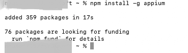


- 安装完毕后，可通过如下命令验证安装是否成功：

  在命令行窗口执行如下命令：

```shell
appium driver list --installed
```

如下图：


- 安装 XCUITest driver：

  在命令行窗口执行如下命令：

```shell
appium driver install xcuitest
```

如下图：


安装完毕后，可通过如下命令验证安装是否成功：

```shell
 appium driver list --installed
```

如下图：

​             


#### 4. 安装 Appium 客户端

- 安装python（由于选用Python语言作为客户端的脚本开发语言，所以优先安装Python）

​       可以从Python的官方网站下载Python 3对应的[macOS安装程序]( https://www.python.org/downloads/macos/)，选择版本进行下载，然后双击`.pkg`文件进行安装。一般来说mac会自动配置Python到环境变量中。

​	在命令行窗口执行如下命令验证Python是否安装成功：

```
python3 --version
```

如下图： 

​            

- 安装appium的python客户端

  在命令行窗口执行如下命令：

```shell
pip3 install Appium-Python-Client
```

如下图：

​        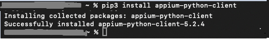


#### 5. 配置WebDriverAgent签名	

 为了与被测设备通信，XCUITest 驱动程序会自动使用Xcode的命令行工具安装（WDA）应用程序。真实设备有若干安全限制，首先需要进行配置：

- 配置 WebDriverAgentRunner 自动签名

  在命令行窗口执行如下命令打开 WDA 项目：

  ```shell
  appium driver run xcuitest open-wda
  ```

  如下图：

  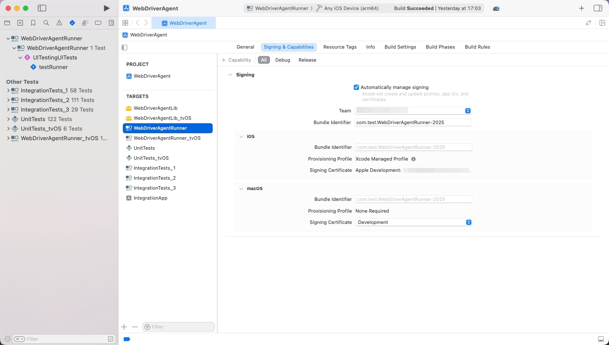

在项目中的 *TARGETS* 下选择  WebDriverAgentRunner，切换到 Signing & Capabilities 标签，**务必勾选 “Automatically manage signing”**，然后选择 TeamID 并输入唯一的 Bundle Identifier，如下图：

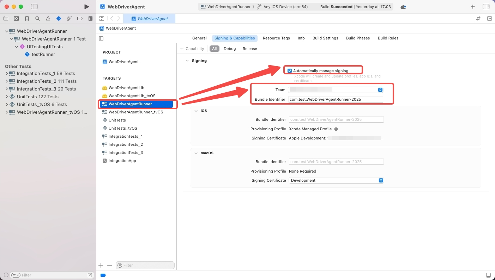


- 运行一次 WebDriverAgentRunner

​		在项目顶部栏的Scheme 下选择  WebDriverAgentRunner，设备切换到当前连接的测试设备，然后点击左侧的 ▶ 按钮，如下图所示，即可在手机上安装WDA应用程序：

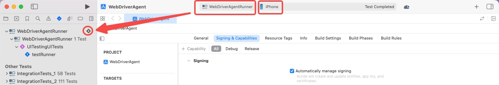


- 在手机上选择信任开发者

  在连接的iOS手机上选择【设置 → 通用 → VPN与设备管理】，选择上述签名时配置的TeamID，选择信任即可。


- 免费TeamID可能出现的情况 

  由于免费TeamID有安装开发应用限制 ，一旦超过三个应用，会出现下图情况：

  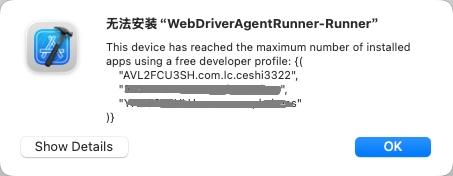

  遇到这种情况，需要将手机上的开发应用卸载到三个以下即可继续安装，安装成功后需要在手机上选择信任开发者。

至此，iOS平台的Appium环境搭建完成。下面使用示例验证Appium。


#### 6. 验证示例代码

- 示例代码如下（ test_iOSsample.py）

```python
import unittest
from appium import webdriver
from appium.options.ios import XCUITestOptions
from appium.webdriver.common.appiumby import AppiumBy

# iOS 真机配置（请确保签名和设备已正确配置）
capabilities = {
    'platformName': 'iOS',
    'udid': 'YOUR_TEST_DEVICES_UDID',   # 替换为测试设备的UDID
    'bundleId': 'com.apple.Preferences', 
    'automationName': 'XCUITest',
    'xcodeOrgId': 'YOUR_TEAM_ID', # 替换为开发团队ID
    'xcodeSigningId': 'iPhone Developer',
    'showXcodeLog': True,
    'shouldUseSingletonTestManager': False,
}

appium_server_url = 'http://localhost:4723'

class TestOpenWLANAndReturn(unittest.TestCase):
    def setUp(self) -> None:
        self.driver = webdriver.Remote(
            appium_server_url,
            options=XCUITestOptions().load_capabilities(capabilities)
        )
        self.driver.implicitly_wait(10)

    def tearDown(self) -> None:
        if self.driver:
            self.driver.quit()

    def test_open_wlan_and_return_home(self) -> None:
        try:
            wlan_button = self.driver.find_element(
                by=AppiumBy.IOS_PREDICATE,
                value='label == "WLAN" OR label == "无线局域网"'
            )
            wlan_button.click()
            print("已进入 WLAN 页面")
        except Exception as e:
            print("未找到 WLAN 入口:", e)
            raise

        # 返回主屏幕
        self.driver.execute_script('mobile: pressButton', {'name': 'home'})
        print("已返回主屏幕")

if __name__ == '__main__':
    unittest.main()
```


- 启动appium服务

  在命令行窗口执行如下命令：

  ```shell
  appium
  ```

  如下图：

  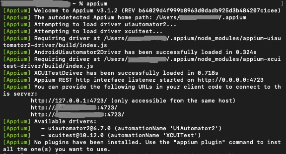

- 运行示例代码

在命令行进入到test.py所在目录，执行如下命令：

```shell
python3 test_iOSsample.py
```

 如下图：

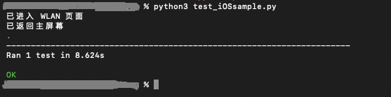

执行成功的情况下，手机上可以看到：自动点击【settings】后，在设置界面中又点击了【WLAN】，然后退回主屏幕。


### Appium测试ArkUI-X应用说明

​	测试脚本使用Python语言编写，推荐使用PyCharm开发环境。

#### 1. Pycharm工程目录结构

> 工程目录结构可以由开发者自定义。下图是推荐的目录结构。


- 红色框内 `config.yaml`文件为配置文件，包含测试设备及测试用例等相关信息，***测试前需手动配置***，配置方式详见第2点
- 黄色下划线 `driver_manager.py` 文件为启动器相关，封装了启动管理器的单例，***不需要改动***，定位元素时可通过实例化启动管理器后直接调用其内接口
- 绿色下划线 `common_utils.py`文件为共通函数，在编写用例时如有重复且需反复调用的工具函数***可添加到该文件中*** 方便后续统一调用
- 蓝色框内 `TestCase`文件夹为具体测试用例

#### 2. ArkUI-X测试config文件配置

在Pycharm中测试Android或iOS平台的自动化用例是通过修改 `config.yaml` 文件控制，脚本如下：

```yaml
# config.yaml
# Appium服务器地址
appium_server_url: http://127.0.0.1:4723

# 测试平台
platform: 'android'
#platform: 'ios'

caps:
    ios:
        platform_name: 'iOS'
        automation_name: "XCUITest"
        deviceName: 'iPhone'
        udid: "YOUR_UDID" 					# 修改为测试设备的udid
        xcode_org_id: "YOUR_TEAM_ID"        # 修改为Xcode签名时的TeamID
        xcode_signing_id: "iPhone Developer"
        use_prebuilt_wda: False
        wait_for_quiescence: False
        should_use_singleton_test_manager: False
        new_command_timeout: 300
    android:
        platform_name: 'Android'
        automationName: 'uiautomator2'
        deviceName: 'Android'
        newCommandTimeout: 300
        launchTimeout: 90000
        autoGrantPermissions: True
        noReset: True
        appWaitDuration: 30000
        androidInstallTimeout: 90000
        language: 'zh'
        locale: 'CN'

# 测试App的设定信息
ArkTSComponentCollection:
    bundle_identifier: 'com.example.arktscomponentcollection' # 与Xcode签名Bundle Identifier一致
    package_name: 'com.example.arktscomponentcollection'
    entry_activity: '.EntryEntryAbilityActivity'
OxHornCampus :
    bundle_identifier: 'com.example.oxhorncampus' # 与Xcode签名Bundle Identifier一致
    package_name: 'com.example.oxhorncampus'
    entry_activity: '.ArkuixEntryAbilityActivity'
# (如需新增测试用例在此处添加,格式如下:)
# 新增测试用例名称 : 
	# bundle_identifier: 						  # 与Xcode中Bundle Identifier一致
	# package_name:      						  # 与工程app.json5文件中bundleName一致
	# entry_activity:    						  # 需测试用例的能力

# 是否输出页面源码
output_pagesource: true
```

上方代码块中在 ***#测试平台*** 处控制平台信息，展示为测试Android平台，若要测试iOS平台，可改为：

```yaml
# 测试平台
#platform: 'android'
platform: 'ios'
```


​		由于iOS平台自动化测试需要真机的`udid`和与签名对应的`TeamID`，因此测试iOS设备需要将上述`udid`值和`xcode_org_id`值修改为设备对应的值。此外，由于Apple开发者分为免费和付费，其对应能签名的Bundle Identifier数量不一致，免费开发者只能签三个Bundle Identifier，不能保证与用例工程中的 `bundleName` 一致，而在iOS侧Appium拉起应用时对应的就是该Bundle Identifier，因此在不同用例下设置 `bundle_identifier` 要与签名时的 `Bundle Identifier` 相对应。

-  iOS 侧查询 `udid` 命令:

```shell
idevice_id -l
```

如下图：


把查询返回的值复制到上述代码块中的 `udid` 值即可。

-  iOS 侧查询 `xcode_org_id` ：

  打开XCode，页签切换到 Signing&Capabilities，如下图：

  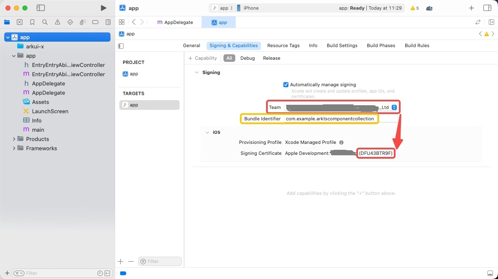

上图中红色框内为签名ID和其对应的`TeamID`值，在脚本config文件中对应为 `xcode_org_id` 值。

上图中黄色框内为`Bundle Identifier`值，在脚本config文件中为对应用例名下的 `bundle_identifier` 值。

替换后的配置文件如下图：

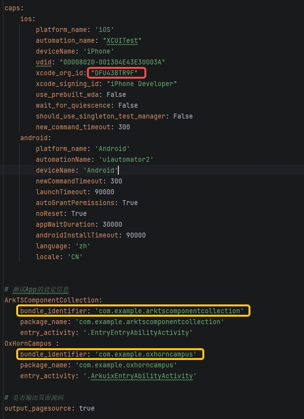


#### 3. Appium元素定位

Appium元素定位是从当前页面的布局中提取数据。在测试脚本中，每个页面可以使用`request_page_source.py`产生当前页面布局的`xml`文件：

```python
# request_page_source.py
# 以Android为例

from appium import webdriver
from appium.options.android import UiAutomator2Options
from common.common_utils_backup import CommonUtils

BUNDLE_NAME = "com.example.arktscomponentcollection"
MAIN_ACTIVITY = ".EntryEntryAbilityActivity"
DEVICE_ID = "4CNGL22406000045"

capabilities = {
    "platformName": "Android",
    "deviceName": DEVICE_ID,
    "appPackage": BUNDLE_NAME,
    "appActivity": MAIN_ACTIVITY,
    "automationName": "UiAutomator2",
    "autoGrantPermissions": True,
    "newCommandTimeout": 300,
    "noReset": True,
}
options = UiAutomator2Options().load_capabilities(capabilities)
driver = webdriver.Remote("http://localhost:4723", options=options)

source = driver.page_source
print(f'{source}')

CommonUtils.save_page_source(driver, folder="../pagesource")
```

  打开`xml`文件，可以定位元素。


##### 元素定位方式

- 当要定位的元素的 `content-desc` 值(Android侧)与 `name` 值(iOS侧)一致时，如下图：

Android示例：

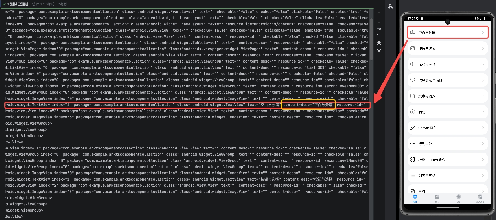

iOS示例：

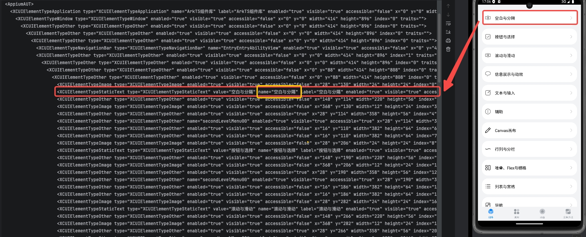


 可采用下述方式定位元素:

```python
self.driver.find_element(AppiumBy.ACCESSIBILITY_ID, id)

# 或 采用driver_manager中封装好的可显示等待定位元素接口
driver_manager.find_element_by_accessibility_id(id)
```

其中 `id` 值需要与 `content-desc` 或 `name` 完全一致。

  代码用法示例：

```python
# Step1.点击"空白与分隔"

btn_text = "空白与分隔"
button = driver_manager.find_element_by_accessibility_id(id=btn_text)
time.sleep(SLEEP_TIME)
button.click()
time.sleep(SLEEP_TIME)
```

- 当要定位的元素的 `content-desc` 值(Android侧)与 `name` 值(iOS侧)都存在但不相同时，如下图：

Android示例：

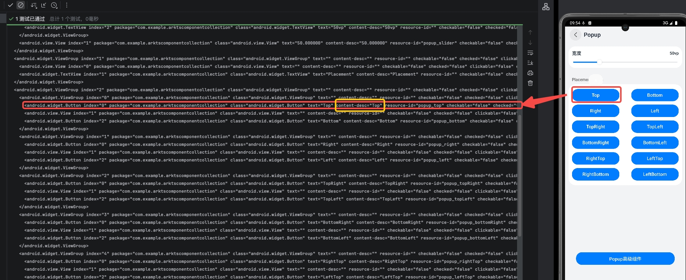

iOS示例：

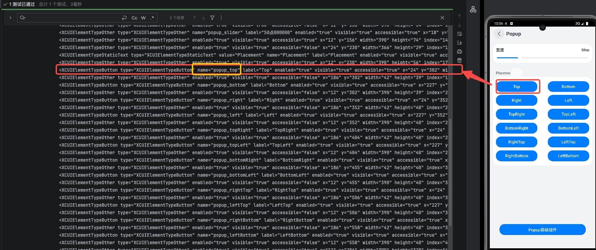

可采用***AppiumBy.ACCESSIBILITY_ID***方式：

```python
if CONFIG['platform'] == 'android': # content-desc
    top_button_id = 'Top'
else:
    top_button_id = 'popup_top'

# 点击Top按钮
driver_manager.find_element_by_accessibility_id(top_button_id).click()
```


- 当要定位的元素的 `content-desc` 值(Android侧)与 `name` 值(iOS侧)都不存在时，如下图：

Android示例：

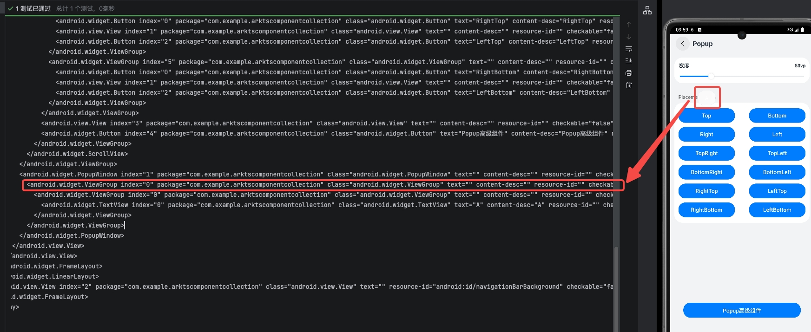

iOS示例：


可采用***AppiumBy.XPATH***方式：

```python
if CONFIG['platform'] == 'android': # content-desc
    popup_xpath = '//android.widget.PopupWindow//android.widget.ViewGroup'
else:
    popup_xpath = '//XCUIElementTypeStaticText[@value="A"]/following-sibling::XCUIElementTypeOther[@index="2"]'

# 获取弹窗元素
popup_window = driver_manager.find_element_by_xpath(popup_xpath)
```


- 当要定位的元素的 `content-desc` 值(Android侧)不存在，但 存在`name` 值(iOS侧)时，如下图：

Android示例：

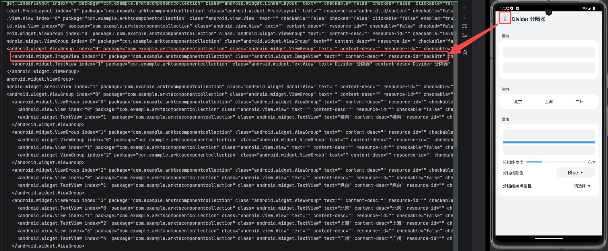

iOS示例：

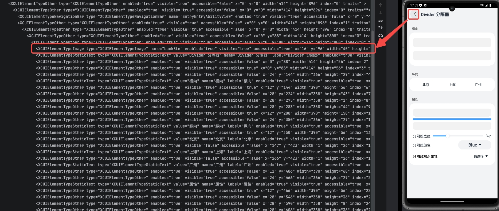

Android根据 `xpath` 定位元素，iOS根据 `name` 值定位元素：

```python
if CONFIG['platform'] == 'android':
    element_path = f"//android.widget.ImageView[@resource-id='backBtn']"
    back_btn = driver_manager.find_element_by_xpath(xpath=element_path)
else:
    back_btn = driver_manager.find_element_by_accessibility_id('backBtn')

back_btn.click()
time.sleep(SLEEP_TIME)
```

