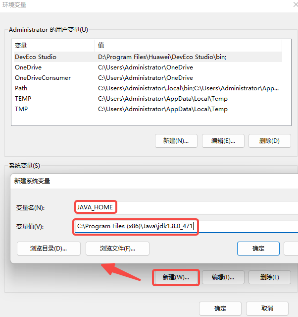
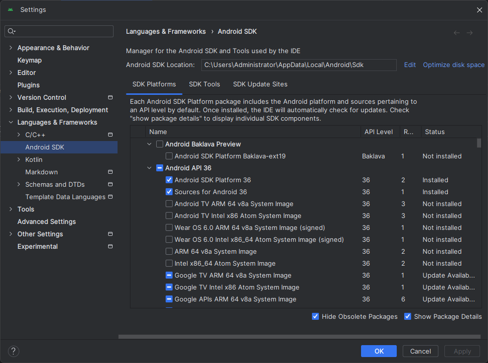
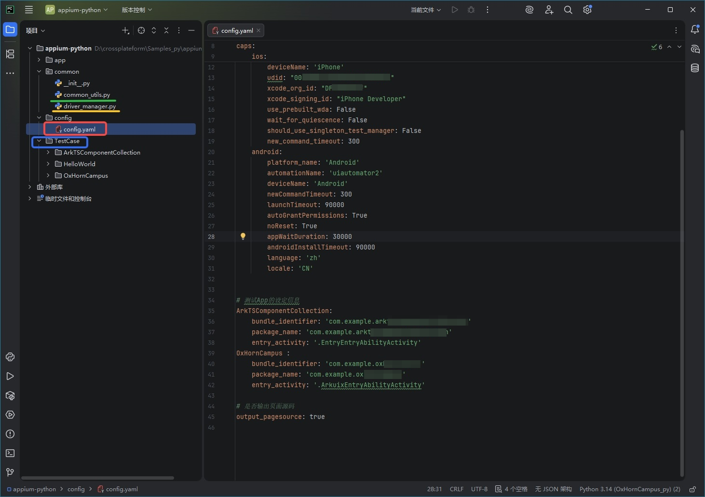

## ArkUI-X 应用支持 Appium 测试

## 一、简介

Appium 是一个开源的、跨平台的移动应用自动化测试框架。使用 API 26 SDK 及以上版本打包的 ArkUI-X 应用支持 Appium 测试，采用客户端-服务器框架：

- Appium Server：Appium 服务器，接收来自客户端的测试脚本
- Client：Appium 客户端，测试人员可使用多种语言编写测试脚本（如 Python、Java、JavaScript 等）

## 二、基于 Windows 系统的 Appium 环境搭建

以在 Win11 平台上安装 Appium 为例。

### 1. 安装 Node.js

- 官方网站 [下载](https://nodejs.org/en/download/) 最新版本，按提示进行安装即可
- 检查是否安装成功：在命令行窗口中运行node -v，出现具体版本（本例为 v22.16.0），说明安装成功，如下图


### 2. 安装 JDK

在 `Appium` 中，`UiAutomator2` 通过 `Java` 编写与 `Android` 应用程序进行交互，因此需要配置 JDK 环境：

- 安装 JDK：可以通过下载地址安装 JDK（ [JDK 下载](https://www.oracle.com/java/technologies) ）。

- 环境变量配置：确认 JDK 的安装路径后，通过“我的电脑”右键菜单--->属性--->高级--->环境变量--->系统变量，配置如下变量名和变量值：

| 变量名      | 变量值                                                |
| :---------- | :---------------------------------------------------- |
| `JAVA_HOME` | `C:\Program Files \Java\jdk-x.x.x`            |
| `CLASSPATH` | `.;%JAVA_HOME%\lib\dt.jar;%JAVA_HOME%\lib\tools.jar;` |
| `PATH`      | `%JAVA_HOME%\bin;%JAVA_HOME%\jre\bin;`                |

说明：`jdk-x.x.x` 为示例占位写法，请替换为本机实际安装目录中的 JDK 版本号（例如 `jdk1.8.0_471`）。

以`JAVA_HOME`为例，点击`新建`弹出对话框，添加变量名和变量值，点击`确定`。如下图所示：


- 检查 JDK 是否配置成功：在命令行窗口中运行 java -version，出现具体版本（本例为 1.8.0_131），说明安装配置成功，如下图红框所示：

  

### 3. 安装 Android SDK 平台工具包

- 推荐使用 Android Studio 安装 Android SDK。

- Android Studio 安装时会进行环境的初始化，使用标准安装即可。

- 安装完成后，打开 Android Studio，进入 `SDK Manager`，按如下步骤操作：

  - `SDK Platforms` 标签页：至少勾选一个 Android API 版本（例如 Android API 36）


  - `SDK Tools` 标签页：勾选 "Android SDK Build-Tools"、"Android SDK Platform-Tools" 和"Android SDK Tools"，如下图：


- 设置环境变量：确认 Android SDK 的安装路径后，通过"我的电脑"右键菜单--->属性--->高级--->环境变量--->系统变量，配置如下变量名和变量值：

| 变量名         | 变量值                                                                      |
| :------------- | :-------------------------------------------------------------------------- |
| `ANDROID_HOME` | `C:\Users\YourName\AppData\Local\Android\Sdk`                              |
| `PATH`         | `%ANDROID_HOME%\platform-tools;%ANDROID_HOME%\tools;%ANDROID_HOME%\tools\bin` |

- 检查 SDK 是否安装成功：命令行窗口中运行 adb version，出现下图信息，说明安装成功。


- 如果您不需要Android Studio，可以参考官方文档进行安装，[官网链接](https://developer.android.google.cn/tools?hl=zh-cn)。

### 4. 安装 Appium 服务端

Appium 命令行版本的服务端目前官方已经更新到了 3.x 版本，以下会以 3.x 版本为例介绍命令行版本服务端的安装方式。

>  Appium 服务端也有 GUI 版本，但目前 GUI 版本官方已经停止更新，对应的是 Appium 1.x 版本的服务端。
>
> 推荐使用命令行版本。

- Appium Server 3.x 安装：

  在命令行窗口执行如下命令：

```shell
npm i appium -g
```

如下图：


- 安装 Appium driver，它是 Android 平台自动化的 UiAutomator2 驱动程序：

  在命令行窗口执行如下命令：

```shell
appium driver install uiautomator2
```

如下图：


安装完成后，可通过如下命令验证安装是否成功：

```shell
appium driver list --installed
```

如下图：


### 5. 安装 Appium 客户端

- 安装 Python（由于选用 Python 语言作为客户端的脚本开发语言，所以优先安装 Python）

可以直接从 Python 的官方网站下载 Python 3 对应的[Windows 安装程序](https://www.python.org/downloads/windows/)，推荐下载 `Windows installer (64-bit)`，然后运行下载的 `python-3.x-amd64.exe` 安装包。在安装向导界面，**务必勾选“Add Python to PATH”**选项。


- 安装 Appium 的 Python 客户端

  在命令行窗口执行如下命令：

```shell
pip install Appium-Python-Client
```

如下图：


至此，Android 平台的 Appium 环境搭建完成。下面使用示例验证 Appium。

### 6. 验证示例代码

- 获取代码

示例代码 test.py 可从 [GitHub Appium 仓库](https://github.com/appium/appium/tree/master/packages/appium/sample-code/quickstarts/py) 获取。下载后保存到本地的任意位置。

- 启动 Appium 服务

  在命令行窗口执行如下命令：

  ```shell
  appium
  ```

  如下图：


- 运行示例代码

  通过 CMD 进入到命令行窗口，进入到 test.py 所在目录，执行如下命令：

  ```shell
  python test.py
  ```

   如下图：


执行成功的情况下，手机上可以看到：自动点击【settings】后，在设置界面中又点击了【Apps】，然后退出。


  **注意：执行代码出错的情况，可能是示例代码与测试手机的设置不一致导致的。** 需要手动修改test.py，方法有两种：

**方法一：注释掉如下代码：**


**方法二：设定正确的值**

通过以下查询命令打印并筛选 `adb` 的日志，等待日志刷新结束，重新打开需要测试的 APP，即可得到 `package` 和 `activity`。

查询命令：

```shell
adb logcat ActivityManager:I | findstr "START"
```


将查询到的正确 activity 的值替换示例中的设定值


## 三、基于 macOS 系统的 Appium 环境搭建

### 1. 安装 Node.js

- 官方网站 [下载](https://nodejs.org/en/download/) 最新版本，按提示进行安装即可
- 检查是否安装成功：在命令行窗口中运行node -v，出现具体版本（本例为 v22.16.0），说明安装成功。

### 2. 安装 Xcode

在 `Appium` 中，`iOS` 需要 `Xcode` 及 `Xcode 开发者工具` 进行签名配置等交互，不同的 Xcode 版本对 macOS 主机版本的要求也不同，[详情](https://appium.github.io/appium-xcuitest-driver/latest/installation/) 通过官网查询对应版本，在 App Store 中下载安装即可。

### 3. 安装 Appium 服务端

Appium 命令行版本的服务端目前官方已经更新到了 3.x 版本，以下会以 3.x 版本为例介绍命令行版本服务端的安装方式。

>  Appium 服务端也有 GUI 版本，但目前 GUI 版本官方已经停止更新，对应的是 Appium 1.x 版本的服务端。
>
> 推荐使用命令行版本。

- Appium Server 3.x 安装：

  在命令行窗口执行如下命令：

  ```shell
  npm i appium -g
  ```

  如下图：


- 安装完成后，可通过如下命令验证安装是否成功：

```shell
appium driver list --installed
```

如下图：


- 安装 XCUITest driver：

  在命令行窗口执行如下命令：

```shell
appium driver install xcuitest
```

如下图：


安装完毕后，可通过如下命令验证安装是否成功：

```shell
 appium driver list --installed
```

如下图：


### 4. 安装 Appium 客户端

- 安装 Python（由于选用 Python 语言作为客户端的脚本开发语言，所以优先安装 Python）

可以从 Python 的官方网站下载 Python 3 对应的 [macOS 安装程序](https://www.python.org/downloads/macos/)，选择版本进行下载，然后双击 `.pkg` 文件进行安装

安装后若命令行无法识别 `python3` 或 `pip3`，可按以下步骤手动配置环境变量：

```shell
# 查看当前 shell 类型
echo $SHELL
```

- 若输出包含 `zsh`，编辑 `~/.zshrc`：

```shell
echo 'export PATH="/Library/Frameworks/Python.framework/Versions/3.x/bin:$PATH"' >> ~/.zshrc
source ~/.zshrc
```

- 若输出包含 `bash`，编辑 `~/.bash_profile`：

```shell
echo 'export PATH="/Library/Frameworks/Python.framework/Versions/3.x/bin:$PATH"' >> ~/.bash_profile
source ~/.bash_profile
```

说明：请将示例中的 `3.x` 替换为实际安装的 Python 主版本号（如 `3.12`）。

在命令行窗口执行如下命令验证Python是否安装成功：

```
python3 --version
```

如下图： 


- 安装 Appium 的 Python 客户端

  在命令行窗口执行如下命令：

```shell
pip3 install Appium-Python-Client
```

如下图：


### 5. 配置 WebDriverAgent 签名

 为了与被测设备通信，XCUITest 驱动程序会自动使用Xcode的命令行工具安装（WDA）应用程序。真实设备有若干安全限制，首先需要进行配置：

- 配置 WebDriverAgentRunner 自动签名

  在命令行窗口执行如下命令打开 WDA 项目：

  ```shell
  appium driver run xcuitest open-wda
  ```

  如下图：


在项目中的 *TARGETS* 下选择  WebDriverAgentRunner，切换到 Signing & Capabilities 标签，**务必勾选 “Automatically manage signing”**，然后选择 TeamID 并输入唯一的 Bundle Identifier，如下图：


- 运行一次 WebDriverAgentRunner

在项目顶部栏的Scheme 下选择  WebDriverAgentRunner，设备切换到当前连接的测试设备，然后点击左侧的 ▶ 按钮，如下图所示，即可在手机上安装WDA应用程序：


- 在手机上选择信任开发者

  在连接的iOS手机上选择【设置 → 通用 → VPN与设备管理】，选择上述签名时配置的TeamID，选择信任即可。


- 免费TeamID可能出现的情况

由于免费 TeamID 有安装开发应用限制，一旦超过三个应用，会出现下图情况：


遇到这种情况，需要将手机上的开发应用卸载到三个以下即可继续安装，安装成功后需要在手机上选择信任开发者。

至此，iOS 平台的 Appium 环境搭建完成。下面使用示例验证 Appium。

### 运行前请将 <占位符> 替换为实际值

本文中的示例脚本和配置中包含以下占位符，使用前必须替换为真实值，否则会导致启动失败或连接失败：

- `YOUR_ANDROID_PACKAGE_NAME`：Android 应用包名。可从 `app.json5` 的 `bundleName` 获取，或通过 `adb logcat | findstr /I "cmp="`（Windows）/`adb logcat | grep "cmp="`（macOS）从启动日志提取。
- `YOUR_IOS_BUNDLE_IDENTIFIER`：iOS 应用 `Bundle Identifier`。可在 Xcode 的 `Signing & Capabilities` 中查看。
- `YOUR_TEAM_ID`：Apple 开发者团队 ID。可在 Xcode 的 `Signing & Capabilities` 页面查看签名团队信息。
- `YOUR_TEST_DEVICES_UDID`：测试设备唯一标识。Android 可通过 `adb devices` 获取设备序列号；iOS 可通过 `idevice_id -l` 获取设备 UDID。

建议在复制示例代码后，先全局搜索并逐项替换，再执行命令。

### 6. 验证示例代码

- 示例代码如下（ test_iOSsample.py）

```python
import unittest
from appium import webdriver
from appium.options.ios import XCUITestOptions
from appium.webdriver.common.appiumby import AppiumBy

# iOS 真机配置（请确保签名和设备已正确配置）
capabilities = {
    'platformName': 'iOS',
    'udid': 'YOUR_TEST_DEVICES_UDID',   # 替换为测试设备的UDID
    'bundleId': 'YOUR_IOS_BUNDLE_IDENTIFIER',  # BUNDLE_ID 获取方式：在 Xcode 的 Signing & Capabilities 中查看 Bundle Identifier
    'automationName': 'XCUITest',
    'xcodeOrgId': 'YOUR_TEAM_ID', # 替换为开发团队ID
    'xcodeSigningId': 'iPhone Developer',
    'showXcodeLog': True,
    'shouldUseSingletonTestManager': False,
}

appium_server_url = 'http://localhost:4723'

class TestOpenWLANAndReturn(unittest.TestCase):
    def setUp(self) -> None:
        self.driver = webdriver.Remote(
            appium_server_url,
            options=XCUITestOptions().load_capabilities(capabilities)
        )
        self.driver.implicitly_wait(10)

    def tearDown(self) -> None:
        if self.driver:
            self.driver.quit()

    def test_open_wlan_and_return_home(self) -> None:
        try:
            wlan_button = self.driver.find_element(
                by=AppiumBy.IOS_PREDICATE,
                value='label == "WLAN" OR label == "无线局域网"'
            )
            wlan_button.click()
            print("已进入 WLAN 页面")
        except Exception as e:
            print("未找到 WLAN 入口:", e)
            raise

        # 返回主屏幕
        self.driver.execute_script('mobile: pressButton', {'name': 'home'})
        print("已返回主屏幕")

if __name__ == '__main__':
    unittest.main()
```


- 启动 Appium 服务

  在命令行窗口执行如下命令：

  ```shell
  appium
  ```

  如下图：

  

- 运行示例代码

在命令行进入到 test_iOSsample.py 所在目录，执行如下命令：

```shell
python3 test_iOSsample.py
```

 如下图：


执行成功的情况下，手机上可以看到：自动点击【settings】后，在设置界面中又点击了【WLAN】，然后退回主屏幕。


## 四、Appium 测试 ArkUI-X 应用说明

测试脚本使用 Python 语言编写，推荐使用 PyCharm 开发环境。

### 1. PyCharm 工程目录结构

> 工程目录结构可以由开发者自定义。下图是推荐的目录结构。



- 红色框内 `config.yaml` 文件为配置文件，包含测试设备及测试用例等相关信息，***测试前需手动配置***，配置方式详见第 2 点
- 黄色下划线 `driver_manager.py` 文件为启动器相关，封装了启动管理器的单例，通常无需改动；若 iOS 真机出现会话初始化异常，可按第 2.2 节增加 `processArguments` 配置
- 绿色下划线 `common_utils.py` 文件为共通函数，在编写用例时如有重复且需反复调用的工具函数，***可添加到该文件中***，方便后续统一调用
- 蓝色框内 `TestCase` 文件夹为具体测试用例

### 2. ArkUI-X 测试 config 文件配置

在 PyCharm 中测试 Android 或 iOS 平台的自动化用例是通过修改 `config.yaml` 文件控制，脚本如下：

```yaml
# config.yaml
# Appium 服务器地址
appium_server_url: http://127.0.0.1:4723

# 测试平台
# Android 与 iOS 平台二选一，保留目标平台为非注释状态即可
platform: 'android'
#platform: 'ios'

caps:
    ios:
        platform_name: 'iOS'
        automation_name: "XCUITest"
        deviceName: 'iPhone'
        udid: "YOUR_UDID" 					# 修改为测试设备的udid（可通过命令 idevice_id -l 获取）
        xcode_org_id: "YOUR_TEAM_ID"        # 修改为Xcode签名时的TeamID（具体位置参考下方`xcode_org_id`查询方式）
        xcode_signing_id: "iPhone Developer"
        use_prebuilt_wda: False
        wait_for_quiescence: False
        should_use_singleton_test_manager: False
        new_command_timeout: 300
    android:
        platform_name: 'Android'
        automationName: 'uiautomator2'
        deviceName: 'Android'
        newCommandTimeout: 300
        launchTimeout: 90000
        autoGrantPermissions: True
        noReset: True
        appWaitDuration: 30000
        androidInstallTimeout: 90000
        language: 'zh'
        locale: 'CN'

# 测试 App 的设定信息
TestAppA:
  bundle_identifier: 'YOUR_IOS_BUNDLE_IDENTIFIER' # iOS: 从 Xcode -> Signing & Capabilities -> Bundle Identifier 获取
  package_name: 'YOUR_ANDROID_PACKAGE_NAME' # Android: 可从 app.json5 的 bundleName
  entry_activity: 'YOUR_ANDROID_ENTRY_ACTIVITY' 
    # Android: 从日志中的 cmp=包名/Activity 提取 '/' 后内容（例如 .EntryEntryAbilityActivity）
    # entry_activity 获取命令（先执行 adb logcat -c 清空旧日志，再手动启动目标应用）
    # Windows: adb logcat | findstr /I "cmp="
    # macOS: adb logcat | grep "cmp="
    # 示例日志片段: cmp=com.example.appium/.EntryEntryAbilityActivity）
    # 则 package_name=com.example.appium，entry_activity=.EntryEntryAbilityActivity）
TestAppB:
  bundle_identifier: 'YOUR_IOS_BUNDLE_IDENTIFIER'
  package_name: 'YOUR_ANDROID_PACKAGE_NAME'
  entry_activity: 'YOUR_ANDROID_ENTRY_ACTIVITY'

# 是否输出页面源码
output_pagesource: true
```

#### 1. xcode_org_id 查询方式

打开 Xcode，页签切换到 Signing & Capabilities，如下图：


上图中红色框内为签名 ID 和其对应的 `TeamID` 值，在脚本 `config.yaml` 文件中对应为 `xcode_org_id` 值。

#### 2. iOS 补充配置（driver_manager.py）

若 iOS 真机执行过程中出现与 XCTest 配置相关的会话初始化问题，可在 `driver_manager.py` 的 iOS 配置分支（`options = XCUITestOptions()` 之后）增加如下能力：

```python
options.set_capability('processArguments', {
  'env': {
    'XCTestConfigurationFilePath': '/tmp/dummy_xctest_config.plist'  #是否启用appium的唯一标识
  }
})
```

建议放置位置：在 `options.set_capability("includeNonModalElements", True)` 之后。

### 3. Appium 元素定位

Appium 元素定位是从当前页面的布局中提取数据。在测试脚本中，每个页面可以使用 `request_page_source_android.py`、`request_page_source_ios.py` 生成当前页面布局的 `xml` 文件：

```python
# request_page_source_android.py
from appium import webdriver
from appium.options.android import UiAutomator2Options
from common.common_utils import CommonUtils
BUNDLE_NAME = "YOUR_ANDROID_PACKAGE_NAME"
MAIN_ACTIVITY = "YOUR_ANDROID_ENTRY_ACTIVITY"
DEVICE_ID = "YOUR_TEST_DEVICES_UDID"  # 替换为测试设备的序列号
# 获取方式：连接设备后执行 adb devices，使用输出列表中的设备序列号

capabilities = {
    "platformName": "Android",
    "deviceName": DEVICE_ID,
    "appPackage": BUNDLE_NAME,
    "appActivity": MAIN_ACTIVITY,
    "automationName": "UiAutomator2",
    "autoGrantPermissions": True,
    "newCommandTimeout": 300,
    "noReset": True,
}
options = UiAutomator2Options().load_capabilities(capabilities)
driver = webdriver.Remote("http://localhost:4723", options=options)
source = driver.page_source
print(f'{source}')
CommonUtils.save_page_source(driver, folder="../pagesource")
```
```python
# request_page_source_ios.py
from appium import webdriver
from appium.options.ios import XCUITestOptions
from common.common_utils import CommonUtils
BUNDLE_ID = "YOUR_IOS_BUNDLE_IDENTIFIER"  # BUNDLE_ID 获取方式：在 Xcode 的 Signing & Capabilities 中查看 Bundle Identifier
DEVICE_ID = "YOUR_TEST_DEVICES_UDID" # DEVICE_ID 获取方式：连接设备后执行 idevice_id -l，使用输出的设备 UDID
capabilities = {
    "platformName": "iOS",
    "deviceName": "iPhone",
    "udid": DEVICE_ID,
    "bundleId": BUNDLE_ID,
    "automationName": "XCUITest",
    "xcodeOrgId": "YOUR_TEAM_ID", # 修改为Xcode签名时的TeamID
    "xcodeSigningId": "iPhone Developer",
    "showXcodeLog": True,
    "shouldUseSingletonTestManager": False,
    "newCommandTimeout": 300,
    "noReset": True,
    "shouldTerminateApp": False,
    "usePrebuiltWDA": True,
    "waitForQuiescence": False,
    "wdaEventloopIdleDelay": 1,
    "includeNonModalElements": True,
}

options = XCUITestOptions().load_capabilities(capabilities)
driver = webdriver.Remote("http://localhost:4723", options=options)

driver.update_settings({
    "boundElementsByIndex": True,
    "snapshotMaxDepth": 60,
    "simpleIsVisibleCheck": True,
    "customSnapshotTimeout": 5,
    "useFirstMatch": True,
    "tapWithShortPressDuration": 0.18,
})

source = driver.page_source
print(f'{source}')

CommonUtils.save_page_source(driver, folder="../pagesource")
```

打开 `xml` 文件，可以定位元素。

#### 1. 元素定位方式

##### 1.1 元素或组件在开发应用时设置了 ID

建议优先使用开发应用时预先设置的元素 ID 进行定位。

注意事项：
- 建议在开发应用时为关键元素或组件标明 ID。
- ID 规格为：package_name:id/id名，例如 `com.example.appium:id/goToAttributeTestPageButton`。
- 需确保 ID 的唯一性，避免同一页面内出现重复 ID 导致定位歧义。

Android 示例：


iOS 示例：


可采用如下方式定位元素：

其中 `id` 值需要与开发应用时设置的 ID 完全一致。代码示例中的 ID 仅用于说明写法，实际应以页面源码中的 `resource-id` 或 `name` 为准。

```python
# 采用driver_manager中封装好的可显示等待定位元素接口
driver_manager.find_element_by_id(id)
```

代码用法示例：

```python
# Step1. 示例：点击目标测试页面按钮

import time

SLEEP_TIME = 2

button_id = "com.example.appium:id/goToAttributeTestPageButton"
button = driver_manager.find_element_by_id(button_id)
time.sleep(SLEEP_TIME)
button.click()
time.sleep(SLEEP_TIME)
```

##### 1.2 元素或组件在开发应用时没有设置 ID

当元素或组件在开发应用时没有设置 ID 时，可根据页面结构使用 XPath 方式进行定位。

Android 示例：


iOS 示例：


可采用 `AppiumBy.XPATH` 方式：

```python
if CONFIG['platform'] == 'android': # content-desc
    popup_xpath = '//android.widget.PopupWindow//android.widget.ViewGroup'
else:
    popup_xpath = '//XCUIElementTypeStaticText[@value="A"]/following-sibling::XCUIElementTypeOther[@index="2"]'

# 获取弹窗元素
popup_window = driver_manager.find_element_by_xpath(popup_xpath)
```

## 五、Appium 在不同平台常用属性支持对照表

| 序号 | Android属性名   | Android说明                     | 是否支持 | iOS属性名  | iOS说明                    | 是否支持 |
| ---- | --------------- | ------------------------------- | -------- | ---------- | -------------------------- | -------- |
| 1    | checkable       | 元素是否可被勾选                | 支持     | N/A        | -                          | -        |
| 2    | checked         | 元素当前是否处于已勾选/选中状态 | 支持     | selected   | 元素当前是否处于选中状态   | 支持     |
| 3    | class           | 元素对应的 Android 控件类全名   | 支持     | type       | 元素对应的 iOS 控件类型    | 支持     |
| 4    | clickable       | 元素是否可点击                  | 支持     | hittable   | 元素是否可被点击/触摸      | 支持     |
| 5    | content-desc    | 无障碍描述文本                  | 支持     | label      | 元素的无障碍标签           | 支持     |
| 6    | enabled         | 元素是否处于可用状态            | 支持     | enabled    | 元素是否处于可用状态       | 支持     |
| 7    | focusable       | 元素是否可获取焦点              | 支持     | N/A        | -                          | -        |
| 8    | focused         | 元素当前是否拥有焦点            | 支持     | N/A        | -                          | -        |
| 9    | scrollable      | 元素是否可滚动                  | 支持     | N/A        | -                          | -        |
| 10   | selected        | 元素当前是否处于选中状态        | 支持     | selected   | 元素当前是否处于选中状态   | 支持     |
| 11   | displayed       | 元素是否实际显示在屏幕上        | 支持     | visible    | 元素是否在屏幕上可见       | 支持     |
| 12   | text            | 元素上显示的文本内容            | 支持     | value      | 元素的值                   | 支持     |
| 13   | hint            | 输入框的提示文本                | 支持     | N/A        | -                          | -        |
| 14   | resource-id     | 元素的资源 ID                   | 支持     | name       | 元素的无障碍名称           | 支持     |
| 15   | package         | 元素所属应用的包名              | 支持     | N/A        | -                          | -        |
| 16   | bounds          | 元素在屏幕上的矩形边界坐标      | 支持     | rect       | 元素在屏幕上的矩形边界信息 | 支持     |
| 17   | N/A             | -                               | -        | index      | 元素在其父容器中的索引位置 | 支持     |
| 18   | N/A             | -                               | -        | UID        | 元素的唯一标识符           | 支持     |
| 19   | N/A             | -                               | -        | accessible | 元素是否启用了无障碍访问   | 支持     |
| 20   | N/A             | -                               | -        | traits     | 元素的无障碍特征集合       | 支持     |
| 21   | password        | 元素是否为密码输入框            | 支持     | N/A        | -                          | -        |
| 22   | selection-start | 文本选区的起始位置索引          | 支持     | N/A        | -                          | -        |
| 23   | selection-end   | 文本选区的结束位置索引          | 支持     | N/A        | -                          | -        |
| 24   | long-clickable  | 元素是否支持长按操作            | 支持     | N/A        | -                          | -        |