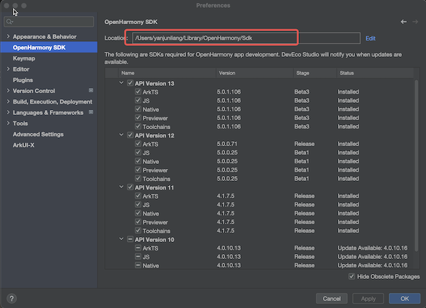

# 路径合法性判断说明

## 简介

本文档主要讲述开发者使用config配置路径时，如何判断配置路径的合法性。包括：

- 路径合法性判断方法
- 环境变量涉及配置选项列表
- 环境path涉及配置选项列表

## 路径合法性判断方法

- ####  SDK

| 配置选项          | 判断方法                                                     |
| ----------------- | ------------------------------------------------------------ |
| --android-sdk     | 1.判断路径是否存在  2.路径是否可用（windows不能为磁盘符；mac和linux不能为系统根目录）  3.判断路径下是否存在’build-tools‘及’platform-tools‘文件夹 |
| --arkui-x-sdk     | 1.判断路径是否存在 2.路径是否可用（windows不能为磁盘符；mac和linux不能为系统根目录） 3.路径下是否有versioncode文件夹  4.versioncode文件夹下是否有'arkui-x'文件夹  5.路径下是否有‘licenses’文件夹 |
| --harmonyos-sdk   | 1.判断路径是否存在  2.路径是否可用（windows不能为磁盘符；mac和linux不能为系统根目录） 新版本： 1.路径下是否有文件夹名称包含'HarmonyOS'或’default’ 2.文件夹下是否有'sdk-pkg.json'文件，如有此文件且文件中的data.platformVersion版本号大于等于5.0.0则直接判定为有效路径，否则继续判断第3步 3.路径下是否有‘licenses’文件夹 若路径下无文件夹名称包含'HarmonyOS'或‘default’，或是文件夹下无'sdk-pkg.json'文件，转为判断旧版本是否合法 旧版本：  1.路径下是否有'hmscore'和'openharmony'文件夹 2.'openharmony'文件夹下是否有versioncode文件夹 3.versioncode文件夹下是否有'toolchains'文件夹 4.路径下是否有‘licenses’文件夹 |
| --openharmony-sdk | 1.判断路径是否存在 2.路径是否可用（windows不能为磁盘符；mac和linux不能为系统根目录） 3.路径下是否有versioncode文件夹 4.versioncode文件夹下是否有'toolchains'文件夹 5.路径下是否有‘licenses’文件夹 |

- openharmony-sdk配置应与DevEco设置中的OpenHarmony SDK配置的地址一致,如下图所示。
注：不能配置成DevEco工具自身包含的的sdk目录下的openharmony路径。

- harmonyos-sdk配置在大于等于5.0.0的DevEco版本中，应配置到DevEco工具自身包含的sdk目录下。

   Mac：在应用程序中找到安装的DevEco工具，右键->显示包内容，进入包内容中找到Contents/sdk目录，配置到该目录下。例如/Applications/DevEco-Studio.app/Contents/sdk
   

   Windows：在应用安装目录中找到sdk目录，配置到该目录下。例如C:\Program Files\Huawei\DevEco Studio\sdk
   

- ####  IDE

| 配置选项              | 判断方法                                                     |
| --------------------- | ------------------------------------------------------------ |
| --android-studio-path | 1.判断路径是否存在 2.若为Windows系统①判断路径下的‘bin’目录下’studio.exe‘或’studio64.exe‘的可执行文件是否存在。②判断路径下’studio.exe‘或’studio64.exe‘的可执行文件是否存在 若为Linux系统①判断路径下的‘bin’目录下’studio.sh‘或’studio64.sh‘的可执行文件是否存在。②判断路径下’studio.sh‘或’studio64.sh‘的可执行文件是否存在。 若为Mac系统①判断路径下的'Contents/MacOS'目录下’studio‘或’studio64’的可执行文件是否存在。②判断路径下’studio‘或’studio64’的可执行文件是否存在。 |
| --deveco-studio-path  | 1.判断路径是否存在 2.若为Windows系统①判断路径下的‘bin’目录下‘devecostudio.exe’或‘devecostudio64.exe’的可执行文件是否存在。②判断路径下‘devecostudio.exe’或‘devecostudio64.exe’的可执行文件是否存在。 若为Mac系统①判断路径下的'Contents/MacOS'目录下‘devecostudio’或‘devecostudio64’的可执行文件是否存在。②判断路径下‘devecostudio’或‘devecostudio64’的可执行文件是否存在。 |

- ####  CMD

| 配置选项     | 判断方法                                                     |
| ------------ | ------------------------------------------------------------ |
| --java-sdk   | 1.判断路径是否存在 2.若为Windows系统，判断路径下'java.exe’的可执行文件是否存在。若为Linux系统或Mac系统，判断路径下的‘bin’目录下‘java’的可执行文件是否存在 |
| --nodejs-dir | 1.判断路径是否存在 2.若为Windows系统，判断路径下是否有'node.exe’的可执行文件。若为Linux系统或Mac系统，判断路径下的‘bin’目录下‘node’的可执行文件是否存在 |
| --ohpm-dir   | 1.判断路径是否存在 2.判断路径下的‘bin’目录下‘ohpm’的可执行文件是否存在 |
| --build-dir  | 1.判断路径是否存在                                           |

## 环境变量涉及配置选项列表

| 配置选项              | 环境变量名       |
| --------------------- | ---------------- |
| --android-sdk         | ANDROID_HOME     |
| --arkui-x-sdk         | ARKUIX_SDK_HOME  |
| --harmonyos-sdk       | HarmonyOS_HOME   |
| --openharmony-sdk     | OpenHarmony_HOME |
| --java-sdk            | JAVA_HOME        |
| --android-studio-path | Android Studio   |
| --deveco-studio-path  | DevEco Studio    |
| --nodejs-dir          | NODE_HOME        |
| --ohpm-dir            | OHPM_HOME        |

## 环境path涉及配置选项列表

- --java-sdk

- --nodejs-dir

- --ohpm-dir
