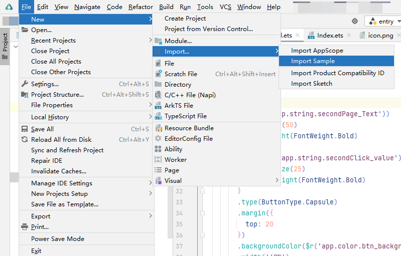

# 使用DevEco Studio开发ArkUI-X应用

## 开发跨平台应用

### 创建工程

在Deveco Studio中导入ArkUI-X Sample，快速创建跨平台工程。

1. 点击File > New > Import > Import Sample。
   

2. 在左上方的下拉框中选择OpenHarmony，选择ArkUI-X/HelloWorld，点击**Next**。

3. 在工程配置页面，填写Project name和Project location，点击**Finish**，等待Sample工程导入完成。

为了您开发应用的良好体验，DevEco Studio提供了ArkUI-X开发环境诊断的功能，帮助您识别开发环境是否完备。创建工程完成后，会进行环境检查，如果环境配置有问题，会弹窗提示环境检查不通过，请根据具体的错误项进行检查并完成相应的配置。

如弹窗提示Android SDK检查结果报错，请确认环境变量是否已完成配置。

### 编译构建生成跨平台应用

DevEco Studio可打包生成不同平台的应用包，在Windows平台上同时生成可运行在OpenHarmony设备上的app包和运行在Android设备上的apk包，在macOS平台上还将生成可运行在iOS设备上的app包。

1. 在主菜单栏，单击**Build &gt; Build Hap(s)/APP(s) &gt; Build APP(s)**。
   

   构建完成后，在 **.arkui-x &gt; android &gt; app &gt; build &gt; outputs** 目录下生成可运行在Android设备上的apk包。如果是使用macOS平台，还将在ios目录下构建出可运行在iOS设备上的app包。

   

   在**build**目录下生成可运行在OpenHarmony设备上的app包。

   

2. 在Android Studio打开android目录，通过Android Studio将构建产物推包到Android真机设备上，查看应用运行效果。
## 开发跨平台依赖包

基于OpenHarmony应用，构建Android和iOS应用的依赖包。依赖包支持添加到已有的Android和iOS应用中。

### 创建Library

在Deveco Studio中导入ArkUI-X Sample，快速创建跨平台工程。

1. 点击File > New > Import > Import Sample。
   

2. 在左上方的下拉框中选择OpenHarmony，选择ArkUI-X/ArkUI-X_Library，点击**Next**。

3. 在工程配置页面，填写Project name和Project location，点击**Finish**，等待Sample工程导入完成。

### 编译构建生成跨平台依赖包

基于OpenHarmony应用，DevEco Studio可打包生成不同平台的依赖包，在Windows平台上同时生成集成Android应用的aar包，在macOS平台上还将生成集成在iOS应用的.xcframework包。

在主菜单栏，单击**Build &gt; Build Hap(s)/APP(s) &gt; Build APP(s)**。

构建完成后，在 **.arkui-x &gt; android &gt; library &gt; build &gt; outputs**目录下生成可集成在Android应用上的aar包。如果是使用macOS平台，还将ios目录下构建出可集成在iOS应用上的.xcframework包。

