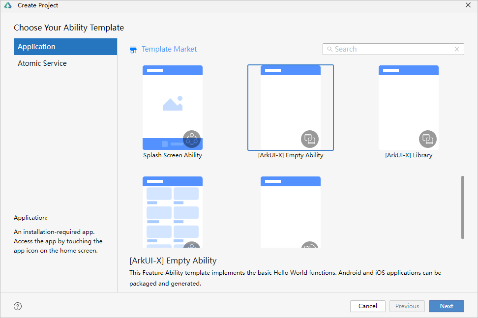
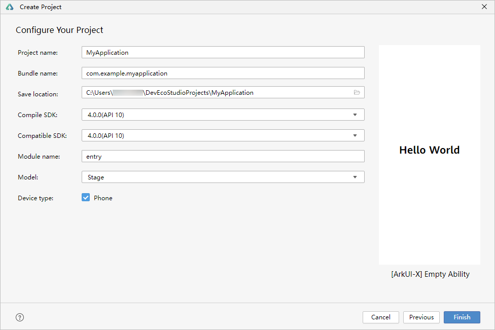
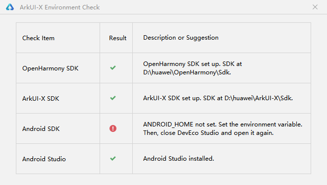
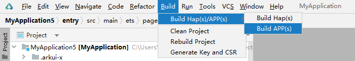
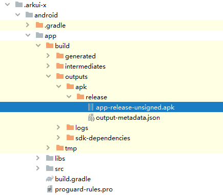
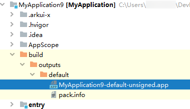
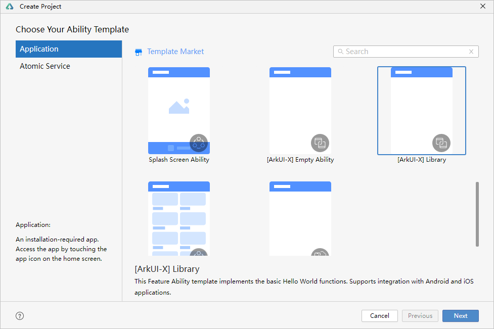
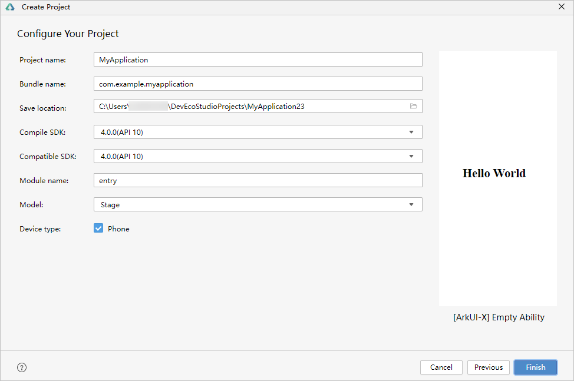
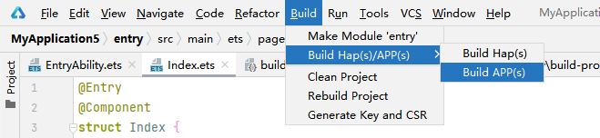
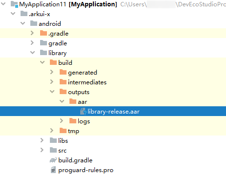

# 使用DevEco Studio开发ArkUI-X项目

## 开发跨平台应用


### 创建工程

Deveco Studio提供ArkUI-X模板快速创建跨平台工程，支持基于Stage模型HarmonyOS应用生成跨平台Android和iOS应用。

1. 根据工程创建向导，选择创建Application，选择ArkUI-X模板**[ArkUI-X] Empty Ability**，点击**Next**。
   

2. 在工程配置页面，填写工程的基本信息，点击**Finish**。
   

为了您开发应用的良好体验，DevEco Studio提供了ArkUI-X开发环境诊断的功能，帮助您识别开发环境是否完备。创建工程完成后，会进行环境检查，如果环境配置有问题，会弹窗提示环境检查不通过，请根据具体的错误项进行检查并完成相应的配置。

如弹窗提示Android SDK检查结果报错，请确认环境变量是否已完成配置。


### 工程目录结构

```
MyApplication
├── .arkui-x
│   ├── android
│   │   ├── app
│   │   │   ├── libs
│   │   │   │   ├── ace_android.jar                       // ArkUI-X跨平台适配层，在SDK中发布
│   │   │   │   ├── ace_ohos_${module-name}.jar           // API扩展库，在SDK中发布
│   │   │   │   └── arm64-v8a
│   │   │   │       ├── libace_android.so                 // ArkUI-X跨平台引擎库，在SDK中发布
│   │   │   │       └── libace_${module-name}_${submodule-name}.so     // API扩展库，在SDK中发布
│   │   │   ├── src
│   │   │   │   ├── androidTest
│   │   │   │   ├── main
│   │   │   │   │   ├── assets                            // 源码和资源编译后的JSBundle和资源文件，作为平台资源存放在assets中
│   │   │   │   │   │   └── arkui-x
│   │   │   │   │   │       ├── entry                     // JSBundle&resources资源
│   │   │   │   │   │       │   ├── ets
│   │   │   │   │   │       │   │   ├── Application
│   │   │   │   │   │       │   │   ├── MainAbility
│   │   │   │   │   │       │   │   └── pages
│   │   │   │   │   │       │   ├── resources.index       // 应用资源
│   │   │   │   │   │       │   ├── resources
│   │   │   │   │   │       │   └── module.json
│   │   │   │   │   │       ├── feature1
│   │   │   │   │   │       ├── feature2
│   │   │   │   │   │       ├── entryTest                 // ohosTest，仅Debug模式构建包含
│   │   │   │   │   │       └── systemres                 // OpenHarmony系统资源
│   │   │   │   │   ├── java/com/example/myapplication
│   │   │   │   │   │   ├── EntryEntyAbilityActibity.java // 基于AceActivity扩展EntryActivity
│   │   │   │   │   │   └── MyApplication.java            // 基于AceApplication扩展MainActivity
│   │   │   │   │   ├── res
│   │   │   │   │   └── AndroidManifest.xml
│   │   │   │   └── test
│   │   │   ├── build.gradle
│   │   │   └── proguard-rules.pro
│   │   ├── gradle
│   │   ├── build.gradle
│   │   ├── gradle.properties
│   │   ├── gradlew
│   │   ├── gradlew.bat
│   │   └── settings.gradle
│   └── ios
├── .hvigor
├── .idea
├── AppScope                                              // 应用的全局配置信息
├── entry[src/main]                                       // HarmonyOS应用的源码
│   └── src
│       └── main
│           ├── ets
│           │   ├── entryability                          // 应用入口
│           │   │   └── EntryAbility.ets
│           │   └── pages                                 // 应用包括的页面
│           │       └── Index.ets
│           ├── resources                                 // 用于存放应用所用到的资源文件
│           └── module.json5
├── hvigor
├── oh_modules
├── build-profile.json5                                   // 应用级配置信息，包括签名、产品配置等
├── hvigorfile.ts                                         // 应用级编译构建任务脚本
├── hvigorw
├── hvigorw.bat
├── local.properties
└── oh-package.json5
```


### 编译构建生成跨平台应用

DevEco Studio可打包生成不同平台的应用包，在Windows平台上同时生成可运行在HarmonyOS设备上的app包和运行在Andorid设备上的apk包，在macOS平台上还将生成可运行在iOS设备上的app包。

1. 在主菜单栏，单击**Build &gt; Build Hap(s)/APP(s) &gt; Build APP(s)**。
   

   构建完成后，在 **.arkui-x &gt; android &gt; app &gt; build &gt; outputs** 目录下生成可运行在Andorid设备上的apk包。如果是使用macOS平台，还将在ios目录下构建出可运行在iOS设备上的app包。

   

   在**build**目录下生成可运行在HarmonyOS设备上的app包。

   

2. 在Android Studio打开android目录，通过Android Studio将构建产物推包到Android真机设备上，查看应用运行效果。
## 开发跨平台依赖包


基于HarmonyOS应用，构建Android和iOS应用的依赖包。依赖包支持添加到已有的Android和iOS应用中。


### 创建Library

1. 根据工程创建向导，选择创建Application，选择所需要的ArkUI-X模板 **[ArkUI-X] Library**，点击**Next**。
   

2. 在工程配置页面，填写工程的基本信息，点击**Finish**。
   


### 编译构建生成跨平台依赖包

基于HarmonyOS应用，DevEco Studio可打包生成不同平台的依赖包，在Windows平台上同时生成集成Andorid应用的aar包，在macOS平台上还将生成集成在iOS应用的.xcframwork包。

在主菜单栏，单击**Build &gt; Build Hap(s)/APP(s) &gt; Build APP(s)**。



构建完成后，在 **.arkui-x &gt; android &gt; library &gt; build &gt; outputs**目录下生成可集成在Andorid应用上的aar包。如果是使用macOS平台，还将ios目录下构建出可集成在iOS应用上的.xcframwork包。




