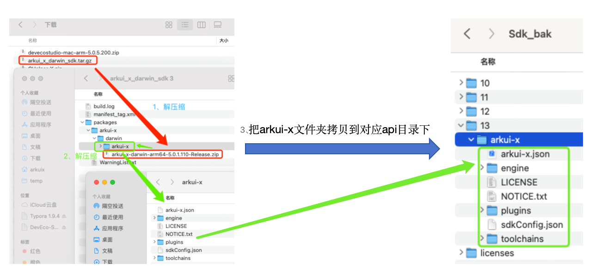
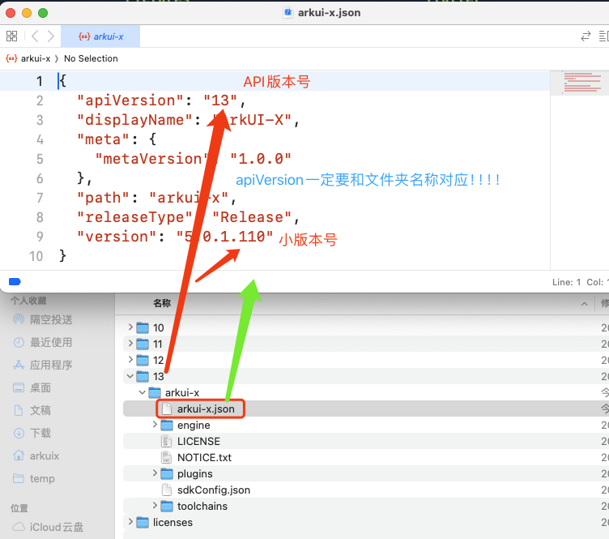
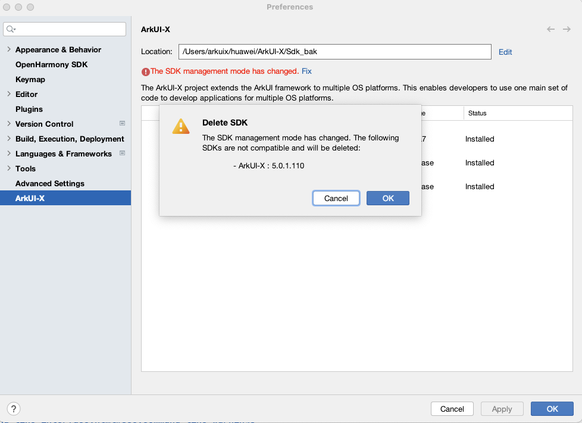

# 如何手动替换ArkUI-X SDK

### 标准替换流程

以MacOS为例，可以参考下图进行SDK的解压缩和拷贝替换：

替换的时候一定注意，下载下来的SDK中**apiVersion一定和要放置的API文件夹名称数字保持一致**：

### 常见问题解决

手动替换经常会遇到以下报错：

**问题原因：**

API文件夹数字和arkui-x.json中的api字段不一致，需要手动修改arkui-x.json中的api字段放到api字段一致的文件夹中，或者新建一个arkui-x.json中的api字段的文件夹，保证API文件夹数字和arkui-x.json中的api字段一致，参考：[ArkUI-X SDK Version与API Version映射表](Dev-faq-12.md)