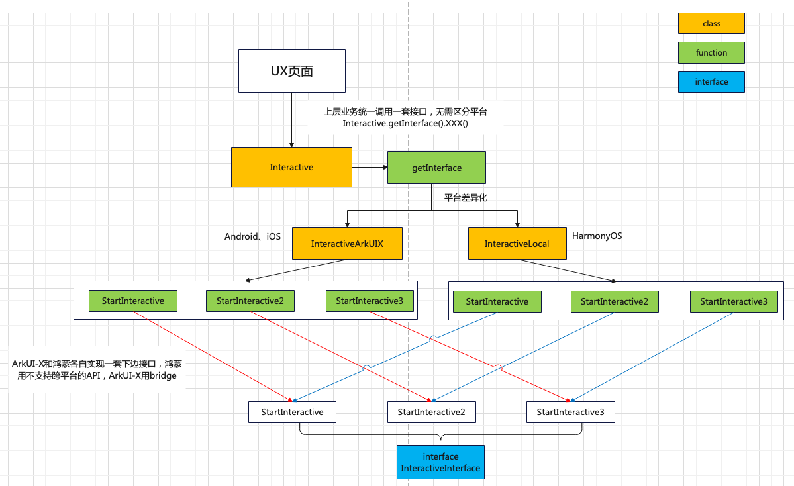

# 如何解决部分API不支持跨平台的问题

### 主要思路：

ArkUI-X提供bridge能力，用于ArkTS和原生侧的通信，可以借助原生侧能力实现当前不支持跨平台API的功能

### Bridge开发者文档：

[总指南](https://gitcode.com/arkui-x/docs/blob/master/zh-cn/application-dev/quick-start/platform-bridge-introduction.md)、[Android侧平台桥接开发指南](https://gitcode.com/arkui-x/docs/blob/master/zh-cn/application-dev/tutorial/how-to-use-bridge-on-android.md)、[iOS侧平台桥接开发指南](https://gitcode.com/arkui-x/docs/blob/master/zh-cn/application-dev/tutorial/how-to-use-bridge-on-ios.md)

### Bridge参考demo工程：

（1）使用Bridge的入门级案例：

核心思想：主要介绍如何引入host_bridge公共桥接module，管理HarmonyOS Next和iOS以及安卓之间的实现差异，让上层业务不再感知通道差异，专注自身业务实现，实现“一码三平台”。

项目源码：具体代码细节请参考：[host_bridge](https://gitcode.com/ChaoZZ/ArkUIX-Project-Reform/tree/main/hostBridgeDemo/project)

（2）使用Bridge的进阶案例：

核心思想：主要介绍从整体架构方面如何进行大型鸿蒙应用工程的模块分层和抽离，以及使用bridge抽象出适配层，进行三端平台的适配

项目源码：具体代码细节请参考：[CodeLab](https://gitcode.com/arkui-x/samples/tree/master/CodeLab)

### 跨平台改造场景级方案建议



#### 不支持跨平台的开源API桥接方案

使用平台差异化来处理，核心思想可以参考上图，具体的demo可以参考：开源API桥接示例XXX

#### HMS的API桥接方案（默认均不支持跨平台）

主要用到动态import的思想，具体的官方用例可以参考：[运行示例](https://developer.huawei.com/consumer/cn/doc/harmonyos-guides/arkts-dynamic-import)，分为两种情况。

（1）如果要调用hms的API，一定得在调用之前用动态import的方式，否则模块加载起来就会找对应的abc文件，找不到则崩溃。

```typescript
// 跨平台加载崩溃用法
import interactiveLiveness from '@hms.ai.interactiveLiveness'
public startInteractive(): void {
	 try {
        interactiveLiveness.startLivenessDetection(routerOptions).then((DetectState: boolean) => {
          ...;
        }).catch((err: BusinessError) => {
          ...;
        })
      } catch (err) {
		...
      }
}


// 正确用法
public startInteractive(): void {  
	import('@hms.ai.interactiveLiveness').then((ns) => {
      try {
        ns.default.startLivenessDetection(routerOptions).then((DetectState: boolean) => {
          ...;
        }).catch((err: BusinessError) => {
          ...;
        })
      } catch (err) {
		...
      }
    })
}
```

（2）而如果只涉及HMS中数据类型的声明使用不涉及，可以在ArkTS代码入口import HMS的api，不会加载具体的模块，因而不会导致崩溃问题

```typescript
import interactiveLiveness from '@hms.ai.interactiveLiveness'
public startInteractive(): void {
    let isSilentMode = "INTERACTIVE_MODE" as interactiveLiveness.DetectionMode;
    let actionsNum = 3 as interactiveLiveness.ActionsNumber;
    let routerOptions: interactiveLiveness.InteractiveLivenessConfig = {
      actionsNum: actionsNum,
      isSilentMode: isSilentMode
    };
	try {
    	ns.default.startLivenessDetection(routerOptions).then((DetectState: boolean) => {
          ...;
        }).catch((err: BusinessError) => {
          ...;
        })
      } catch (err) {
		...
   	  })
}
```