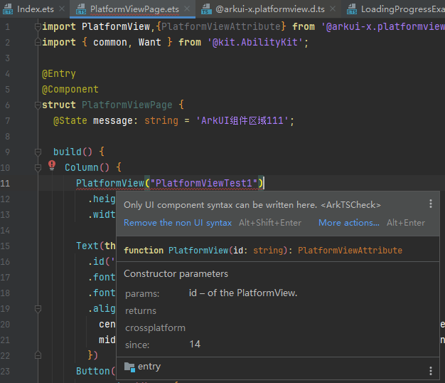

# ArkUI-X 使用PlatformView报"Only UI component syntax can be written here"错误

**【问题现象】**

**【问题原因】**

PlatformView接口缺少自定义组件标签@uicomponent注解

**【解决方法】**

在arkui-x的sdk目录下找到@arkui-x.platformview.d.ts文件，如..\ArkUI-X\Sdk\18\arkui-x\engine\ets， 
 
使用文本编辑器打开@arkui-x.platformview.d.ts文件，修改PlatformView接口增加@uicomponent注解，例如： 

**【解决计划】**

问题会在arkui-x 5.1.1.100 Release及以后版本中修复。