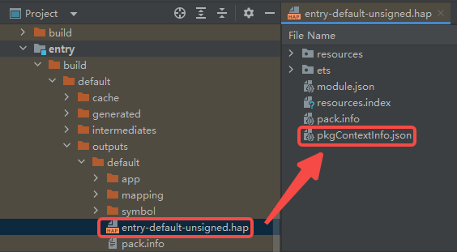

# ArkUI-X 解决useNormalizedOHMUrl设置为true时Android、iOS应用闪退或白屏

**【问题现象】**

工程中build-profile.json5文件useNormalizedOHMUrl设置为true，安装的APP在Android和iOS端闪退或白屏。

**【问题原因】**

useNormalizedOHMUrl设置为true时，开发者构建app，并在Android和iOS端安装app，由于IDE没有自动拷贝pkgContextInfo.json文件，导致框架异常。

**【解决方法】**

在工程构建Hap后，按下图所示找到entry-default-unsigned.hap

 

将文件中的pkgContextInfo.json文件拷贝对应目录下，重新构建app。

目录位置：

> Android：.arkui-x/android/app/src/main/assets/arkui-x/entry

> iOS：.arkui-x/ios/arkui-x/entry

**【解决计划】**

该问题已在DevEco Studio 5.1.1版本中修改解决。请下载更新 [DevEco Studio 5.1.1版本](https://developer.huawei.com/consumer/cn/download/deveco-studio)。