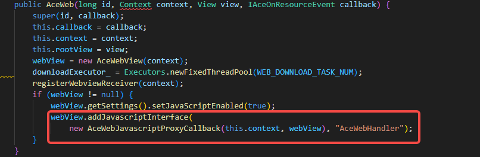
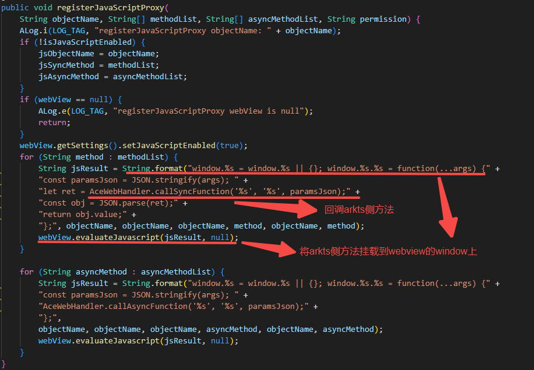
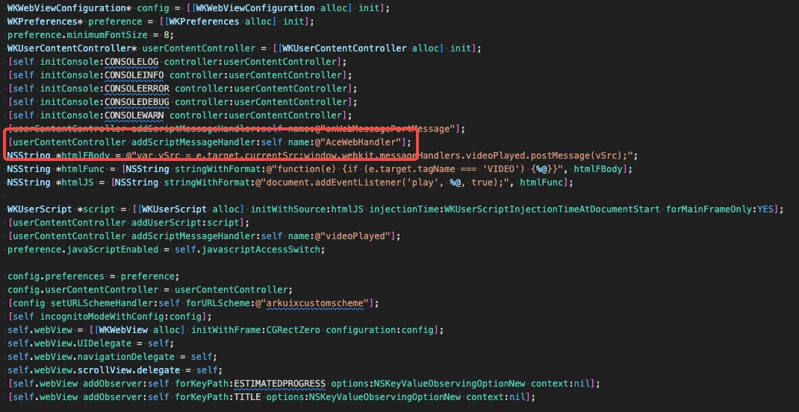
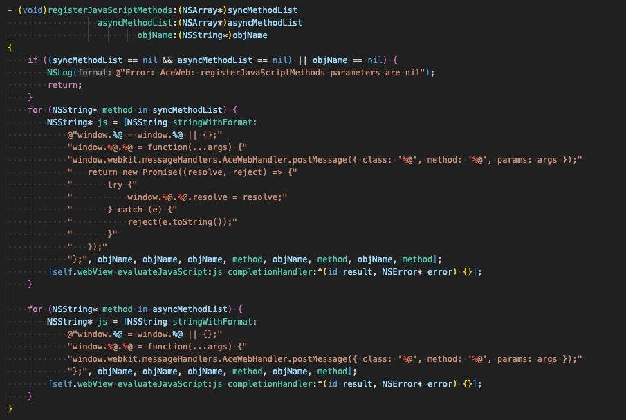

# 关于 registerJavaScriptProxy使用说明

**调用该接口之前，web的js环境必须已经准备好了，否则调用该接口注入方法不会生效。**

1：保证webview的js环境准备好：

Android平台：

说明：

跨平台ArkWeb组件的是通过桥接原生侧WebView来实现的，方法registerJavaScriptProxy是通过原生平台Weview提供的addJavascriptInterface方法，将原生侧AceWebHandler挂载到WebView全局对象window上，在通过原生平台Weview提供的evaluateJavascript方法，将ArkTs侧的方法挂载到WebView全局对象window上，通过调用框架注册的原生的AceWebHandler来回调Ark侧注册的方法。注册时，必须保证JavaScript上下文初始化完成，否则会导致方法挂在失败。

关键代码片段：

原生侧AceWebHandler挂载到WebView全局对象window上：

原生的AceWebHandler来回调Ark侧注册的方法：

调用接口：WebviewController的

registerJavaScriptProxy(object: object, name: string, methodList: Array\<string>, asyncMethodList?: Array\<string>, permission?: string): void。

​在onPageEnd或者之后进行调用该方法，能够保证注入类及其方法挂载到window对象上。

iOS平台：

说明：

​跨平台ArkWeb组件的是通过桥接原生侧WKWebView来实现的，方法registerJavaScriptProxy是通过原生平台WKWebView提供的addScriptMessageHandler方法，将原生侧AceWebHandler挂载到WKWebView全局对象window上，在通过原生平台WKWebView提供的evaluateJavaScript方法，将ArkTs侧的方法载到WebView全局对象window上，通过调用框架注册的原生的AceWebHandler来回调Ark侧注册的方法。注册时，必须保证JavaScript上下文初始化完成，否则会导致方法挂在失败。

关键代码片段：

原生侧AceWebHandler挂载到WKWebView全局对象window上：

原生侧AceWebHandler回调Ark侧注册的方法：

调用接口：WebviewController的

registerJavaScriptProxy(object: object, name: string, methodList: Array\<string>, asyncMethodList?: Array\<string>, permission?: string): void。

在onPageEnd或者之后调用该方法，能够保证注入类及其方法挂载到window对象上。

2：想要在上述更早的时机需要注入类和方法：

Android平台：

调用框架同步接口：AceWebJavascriptInterface.callSyncFunction(className:String, methodName:String, paramsJson:String):String;

参数说明：

| 参数       | 类型   | 说明                                                                            |
| ---------- | ------ | -------------------------------------------------------------------------------|
| className  | String | 注入的类名                                                                      |
| methodName | String | 注入的方法名                                                                    |
| paramsJson | String | 注入方法的参数列表（参数列表字符串是使用JSON.stringify()方法序列化后的json串）  |
| return     | String | 函数返回值（返回值需要用JSON.parse()进行解析，returnValue.value是真正的返回值） |

说明：调用该框架方法，注入类中的方法只能传入单个方法名称，如果需要传入多个方法名称，需要循环调用。

调用框架异步接口：AceWebJavascriptInterface.callAsyncFunction(className:String, methodName:String, paramsJson:String):void

参数说明：

| 参数       | 类型   | 说明                                                                           |
| ---------- | ------ | ------------------------------------------------------------------------------|
| className  | String | 注入的类名                                                                     |
| methodName | String | 注入的方法名                                                                   |
| paramsJson | String | 注入方法的参数列表（参数列表字符串是使用JSON.stringify()方法序列化后的json串） |

说明：调用该框架方法，注入类中的方法只能传入单个方法名称，如果需要传入多个方法名称，需要循环调用，此函数没有返回值信息。

iOS平台：

调用框架接口：window.webkit.messageHandlers.AceWebHandler.postMessage({ class: String, method: String, params: String });

参数说明：

| 参数   | 类型   | 说明                                                                           |
| ------ | ------ | ------------------------------------------------------------------------------|
| class  | String | 注入的类名                                                                     |
| method | String | 注入的方法名                                                                   |
| params | String | 注入方法的参数列表（参数列表字符串是使用JSON.stringify()方法序列化后的json串） |

说明：调用该框架方法，注入类中的方法只能传入单个方法名称，如果需要传入多个方法名称，需要循环调用。