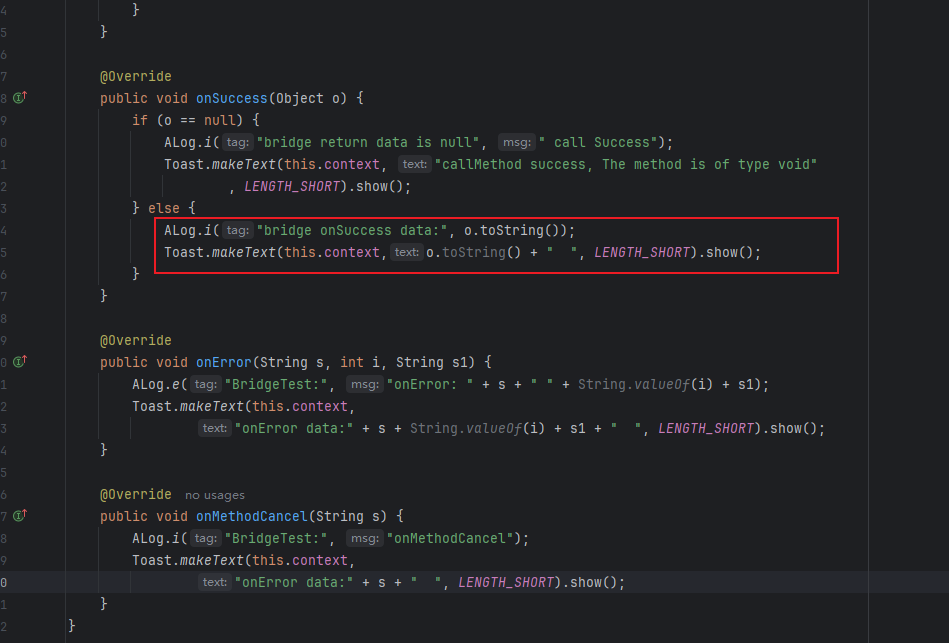
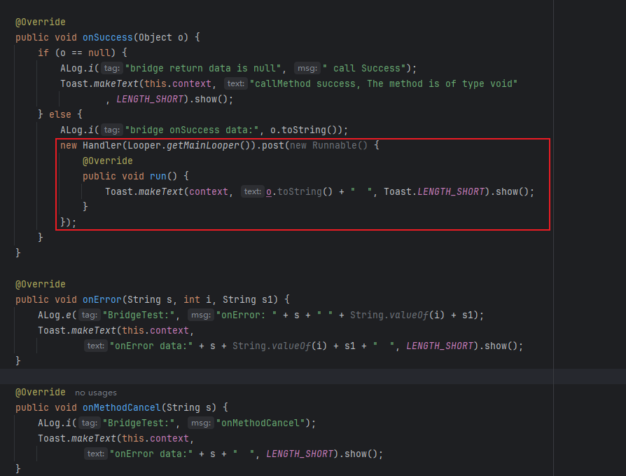

# ArkUI-X API 20+版本，在原生侧Bridge里调用必须在主线程执行的 API 时，会抛出运行时异常(RuntimeException)。

**【问题现象】**

在bridge 的 IMethodResult 和 IMessageListener 监听结果回调的方法里，进行UI相关的操作（如Toast，TextView）或执行其它必须在主线程执行的方法，导致抛出运行时异常。

**【问题原因】**

在since 22 版本为了优化运行的性能，Bridge运行线程和主线程解耦，在独立的子线程运行。如果在Bridge的回调处理中，使用UI相关的操作以及其它必须在主线程执行的方法，需要抛回到主线程中执行，否则会出现异常。

**【解决方法】**

将原生侧 UI 操作等调度至主线程执行。

**修改前：**



**修改后：**



**Android 代码示例：**

```java
package com.example.androidCopeObject;
import static android.widget.Toast.LENGTH_SHORT;

import android.content.Context;
import android.os.Handler;
import android.os.Looper;
import android.widget.Toast;

import ohos.ace.adapter.ALog;
import ohos.ace.adapter.capability.bridge.BridgePlugin;
import ohos.ace.adapter.capability.bridge.IMethodResult;

public class BridgeTest extends BridgePlugin implements IMethodResult {

    public static int STRESS_TEST = 0;
    public static String STRESS_TEST_MESSAGE = "";
    public Context context = null;

    public BridgeTest(String name, BridgeType bridgeType) {
        super(name, bridgeType);
        setMethodResultListener(this);
    }

    public void setContext(Context context) {
        this.context = context;
    }

    @Override
    public void onSuccess(Object o) {
        if (o == null) {
            ALog.i("bridge return data is null", " call Success");
            new Handler(Looper.getMainLooper()).post(new Runnable() {
                @Override
                public void run() {
                    //确保UI操作在主线程执行
                    Toast.makeText(context, "callMethod success, The method is of type void" , LENGTH_SHORT).show();
                }
            });
        } else {
            ALog.i("bridge onSuccess data:", o.toString());
            new Handler(Looper.getMainLooper()).post(new Runnable() {
                @Override
                public void run() {
                    //确保UI操作在主线程执行
                    Toast.makeText(context, o.toString() + "  ", Toast.LENGTH_SHORT).show();
                }
            });
        }
    }

    @Override
    public void onError(String s, int i, String s1) {
        ALog.e("BridgeTest:", "onError: " + s + " " + String.valueOf(i) + s1);
        new Handler(Looper.getMainLooper()).post(new Runnable() {
            @Override
            public void run() {
                //确保UI操作在主线程执行
                Toast.makeText(context,
                        "onError data:" + s + String.valueOf(i) + s1 + "  ", LENGTH_SHORT).show();
            }
        });
    }

    @Override
    public void onMethodCancel(String s) {
        ALog.i("BridgeTest:", "onMethodCancel");
        new Handler(Looper.getMainLooper()).post(new Runnable() {
            @Override
            public void run() {
                //确保UI操作在主线程执行
                Toast.makeText(context, "onError data:" + s + "  ", LENGTH_SHORT).show();
            }
        });
    }
}
```

**iOS 代码示例：**

BridgeImpl.h

```objective-c
#import <Foundation/Foundation.h>
#import <libarkui_ios/BridgePlugin.h>

NS_ASSUME_NONNULL_BEGIN

@interface BridgeImpl : BridgePlugin<IMethodResult>

@end

NS_ASSUME_NONNULL_END
```

BridgeImpl.m

```objective-c
#import "BridgeImpl.h"

@implementation BridgeImpl
- (id)initBridgePlugin:(NSString *)bridgeName bridgeType:(BridgeType)type {
    self = [super initBridgePlugin:bridgeName bridgeType:type];
    if (self) {
        self.methodResult = self;
    }
    return self;
}

- (void)onSuccess:(nonnull NSString *)methodName resultValue:(nonnull id)resultValue {
    dispatch_async(dispatch_get_main_queue(), ^{
        //确保UI操作在主线程执行
    });
}

- (void)onError:(nonnull NSString *)methodName errorCode:(ErrorCode)errorCode errorMessage:(nonnull NSString *)errorMessage {
    dispatch_async(dispatch_get_main_queue(), ^{
        //确保UI操作在主线程执行
    });
}

- (void)onMethodCancel:(nonnull NSString *)methodName { 
    dispatch_async(dispatch_get_main_queue(), ^{
        //确保UI操作在主线程执行
    });
}

@end
```

