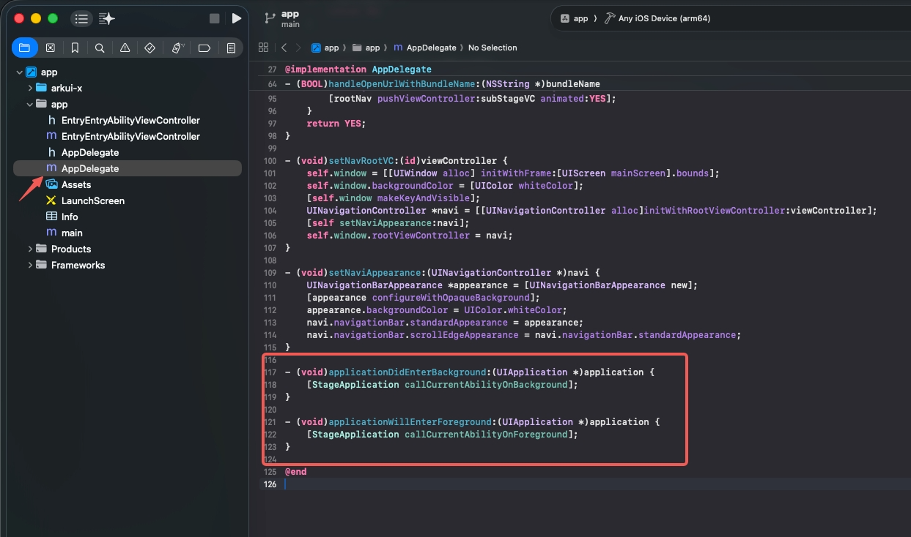

# ArkUI-X iOS如何触发应用前后台切换回调

### ArkUI-X 6.1版本以前

- ArkUI应用进入后台，触发对应生命周期事件。

```objc
- (void)applicationDidEnterBackground:(UIApplication *)application {
    [StageApplication callCurrentAbilityOnBackground];
}
```

- ArkUI应用进入前台，触发对应生命周期事件。

```objc
- (void)applicationWillEnterForeground:(UIApplication *)application {
    [StageApplication callCurrentAbilityOnForeground];
}
```



ArkUI-X 6.1版本以后可以直接触发EntryAbility内的`onBackground(): void`和`onForeground(): void`方法，无需额外处理。