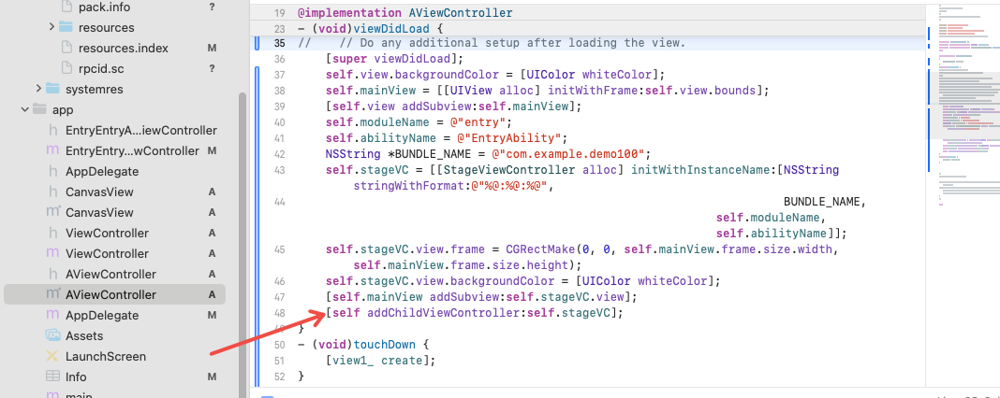

# ArkUI-X iOS中使用控制器直接添加另一个控制器作为子view后出现白屏

6.1之后需要添加下述代码，否则会白屏；6.1之前不是必须，建议加。

### ArkUI-X 6.1版本以前

正常使用任何方式调用,无需加下述代码

### ArkUI-X 6.1版本以后

- ArkUI应用拉起页面出现白屏。

```objc
self.stageVC.view.frame = CGRectMake(0, 0, self.mainView.frame.size.width, self.mainView.frame.size.height);
self.stageVC.view.backgroundColor = [UIColor whiteColor];
[self.mainView addSubview:self.stageVC.view];
[self addChildViewController:self.stageVC];
```



ArkUI-X 6.1版本以后出现拉起页面后白屏,需要使用[self addChildViewController:self.stageVC]显示页面;,ArkUI-X 6.1版本以前无需处理。

