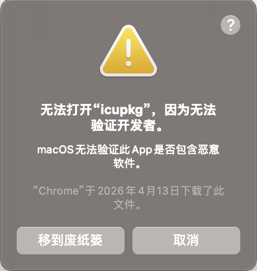
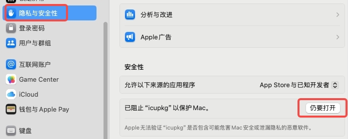
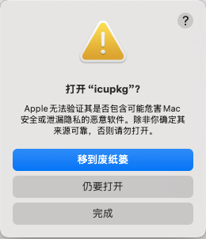
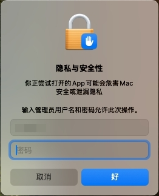

## MacOS 提示“无法打开‘icupkg’，因为无法验证开发者”解决办法

### 问题现象
在 macOS 上运行某些工具（如 `ace build ios`）时，可能会弹出类似提示，导致无法打开程序：

	

### 解决办法
1. **打开“系统设置” → “隐私与安全性”**
	- 在弹窗后，进入“系统设置” > “隐私与安全性”，页面底部会出现“已阻止‘icupkg’以保护Mac”，点击右侧的“仍要打开”。

		

			
		

2. **重新执行对应命令**

	- 重新执行对应命令后会弹出如下确认窗口，点击“仍要打开”。

		

			
		

3. **输入管理员用户名和密码**
	- 系统会弹出验证窗口，输入管理员用户名和密码，点击“好”即可正常执行。

		

			
		

### 说明
此问题是由于 macOS 的安全策略阻止了未签名开发者的程序运行。只要确认程序来源可信，按照上述步骤操作即可。
