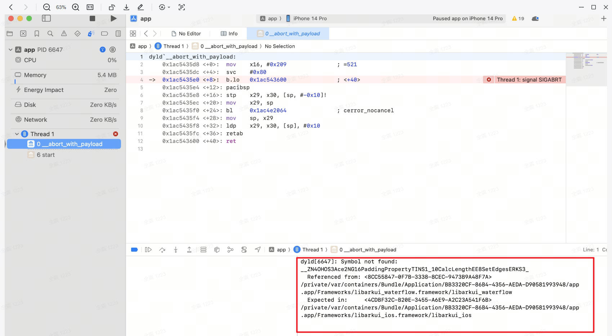
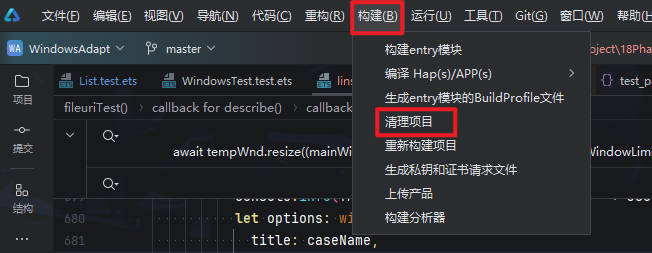
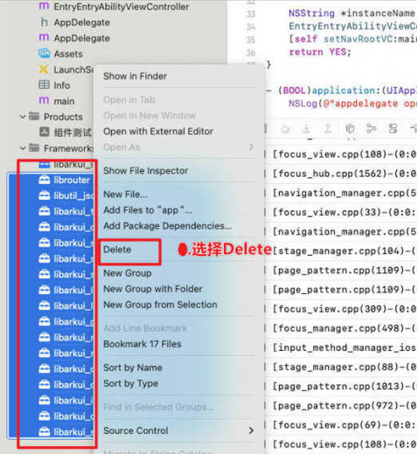
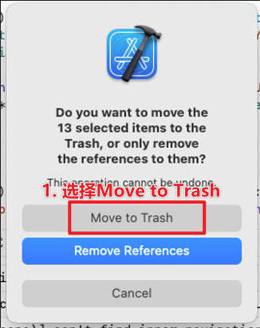

## SDK版本切换 iOS白屏问题分析-symbol not found错误处理

### 问题现象
切换使用不同版本的 ArkUI-X SDK编译工程，安装应用至iOS设备时，可能会出现界面白屏，无法正常启动的问题。<br>

报错日志提示“ Symbol not found：... ”。<br>

<div align="center">
    
</div>

### 问题原因

此问题的核心原因是 **不同版本的ArkUI-X SDK存在差异**。<br>

切换SDK后，由于不同版本ArkuI-X SDK里面的库文件可能存在差异，但项目配置或缓存仍可能试图链接它们，导致库文件链接失败，造成应用启动时白屏。<br>


### 解决办法
1. 每次切换ArkUI-X SDK后，清理项目缓存。<br>

   - 工具链命令处理：在项目工程根目录下执行命令。<br>

     ```bash
     ace clean
     ```

   - IDE处理：菜单栏--->构建--->清理项目。<br>

     <div align="center">
         
     </div>

2. 删除除libarkui ios.xcframework以外的所有来源于ArkUI-XSDK的xcframework文件。<br>

<div align="center">
    
</div>

<div align="center">
    
</div>

3. 完成上述操作后，重新执行工程构建编译。<br>
