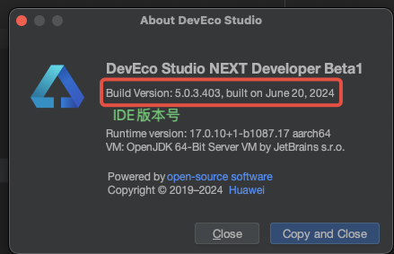
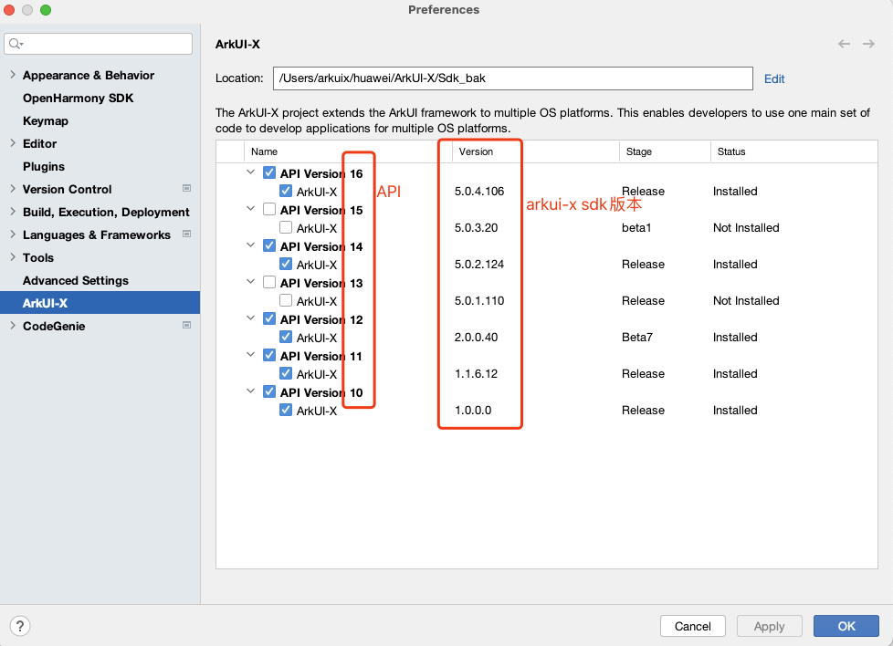
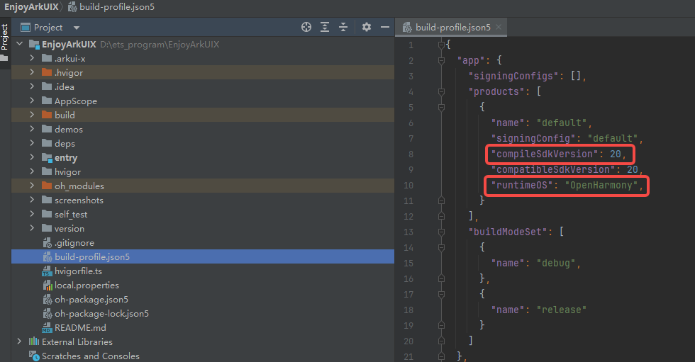
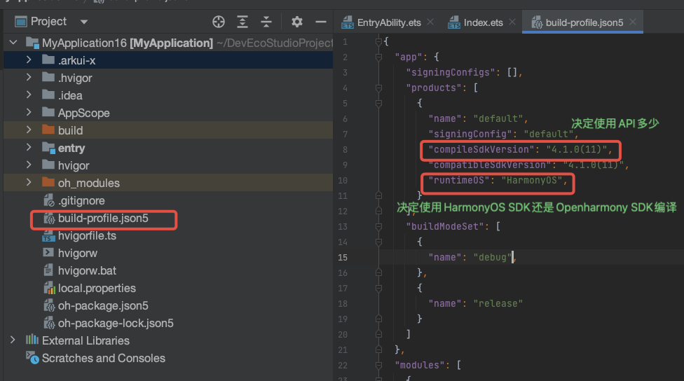
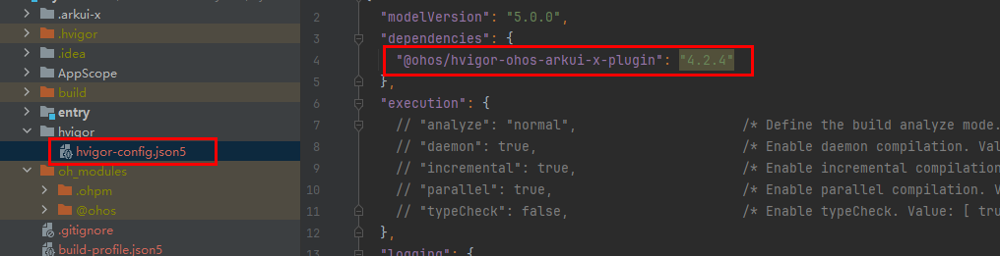

# 问题反馈模板

## 模板信息

* 问题概述
* IDE版本号
* OpenHarmony SDK、HarmonyOS SDK版本号
* 当前编译的ArkUI-X SDK版本号
* hvigor-arkui-x插件版本号

## 模板信息描述指导

### 问题描述

请详细描述遇到的问题，并给出复现问题的步骤，并附上报错信息。

### IDE版本号查看

Windows：Help->About DevEco Studio
MacOS：DevEco Studio->About DevEco Studio

### OpenHarmony SDK、HarmonyOS SDK版本号查看
***OpenHarmony SDK***

* 5.0.0 IDE及以上版本：

Windows：File->Settings->OpenHarmony SDK

MacOS：DevEco Studio->Preferences->OpenHarmony SDK

* 5.0.0 IDE以下版本：

Windows：File->Settings->SDK（下拉框选择OpenHarmony）

MacOS：DevEco Studio->Preferences->SDK（下拉框选择OpenHarmony）

***HarmonyOS SDK***

* 5.0.0 IDE及以上版本：

Windows/MacOS：Help->About HarmonyOS SDK

* 5.0.0 IDE以下版本：

Windows：File->Settings->SDK（下拉框选择HarmonyOS）

MacOS：DevEco Studio->Preferences->SDK（下拉框选择HarmonyOS）

### ArkUI-X SDK版本号查看

* 位置查看

Windows：File->Settings->ArkUI-X

MacOS：DevEco Studio->Preferences->ArkUI-X

* 当前编译版本

打开应用工程目录下的build-profile.json5，查看runtimeOS字段:

* 如果是OpenHarmony，看compileSdkVersion中数值，数值即为编译用的API版本号
  

* 如果是HarmonyOS，无compileSdkVersion字段，**且IDE是5.0.0以上的版本**，如图：
  
  
  IDE版本对应编译所用API版本对照关系：

    | IDE版本 | ArkUI-X SDK版本 |
    | ------- | --------------  |
    | 5.0.0   | API 12          |
    | 5.0.1   | API 13          |
    | 5.0.2   | API 14          |
    | 5.0.3   | API 15          |
    | 5.0.4   | API 16          |
    | 5.0.5   | API 17          |
    | 5.1.0   | API 18          |
    | 5.1.1   | API 19          |

### hvigor-arkui-x插件版本号
查看文件：
/跨平台工程/hvigor/hvigor-config.json5

