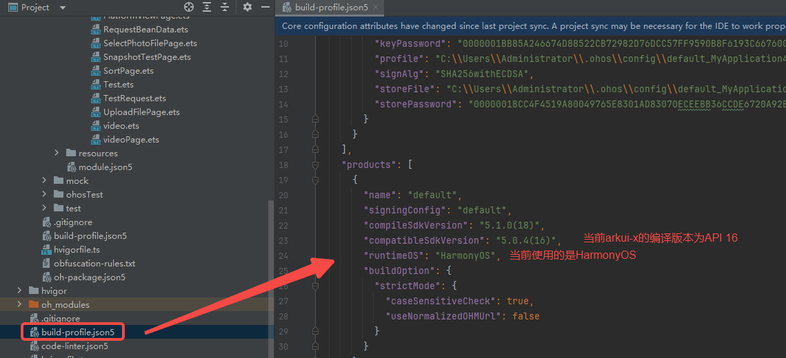

# 问题反馈的常用信息获取方式

### 使用哪个ArkUI-X SDK版本进行编译

一、**首先确认当前工程的编译API版本，** 打开应用工程目录下的build-profile.json5，查看runtimeOS字段

1、如果是OpenHarmony，看compileSdkVersion中x.x.x(API)，API即为编译用的API版本号

2、如果是HarmonyOS，无compileSdkVersion字段，**且IDE是5.0.0之后的版本**，则查看IDE版本找寻对应编译所用API版本，对照关系：

`5.0.0->API 12；5.0.1->API 13；5.0.2->API 14；5.0.3->API 15；5.0.4->API 16；5.0.5->API 17；5.1.0->API 18`

例如上图IDE版本截图Version为5.0.3.403，如果runtimeOS是HarmonyOS，则它选择的是API 15版本编译

二、**其次确认使用的ArkUI-X SDK版本，** 基于上述得到的API版本，打开如下配置，**确认最终使用的具体ArkUI-X SDK版本，例如上边右图示，API 16，使用的ArkUI-X SDK版本是5.0.4.106**：

Windows：File->Settings->ArkUI-X

MacOS：DevEco Studio->Preferences->ArkUI-X

### IDE版本号

Windows：Help->About DevEco Studio
MacOS：DevEco Studio->About DevEco Studio

### hvigor-arkui-x插件版本号
查看文件：
/跨平台工程/hvigor/hvigor-config.json5

### OpenHarmony SDK、HarmonyOS SDK版本号及版本路径
 **【OpenHarmony SDK】**

**5.0.0 IDE及以上版本：**

Windows：File->Settings->OpenHarmony SDK

MacOS：DevEco Studio->Preferences->OpenHarmony SDK

**5.0.0 IDE以下版本：**

Windows：File->Settings->SDK（下拉框选择OpenHarmony）

MacOS：DevEco Studio->Preferences->SDK（下拉框选择OpenHarmony）

 **【HarmonyOS SDK】**

**5.0.0 IDE及以上版本：**

Windows/MacOS：Help->About HarmonyOS SDK

**5.0.0 IDE以下版本：**

Windows：File->Settings->SDK（下拉框选择HarmonyOS）

MacOS：DevEco Studio->Preferences->SDK（下拉框选择HarmonyOS）