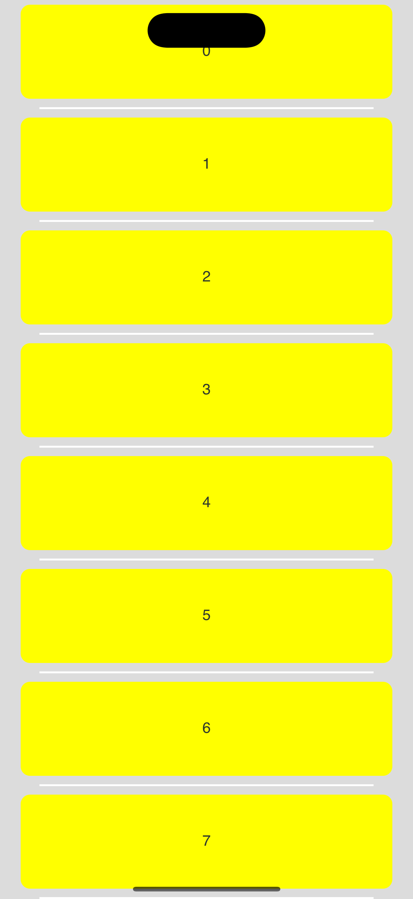
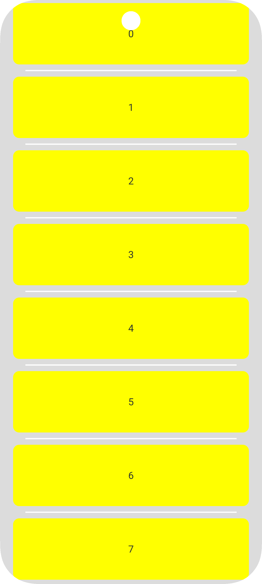
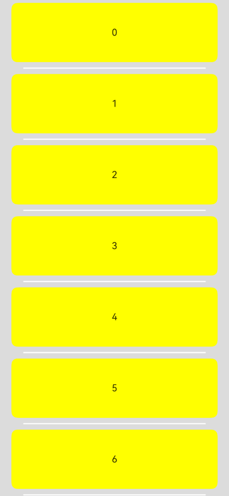
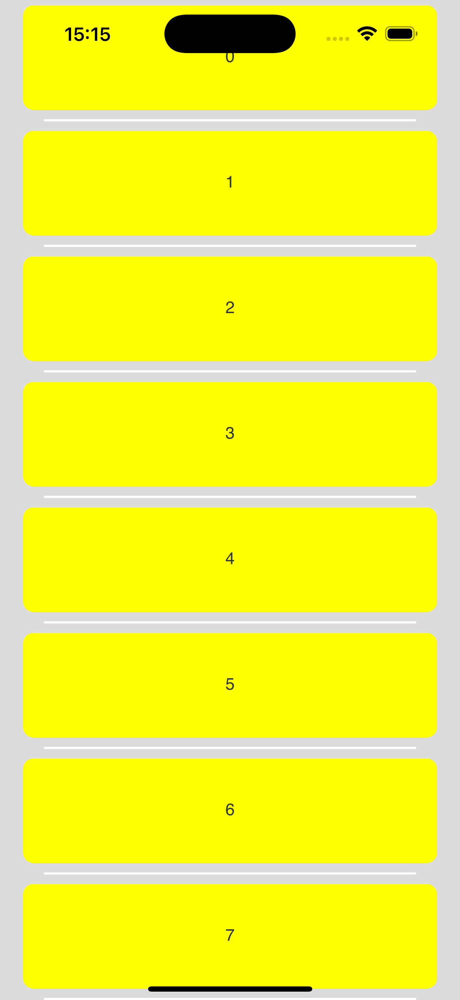
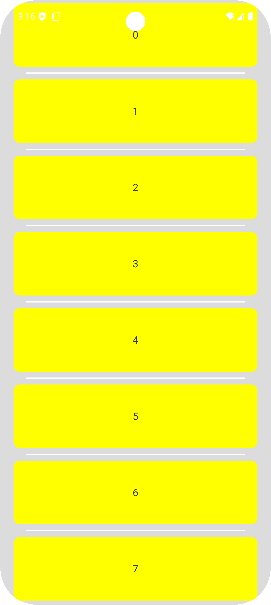
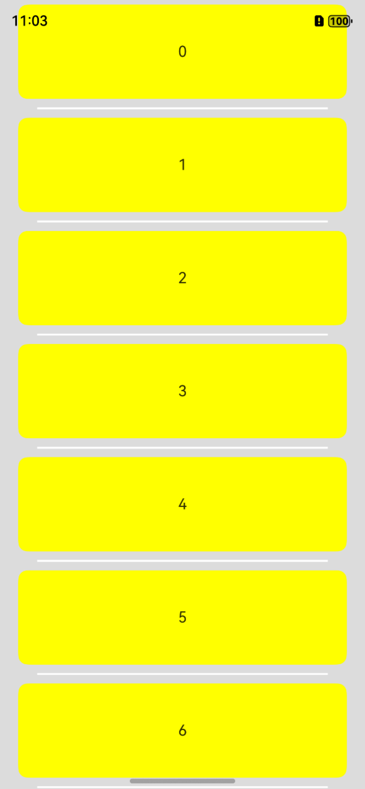
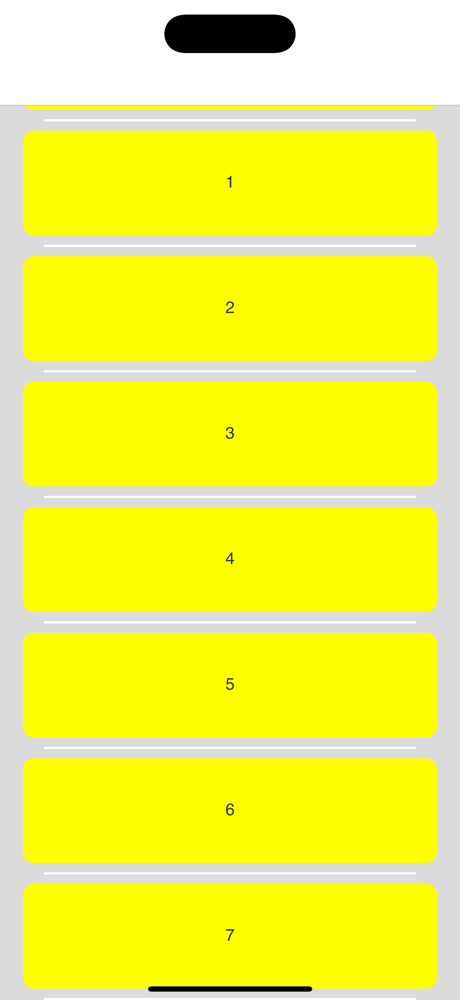
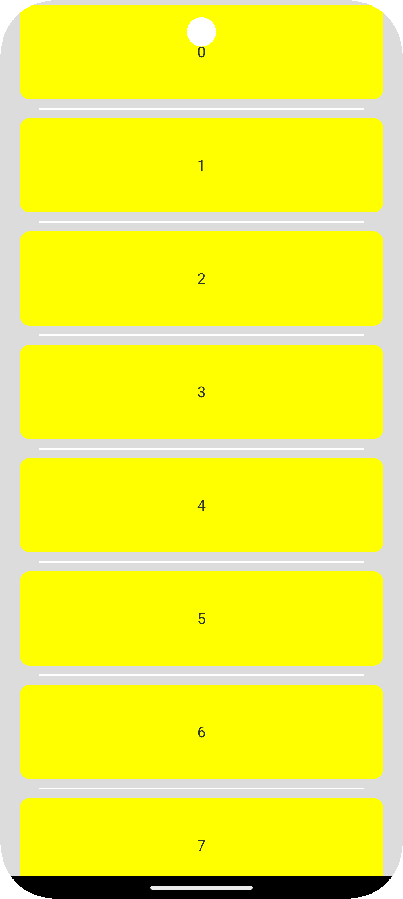

# ArkUI-X如何设置沉浸式效果

**【问题描述】**
在ArkTS侧，组件设置expandSafeArea属性，实际Android和iOS运行不能达到沉浸式效果

**【解决方案】**
如果想设置整应用的沉浸式效果，在Ability的`onWindowStageCreate`方法中，使用`setWindowLayoutFullScreen`方法达到沉浸式效果，在跨平台端，需要通过`setWindowSystemBarEnable`方法隐藏状态栏和导航栏，代码示例：

```typescript
  let windowClass: window.Window | undefined = undefined;
  windowStage.getMainWindow((err: BusinessError, data) => {
    const errCode: number = err.code;
    if (errCode) {
      console.error(`Failed to obtain the main window. Cause code: ${err.code}, message: ${err.message}`);
      return;
    }
    windowClass = data;
    let isLayoutFullScreen = true;
    try {
      // 设置沉浸式
      let promise = windowClass.setWindowLayoutFullScreen(isLayoutFullScreen);
      promise.then(() => {
        console.info('Succeeded in setting the window layout to full-screen mode.');
      }).catch((err: BusinessError) => {
        console.error(`Failed to set the window layout to full-screen mode. Cause code: ${err.code}, message: ${err.message}`);
      });
    } catch (exception) {
      console.error(`Failed to set the window layout to full-screen mode. Cause code: ${exception.code}, message: ${exception.message}`);
    }
    // 设置导航栏隐藏,此处设置为保留状态栏,隐藏导航栏
    let names: Array<'status' | 'navigation'> = ['status'];
    windowClass.setWindowSystemBarEnable(names);
  });
```
单独设置某一页面沉浸式效果，可以在页面的`aboutToAppear`方法中进行相关设置，代码实例：

```typescript
  aboutToAppear(): void {
    window.getLastWindow(getContext(), (err, windowClass) => {
      this.windowClass = windowClass;
      // 设置沉浸式
      windowClass.setWindowLayoutFullScreen(true);
      // 设置状态栏隐藏
      windowClass.setSpecificSystemBarEnabled('status', false);
      // 设置导航栏隐藏
      windowClass.setSpecificSystemBarEnabled('navigation', false);
    })
  }

  aboutToDisappear(): void {
    if (this.windowClass) {
      // 销毁前把布局设回去
      this.windowClass.setWindowLayoutFullScreen(false);
      this.windowClass.setSpecificSystemBarEnabled('status', true);
      this.windowClass.setSpecificSystemBarEnabled('navigation', true);
    }
  }
```

| 设置                                                 | iOS                                                          | Android                                                      | OH                                                    |
| ---------------------------------------------------- | ------------------------------------------------------------ | ------------------------------------------------------------ | ------------------------------------------------------------ |
| windowClass.setWindowSystemBarEnable([])             |                 |         |     |
| windowClass.setWindowSystemBarEnable(['status'])     |   |  |  |
| windowClass.setWindowSystemBarEnable(['navigation']) |  |  |  |
