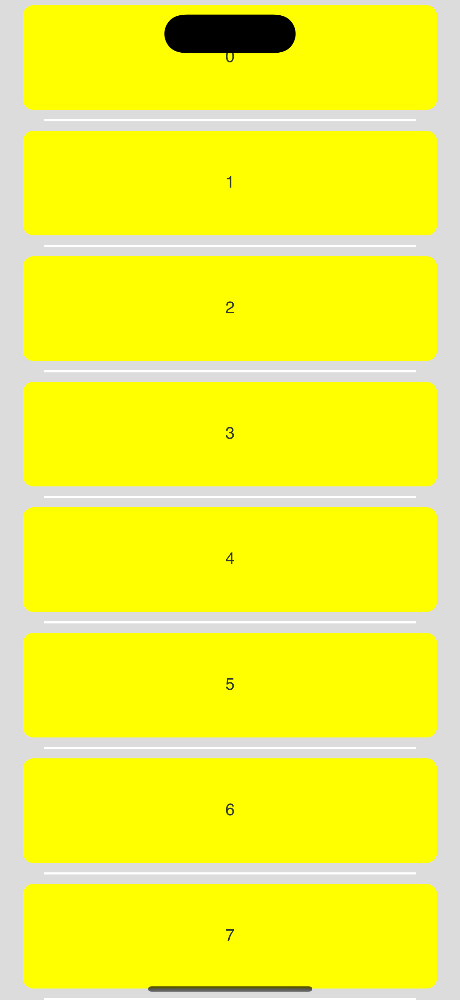
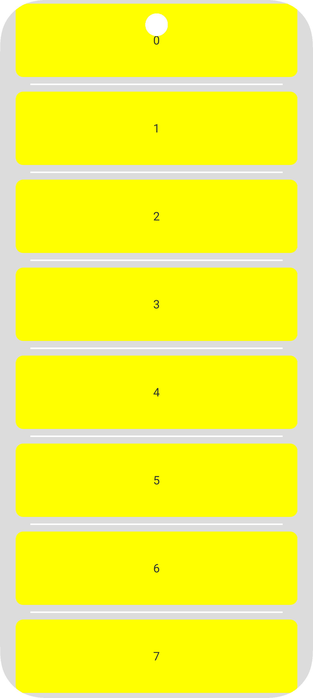
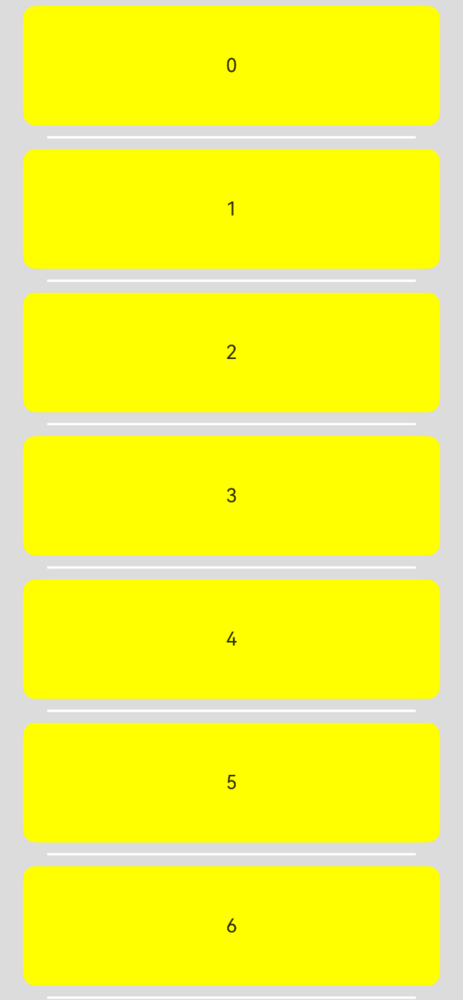
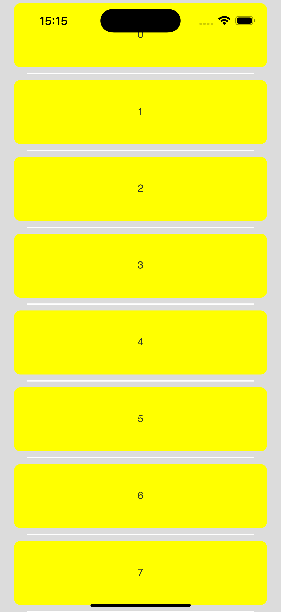
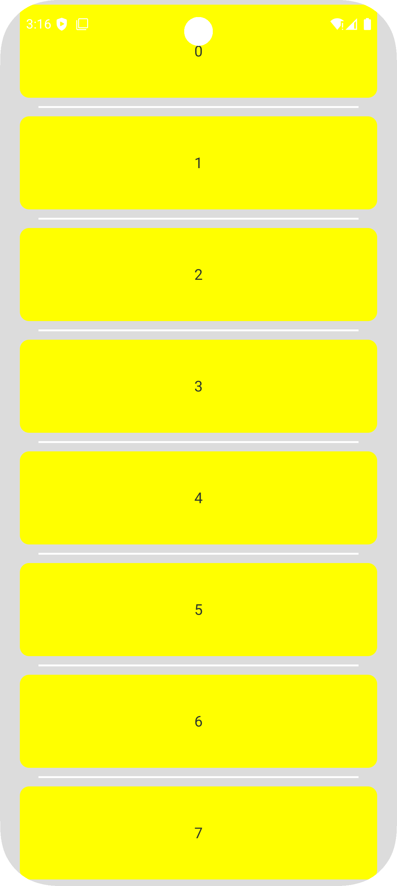
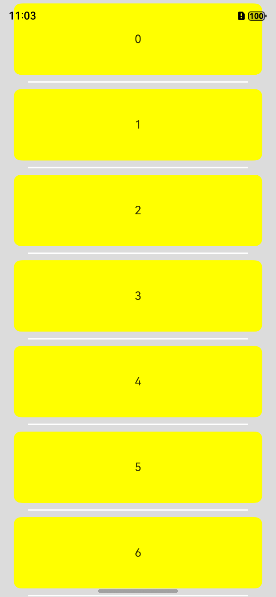
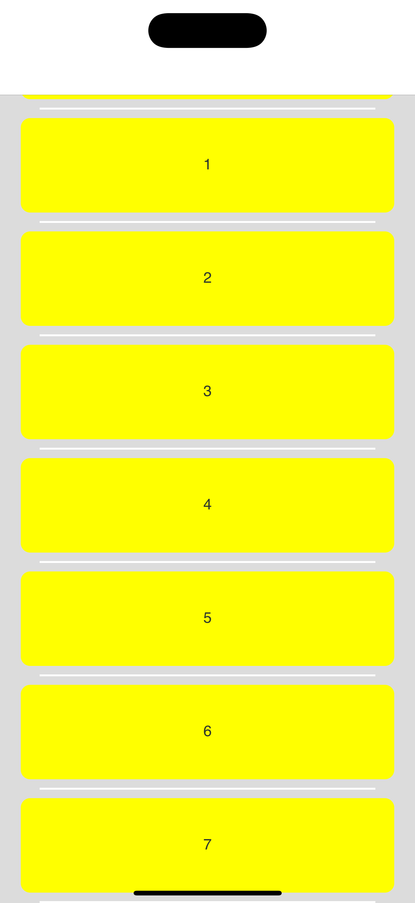
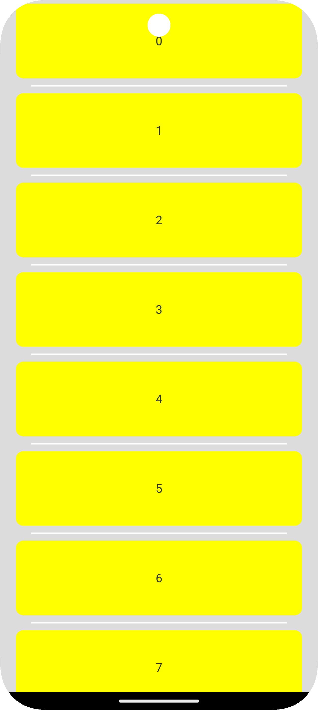

# ArkUI-X如何设置沉浸式效果

### 问题描述

在ArkTS侧，组件设置expandSafeArea属性，实际Android和iOS运行不能达到沉浸式效果

### 解决方案<a id="Solution"></a>

#### 批量设置页面沉浸式
如果想设置某个跨平台Ability下所有ArkTS页面的沉浸式效果，需要在该Ability的`onWindowStageCreate`方法中，使用`setWindowLayoutFullScreen`方法达到沉浸式效果，在跨平台端，需要通过`setWindowSystemBarEnable`方法隐藏状态栏和导航栏，代码示例：

```typescript
onWindowStageCreate(windowStage: window.WindowStage): void {
  let windowClass: window.Window | undefined = undefined;
  windowStage.getMainWindow((err: BusinessError, data) => {
    const errCode: number = err.code;
    if (errCode) {
      console.error(`Failed to obtain the main window. Cause code: ${err.code}, message: ${err.message}`);
      return;
    }
    windowClass = data;
    let isLayoutFullScreen = true;
    try {
      // 设置沉浸式
      let promise = windowClass.setWindowLayoutFullScreen(isLayoutFullScreen);
      promise.then(() => {
        console.info('Succeeded in setting the window layout to full-screen mode.');
      }).catch((err: BusinessError) => {
        console.error(`Failed to set the window layout to full-screen mode. Cause code: ${err.code}, message: ${err.message}`);
      });
    } catch (exception) {
      console.error(`Failed to set the window layout to full-screen mode. Cause code: ${exception.code}, message: ${exception.message}`);
    }
    // 设置导航栏隐藏,此处设置为保留状态栏,隐藏导航栏
    let names: Array<'status' | 'navigation'> = ['status'];
    windowClass.setWindowSystemBarEnable(names);
  })
};
```

#### 设置单跨平台页面沉浸式<a id="pageSet"></a>
单独设置某个跨平台Ability下某一ArkTS页面的沉浸式效果，可以在页面的`aboutToAppear`方法中进行相关设置，代码示例：

```typescript
  aboutToAppear(): void {
    window.getLastWindow(getContext(), (err, windowClass) => {
      this.windowClass = windowClass;
      // 设置沉浸式
      windowClass.setWindowLayoutFullScreen(true);
      // 设置状态栏隐藏
      windowClass.setSpecificSystemBarEnabled('status', false);
      // 设置导航栏隐藏
      windowClass.setSpecificSystemBarEnabled('navigation', false);
    })
  }

  aboutToDisappear(): void {
    if (this.windowClass) {
      // 销毁前把布局设回去
      this.windowClass.setWindowLayoutFullScreen(false);
      this.windowClass.setSpecificSystemBarEnabled('status', true);
      this.windowClass.setSpecificSystemBarEnabled('navigation', true);
    }
  }
```

| 设置                                                 | iOS                                                          | Android                                                      | OH                                                    |
| ---------------------------------------------------- | ------------------------------------------------------------ | ------------------------------------------------------------ | ------------------------------------------------------------ |
| windowClass.setWindowSystemBarEnable([])             |                 |         |     |
| windowClass.setWindowSystemBarEnable(['status'])     |   |  |  |
| windowClass.setWindowSystemBarEnable(['navigation']) |  |  |  |

### 补充说明

1、IOS系统中如果使用上述方案无法实现沉浸式效果，还可尝试如下方式。

注意：

（1）iOS需要去掉上述[沉浸式](#Solution)方案的ArkTS代码，单独在原生平台进行以下设置。

（2）如果Android仍需要使用上述方案设置沉浸式，请使用[平台差异化](https://gitcode.com/arkui-x/docs/blob/master/zh-cn/application-dev/quick-start/platform-different-introduction.md)进行平台隔离，确保iOS不走ArkTS方案逻辑。

在需要实现沉浸式的跨平台ArkTS页面对应的xxxViewController.m文件中的viewDidLoad方法（跨平台ViewController同跨平台的ArkTS UIAbility一一对应），增加隐藏导航栏和状态栏的逻辑：self.navigationController.navigationBarHidden = YES，以达到沉浸式效果。

以DevEco Studio中跨平台的基础模版工程[ArkUI-X]Empty Ability为例，开发者可以修改.arkui-x/ios/app/EntryEntryAbilityViewController.m文件，在继承自StageViewController的EntryEntryAbilityViewController中viewDidLoad方法增加代码: self.navigationController.navigationBarHidden = YES设置导航栏和状态栏隐藏。

请注意该方法会将Entry Ability下所有ArkTS页面设置为沉浸式。示例如下：
```typescript
// xxxViewController.m（继承自跨平台提供的StageViewController）
- (void)viewDidLoad {
    [super viewDidLoad];
    self.navigationController.navigationBarHidden = YES;
}
```

2、如果开发者只想设置单个跨平台ArkTS页面的沉浸式效果，建议开发者升级至ArkUI-X 6.0.2.130及以上版本后使用[设置单跨平台页面沉浸式](#pageSet)方案。 
 
 
 版本下载链接：[下载地址](https://repo.huaweicloud.com/arkui-crossplatform/sdk/6.0.2.130) 
 
 
 手动替换IDE集成的SDK操作参考：[如何手动替换ArkUI-X SDK](https://gitcode.com/arkui-x/docs/blob/master/zh-cn/application-dev/tutorial/faq/Development-Stage/Dev-faq-1.md)
