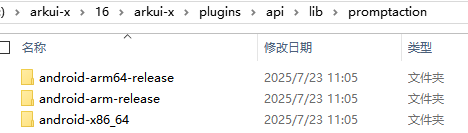
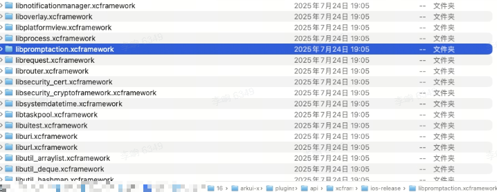
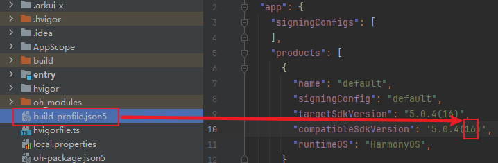
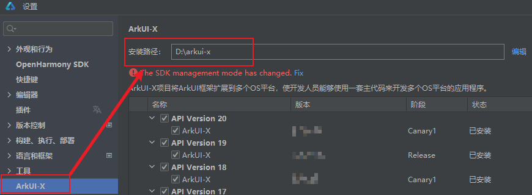

# ArkTS通过UIContext获取组件能力，运行态功能不可用

**问题描述**

在安卓和iOS平台上使用PromptAction、Router、Font等功能不可用，以PromptAction功能为例，
按照如下ArkTS写法来使用PromptAction功能，安卓和iOS上运行时弹窗功能不可用：
```typescript
import { BusinessError } from '@kit.BasicServicesKit';

@Entry
@Component
struct Index {
  build() {
    Row() {
      Column() {
        Button()
          .onClick(() => {
            let uiContext = this.getUIContext();
            let promptAction = uiContext.getPromptAction();
            try {
              promptAction.showToast({
                message: 'Message Info',
                duration: 2000
              });
            } catch (error) {
              let message = (error as BusinessError).message;
              let code = (error as BusinessError).code;
              console.error(`showToast args error code is ${code}, message is ${message}`);
            };
          })
      }
      .width('100%')
    }
    .height('100%')
  }
}
```


**具体报错日志**
```shell
[native_module_manager.cpp(EmplaceModuleLib)] modulekey is 'promptAction'

[native_module_manager.cpp(FindNativeModuleByDisk)] try to load abc module path: /private/var/containers/Bundle/Application/98628FE0-A19E-42AE-AEC7-EE3B79EA9508/app.app/arkui-x/systemres/abc/promptaction.abc

[native_module_manager.cpp(GetFileBuffer)] /private/var/containers/Bundle/Application/98628FE0-A19E-42AE-AEC7-EE3B79EA9508/app.app/arkui-x/systemres/abc/promptaction.abc is not existed.

[native_module_manager.cpp(FindNativeModuleByDisk)] First attempt: 
Second attempt: 
try to load abc file from /private/var/containers/Bundle/Application/98628FE0-A19E-42AE-AEC7-EE3B79EA9508/app.app/arkui-x/systemres/abc/promptaction.abc failed

[native_module_manager.cpp(LoadNativeModule)] load native module failed

[ark_native_engine.cpp(operator())] First attempt: 
Second attempt: 
try to load abc file from /private/var/containers/Bundle/Application/98628FE0-A19E-42AE-AEC7-EE3B79EA9508/app.app/arkui-x/systemres/abc/promptaction.abc failed

[ERROR] [js_console_log.cpp(103)] showToast args error code is undefined, message is Cannot read property showToast of undefined
```

**解决办法**

***Android平台：***

请手动从对应API的ArkUI-X SDK路径下，将"libpromptaction.so、librouter.so、libfont.so"拷贝到工程目录".arkui-x\android\app\libs\arm64-v8a"文件夹下。

*so具体位置*

以"libpromptaction.so"举例说明：

相对路径：arkui-x\plugins\api\lib\promptaction



三个文件夹分别对应三种设备架构，获取设备架构方式如下：

1、连接测试设备

2、打开命令行输入“adb shell getprop ro.product.cpu.abi”

3、根据返回结果，进入对应文件夹（如 arm64-v8a）。

| 设备架构    | 对应文件夹            |
| ----------- | --------------------- |
| arm64-v8a   | android-arm64-release |
| armeabi-v7a | android-arm-release   |
| x86_64      | android-x86_64        |

4、从目标文件夹中复制“libpromptaction.so”到所需位置即可。

***iOS平台：***

请手动从对应API的ArkUI-X SDK路径下，将"libpromptaction.xcframework、librouter.xcframework、libfont.xcframework"拷贝到工程目录".arkui-x/ios/frameworks"文件夹下。

*xcframework具体位置*

以"libpromptaction.xcframework"举例说明：

相对路径：arkui-x/plugins/api/xcframework/ios-release/libpromptaction.xcframework

以"libpromptaction.xcframework"举例说明：



***API、ArkUI-X SDK路径***

> API版本位置如图所示：




> ArkUI-X SDK位置如图所示：

