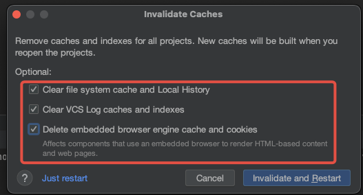

# 如何实现平台差异化(编译态、运行态)

**平台差异化适用于以下两种典型场景：**

1. 自身业务逻辑不同平台本来就有差异；
2. 在OpenHarmony上调用了不支持跨平台的API，这就需要在OpenHarmony上仍然调用对应API，其他平台通过Bridge桥接机制进行差异化处理；

**编译态（** 规避手段，**注意：该方法会屏蔽掉所有不支持跨平台的error错误，可能会带来运行态上的crash，谨慎使用）：**

1、找到IDE里配套OH SDK（如果是hmos next开发，则是hmos里带的oh sdk）地方，参考“3、常见定位信息收集”

2、找到“api_check_util.js”这个文件，以一体化IDE该文件路径举例：

`/Applications/DevEco-Studio 4.app/Contents/sdk/HarmonyOS-NEXT-DB1/openharmony/ets/build-tools/ets-loader/lib/fast_build/system_api/api_check_utils.js`

3、搜索`CROSSPLATFORM_TAG_CHECK_ERROR`，将其后边的`DiagnosticCategory.Error`改为`DiagnosticCategory.Warning`

4、点击File->Invalidate Caches，之后重启IDE：

**运行态：** 
**特别说明：编译态屏蔽后，所有不支持跨平台API的场景，需要通过运行态的方式来处理，不然会有Crash。**
参考[运行态平台差异化](https://gitcode.com/arkui-x/docs/blob/master/zh-cn/application-dev/quick-start/platform-different-introduction.md)。
