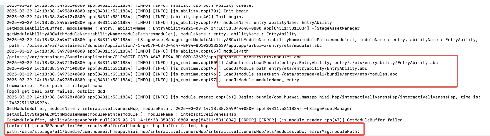
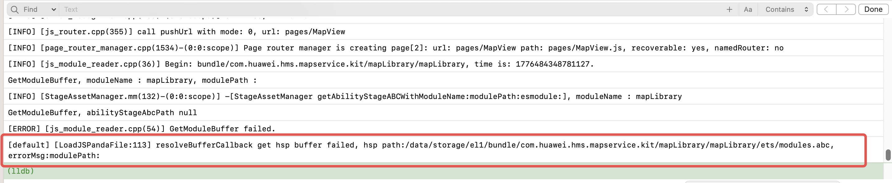

# 如何实现平台差异化(编译态、运行态)

**平台差异化适用于以下两种典型场景：**

1. 自身业务逻辑不同平台本来就有差异；
2. 在OpenHarmony上调用了不支持跨平台的API，这就需要在OpenHarmony上仍然调用对应API，其他平台通过Bridge桥接机制或platformView平台视图进行差异化处理；

## 编译态

**编译态（** 规避手段，**注意：该方法会屏蔽掉所有不支持跨平台的error错误，可能会带来运行态上的crash，谨慎使用）：**

在工程中的.arkui-x/arkui-x-config.json5配置文件中增加ignoreCrossPlatform配置，并设置为true来屏蔽此告警


## 运行态

**特别说明：编译态屏蔽后，所有不支持跨平台API的场景，需要通过运行态的方式来处理，不然会有Crash。**
参考[运行态平台差异化](https://gitcode.com/arkui-x/docs/blob/master/zh-cn/application-dev/quick-start/platform-different-introduction.md)。

除了以上关于平台判断处理外，针对不支持跨平台的HMS API或者HMS 组件，不能直接在文件头中import引用，会造成Android/iOS运行时错误，虚参考以下处理：

**不支持跨平台的HMS API：**

&emsp;&emsp;对于不支持跨平台的HMS API，直接基于上述写法运行起来会直接crash，以活体检测API [interactiveLiveness](https://developer.huawei.com/consumer/cn/doc/harmonyos-references/vision-interactive-liveness)为例，运行态会报如下截图错误，该如何解决？

<div align=center>
    
</div>
<div align=center style="font-size:12px">HMS API跨平台改造报错截图</div>


&emsp;&emsp;1、**原因分析：** 如果应用工程中import了HMS API并涉及到具体调用，当应用运行起来后还未执行到具体业务逻辑时，方舟虚拟机就会首先遍历寻找实现这些HMS API的hsp，对于鸿蒙应用而言，这些hsp包预置到鸿蒙手机系统，因而可以成功获取，但是安卓和iOS原生平台未集成这些闭源hsp，所以会因找不到hsp直接crash。（**注：若import了HMS API，但是只存在对象声明，不调用API的情况不会初始化寻找对应hsp**）。

&emsp;&emsp;2、**解决方案：** 仍可以基于上面“一码三平台”的架构，只不过需要在commons层使用HMS API的地方引入[动态import](https://developer.huawei.com/consumer/cn/doc/harmonyos-guides/arkts-dynamic-import)的处理策略，以活体检测API为例，具体实现参考如下：

```shell
// commons/recognize/src/main/ets/Interactive/Interactive.ets
import { PlatformInfo, PlatformTypeEnum } from 'utils';
import { InteractiveInterface } from './interface/interactiveInterface';
import { InteractiveArkUIX } from './impl/interactiveArkUIX';

export class Interactive {
  public static getInterface(): InteractiveInterface {
    let platform: PlatformTypeEnum = PlatformInfo.getPlatform();
    if (platform == PlatformTypeEnum.ANDROID || platform == PlatformTypeEnum.IOS) {
      return InteractiveArkUIX.getInstance();
    } else {
      return InteractiveLocal.getInstance();
  }
}
```

&emsp;&emsp;这里不再赘述InteractiveArkUIX的实现，和上文CameraArkUIX思想一致，直接看InteractiveLocal的实现，最重要的便是在使用startLivenessDetection该API之前，需要重新动态import一次具体的系统接口文件，但正如上述所说，函数入口处的isSilentMode、actionsNum和routerOptions只是使用API中的数据类型声明定义变量，这些仍可以直接使用文件入口处import的interactiveLiveness能力而不会带来问题：

```shell
// commons/recognize/src/main/ets/Interactive//impl/InteractiveLocal.ets
import { InteractiveInterface } from '../interface/interactiveInterface';
import { BusinessError } from '@kit.BasicServicesKit';
import { hilog } from '@kit.PerformanceAnalysisKit';
import interactiveLiveness from '@hms.ai.interactiveLiveness'

export class InteractiveLocal implements InteractiveInterface {
  public startInteractive(): void {
    let isSilentMode = "INTERACTIVE_MODE" as interactiveLiveness.DetectionMode;
    let actionsNum = 3 as interactiveLiveness.ActionsNumber;
    let routerOptions: interactiveLiveness.InteractiveLivenessConfig = {
      actionsNum: actionsNum,
      isSilentMode: isSilentMode
    };
    import('@hms.ai.interactiveLiveness').then((ns) => {
      try {
        ns.default.startLivenessDetection(routerOptions).then((DetectState: boolean) => {
          hilog.info(0x0001, "LivenessCollectionIndex", `Succeeded in jumping.`);
        }).catch((err: BusinessError) => {
          hilog.error(0x0001, "LivenessCollectionIndex", `Failed to jump. Code：${err.code}，message：${err.message}`);
        })
      } catch (err) {
        err = err as BusinessError;
        console.error(`startLivenessDetection failed. Code: ${err.code}, message: ${err.message}`);
      }
      return;
    })
  }
}
```

&emsp;&emsp;3、**更优化的解决方案：** 上述写法虽然可以解决crash的问题，但是不可避免地会在一个ets文件中的不同函数中反复多次进行动态**import API**，影响开发效率和代码整齐程度，所以可以考虑在Interactive类的平台差异化处，直接进行动态**import ets文件**的处理，处理完成后，文件内使用HMS API的地方无需再增加动态import API的侵入修改。

```shell
// commons/recognize/src/main/ets/Interactive/Interactive.ets
import { PlatformInfo, PlatformTypeEnum } from 'utils';
import { InteractiveInterface } from './interface/interactiveInterface';
import { InteractiveArkUIX } from './impl/interactiveArkUIX';

export class Interactive {
  public static async getInterface(): Promise<InteractiveInterface|null> {
    let temp: InteractiveInterface | null = null;
    let platform: PlatformTypeEnum = PlatformInfo.getPlatform();
    if (platform == PlatformTypeEnum.ANDROID || platform == PlatformTypeEnum.IOS) {
      temp = InteractiveArkUIX.getInstance();
    } else {
      await import('./impl/interactiveLocal').then((ns) => {
        temp = new ns.InteractiveLocal();
      })
    }
    return temp;
  }
}
```

**不支持跨平台的HMS 组件：**

&emsp;&emsp;对于不支持跨平台的HMS组件（如MapComponent地图组件），同样不能直接在文件头中import引用，会造成Android/iOS运行时错误，报错如下：

<div align=center>
    
</div>
<div align=center style="font-size:12px">HMS API跨平台改造报错截图</div>

需要通过以下方案处理：

&emsp;&emsp;1、**封装方案：** 在OpenHarmony平台侧创建一个专门的组件封装文件，使用wrapBuilder方式导出：

```shell
// entry/src/main/ets/pages/harmonyOSPage.ets
import { MapComponent, mapCommon, map } from '@kit.MapKit';
import { AsyncCallback } from '@kit.BasicServicesKit';

@Entry
@Component
export struct harmonyOSPage {
  // MapComponent地图组件相关逻辑
  private mapOptions?: mapCommon.MapOptions;
  private callback?: AsyncCallback<map.MapComponentController>;

  aboutToAppear(): void {
    this.mapOptions = {
      position: {
        target: {
          latitude: 39.9,
          longitude: 116.4
        },
        zoom: 10
      }
    };
    this.callback = async (err, mapController) => {
      if (!err) {
        // 地图初始化成功后的处理逻辑
      }
    };
  }

  build() {
    MapComponent({ mapOptions: this.mapOptions, mapCallback: this.callback }).width('100%').height('100%')
  }
}

// 使用wrapBuilder包装为Builder类型
@Builder
function builder() {
  harmonyOSPage()
}

export const MapComponentBuilder = wrapBuilder(builder);
```

&emsp;&emsp;2、**动态加载方案：** 在组件显示页面中通过动态import结合NodeController和BuilderNode的方式动态引用和加载：

```shell
// entry/src/main/ets/pages/MapView.ets
import PlatformView from '@arkui-x.platformview';
import { deviceInfo } from '@kit.BasicServicesKit';
import { BuilderNode, NodeController, UIContext } from '@kit.ArkUI';

@Entry
@Component
struct Index {
  private osFullNameInfo: string = '';
  private controller: MyNodeController = new MyNodeController();

  aboutToAppear(): void {
    this.osFullNameInfo = deviceInfo.osFullName;
    // 仅在OpenHarmony平台动态加载HMS组件
    if (this.osFullNameInfo.startsWith("OpenHarmony")) {
      // 动态import HMS组件封装文件
      import ('./harmonyOSPage').then(res => {
        // 创建BuilderNode并加载wrapBuilder导出的组件
        this.controller.node = new BuilderNode(this.getUIContext());
        this.controller.node.build(res.MapComponentBuilder);
      })
    }
  }

  build() {
    Row() {
      Column() {
        // Android/iOS平台使用PlatformView占位或显示其他跨平台组件
        if (this.osFullNameInfo.startsWith("OpenHarmony")) {
          NodeContainer(this.controller).width('100%').height('100%')
        } else if (this.osFullNameInfo.startsWith("Android") ||
                   this.osFullNameInfo.startsWith("iOS")) {
          // 其他平台可以显示占位提示或使用其他替代方案
          Text('地图功能仅在鸿蒙系统支持').width('100%').height('100%')
        }
      }
    }
  }
}

// 自定义NodeController
class MyNodeController extends NodeController {
  node?: BuilderNode<[]>;

  makeNode(uiContext: UIContext): FrameNode | null {
    return this.node?.getFrameNode() ?? null;
  }
}
```

&emsp;&emsp;3、**方案总结：** 该方案的核心思想是将不支持跨平台的HMS组件（如MapComponent）封装在独立的.ets文件中，使用时仅在OpenHarmony平台通过动态import进行加载，其他平台（Android/iOS）通过条件判断使用platformView加载。这种方式既保证了鸿蒙端的完整功能，又避免了Android/iOS端因缺少HMS组件hsp而导致的crash。

