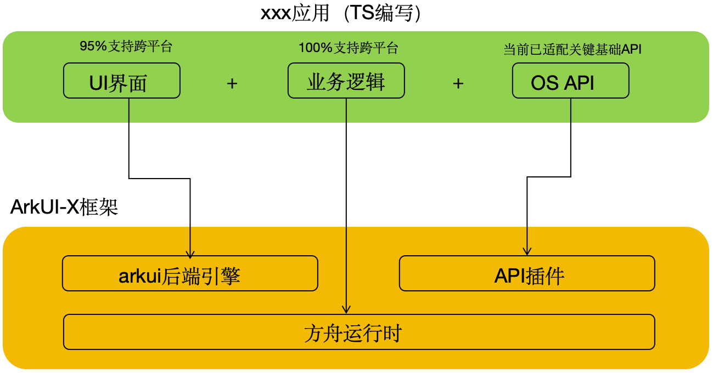

# 现有鸿蒙工程如何使用ArkUI-X向跨平台迁移

### 当前应用是否可以全部跨平台

一般来说一个应用包含三部分：

其中UI界面也即使用ArkUI实现的部分，当前ArkUI组件约98%支持跨平台，部分高级组件，需要特殊适配，暂不支持，已规划在后续版本中。第二部分是业务逻辑，使用ArkTS实现，该部分在方舟运行时中运行，完全支持跨平台。第三部分是调用的OS API（import ohos.xxx开头），这部分当前ArkUI-X框架已适配约5000+ API，已满足绝大部分应用使用。

**一个应用是否可以全部跨平台主要通过以下几个因素评估：**

1. 调用的API是否有不支持跨平台的API，如果有的话可以通过bridge机制，中转到原生实现。也即整个应用跨平台，但需要写少部分原生代码；
2. 调用的API如hms账号登录、push等，在HarmonyOS、Android、iOS上 和HarmonyOS Next差异较大，且hms相关闭源api均不支持跨平台，需要原生实现。

### 鸿蒙工程目录结构改造

ArkUI-X在Ace Tools上提供了ace modify的能力，用来帮助开发者实现一键式的鸿蒙工程结构向跨平台工程结构改造的能力，具体请参考：[鸿蒙工程结构改造为跨平台工程结构](Pre-faq-8.md)

### 如何解决部分API不支持跨平台的问题

针对当前不支持跨平台的API，ArkUI-X提供bridge桥接机制用来借助原生能力实现对应功能，具体场景化代码开发指导，请参考：[解决部分API不支持跨平台](../Development-Stage/Dev-faq-10.md)

### 实战教程参考

从零开始或基于现有HarmonyOS Next App进行改造，使其可快速部署于Android、IOS平台，从架构设计和实际代码开发层面，详情请参考：[跨平台改造实战指南](https://gitcode.com/arkui-x/docs/blob/master/zh-cn/application-dev/tutorial/how-to-use-arkuix-on-applicationRetrofit.md)