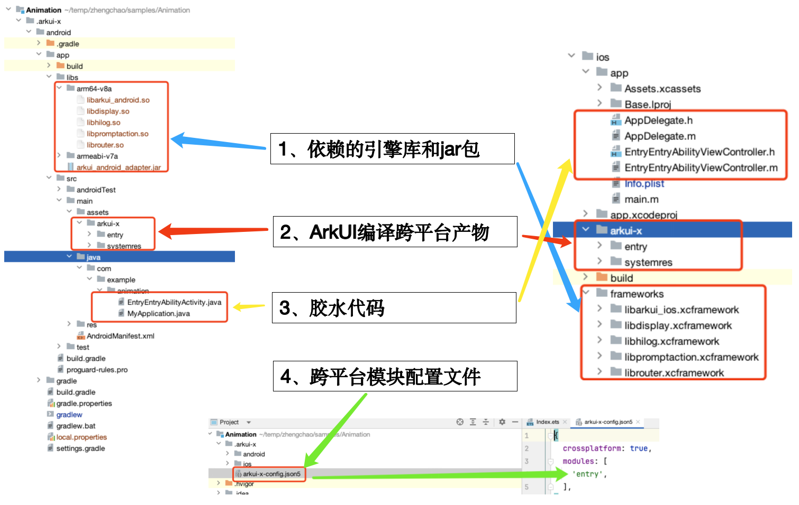

# 应用是如何借助ArkUI-X实现跨平台编译运行的

让我们以最简单的HelloWorld工程为例，工程创建请参考：[ArkUI-X之初体验-创建工程](https://gitcode.com/arkui-x/docs/blob/master/zh-cn/application-dev/quick-start/start-with-deveco-studio.md#%E5%88%9B%E5%BB%BA%E5%B7%A5%E7%A8%8B)

工程创建完成之后，跨平台工程对比鸿蒙工程， 从目录结构来看，最明显的差异就是多出来一个.arkui-x的目录，这里边的Android目录和iOS目录，都可以作为一个单独的安卓应用工程和iOS应用工程运行，编译对应平台的应用包。具体的Android和iOS工程目录结构及文件说明请参考：[ArkUI-X应用工程结构说明](https://gitcode.com/arkui-x/docs/blob/master/zh-cn/application-dev/quick-start/package-structure-guide.md)。

多出来的平台目录中会自动生成安卓和iOS平台上的**胶水代码**，位置和文件名称见上图"3、胶水代码\"。以安卓为例，Android应用的入口Application和Activity类，这两个类需要继承自ArkUI提供的基类，Activity继承StageActivity类，Application需要继承StageApplication类，或者也可以通过代理类StageApplicationDelegate使用，详情参见[Android使用说明](https://gitcode.com/arkui-x/docs/blob/master/zh-cn/application-dev/quick-start/start-with-ability-on-android.md)，[iOS使用说明](https://gitcode.com/arkui-x/docs/blob/master/zh-cn/application-dev/quick-start/start-with-ability-on-ios.md)。

接着开发者通过DevEco Studio或者Ace Tools开始进行编译，具体操作参考[使用说明](https://gitcode.com/arkui-x/docs/blob/master/zh-cn/application-dev/quick-start/start-with-deveco-studio.md#%E7%BC%96%E8%AF%91%E6%9E%84%E5%BB%BA%E7%94%9F%E6%88%90%E8%B7%A8%E5%B9%B3%E5%8F%B0%E5%BA%94%E7%94%A8)：

**Build APP(s)执行后，IDE具体执行了以下操作（以Android为例）：**

1. 编译所有模块的鸿蒙形态hap包；
2. **Android应用工程集成ArkUI-X SDK**

    - 从ArkUI-X SDK拷贝依赖的引擎库(libarkui_android.so)和主jar包(arkui_android_adapter.jar)；

    - 基于应用工程中用到的api拷贝依赖的插件库和相应jar包到.arkui-x/android/app/libs目录下，其中.so会拷贝两种编译架构的，分别是arm64（arm64-v8a）和arm（armeabi-v7a）两个文件夹；

    - 拷贝ArkUI-X SDK中/arkui-x/engine/systemres目录生成.arkui-x/android/app/src/main/assets/arkui-x/systemres目录，这部分属于ArkUI框架资源，可保证ArkUI-X应用在各平台上UX渲染一致性。
3. **Android应用工程集成ArkUI-X应用编译产物**

    解压缩第一步中跨平台模块编译生成的hap包，拷贝生成.arkui-x/android/app/src/main/assets/arkui-x/entry目录，里边主要包含ArkTS源码通过OpenHarmony SDK工具链生成的abc（Ark Byte Code），ArkUI应用资源；

    > 注：
    >
    > 1、具体哪些是跨平台模块，可以参考上图“4、跨平台模块配置文件”，查看arkui-x-config.json5文件
    >
    > 2、目录名叫entry是因为跨平台模块配置文件arkui-x-config.json5中指定该模块为跨平台模块，规则是，模块A跨平台，生成A目录，模块A和B跨平台，生成A和B目录
    >
    > 3、这里“arkui-x”目录名称是固定的，不能更改
    >

---

***此外，针对跨平台模块配置文件中如果配置了不同类型的module，重点解释说明如下：***

1、用来标记哪些module是跨平台模块；

2、特别说明，跨平台hap模块依赖的hsp和har模块名都需要标记到该文件中才会参与ArkUI-X的编译打包；

3、hsp和hap模块均会生成对应的ArkUI编译跨平台产物；

4、hsp、hap、har三种模块使用的api依赖的.so都会拷贝到libs目录。