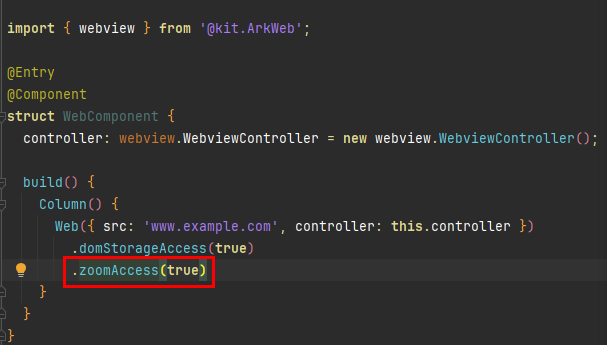
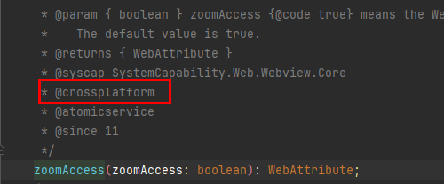

# 当前支持跨平台的鸿蒙API以及UI组件属性有哪些

1、当前支持跨平台的全量API，可以参考[API列表](https://gitcode.com/arkui-x/docs/blob/master/zh-cn/application-dev/reference/apis/README.md)
2、当前支持跨平台的组件能力，可以参考[组件属性列表](https://gitcode.com/arkui-x/docs/blob/master/zh-cn/application-dev/reference/arkui-ts/README.md)

**备注：**
除去上述支持跨平台的全量列表，开发者如果想快捷查看当前某个API是否支持跨平台，可以通过当前鸿蒙开发者联盟下载到最新版IDE进行ArkTS代码开发，查看是否支持跨平台方式如下：
CTRL(windows) OR command(Mac OS)+鼠标左键，点击api，跳转到对应.d.ts文件，查看API头注释是否有@crossplatform标签

  <table>
  <tr>
      <td>
         

              
         

      </td>
       <td>
          

              
          

      </td>
  </tr>
  </table> 