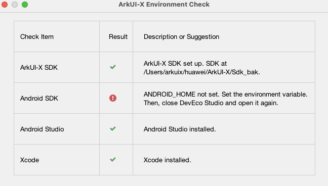
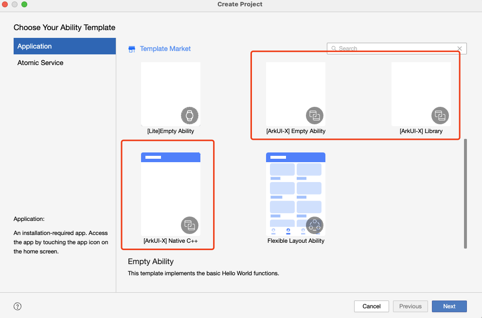
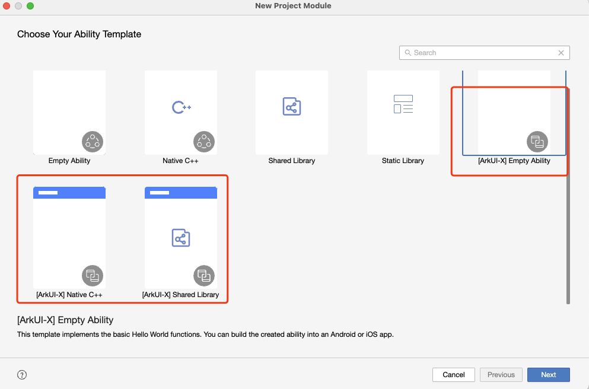

# DevEco Studio环境搭建常见问题

1、DevEco Studio为ArkUI-X应用构建提供了简单的集成开发环境，建议版本：V5.0.0 Release及以上。请从[官网](https://developer.huawei.com/consumer/cn/download/)进行DevEco Studio的下载和安装：

2、使用DevEco Studio开发ArkUI-X依赖其他的开发工具和SDK，根据开发的系统，MacOS上开发依赖以下四项，Windows上开发依赖除Xcode以外的另外三项。

重点关注Android SDK的环境变量的配置，需要配置环境变量ANDROID_HOME，详细配置方法可以参考[配置文档。](https://gitcode.com/arkui-x/docs/blob/master/zh-cn/application-dev/quick-start/start-with-dev-environment.md#配置android-sdk安装目录环境变量)

3、使用DevEco Studio创建模版工程请参考：[创建指导](https://gitcode.com/arkui-x/docs/blob/master/zh-cn/application-dev/quick-start/start-with-deveco-studio.md)

（1）当前支持三种工程模板，包括：

​	Empty Ability：简单的HelloWorld示例，编译之后，HarmonyOS Next->hap，Android->apk，iOS->iPA

​	Library：编译之后，HarmonyOS Next->har，Android->aar，iOS->framework

​	Native C++：用C++实现的接口，通过NAPI暴露接口到ts文件，编译之后，HarmonyOS Next->hap，Android->apk，iOS->iPA

（2）当前ArkUI-X支持模块级跨平台，在跨平台工程基础上，通过File->New->Module，可以新增三种模块：

​	Empty Ability：作为feature模块，可以编译单独的hap包，会在编译态生成对应的asset产物

​	Native C++：作为feature模块，用C++实现的接口，通过NAPI暴露接口到ts文件，可以编译单独的hap包，会在编译态生成对应的asset产物

​	Shared Library：作为hsp模块，无UIAbility作承载，但也会在编译态生成对应的asset产物

