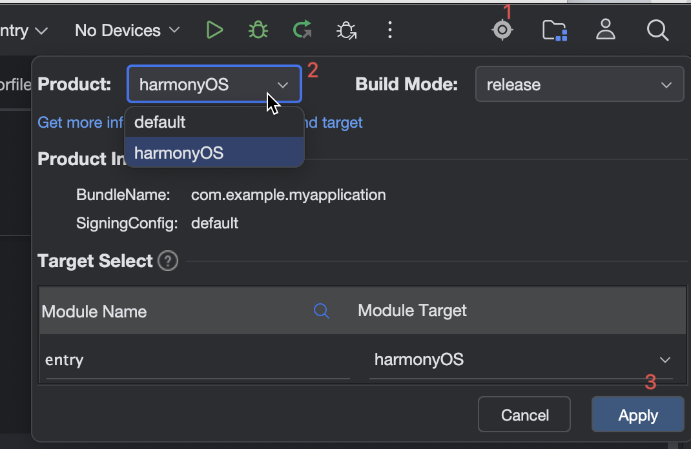

# 跨平台工程文件引用和三方库依赖隔离指南

## 背景与需求

ArkUI-X 是一个跨平台应用开发框架，支持同时编译生成 HarmonyOS 和 Android/iOS 应用。然而在实际开发中，会遇到以下问题：

### 1. 文件引用隔离的需求


部分业务代码依赖于 HarmonyOS 的闭源 SDK（如地图服务 `MapKit`、`Location Kit` 等），这些闭源库只能在 HarmonyOS 平台上运行，无法在 Android/iOS 跨平台环境中使用。

**解决方案**：

为不同平台创建不同的 product 和 target 配置：
- **default product**：编译跨平台版本，引用跨平台兼容的业务实现（不包含闭源库调用）
- **harmonyOS product**：编译纯 HarmonyOS 版本，可以引用包含闭源库调用的业务文件

这样可以确保：
- 跨平台编译时不会因为引用闭源库而报错
- 纯 HarmonyOS 开发时可以使用完整的平台能力
- 代码复用最大化，只需维护一套业务逻辑代码

### 2. 三方依赖库隔离的需求


项目中引入的部分第三方依赖库可能仅支持 HarmonyOS 平台（如某些媒体播放库、原生能力封装库），无法在 Android/iOS 跨平台环境中使用。

**解决方案**：

通过 hvigorfile.ts 脚本，在编译时根据当前 product 动态增删 `dependencies` 或 `devDependencies`，确保每个 product 使用的都是兼容的依赖库。

---

## 一、文件引用隔离

### 1.1 配置示例

假设工程目录结构如下：

```
entry/
└── src/
    └── main/
        └── ets/
            ├── arkuix_util/
            │   └── arkuixPage.ets    # default product Arkui-X跨平台使用的页面  
            └── harmonyOS_util/
                └── harmonyPage.ets   # harmonyOS product harmonyOS使用的页面
```

- 当编译 `default` product 时，打包 `arkuix_util/arkuixPage` 页面，此页面中的逻辑实现符合跨平台开发要求。
- 当编译 `harmonyOS` product 时，打包 `harmonyOS_util/harmonyPage` 页面，此页面中会引用harmonyOS闭源库实现功能。

### 1.2 工程级 build-profile.json5 配置

在工程根目录的 `build-profile.json5` 中，需要配置：

1. **products 数组**：定义不同的 product（产品）
2. **modules 数组**：为每个模块配置 targets，并指定 target 应用于哪些 product

```json5
{
  "app": {
    "products": [
      {
        "name": "default",           // product 名称
        "signingConfig": "default",
        "targetSdkVersion": "6.0.2(22)",
        "compatibleSdkVersion": "6.0.2(22)",
        "runtimeOS": "HarmonyOS",
        "buildOption": {
          "strictMode": {
            "caseSensitiveCheck": false,
            "useNormalizedOHMUrl": false
          }
        }
      },
      {
        "name": "harmonyOS",  // 另一个 product
        "signingConfig": "default",
        "targetSdkVersion": "6.0.2(22)",
        "compatibleSdkVersion": "6.0.2(22)",
        "runtimeOS": "HarmonyOS",
        "buildOption": {
          "strictMode": {
            "caseSensitiveCheck": false,
            "useNormalizedOHMUrl": true
          }
        }
      }
    ]
  },
  "modules": [
    {
      "name": "entry",               // 模块名称
      "srcPath": "./entry",
      "targets": [
        {
          "name": "default",         // target 名称
          "applyToProducts": [
            "default"                // 应用于哪个 product
          ]
        },
        {
          "name": "harmonyOS",
          "applyToProducts": [
            "harmonyOS"
          ]
        }
      ]
    }
  ]
}
```

**关键配置说明：**

| 配置项 | 说明 |
|--------|------|
| `products[].name` | product 名称，用于区分不同的产品配置 |
| `targets[].name` | target 名称，一个模块可以定义多个 target |
| `targets[].applyToProducts` | 指定该 target 应用于哪些 product |

### 1.3 模块级 build-profile.json5 配置

在模块目录（如 `entry/build-profile.json5`）中，配置每个 target 对应的源文件路径：

```json5
{
  "apiType": "stageMode",
  "targets": [
    {
      "name": "default",
      "source": {
        "pages": [
          "arkuix_util/arkuixPage"        // default product为arkui-x使用的页面
        ],
        "sourceRoots": [
          "./src/main"
        ]
      }
    },
    {
      "name": "harmonyOS",
      "source": {
        "pages": [
          "harmonyOS_util/harmonyPage"     // harmonyOS product为hormonyOS使用的页面
        ],
        "sourceRoots": [
          "./src/main"
        ]
      }
    }
  ]
}
```

**配置说明：**

| 配置项 | 说明 |
|--------|------|
| `targets[].name` | 必须与工程级 build-profile.json5 中定义的 target 名称一致 |
| `targets[].source.pages` | 指定该 product 编译时使用的页面路径（相对于 sourceRoots） |
| `targets[].source.sourceRoots` | 源代码根目录 |

### 1.4 编译打包



编译时按照需求选择不同的Product后，编译或者运行。

---

## 二、三方依赖库隔离（动态依赖管理）

### 2.1 需求场景

不同 product 可能需要不同的三方依赖库，例如：
- `default` product：为跨平台product，其中不支持使用三方媒体库进行播放，使用桥接到原生媒体播放库实现播放功能，所以不引用 `@polyvharmony/media-player-sdk` 三方库
- `harmonyOS` product：需要使用 `@polyvharmony/media-player-sdk` 媒体播放库，所以需要引用

### 2.2 hvigorfile.ts 动态依赖配置

在工程根目录的 `hvigorfile.ts` 中，动态修改依赖配置。

```typescript
import { AppTasksForArkUIX } from '@ohos/hvigor-ohos-arkui-x-plugin';
import { hvigor } from '@ohos/hvigor';
import { appTasks, OhosAppContext, OhosPluginId } from '@ohos/hvigor-ohos-plugin';
import * as fs from 'fs';

// 获取根节点和应用上下文
const rootNode = hvigor.getRootNode();
const appContext = rootNode.getContext(OhosPluginId.OHOS_APP_PLUGIN) as OhosAppContext;

// 在节点评估完成后执行
hvigor.nodesEvaluated(() => {
  const rootNode = hvigor.getRootNode();
  const appContext = rootNode.getContext(OhosPluginId.OHOS_APP_PLUGIN) as OhosAppContext;

  if (!appContext) {
    console.error("上下文获取失败: 请检查插件注册");
    return;
  }

  // 获取当前编译的 product 名称
  const productName = appContext.getCurrentProduct().getProductName();
  console.log(`当前编译 product: ${productName}`);

  // 根据 product 动态配置依赖
  if (productName === 'harmonyOS') {
    // harmonyOS product 需要媒体播放库
    updateDependencies('./entry/oh-package.json5', {
      "@polyvharmony/media-player-sdk": "2.4.0"
    });
  } else {
    // default product 不需要额外的三方依赖
    updateDependencies('./entry/oh-package.json5', {});
  }
});

/**
 * 更新 oh-package.json5 中的依赖
 * @param packageJsonPath oh-package.json5 文件路径
 * @param dependencies 要设置的依赖对象
 */
function updateDependencies(packageJsonPath: string, dependencies: Record<string, string>): void {
  const fileContent = fs.readFileSync(packageJsonPath, 'utf-8');
  let packageData: any;

  try {
    packageData = eval(`(${fileContent})`);
  } catch (error) {
    console.error(`解析 ${packageJsonPath} 文件失败:`, error);
    return;
  }

  // 更新 dependencies
  packageData.dependencies = dependencies;

  const updateContent = JSON.stringify(packageData, null, 2);

  try {
    fs.writeFileSync(packageJsonPath, updateContent, 'utf-8');
    console.log(`成功更新依赖: ${JSON.stringify(dependencies)}`);
  } catch (error) {
    console.error(`写入 ${packageJsonPath} 文件失败:`, error);
  }
}

// 必须注册 APP 插件
export default {
  system: AppTasksForArkUIX,
  plugins: []
}
```

### 2.3 实现原理

1. `hvigorfile.ts` 文件中可以编写编译相关的脚本，工程级目录下和模块级目录下均有对应的`hvigorfile.ts` 文件。不同级别的需求在不同级别的文件中处理。

2. 上文是在工程级目录的`hvigorfile.ts` 文件中获取到当前选择的 product名称，根据不同product实现不同的依赖库动态配置。

   **获取当前 product**：
   ```typescript
   const productName = appContext.getCurrentProduct().getProductName();
   ```

3. **动态修改 oh-package.json5**文件，根据 product 名称，修改 `dependencies` 字段

### 2.4 编译打包

  同1.4中所述，也是选择对应的Product后，进行编译打包


---

## 三、常见问题

### Q1: hvigorfile.ts 中的修改没有生效？
A: 确保在 `hvigor.nodesEvaluated()` 回调中修改，修改后重新编译。

### Q2: 如何调试 hvigorfile.ts？
A: 在 hvigorfile.ts 中添加 console.log 日志，编译时查看日志输出。

> 参考文档：https://developer.huawei.com/consumer/cn/doc/best-practices/bpta-multi-target

> 参考文档：https://developer.huawei.com/consumer/cn/doc/harmonyos-guides/ide-build-expanding
