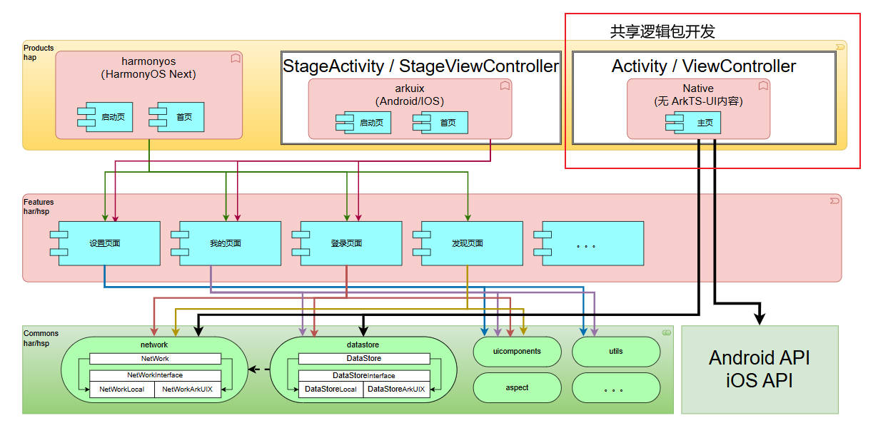
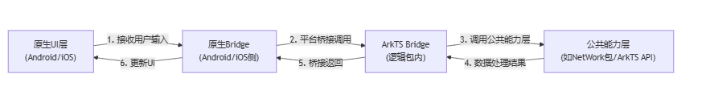

# 跨平台应用开发工程模块设计

## 一、简介

&emsp;&emsp;ArkUI-X 是**基于 HarmonyOS 技术底座打造的跨端跨平台开发框架**，以“一次开发、三平台部署”为核心目标，支持开发者通过**ArkTS 语言**编写的应用，快速适配 **HarmonyOS Next、Android、iOS** 三大平台，实现“一套代码，多端运行”。<br>

- **效率提升**：基于 HarmonyOS Next 的 ArkTS 应用，可通过 ArkUI-X 框架快速改造为跨平台应用，**大幅缩短多端适配周期**。<br>
- **体验一致**：确保应用在三大平台上的**交互逻辑、视觉风格、功能表现统一**。<br>
- **技术延续**：复用 HarmonyOS Next 成熟的 ArkTS 生态（如声明式 UI、状态管理、API），避免从零构建多端逻辑。<br>

&emsp;&emsp;本文档**重点阐述跨平台应用工程的模块设计思路与最佳实践**，帮助开发者理解。<br>

- 如何基于 ArkTS 代码拆分平台无关逻辑与平台相关适配层。<br>
- 如何通过模块化设计平衡“代码复用”与“平台特性扩展”。<br>

## 二、方案说明

&emsp;&emsp;整体设计理念源于[分层架构设计](https://developer.huawei.com/consumer/cn/doc/best-practices-V5/bpta-layered-architecture-design-V5)理念，并结合一部分当前跨平台特性。<br>&emsp;&emsp;关于图中”共享逻辑包开发模式“：详情描述请看[第四部分](#第四部分：共享逻辑包开发（ui与逻辑解耦）)。



### 第一部分：**产品定制层**（products）

&emsp;&emsp;由于不同操作系统之间的**数据平台差异**等客观原因，部分功能基于各平台的独特能力来实现不可避免。基于此，在products层，建议开发者建立两个module，分别命名为harmonyos和arkuix。在不同的hap包中集成对应的独特功能模块，最终编译成独立的hap包，以此实现功能隔离的效果。<br>

&emsp;&emsp;当然，倘若在App的实际开发进程中确定所有功能在三端应用时均可实现，也就是不需要考虑平台差异性问题，可以直接采用单hap设计。开发者需要根据实际开发状况进行全面综合的考量。

| 运行设备平台（系统能力支持） | module    | 编译产物：hap包 |
| ---------------------------- | --------- | --------------- |
| HarmonyOS Next               | harmonyos | harmonyos.hap   |
| Android                      | arkuix    | arkuix.hap      |
| iOS                          | arkuix    | arkuix.hap      |

&emsp;&emsp;products层为App主module，其编译产物为[HAP](https://developer.huawei.com/consumer/cn/doc/harmonyos-guides-V5/hap-package-V5)。作为应用的入口。一般保留有应用启动页和应用首页。由于采用了分包编译，需要开发者在harmonyos.hap（下面简称A包）和 arkuix.hap （下面简称B包）中各自独立开发应用启动页和应用首页（下面简称Pages），带来额外的开发量。基于此，建议开发者进行 products层 设计时考虑以下几点：<br>

- 共性考虑：对于App来说，A包和B包都存在”设置页面、我的页面、登录页面“（见上图），这些共性的代码和文件如果分别存放于A包和B包会导致大量的冗余代码，也不利于后期维护，因此建议对其进行抽象，形成一个独立的模块存放（features层模块main），通过module依赖的方式使用。<br>
- 差异性考虑：对于App来说，仅A包存在”发现页面“（见上图），如果B包运行至”发现页面“时会产生不可预知的后果。<br>
  - B包的Pages设计时删除相关的页面元素，用户使用基于B包的App时不感知”发现页面“。<br>
  - 相关的数据结构、方法函数等应重新设计，可以抽象的部分进行抽象，存于features层模块main；无法抽象的部分各自实现。<br>

### 第二部分：**基础特性层**（features）

&emsp;&emsp;Features层属于App的特性界面层，其编译产物为[HAR](https://developer.huawei.com/consumer/cn/doc/harmonyos-guides-V5/har-package-V5)/[HSP](https://developer.huawei.com/consumer/cn/doc/harmonyos-guides-V5/in-app-hsp-V5)包。在该层级中，包含了应用的所有UI界面、弹窗、媒体图片等元素，这些都是能够被用户直接感知并进行操作的。此层是借助HarmonyOS的ArkUI组件以及相关能力来进行设计与开发的，并且ArkUI-X框架确保了在Android/iOS与HarmonyOS Next上能够拥有相同的展示效果和交互体验。<br>

​		（1） 开发者进行设计时需首先考虑ArkUI-X框架的实际适配状况，使用支持跨平台的UI控件、属性、方法进行跨平台开发，因为在UI组件方面存在的差异，是无法借助Bridge能力来弥补的。 关于ArkUI-X框架组件适配情况可参考：[ArkTS声明式开发范式跨平台支持列表](https://gitcode.com/arkui-x/docs/blob/master/zh-cn/application-dev/reference/arkui-ts/README.md)。<br>

​		（2） API接口的使用：在使用API接口时可能会遇到以下两种情况：1、API不支持跨平台。2、API在Android、iOS平台支持能力有差异（具体信息可参考相应的API文档）。因此不建议开发者在features层直接调用API接口实现功能。应尽可能对其抽象，于commons层创建功能模块实现，使用时调用commons层相应功能模块接口。具体实现详见“第三部分：公共能力层（commons）”。<br>

​		（3）共通组件：在实际开发过程中，可以抽象出部分满足多种场景的共通UI。可以在commons层创建模块“**uicomponents**”，将共通UI抽象并实现，实现代码复用的效果。详见[架构图commons层 uicomponents](#二、方案说明)。<br>

​		（4）应注意，features层应合理设计模块，谨慎处理模块间依赖关系，避免循环依赖等问题。<br>

​		（5）关于模块main的设计细节见[模块main设计](./how-to-use-arkuix-on-applicationRetrofit.md#模块main)。<br>

### 第三部分：公共能力层（commons）

&emsp;&emsp;commons层是App的能力集合体，其编译产物为[HAR](https://developer.huawei.com/consumer/cn/doc/harmonyos-guides-V5/har-package-V5)/[HSP](https://developer.huawei.com/consumer/cn/doc/harmonyos-guides-V5/in-app-hsp-V5)包，主要用于阐述App的核心功能与附加服务。它向上能够为features层和products层直接给予能力方面的支持，向下则依靠运行设备平台的系统能力。ArkUI - X框架的Bridge能力，为功能模块直接调用Android/iOS平台的能力提供了有力的支撑。<br>

&emsp;&emsp;需要注意的是，commons层应当合理规划模块设置，谨慎对待模块间的依赖关系，避免出现循环依赖等问题。<br>

&emsp;&emsp;建议开发者首先考虑使用ArkUI-X框架已有API进行开发，可参考：[ArkUI-X框架 API参考](https://gitcode.com/arkui-x/docs/blob/master/zh-cn/application-dev/README.md#api参考)。<br>

&emsp;&emsp;根据当前ArkUI-X框架的适配现状，可分为三种改造方式，具体的设计细节见[commons层设计](./how-to-use-arkuix-on-applicationRetrofit.md#第三部分：公共能力层（commons）)。<br>

  ### 第四部分：共享逻辑包开发（UI与逻辑解耦）

&emsp;&emsp;正常情况下，依据文章上述三部分，即可搭建一个跨平台应用的架构。<br>

&emsp;&emsp;在跨平台应用开发中，部分场景存在特殊诉求：**UI层使用Android/iOS原生能力实现**（如复杂动效、平台专属控件），**但业务逻辑希望复用ArkUI-X框架的API能力集**（如跨端一致的算法、数据处理等）。<br>

&emsp;&emsp;针对上述场景，引入“共享逻辑包开发模式”**：通过将ArkTS侧业务逻辑封装为独立的“逻辑包”（HAP模块），由原生UI层通过**平台桥接（Bridge）调用逻辑包中的能力，实现“UI原生实现+逻辑ArkTS复用”的混合架构。需要注意：**本方案仅支持Android、iOS，不支持HarmonyOS Next。**<br>

- **工程结构设计：逻辑包的“纯逻辑”约束**<br>

  需额外创建一个**HAP模块作为“逻辑包”**，其设计遵循“零UI依赖”原则，具体约束如下：<br>

  | **维度**               | **要求**                                                     | **原因**                                 |
  | ---------------------- | ------------------------------------------------------------ | ---------------------------------------- |
  | **对内（逻辑包自身）** | 禁止使用任何ArkTS UI能力：<br> • 不能用ArkTS UI组件绘制界面；<br/> • 不能调用UI相关API（如`dialog`、`promptAction`等）。 | 确保逻辑包仅承载业务逻辑，与UI彻底解耦。 |
  | **对外（逻辑包依赖）** | 依赖的HAR包/库也不能包含ArkTS UI能力<br/>（如某HAR包若用`dialog`，则逻辑包不可依赖）。 | 避免间接引入UI依赖，保证逻辑包“纯净性”。 |

- **整体流程解析：从原生UI到ArkTS逻辑的协同**<br>

  逻辑包的能力需依托**公共能力层**（commons），整体流程如下：<br>

  

&emsp;&emsp;**共享逻辑包开发模式提供了以下两种方案**

|            | 通过[loadModule](../reference/arkui-for-android/StageApplicationDelegate.md#loadmodule)加载Hap | 通过[loadAbility](../reference/arkui-for-android/AbilityLoader.md#loadability)加载Hap |
| ---------- | ------------------------------------------------------------ | ------------------------------------------------------------ |
| UIAbility  | 不创建UIAbility<br/>不会触发UIAbility的任何生命周期函数      | 创建UIAbility组件<br/>调用[loadAbility](../reference/arkui-for-android/AbilityLoader.md#loadability)时仅会触发UIAbility的onCreate()<br/>调用[unloadAbility](../reference/arkui-for-android/AbilityLoader.md#unloadability)时仅会触发UIAbility的onWindowStageDestroy()和onDestroy() |
| UI界面     | 不可使用ArkTS侧与UI相关的组件和API                           | 不可使用ArkTS侧与UI相关的组件和API                           |
| API限制    | 涉及下列内容的API将无法使用<br/>1.涉及使用UIAbility组件的上下文信息(context)，比如[@ohos.data.preferences](../reference/apis/js-apis-data-preferences.md#data_preferencesgetpreferences)。<br/>2.涉及UI组件相关的API | 涉及下列内容的API将无法使用<br/>1.涉及UI组件相关的API        |
| 特殊配置项 | 详见[ModuleLoader](../reference/apis/js-apis-ModuleLoader.md) | 无                                                           |
| 重复性     | 重复调用loadModule时，每一次调用都会触发[onLoad()](../reference/apis/js-apis-ModuleLoader.md#moduleloaderonload)回调 | 重复调用loadAbility加载相同的UIAbility时，仅第一次加载时会触发onCreate()，后续接口调用将不会生效，即不可重复创建<br>unloadAbility同理 |

&emsp;&emsp;**注**：“API限制”中API指[OpenHarmony接口定义跨平台支持列表](../reference/apis/README.md)。<br>

  #### 开发流程

&emsp;&emsp;具体的开发流程详见[共享逻辑包开发--Android平台](./how-to-decoupled-UI-and-Logic-on-android.md#开发流程)或[共享逻辑包开发--iOS平台](./how-to-decoupled-UI-and-Logic-on-ios.md#开发流程)。<br>

  #### 约束与限制

&emsp;&emsp;具体的约束与限制详见[共享逻辑包开发--Android平台](./how-to-decoupled-UI-and-Logic-on-android.md#约束与限制)或[共享逻辑包开发--iOS平台](how-to-decoupled-UI-and-Logic-on-ios.md#约束与限制)。<br>


## 四、工程目录结构设计

&emsp;&emsp;阐述说明相关文件的目录结构设计。跨平台整体工程目录详细资料请参考[ArkUI-X应用工程结构说明](https://gitcode.com/arkui-x/docs/blob/master/zh-cn/application-dev/quick-start/package-structure-guide.md)。

```tsx
工程
├── .arkui-x
│   ├── android
│   │   └── App\src\main
│   │       ├── java\com\example\test
│   │       |	├── BridgeSrc			 			 // Android平台Bridge类目录
|   |       |   |	 └── BridgeNetWorkUtil.java		 // NetWork Android 原生实现类
│   │       |	├── ArkuixEntryAbilityActivity.java
│   │       |	└── MyApplication.java
│   │       └── AndroidManifest.xml
|   | 
│   ├── ios
│   │   ├── App
│   │   |	├── BridgeSrc				  			 // iOS平台Bridge类目录
|   |   |   |   ├──	include							 // iOS平台Bridge 原生实现类 .h 文件目录
|   |   |   |   |	 └── BridgeNetWorkUtil.h		 // NetWork iOS 原生实现类
|   |   |   |   └──	src								 // iOS平台Bridge 原生实现类 .m 文件目录
|   |   |   |   	 └── BridgeNetWorkUtil.m		 // NetWork iOS 原生实现类
│   │   |   ├── AppDelegate.m
│   │   |   ├── AppDelegate.h
│   │   |   ├── ArkuixEntryAbilityViewController.h
│   │   |   └── ArkuixEntryAbilityViewController.m
│   │   └── App.xcodeproj
│   └── arkui-x-config.json5
|    
├── AppScope
│   ├── resourcesA
│   └── App.json5
├── commons	
│   ├── network										// commons层级功能模块 network
│   │   ├── src\main\ets
│   │   │   ├── interface							// interface 文件目录						
|   |   |   |    └── NetWorkInterface.ets			  // network 模块功能接口定义
|   |   |   └── utils								// class 文件目录
|   |   |        ├── NetWork.ets					  // NetWork
|   |   |        ├── NetWorkArkUIX.ets				  // ArkUIX实现
|   |   |        └── NetWorkLocal.ets				  // HarmonyOS实现
│   │   ├── Index.ets
│   │   └── oh-package.json5
|   |
│   ├── uicomponents								// commons层级功能模块 uicomponents 通用UI组件
│   │   ├── src\main\ets
│   │   │   ├── common								// 常量、数据结构等定义文件目录
|   |   |   └── components							// 通用UI组件 文件目录
│   │   ├── Index.ets								// uicomponents 对外导出组件实例文件
│   │   └── oh-package.json5						// uicomponents 依赖项配置文件
|   |
│   ├── utils										// commons层级功能模块 utils 通用方法
│   │   ├── src\main\ets
│   │   │   ├── common								// 常量、数据结构等定义文件目录
|   |   |   └── utils								// class 文件目录
|   |   |        └── PlatformInfo.ets				  // 区分当前设备平台
│   │   ├── Index.ets								// utils 对外暴露接口导出文件
│   │   └── oh-package.json5						// utils 依赖项配置文件
│   └── 功能...
├── features
│   ├── main 								// 模块 main
│   |    ├── src\main
│   |    |	  ├── ets						
│   |    |	  |	   └── model
│   |    |	  |	   		└── SplashSource.ets
│   |    |	  ├── resources
│   |    |	  └── module.json5
│   |    ├── build-profile.json5			
│   |    ├── Index.ets						// 模块对外暴露接口导出文件
│   |    └── oh-package.json5				// 模块依赖项配置文件
│   └── 特性...
├── products
│   └── phone
│       ├── arkuix							// 入口Module：Android、iOS平台
│       |	├── src\main
│       |	|	├── ets
│       |	|	|	├── entryability
│       |	|	|	|	└── EntryAbility.ets
│       |	|	|	└── pages
│       |	|	|		├── SplashPage.ets		// 应用启动页
│       |	|	|		└── MainPage.ets		// 应用首页
│       |	|	├── resources
│       |	|	└── module.json5
│       |	├── build-profile.json5
│       |	└── oh-package.json5				// 模块依赖项配置文件
│       └── harmonyos						// 入口Module：HarmonyOS Next平台 
│        	├── src\main
│       	|	├── ets
│       	|	|	└── pages
│       	|	|		├── SplashPage.ets		// 应用启动页
│       	|	|		└── MainPage.ets		// 应用首页
│       	|	├── resources
│       	|	└── module.json5
│       	├── build-profile.json5
│       	└── oh-package.json5				// 模块依赖项配置文件
├── build-profile.json5
└── oh-package.json5
```

&emsp;&emsp;如果采用“共享逻辑包改造（UI与逻辑解耦）”方案，工程中通常还会增加如下关键文件：<br>

```tsx
工程
├── .arkui-x
│   ├── android
│   |   └── App\src\main\java\com\example\test
│   |       ├── NativeActivity.java             // Android原生页面
│   |       └── MyStageApplication.java         // 控制是否加载ArkUI界面
│   ├── ios
│   │   ├── App
│   │   |   ├── AppDelegate.m					// 控制是否加载ArkUI界面
│   │   |   ├── AppDelegate.h
│   │   |   ├── NativeViewController.h			
│   │   |   └── NativeViewController.m			// iOS原生页面
│   │   └── App.xcodeproj
│   └── arkui-x-config.json5
├── products
│   └── phone
│       └── arkuix
│           ├── src\main\ets
│           │   ├── MyModuleLoader.ets          // loadModule方案使用
│           │   └── entryability
│           │       └── EntryAbility.ets        // loadAbility方案使用
│           └── build-profile.json5             // 需配置runtimeOnly.sources
└── commons
  └── 功能模块...                             // 暴露给原生侧调用的业务逻辑
```


## 五、约束与建议

- 本方案是依据ArkUI-X框架来实现的，应首先符合ArkUI-X框架的规格要求，详细内容可查看[ArkUI-X框架规格](https://gitcode.com/arkui-x/docs/blob/master/zh-cn/application-dev/tutorial/specification/framework-specification.md)。<br>
- 应用改造过程中可能涉及通过Bridge框架使用平台原生接口方法，使用时需满足相应的原生系统版本要求。<br>
- 在UI层面，建议使用ArkUI-X框架中已经适配完毕的组件，这些组件功能相对稳定且较为全面。详细内容可查看[ArkTS声明式开发范式跨平台支持列表](https://gitcode.com/arkui-x/docs/blob/master/zh-cn/application-dev/reference/arkui-ts/README.md)、[ArkUI-X框架 API参考](https://gitcode.com/arkui-x/docs/blob/master/zh-cn/application-dev/README.md#api参考)。<br>
- 共享逻辑包是“原生UI优先”场景下的补充方案。只有当UI层确实无法用ArkUI-X统一实现时，才通过此模式平衡灵活性与复用性；若UI与逻辑均需跨平台（即追求“一次开发、多端部署”的一致体验），ArkUI-X跨平台UI改造是更优解。<br>

