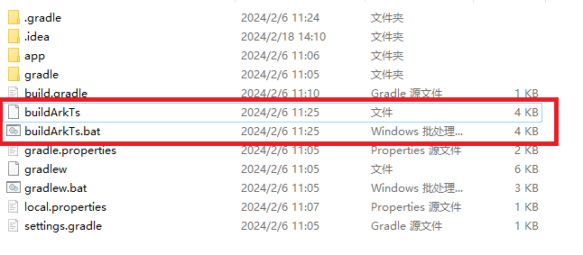

# 联动编译开发指南


## 简介

本文主要介绍通过CLI工具链执行ace create project命令创建工程，生成联动编译脚本。使用Android Studio编译Android应用时，可联动编译ArkTS源码，并自动拷贝ArkTS产物到Android工程中。

其功能主要包括：

- 手动配置编译ArkTS源码开关
- 手动配置编译module
- 手动配置文件输出路径


## 编译配置说明
- #### 配置编译ArkTS脚本开关


在.arkui-x/android/app/build.gradle目录下设置configBuildFlag开关，可触发联动ArkTS源码编译脚本，默认为false，不执行编译ArkTS脚本文件。
```
//执行联动编译脚本开关.
def configBuildFlag = false

task ArkTSBuildTask {
  preBuild.dependsOn ArkTSBuildTask
  doLast {
    if (configBuildFlag) {
      def os = System.getProperty("os.name").toLowerCase()
      if (os.contains("win")) {
        exec {
          //Windows系统执行此命令触发联动编译
          commandLine 'cmd', '/c', '.\\\\buildArkTs'
          workingDir file( project.projectDir.getAbsolutePath() + '\\\\..' )
        }
      } else {
        exec {
          //Linux和Mac系统执行此命令触发联动编译
          commandLine 'sh', '-c', 'chmod +x ./buildArkTs && ./buildArkTs'
          workingDir file( project.projectDir.getAbsolutePath() + '/..' )
        }
      }
    }
  }
}
```

- #### 配置编译module

可手动在Android工程下的buildArkts脚本中添加跨平台module，默认编译entry，用于编译指定module文件。

例：moduleLists=entry,testmodule

```
moduleLists=entry
```

- #### 配置Android的arkuix输出路径

可手动在Android工程下的buildArkts脚本中修改Android应用中module的输出路径。
```
android_arkuix_path="$project_path/.arkui-x/android/app/src/main/assets/arkui-x"
```
- #### 配置Android的systemRes输出路径

可手动在Android工程下的buildArkts脚本中修改Android应用中systemRes的输出路径。
```
android_systemRes_path="$project_path/.arkui-x/android/app/src/main/assets/arkui-x/systemres"
```
## 编译脚本目录
- #### .arkui-x/android目录，新增编译ArkTS脚本：



