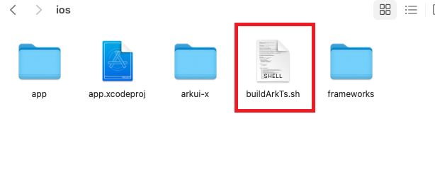

# 联动编译开发指南


## 简介

本文主要介绍通过CLI工具链执行ace create project命令创建工程，生成联动编译脚本。使用Xcode编译iOS应用时，可联动编译ArkTS源码，并自动拷贝ArkTS产物到iOS工程中。

其功能主要包括：

- 手动配置编译ArkTS源码开关
- 手动配置编译module
- 手动配置文件输出路径

## 编译配置说明

- #### 配置编译ArkTS脚本开关


在Xcode的Build Phases→Run My Script中设置configBuildFlag开关，可触发联动ArkTS源码编译脚本，默认为false，不执行编译ArkTS脚本文件。
```
# 执行联动编译脚本开关.
configBuildFlag=false
if [ "$configBuildFlag" = "false" ]; then
    exit 0
fi
sh ${SRCROOT}/buildArkTs.sh
```

- #### 配置编译module


可手动在iOS工程下的buildArkts脚本中添加跨平台module，默认编译entry，用于编译指定module文件。
例：moduleLists=entry,testmodule
```
moduleLists=entry
```

- #### 配置iOS的arkuix输出路径

可手动在iOS工程下的buildArkts脚本中修改iOS应用中module的输出路径。
```
ios_arkuix_path="$project_path/.arkui-x/ios/arkui-x"
```

- #### 配置iOS的systemRes输出路径

可手动在iOS工程下的buildArkts脚本中修改iOS应用中systemRes的输出路径。
```
ios_systemRes_path="$project_path/.arkui-x/ios/arkui-x/systemres"
```
## 编译脚本目录

- #### .arkui-x/ios目录，新增编译ArkTS脚本：


