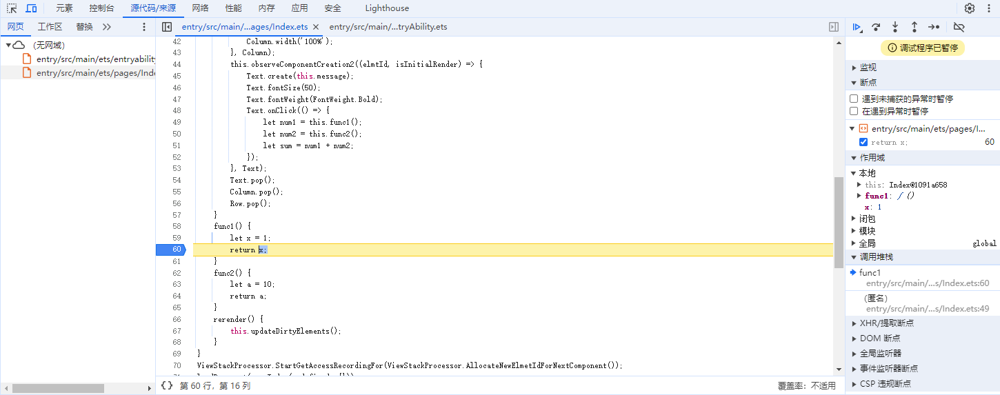
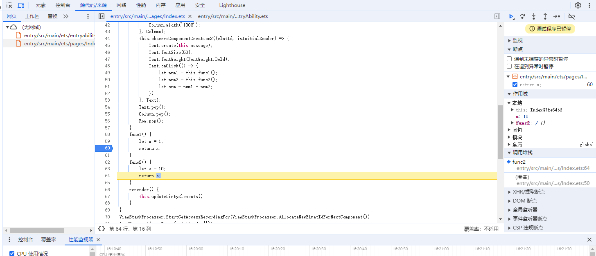
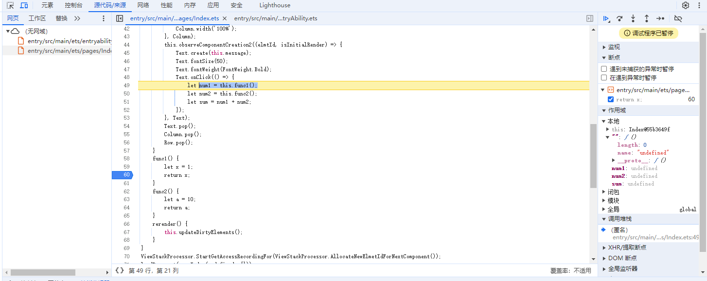
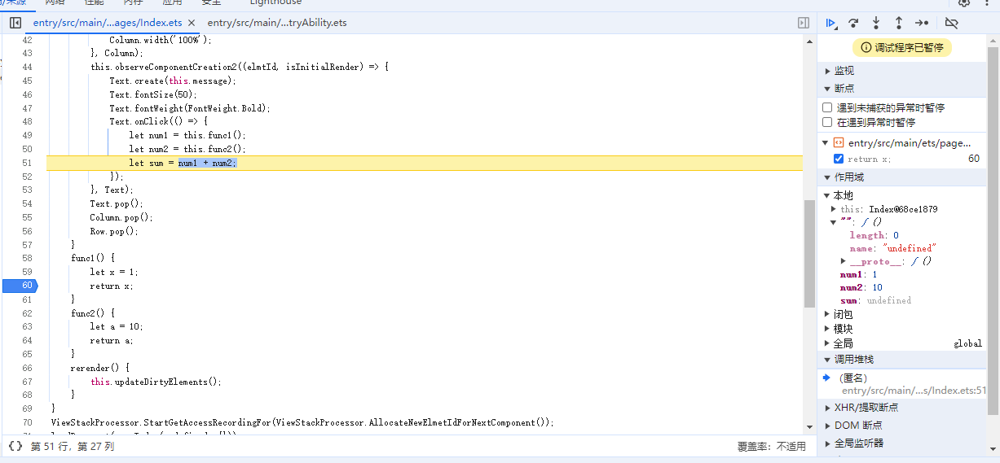
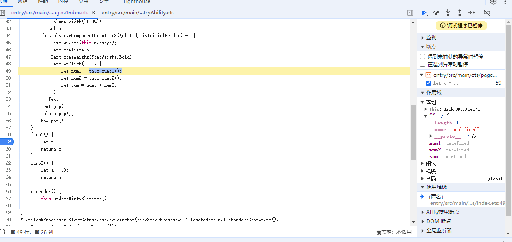
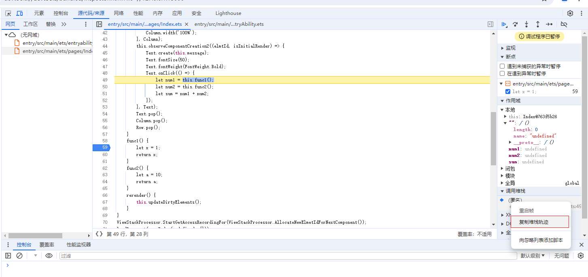
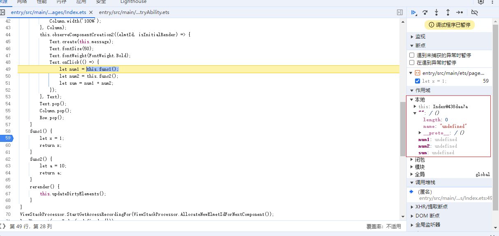

# 一. 方舟调试器简介

方舟调试器(ArkCompiler Debugger)为开发者提供了ArkUI-X应用程序调试的工具，用来调试Android应用，目前可在Chrome上进行调试，其功能包括单步调试、断点调试、查看和编辑变量、查看堆栈等。后续将支持在HUAWEI DevEco Studio上进行调试。

## 调试运行在Android系统上的应用

- 启动应用
- 获取设备端（Android应用端）debugger socket的端口号

```
    adb shell "netstat -anp | grep PandaDebugger"
```

- 将设备端的端口转发到host端（Chrome调试端）以进行通信, 此处$port为上条指令获得的端口号

```
    adb forward tcp:15037 localabstract:{$port}PandaDebugger
```

- 通过Chrome devtool进行调试，在Chrome上访问[devtool](devtools://devtools/bundled/inspector.html?ws=//127.0.0.1:15037): <devtools://devtools/bundled/inspector.html?ws=//127.0.0.1:15037>

- 如要重启应用需取消之前adb的端口映射，或映射host端的新端口

```
    adb forward --remove tcp:15037 ---取消之前的映射
    adb forward tcp:{$new_host_port} localabstract:{$device_port}PandaDebugger ---映射新的端口
```

## 调试方法

在应用调试过程中，单步调试以及查看变量的变化过程是否符合预期结果是一项常用的调试方法，方舟编译器运行时（ArkCompiler）提供了这项功能，结合Chrome的调试功能主要有以下几个基本操作：

F8：Run，继续执行脚本

F10：stepover，跳过下一个函数调用

F11：stepinto，进入下一个函数调用

Shift+F11：stepout，跳出当前函数调用

F9：单步调试

Ctrl+F8：停用断点

### 单步调试

进入调试界面后，先设置断点，然后点击右上角单步调试按钮或者按F9，就可以开始单步调试了。

例如：你在`49行`暂停。 单击“ **单步执行**”后，DevTools 将运行函数中的`func1` 代码，然后在`59行`暂停。 如果再次单击“ **单步执行** ”，DevTools 将运行到下一行，在`60行`暂停。



### stepinto

如果函数中调用了其他方法，需要进入到这个方法中查看变量值时，点击右上角stepinto按钮或者按F11，就可以进入这个方法中。

例如：你在`60行`暂停。 单击右上角“ **stepinto**”或者按"**F11**"后，DevTools 将进入函数`func2` ，然后在`63行`暂停。 如果再次单击“ **stepinto** ”或者按"**F11**"后，DevTools 将运行到下一行，在`64行`暂停。



### stepout

当进入到函数内部，但又不想执行函数剩余部分时，点击右上角stepout按钮或者按Shift+F11可以跳出当前函数。

例如：你在`60行`暂停。 单击右上角“ **stepout**”或者按"**shift+F11**"后，DevTools 将跳出函数`func1` ，在`49行`暂停。



### stepover

当遇到不想执行的函数时，点击右上角stepover按钮或者按F10，可以直接跳过此函数。

例如：你在`49行`暂停。 单击右上角“ **stepover**”或者按"**F10**"后，DevTools 逐行执行代码直接跳过函数`func1` ，然后在`50行`暂停。 如果再次单击“ **stepover** ”或者按"**F10**"后，DevTools 将运行到下一行，在`51行`暂停。



### 查看调用堆栈

在代码行上暂停时，使用“ **调用堆栈** ”窗格查看已达到此点的调用堆栈。



* **注: 在代码行上未暂停时,"调用堆栈"窗格为空。**

### 复制堆栈跟踪

若要将当前调用堆栈复制到剪贴板，请右键单击“ **调用堆栈** ”窗格，然后选择“ **复制堆栈跟踪**”。



### 查看并编辑属性和变量

在代码行上暂停时，使用“ **作用域** ”窗格可以查看和编辑局部范围、闭包范围和全局范围中的属性和变量的值。

* 双击属性值以对其进行更改。
* 不可枚举属性灰显。



