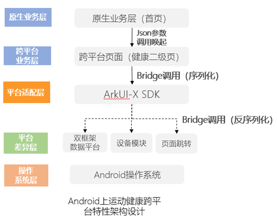

# 最佳实践之ArkUI-X跨平台技术落地-华为运动健康
## 1、现状与诉求
&emsp;&emsp;目前，华为运动健康App在Android 和 iOS均有独立的客户端工程，在原生页面部分，两个客户端独立开发，代码各自维护和演进，会带来各自独立的开发工作量，并且两个端之间的交互体验也无法做到一致。

&emsp;&emsp;为了解决开发工作量翻倍和交互体验不一致的问题，华为运动健康利用H5技术来进行跨平台，就是业界常说的hybrid-app，但是H5技术天生就有性能缺陷，无法带来极致流畅的用户体验和“秒开”的加载速度，所以目前H5跨平台技术只在运动健康应用某些低频和容易变化的页面上使用，在一二级页面仍使用原生native开发。
<div align=center>
	
</div>
<div align=center style="font-size:12px">运动健康业务技术栈示意图</div>

## 2、跨平台方案选型
&emsp;&emsp;随着运动健康鸿蒙NEXT版本开发，三个平台同时开发的成本及体验一致性问题凸显，例如占比90%的健康详情界面使用原生实现，多平台&多端，开发维护成本高。

<div align=center>
	
</div>
<div align=center style="font-size:12px">健康数据详情的原有技术实现</div>

&emsp;&emsp;有鉴于此，引入一种跨平台开发技术做到"一次开发、三端部署"来降低开发工作量以及保证体验一致性，对于运动健康App而言，显得尤为重要。作为鸿蒙NEXT系统生态中的重要一员，ArkUI-X框架是我们跨平台技术方案的首选。结合当前运动健康三端现状，具体采取如下跨平台技术的设计策略：

（1）运动健康首页历史逻辑复杂，涉及的模块多并且改造包袱重，仍使用**原生页面native**开发技术。

（2）在运动健康内部的二级页面（如心脏健康、睡眠等页面）使用**ArkUI-X**技术，实现页面级别的复用，实现“一次开发，三端部署”。

（3）在三级页面和低频页面上，仍使用**H5技术**。H5技术在三端上目前均已成熟，可以做到在三端无缝切换。

&emsp;&emsp;综上所述，页面采用的技术方案如下图所示：

<div align=center>
	
</div>
<div align=center style="font-size:12px">运动健康ArkUI-X跨平台业务技术栈示意图</div>

## 3、运动健康基于ArkUI-X跨平台框架适配
####  鸿蒙Next平台运动健康架构设计
&emsp;&emsp;如上所述，运动健康在鸿蒙NEXT系统上健康二级页面（如心脏健康、睡眠）采用ArkUI-X 跨平台技术进行开发，并且将对应的健康二级页面在Android 和 iOS上面进行复用，实现“一套代码，三端运行”。

&emsp;&emsp;在健康二级页面上，数据来自于运动健康内部的“数据平台”，但是目前运动健康在三端上的“数据平台”有各自单独的实现（运动健康“数据平台”可以理解成为一个独立的内部数据存储模块，具备增、删、改、查健康数据以及实现端云数据同步的功能）。但是由于历史原因，当前三端的数据平台无法做到代码复用，有各自的接口和逻辑实现，所以如何去除健康二级页面（如睡眠、心脏健康）与 数据平台的耦合关系，通过接口的形式隔离三端（iOS 和 Android和鸿蒙NEXT系统）的数据平台的实现差异，成为一个重要的问题。所以当前架构设计面临如下三个诉求：

（1）上层健康二级页面代码复用，抽象数据平台层接口实现，不修改上层业务代码的情况下兼容不同数据平台的差异。

（2）健康模块代码能够作为运动健康Next版本的一部分，可以在运动健康Next版本里面编译，同时能够单独编译，生成编译产物hap包，供Android和iOS编译，实现“一套代码，三端运行”。

（3）其他底层能力差异（如蓝牙设备连接，页面跳转等），通过bridge形式实现，最大限度复用上层代码。

&emsp;&emsp;根据上述诉求，鸿蒙NEXT系统上运动健康的架构设计如下：

（1）新建独立跨平台的Entry模块，该跨平台Entry模块用于编译跨平台hap包，供Android和iOS编译，跨平台的Entry模块本身不包含业务逻辑代码，仅仅用于编译出包。

（2）将健康二级页面代码单独抽离成独立module:健康Module，让鸿蒙NEXT的Entry模块和跨平台工程的Entry模块可以依赖健康Module。

（3）抽象数据平台的接口，让健康Module调用数据平台的抽象接口，而非依赖具体的数据平台实现，后续使用动态编译脚本，根据宿主平台来修改数据平台的实现。

（4）其他底层能力的差异（如蓝牙设备连接、页面跳转等），通过bridge的形式，桥接到不同的平台，根据平台来调用对应的方法。

&emsp;&emsp;鸿蒙Next系统上的运动健康整体架构图如下所示：

<div align=center>
	
</div>
<div align=center style="font-size:12px">鸿蒙NEXT系统上运动健康的架构图</div>

#### Android、iOS平台运动健康架构设计（以Android为例）
（1）如前所述，鸿蒙Next系统的跨平台工程编译出来的hap包，添加到运动健康Android版本的工程下Asset目录下参与编译，最后生成Android版本的apk包。通过这种形式，ArkUI-X跨平台页面代码就可以预置到Android版本的运动健康中。 

（2）跨平台代码预置后，Android侧通过ArkUI-X SDK提供的setInstanceName接口可以拉起对应的跨平台页面，并且通过该接口，可以将json格式的参数传递到跨平台的Entry模块。

```ts
package com.example.myapplication;
import ohos.stage.ability.adapter.StageActivity;

public class EntryMainAbilityActivity extends StageActivity {
    @Override
    protected void onCreate(Bundle savedInstanceState) {
        // 设置规则：bundleName:moduleName:abilityName:
        super.setInstanceName("com.example.myapplication:entry:MainAbility:");
        super.onCreate(savedInstanceState);
    }
}
```

（3）Entry模块收到json数据，解析对应的数据，从而拉起对应的跨平台页面。

（4）底层能力的差异（如蓝牙设备连接、页面跳转、数据平台等），通过bridge的形式，桥接到不同的平台，根据平台来调用对应的方法。

<div align=center>
	
</div>
<div align=center style="font-size:12px">Android上运动健康跨平台特性架构设计图</div>

## 4、原生和ArkUI界面参数传递
&emsp;&emsp;在原生页面拉起对应的跨平台的页面时，会将代表拉起哪个页面的参数通过intent的形式传递给跨平台的Entry模块，这里主要用到的是intent的putExtra()方法进行设置，Entry模块收到该参数之后，解析参数从而决定拉起的页面，一个简单的示意图如下所示：

<div align=center>
	
</div>
<div align=center style="font-size:12px">原生页面和ArkUI跨平台界面参数传递示意图</div>

## 5、ArkUI-X与原生之间的bridge桥接通信

&emsp;&emsp;ArkUI-X SDK 提供了一种bridge通信方案，用于跨平台层和宿主Native之间进行相互通信，使得跨平台层可以调用原生的能力。运动健康应用使用bridge的简单示意图如图所示：

<div align=center>
	
</div>
<div align=center style="font-size:12px">bridge调用示意图</div>

&emsp;&emsp;在运动健康内部，有5个bridge，用于跨平台层与native之间进行通信：

（1）**数据平台的bridge** -- 负责跨平台业务层  和 数据平台之间交互的接口定义；

（2）**设备类的bridge** -- 负责上层业务层 和 设备能力之间的交互（目前由于ArkUI-X SDK的蓝牙能力并非跨平台的，所以使用接口抽象不同平台的设备的交互）；

（3）**页面跳转的bridge** -- 负责从ArkUI的页面跳转到 H5的页面（在鸿蒙NEXT系统当中，运动健康跳转的是NEXT系统的H5页面，而在Android和iOS当中，运动健康跳转的是原生的H5页面）；

（4）**日志类的bridge** -- 负责将日志打印到对应的原生应用的日志文件当中；

（5）**用户账户信息的bridge** --负责向上层业务层提供获取原生App账户信息的能力。

&emsp;&emsp;这些bridge的创建时机均为跨平台Entry模块初始化之时。为了使上层调用bridge方法的时候，像调用ts原生方法一样方便，在应用工程内部，我们在ArkUI-X SDK的基础上对bridge的调用进行了一层封装，方法的核心代码如下所示：

```ts
/**
  * 执行Native接口
  * @param moduleName native模块名
  * @param funcName native函数名
  * @param params 参数列表
  */
public execNativeAsync(moduleName: string, funName: string, ...params: any): Promise<any> {
    return this.wrapFunc(moduleName, funcName, ...params);
}

private wrapFunc(moduleName: string, funcName: string, ...params: any): Promise<void> {
    return new Promise((resolve, reject) => {
        const id = mgr.add({
            success: (data) => {
                resolve(this.parseResult(data));
            },
            fail: (errCode, errMsg) => {
                reject({ errCode, errMsg });
            }
        });
        // 指定bridge类型和方法名即可进行调用对应的bridge方法
        console.log(`${TAG} call method: ${moduleName}/${funcName}`);
        if (params.length) {
            this.getModule(moduleName).callMethod(funcName, id, ...params);
        } else {
            this.getModule(moduleName).callMethod(funcName, id);
        }
    });
}
```

&emsp;&emsp;在本方法中，对调用层屏蔽了变量id，变量id由mgr来进行管理，调用方在调用bridge方法的时候，只需要指定bridge的类型和对应的bridge方法名，即可像调用原生ts方法一样调用bridge方法。

## 6、平台差异化处理—动态编译脚本
&emsp;&emsp;由于不同操作系统之间的**数据平台差异**等客观原因，需要做到一套业务代码在鸿蒙NEXT系统、Android 和 iOS上面同步运行，在**尽可能不修改业务代码的前提下屏蔽三端数据平台**的差异，结合运动健康NEXT系统当前的代码现状，运动健康使用了编译前动态修改import的技术方案：根据接口的形式抽象数据平台的功能，**利用编译前动态import的方式**来根据宿主形态来确定调用的具体方法。具体方案如下：

（1）在鸿蒙Next系统上，我们的业务代码依赖了鸿蒙Next系统的原生能力，我们将该原生能力包称为A包；与此同时，我们开发跨平台场景包，为了描述方便，我们将这个包命名为B包，B包的接口形式与数据结构跟A包保持一致，但是B包的内部实现与A包的实现不同（B包主要是跨平台包，内部实现为跨平台桥接）。

（2）将上层业务对A包的依赖导入收编到一个文件内（对A包的数据结构和接口进行import 和 export，通过该形式实现依赖中转），我们在这里将文件命名为**import-sdk.ts**，举个简单的示例：

```ts
import { xxx } from ‘a-sdk’ // A包是鸿蒙Next系统原生能力包
```

修改为：

```ts
import { xxx } from ‘import-sdk’// import-sdk.ts 是包名统一收编包
```

其中，**import-sdk.ts**文件的简单示例如下所示：

```ts
import {
  HealthModel, // A包的数据结构
  healthInterface // A包的接口方法
} from 'a-sdk'; // A包

export {
  HealthModel, 
  healthInterface
};
```

与此同时，创建B包的收编导入文件，其内容与**import-sdk.ts**有差异，差异为引入包的路径，代码如下所示：

```ts
import {
  HealthModel, // B包的数据结构
  healthInterface // B包的接口方法
} from 'b-sdk'; // B包

export {
  HealthModel, 
  healthInterface
};
```

（3）在编译前，按照**编译目标**替换收编导入文件，例如编译跨平台版本时，将**import-sdk.ts**替换为B包的收编导入文件。如果是编译鸿蒙Next系统的hap包，则不需要替换。由于之前对A包和B包的依赖统一收编到**import-sdk.ts**，所以只需要替换一个文件，即可以实现全局依赖替换。

<div align=center>
	
</div>

## 7、性能指标

目前ArkUI-X跨平台页面整体静态指标为：
•	滑动帧率为：**60fps（达到满帧）**
•	包体积增加：二进制包增加19MB
•	内存数据：**内存与原生持平（或略高）**，具体表格数据如下所示：

<div align=center>
	
</div>
<div align=center style="font-size:12px">内存对比</div>

## 8、整体实现效果

<div align=center>
	
</div>
<div align=center style="font-size:12px">目前心脏健康ArkUI-X跨平台实现已经在iOS上实现商用，Android版本正在Beta中</div>

## 9、总结

&emsp;&emsp;通过引入ArkUI-X技术，使得华为运动健康应用三端平台复用健康模块代码，从而在三端交互一致的前提下提升开发效率以及代码复用率（目前代码复用率为**74.3%**，提升研发效率**30%**），并且**用户体验追平原生native页面的体验效果**。后续规划，运动健康应用内部更多高频使用的页面和模块（如单次运动模块、运动记录页面等）也会逐渐迁移到ArkUI-X跨平台框架上。
