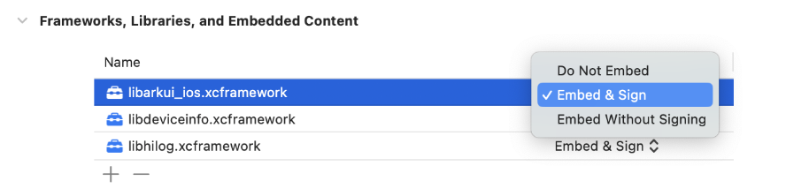

# 跨平台与原生页面跳转开发指南

### 文档概述

&emsp;&emsp;本文档介绍如何在原生工程中集成 ArkUI-X，实现跨平台与原生页面的跳转开发。文档覆盖 Android 与 iOS 两个平台，分别说明在现有原生工程中接入 ArkUI-X 页面能力、实现原生页面与 ArkUI 页面双向跳转的方法。

&emsp;&emsp;适用场景：

- 现有 Android / iOS 工程继续使用原生页面开发，同时新增页面希望使用 ArkUI-X
- 业务已上线，需要在不重构整体架构的前提下逐步接入 ArkUI-X
- 宿主应用保留原生导航、生命周期和平台能力，业务页面逐步引入 ArkUI-X

---

# 第一部分：Android 原生与 ArkUI 页面跳转开发指南

### 一、概述

&emsp;&emsp;本文档介绍如何在 Android 原生工程中集成 ArkUI-X 框架，实现 Android 原生页面与 ArkUI 页面的跳转开发。本文同时覆盖“原生页面跳转到 ArkUI 页面”和“ArkUI 页面跳转到原生页面”两种场景。

### 二、架构设计

#### 2.1 整体架构

&emsp;&emsp;Android 与 ArkUI-X 混合开发采用**双框架共存**的架构模式，通过 ArkUI-X 提供的适配层（`StageApplication`、`StageActivity`）实现 Android 与 ArkUI-X 的衔接。

&emsp;&emsp;Android 原生页面与 ArkUI 页面在同一应用中共存，原生页面通过 `Intent` 进入 ArkUI 页面承载页；满足命名映射规则时，ArkUI 页面也可以通过 `startAbility()` 拉起对应的原生 Activity。

&emsp;&emsp;架构核心组件：

- **StageApplication**：ArkUI-X 应用级适配器，负责初始化 ArkUI-X 运行时环境，包括资源路径和配置信息
- **StageActivity**：ArkUI-X 页面级适配器，负责将 Android Activity 生命周期与 ArkUI-X Ability 生命周期进行映射，并加载 ArkUI-X 页面
- **arkui_android_adapter.jar**：ArkUI-X Android 适配层核心库
- **动态链接库（.so）**：ArkUI-X 运行时的底层实现

#### 2.2 页面跳转链路

&emsp;&emsp;页面跳转链路如下：

1. Android 系统启动应用，加载 `MyApplication` 并初始化 ArkUI-X 运行时
2. 原生页面作为业务入口页展示 Android 原生 UI
3. 原生页面通过 `Intent` 跳转到 `EntryEntryAbilityActivity`
4. `EntryEntryAbilityActivity` 通过 `setInstanceName()` 绑定目标 ArkUI Ability 并加载 ArkUI 页面
5. ArkUI 页面渲染完成后，用户可继续交互
6. 满足命名映射规则时，ArkUI 页面也可以通过 `startAbility()` 拉起对应的原生 Activity

### 三、步骤详解

#### 前置：在 DevEco Studio 中构建 ArkUI-X 工程

在执行以下步骤前，先在 DevEco Studio 中对 ArkUI-X 工程执行一次构建，确保产出 Android 集成所需文件。

- `libs` 目录（包含 `arkui_android_adapter.jar` 和各架构 `.so` 库）
- `assets` 目录（如 `~/.arkui-x/android/app/src/main/assets/`）
- `EntryEntryAbilityActivity.java` 自动生成文件

#### 步骤1：拷贝 ArkUI-X 库文件

&emsp;&emsp;将 DevEco Studio 构建生成的整个 `libs` 目录拷贝至 Android 工程的 `app/libs` 目录下。

&emsp;&emsp;`libs` 目录结构：

```shell
app/libs/
├── arkui_android_adapter.jar          # ArkUI-X Android 适配层核心库
├── arm64-v8a/                         # ARM64 架构原生库
│   ├── libarkui_android.so
│   └── ...
└── armeabi-v7a/                       # ARM32 架构原生库
    ├── libarkui_android.so
    └── ...
```

#### 步骤2：拷贝 ArkUI-X 页面产物（assets）

将 DevEco Studio 编译生成目录 `~/.arkui-x/android/app/src/main/assets/` 下的全部文件和子目录，完整拷贝到 Android 工程 `app/src/main/assets/` 下，建议覆盖更新。

`assets` 目录是 ArkUI-X 页面运行时的资源根目录，`StageActivity` 会从这里查找并加载页面字节码和系统资源。

`assets` 目录通常包含以下内容（以实际构建产物为准）：

- `arkui-x/entry/`：业务模块产物，包含 `ark_module.json`、`module.json`、`ets/modules.abc`、`resources/` 等
- `arkui-x/systemres/`：ArkUI-X 运行时系统资源，包含基础 abc、字体、通用资源等
- 其他编译时附带资源（不同版本可能有差异）

如果 `app/src/main/assets/` 拷贝不完整，常见现象是 ArkUI 页面黑屏、资源加载失败或运行时异常。

#### 步骤3：配置 build.gradle

&emsp;&emsp;在 `app/build.gradle` 文件中添加以下配置：

**3.1 配置 sourceSets**

```gradle
android {
    sourceSets {
        main() {
            jniLibs.srcDirs = ['libs']  // 指定原生库所在目录
        }
    }
}
```

**3.2 添加依赖**

```gradle
dependencies {
    // ... existing dependencies
    implementation files('libs\\arkui_android_adapter.jar')
    // ... existing dependencies
}
```

#### 步骤4：修改 MyApplication.java

将 Android 工程中已有的 `MyApplication` 类修改为继承 `StageApplication` 类，原有初始化逻辑可按需保留。

参考实现如下：

```java
package com.example.myapplication;

import android.util.Log;
import ohos.stage.ability.adapter.StageApplication;

public class MyApplication extends StageApplication {
    private static final String LOG_TAG = "HiHelloWorld";

    @Override
    public void onCreate() {
        Log.e(LOG_TAG, "MyApplication");
        super.onCreate();
        Log.e(LOG_TAG, "MyApplication onCreate");
    }
}
```

#### 步骤5：接入 EntryEntryAbilityActivity.java

不要手动实现该类，直接将 DevEco Studio 构建生成的 `EntryEntryAbilityActivity.java` 拷贝到 Android 工程对应目录。

参考实现如下：

```java
package com.example.myapplication;

import android.os.Bundle;
import android.util.Log;
import ohos.stage.ability.adapter.StageActivity;

public class EntryEntryAbilityActivity extends StageActivity {
    @Override
    protected void onCreate(Bundle savedInstanceState) {
        Log.e("HiHelloWorld", "EntryEntryAbilityActivity");
        setInstanceName("com.example.myapplication:entry:EntryAbility:");
        super.onCreate(savedInstanceState);
    }
}
```

#### 步骤6：配置 AndroidManifest.xml

在 `AndroidManifest.xml` 中添加 `MyApplication` 和 `EntryEntryAbilityActivity` 的配置。

```xml
<application
    android:name=".MyApplication"
    android:extractNativeLibs="true"
    ... >
```

```xml
<activity
    android:name=".EntryEntryAbilityActivity"
    android:windowSoftInputMode="adjustResize|stateHidden"
    android:configChanges="orientation|keyboard|layoutDirection|screenSize|uiMode|smallestScreenSize|density"
    android:exported="true">
</activity>
```

#### 步骤7：前置约束说明

在 Android 与 ArkUI-X 进行页面跳转前，建议确认以下约束：

- Android 工程的 `packageName` 需要与 ArkUI-X 工程的 `bundleName` 保持一致
- `EntryEntryAbilityActivity` 等承载页类建议以 DevEco Studio 自动生成代码为准
- 相关 Activity 必须已在 `AndroidManifest.xml` 中注册

### 四、页面跳转开发

#### 4.1 原生页面跳转到 ArkUI 页面

在 Android 原生页面中，通常通过 `Intent` 跳转到 ArkUI 页面对应的承载页，例如 `EntryEntryAbilityActivity`。该承载页继承自 `StageActivity`，并通过 `setInstanceName()` 绑定目标 ArkUI Ability。

参考实现如下：

```java
package com.example.myapplication;

import android.content.Intent;
import android.os.Bundle;
import android.widget.Button;
import androidx.appcompat.app.AppCompatActivity;

public class MainActivity extends AppCompatActivity {
    @Override
    protected void onCreate(Bundle savedInstanceState) {
        super.onCreate(savedInstanceState);
        setContentView(R.layout.activity_main);

        Button btn = findViewById(R.id.buttonNavigate);
        btn.setOnClickListener(view -> {
            Intent intent = new Intent(MainActivity.this, EntryEntryAbilityActivity.class);
            startActivity(intent);
        });
    }
}
```

参数传递方式：

**1. 手动方式**

使用手动方式传参时，`putExtra()` 中的 `key` 固定为 `params`，`value` 为 JSON 字符串。

参数格式如下：

```json
{
  "params": [
    {
      "key": "keyfirst",
      "type": 1,
      "value": "keyvalue"
    }
  ]
}
```

支持的参数类型如下：

| 参数类型 | 参数类型值 |
| --- | --- |
| boolean | 1 |
| int | 5 |
| double | 9 |
| string | 10 |

Java 示例：

```java
Intent intent = new Intent();
intent.setClass(this, EntryEntryAbilityActivity.class);
intent.putExtra("params",
        "{\"params\":[{\"key\":\"keyfirst\",\"type\":1,\"value\":\"keyvalue\"}," +
        "{\"key\":\"keysecond\",\"type\":9,\"value\":\"2.3\"}," +
        "{\"key\":\"keythird\",\"type\":5,\"value\":\"2\"}," +
        "{\"key\":\"keyfourth\",\"type\":10,\"value\":\"test\"}]}");
startActivity(intent);
```

ArkTS 侧接收示例：

```ts
export default class EntryAbility extends UIAbility {
  onCreate(want: Want, launchParam: AbilityConstant.LaunchParam): void {
    console.log("value = " + want.parameters?.keyfirst)
    console.log("value = " + want.parameters?.keysecond)
    console.log("value = " + want.parameters?.keythird)
    console.log("value = " + want.parameters?.keyfourth)
  }
}
```

**2. WantParams 方式（推荐）**

推荐使用 `WantParams` 进行参数传递。该方式可读性更好，也更适合业务扩展。

Java 示例：

```java
import ohos.stage.ability.adapter.WantParams;

Intent intent = new Intent();
intent.setClass(this, EntryEntryAbilityActivity.class);

WantParams wantParams = new WantParams();
wantParams.addValue("stringKey", "normal")
        .addValue("intKey", -2147483648)
        .addValue("doubleKey", -6.9)
        .addValue("boolKey", true)
        .addValue("arrayKey", new boolean[] { false, true })
        .addValue("wantParamsKey", new WantParams().addValue("stringKey2", "It's me."));

intent.putExtra("params", wantParams.toWantParamsString());
startActivity(intent);
```

ArkTS 侧接收示例：

```ts
export default class EntryAbility extends UIAbility {
  onCreate(want: Want, launchParam: AbilityConstant.LaunchParam): void {
    console.log("value = " + want.parameters?.stringKey)
    console.log("value = " + want.parameters?.intKey)
    console.log("value = " + want.parameters?.doubleKey)
    console.log("value = " + want.parameters?.boolKey)
    console.log("value = " + JSON.stringify(want.parameters?.arrayKey))
    console.log("value = " + JSON.stringify(want.parameters?.wantParamsKey))
  }
}
```

注意事项：

- `addValue()` 和 `getValue()` 中的 `key` 不能包含特殊字符，例如 `\t`、`\r`、`\n`
- 使用手动方式传递参数时，`key` 和 `value` 均不应包含特殊字符
- `array` 和 `object` 类型不支持使用手动 JSON 方式传递
- `double` 类型的小数位有效精度为 6 位

#### 4.2 ArkUI 页面跳转到原生页面

在 ArkUI 页面中，也可以通过启动 Ability 的方式拉起对应的原生 Activity。

命名规则如下：

- 原生 Activity 的 `packageName` 需要与应用 `bundleName` 一致
- 原生 Activity 的命名规则为：`moduleName + abilityName + Activity`

例如，若 `moduleName` 为 `entry`，`abilityName` 为 `Jump`，则对应原生 Activity 的类名可为 `EntryJumpActivity`。

ArkTS 侧示例：

```ts
let want: Want = {
  bundleName: 'com.example.helloworld',
  moduleName: 'entry',
  abilityName: 'Jump',
  parameters: { id: 1, name: 'ArkUI-X' }
};

let context = getContext(this) as common.UIAbilityContext;
context.startAbility(want, (err, data) => {
});
```

Android 原生页示例：

```java
public class EntryJumpActivity extends AppCompatActivity {
    private static final String WANT_PARAMS = "params";

    @Override
    protected void onCreate(Bundle savedInstanceState) {
        super.onCreate(savedInstanceState);
        setContentView(R.layout.activity_jump);

        Intent intent = getIntent();
        String params = "";
        if (intent != null) {
            params = intent.getStringExtra(WANT_PARAMS);
        }
    }
}
```

### 五、常见问题

**Q1：应用启动时崩溃，提示找不到 ArkUI-X 相关类？**

**A1：**
1. **原因分析**：未正确配置 `MyApplication` 类，或未在 `AndroidManifest.xml` 中指定。
2. **解决方案**：检查 `AndroidManifest.xml` 中 `application` 标签的 `android:name` 是否正确设置为 `.MyApplication`。

**Q2：跳转到 ArkUI 页面时黑屏或崩溃？**

**A2：**
1. **原因分析**：可能原因包括：
- 未调用 `setInstanceName()` 方法
- 实例名称格式错误
- `assets/arkui-x` 目录下缺少对应的 `.abc` 文件

2. **解决方案**：
- 确保在 `onCreate()` 中调用 `setInstanceName()`
- 检查实例名称格式是否正确
- 确认 DevEco Studio 构建的 `.abc` 文件已正确放置到 `assets/arkui-x` 目录

**Q3：ArkUI 页面无法拉起原生页面？**

**A3：**
1. **原因分析**：可能原因包括：
- `packageName` 与 `bundleName` 不一致
- 原生 Activity 类名不符合映射规则
- 目标 Activity 未注册

2. **解决方案**：
- 检查 Android 工程 `packageName` 是否与应用 `bundleName` 一致
- 检查目标 Activity 是否符合 `moduleName + abilityName + Activity` 命名规则
- 检查目标 Activity 是否已在 `AndroidManifest.xml` 中注册

**Q4：参数传递失败？**

**A4：**
1. **原因分析**：可能原因包括：
- `params` 格式不正确
- 使用手动方式时传入了不支持的复杂类型
- ArkUI 侧读取参数名与原生侧传入参数名不一致

2. **解决方案**：
- 检查 `putExtra("params", ...)` 的内容是否符合约定格式
- 复杂类型优先使用 `WantParams`
- 检查 ArkUI 页面中 `want.parameters` 的字段名是否与传入字段一致

### 六、项目结构

&emsp;&emsp;完整的 Android + ArkUI-X 混合开发项目结构：

```shell
app/
├── build.gradle
├── src/
│   ├── main/
│   │   ├── java/com/example/myapplication/
│   │   │   ├── MainActivity.java
│   │   │   ├── MyApplication.java
│   │   │   ├── EntryEntryAbilityActivity.java
│   │   │   └── EntryJumpActivity.java
│   │   ├── res/
│   │   │   ├── layout/
│   │   │   │   ├── activity_main.xml
│   │   │   │   └── activity_jump.xml
│   │   │   └── ...
│   │   └── assets/arkui-x/
│   │       ├── entry/
│   │       │   ├── ark_module.json
│   │       │   ├── module.json
│   │       │   ├── ets/modules.abc
│   │       │   └── resources/
│   │       └── systemres/
│   ├── test/
│   └── androidTest/
└── libs/
    ├── arkui_android_adapter.jar
    ├── arm64-v8a/
    │   └── *.so
    └── armeabi-v7a/
        └── *.so
```

---

# 第二部分：iOS 原生与 ArkUI 页面跳转开发指南

### 一、概述

&emsp;&emsp;本文档介绍如何在 iOS 原生工程中集成 ArkUI-X 框架，实现 iOS 原生页面与 ArkUI 页面的跳转开发。本文同时覆盖“原生页面跳转到 ArkUI 页面”和“ArkUI 页面跳转到原生页面”两种场景。

### 二、架构设计

#### 2.1 整体架构

&emsp;&emsp;iOS 与 ArkUI-X 混合开发采用**双框架共存**的架构模式，通过 `StageApplication`、`StageViewController` 实现 iOS 原生页面与 ArkUI-X 页面的衔接。

&emsp;&emsp;iOS 原生页面与 ArkUI 页面在同一应用中共存，原生页面通过导航跳转方式进入 ArkUI 页面承载控制器；ArkUI 页面可通过 `startAbility()` 配合 `openURL` 回调拉起对应原生页面。

&emsp;&emsp;架构核心组件：

- **StageApplication**：ArkUI-X 应用级适配器，负责初始化 ArkUI-X 运行时环境，包括资源目录和运行配置
- **StageViewController**：ArkUI-X 页面级适配器，负责承载并加载指定 `instanceName` 对应的 ArkUI 页面
- **arkui-x**：ArkUI-X 页面运行时资源目录，包含模块配置、字节码文件和系统资源
- **libarkui_ios.xcframework**：ArkUI-X iOS 运行时核心库

#### 2.2 页面跳转链路

&emsp;&emsp;页面跳转链路如下：

1. iOS 系统启动应用，加载宿主工程的 `AppDelegate`
2. `AppDelegate` 中调用 `StageApplication` 完成 ArkUI-X 运行时初始化
3. 原生页面作为业务入口页展示 iOS 原生 UI
4. 原生页面构造 `instanceName` 并跳转到 `StageViewController` 子类
5. ArkUI 页面渲染完成后，用户可继续交互
6. ArkUI 页面调用 `startAbility()` 后，iOS 宿主通过 `application:openURL:options:` 回调解析参数并跳转到目标原生页面

### 三、步骤详解

#### 前置：在 DevEco Studio 中构建 ArkUI-X 工程

在执行以下步骤前，先在 DevEco Studio 中对 ArkUI-X 工程执行一次构建，确保产出 iOS 集成所需文件。

- `arkui-x` 目录（包含 `entry`、`systemres`、`ets/modules.abc`、资源文件等）
- `frameworks` 目录（包含 ArkUI-X iOS 侧运行时框架，具体以实际构建产物为准）

如果构建产物不完整，常见现象是页面无法拉起、黑屏或运行时找不到资源。

#### 步骤1：拷贝并引入 ArkUI-X 页面产物（arkui-x）

将 ArkUI-X 工程构建生成的 `arkui-x` 目录完整拷贝到 iOS 工程根目录，建议与 `.xcodeproj` 保持同级。

拷贝完成后，将 `arkui-x` 目录整体加入 Xcode 工程，并确认该目录已进入 `Build Phases -> Copy Bundle Resources`。

`arkui-x` 目录是 ArkUI-X 页面运行时的资源根目录，`StageApplication` 和 `StageViewController` 会从该目录中查找页面字节码、模块配置和系统资源，因此该目录不能只存在于本地工程目录中，必须随 App 一起打包。

集成时应保持 `arkui-x` 原始目录层级不变，建议按目录整体引入工程，不要将 `entry`、`systemres` 或其中的文件拆散后分别加入工程。

#### 步骤2：拷贝并引入 ArkUI-X iOS 框架（frameworks）

将 ArkUI-X 工程构建生成的 `frameworks` 目录拷贝到 iOS 工程根目录。

```shell
frameworks/
├── libarkui_ios.xcframework
└── ...
```

在 Xcode 中打开现有 iOS 工程，将 `frameworks` 目录下的相关 `.xcframework` 添加到 App Target。

添加完成后，在 `General -> Frameworks, Libraries, and Embedded Content` 中确认两个 framework 均已加入，并将嵌入方式设置为 `Embed & Sign`。



#### 步骤3：修改 AppDelegate，初始化 ArkUI-X 运行时

在现有 iOS 工程的 `AppDelegate` 中引入 `StageApplication`，并在应用启动时完成 ArkUI-X 初始化。

```objc
#import "AppDelegate.h"
#import <libarkui_ios/StageApplication.h>

#define BUNDLE_DIRECTORY @"arkui-x"

- (BOOL)application:(UIApplication *)application didFinishLaunchingWithOptions:(NSDictionary *)launchOptions {
    [StageApplication configModuleWithBundleDirectory:BUNDLE_DIRECTORY];
    [StageApplication launchApplication];
    return YES;
}
```

#### 步骤4：新增 ArkUI 页面承载控制器

在现有 iOS 工程中新增一个承载 ArkUI 页面的控制器，例如 `EntryEntryAbilityViewController`，并让该控制器继承 `StageViewController`。

```objc
#import <libarkui_ios/StageViewController.h>

@interface EntryEntryAbilityViewController : StageViewController
@end

@implementation EntryEntryAbilityViewController

- (instancetype)initWithInstanceName:(NSString *)instanceName {
    self = [super initWithInstanceName:instanceName];
    if (self) {
        self.view.backgroundColor = UIColor.whiteColor;
    }
    return self;
}

- (void)viewDidLoad {
    [super viewDidLoad];
    self.edgesForExtendedLayout = UIRectEdgeNone;
    self.extendedLayoutIncludesOpaqueBars = YES;
}

@end
```

#### 步骤5：在现有原生页面中接入跳转逻辑

在现有业务页面中，通过按钮点击或其他业务事件，构造 `instanceName` 并跳转到 ArkUI 页面承载控制器。

`instanceName` 建议根据 `arkui-x/entry/ark_module.json` 中的模块信息拼接，格式如下：

```text
BundleName:ModuleName:AbilityName
```

参考实现如下：

```objc
#define BUNDLE_NAME @"com.example.arkuixtest"

- (void)pushArkUIPage {
    NSString *instanceName = [NSString stringWithFormat:@"%@:%@:%@",
                              BUNDLE_NAME, @"entry", @"EntryAbility"];
    EntryEntryAbilityViewController *vc =
        [[EntryEntryAbilityViewController alloc] initWithInstanceName:instanceName];
    [self.navigationController pushViewController:vc animated:YES];
}
```

### 四、页面跳转开发

#### 4.1 iOS 原生拉起 ArkUI 页面并传递参数

使用 iOS 原生拉起 Ability 时，需通过原生应用中 `StageViewController` 子类实例的 `params` 属性传递参数。当前支持以下两种方式。

参数传递方式：

**1. 使用手动方式**

参数格式如下：

`key` 值固定为 `params`，`value` 为 JSON 字符串。

```json
{
  "params": [
    {
      "key": "键",
      "type": "参数类型值",
      "value": "值"
    }
  ]
}
```

支持的参数类型如下：

| 参数类型 | 参数类型值 |
| --- | --- |
| boolean | 1 |
| int | 5 |
| double | 9 |
| string | 10 |

Objective-C 示例：

```objc
NSString *strParams = @"{\"params\":[{\"key\":\"keyfirst\",\"type\":1,\"value\":\"true\"},{\"key\":\"keysecond\",\"type\":9,\"value\":\"2.3\"},{\"key\":\"keythird\",\"type\":5,\"value\":\"2\"},{\"key\":\"keyfourth\",\"type\":10,\"value\":\"test\"}]}";
NSString *instanceName = [NSString stringWithFormat:@"%@:%@:%@",@"com.example.iosabilitystage", @"entry", @"MainAbility"];
EntryMainViewController *mainView = [[EntryMainViewController alloc] initWithInstanceName:instanceName];
mainView.params = strParams;
```

ArkTS 示例：

```ts
export default class EntryAbility extends UIAbility {
  onCreate(want: Want, launchParam: AbilityConstant.LaunchParam): void {
    console.log("value = " + want.parameters?.keyfirst)
    console.log("value = " + want.parameters?.keysecond)
    console.log("value = " + want.parameters?.keythird)
    console.log("value = " + want.parameters?.keyfourth)
  }
}
```

**2. 使用 WantParams 工具类**

推荐使用 `WantParams` 进行参数传递。

Objective-C 示例：

```objc
NSString *instanceName = [NSString stringWithFormat:@"%@:%@:%@",@"com.example.iosabilitystage", @"entry", @"EntryAbility"];
EntryEntryAbilityViewController *mainView = [[EntryEntryAbilityViewController alloc] initWithInstanceName:instanceName];

WantParams *wp = [[WantParams alloc] init];
[wp addValue:@"strkey" value:@"strWantParams"];

WantParams *params = [[WantParams alloc] init];
[params addValue:@"boolKey" value:@(YES)];
[params addValue:@"intKey" value:@(12)];
[params addValue:@"doubleKey" value:@(1.1415926)];
[params addValue:@"stringKey" value:@"strArkui"];
[params addValue:@"wantParamsKey" value:wp];

mainView.params = [params toWantParamsString];
```

ArkTS 示例：

```ts
export default class EntryAbility extends UIAbility {
  onCreate(want: Want, launchParam: AbilityConstant.LaunchParam): void {
    hilog.info(0x0000, 'testTag', '%{public}s', 'Ability onCreate' + JSON.stringify(want));
  }
}
```

`WantParams` 支持的参数类型如下：

- `boolean`
- `int`
- `float`
- `double`
- `String`
- `WantParams`
- `boolean[]`
- `int[]`
- `float[]`
- `double[]`
- `String[]`

`WantParams` 提供的接口如下：

| 接口 | 返回值 | 参数 | 功能 |
| --- | --- | --- | --- |
| addValue | WantParams | String key, boolean value | 为 WantParams 添加 `"String"` 类型的 key，`"boolean"` 类型的值 value |
| addValue | WantParams | String key, int value | 为 WantParams 添加 `"String"` 类型的 key，`"int"` 类型的值 value |
| addValue | WantParams | String key, double value | 为 WantParams 添加 `"String"` 类型的 key，`"double"` 类型的值 value |
| addValue | WantParams | String key, String value | 为 WantParams 添加 `"String"` 类型的 key，`"String"` 类型的值 value |
| addValue | WantParams | String key, boolean[] value | 为 WantParams 添加 `"String"` 类型的 key，`"boolean[]"` 类型的值 value |
| addValue | WantParams | String key, int[] value | 为 WantParams 添加 `"String"` 类型的 key，`"int[]"` 类型的值 value |
| addValue | WantParams | String key, double[] value | 为 WantParams 添加 `"String"` 类型的 key，`"double[]"` 类型的值 value |
| addValue | WantParams | String key, String[] value | 为 WantParams 添加 `"String"` 类型的 key，`"String[]"` 类型的值 value |
| addValue | WantParams | String key, WantParams value | 为 WantParams 添加 `"String"` 类型的 key，`"WantParams"` 类型的值 value |
| getValue | Object | String key | 获取键值为 key 的属性值，如果键值不存在则返回 null |
| toWantParamsString | String | - | 将 WantParams 对象转换为 JSON 字符串 |

注意事项：

- `addValue` 和 `getValue` 中的 `key` 不能包含特殊字符，例如 `\t`、`\r`、`\n`
- 使用手动方式自定义字符串时，`key` 和 `value` 均不能包含特殊字符
- `array` 和 `object` 不支持使用手动方式进行传递
- `double` 的小数点后有效小数位为 6 位

#### 4.2 ArkUI 页面拉起原生 ViewController

ArkUI 页面可通过 `startAbility()` 发起页面跳转。iOS 宿主侧通过自定义 `URL Scheme` 触发 `AppDelegate` 的 `application:openURL:options:` 回调，并在回调中解析 `bundleName`、`moduleName`、`abilityName` 和 `params`，再根据映射关系跳转到对应的原生 `ViewController`。

**1. 配置 URL Scheme**

在 `Info.plist` 中添加 `URL Scheme` 声明：

```xml
<key>CFBundleURLTypes</key>
<array>
    <dict>
        <key>CFBundleURLSchemes</key>
        <array>
            <string>com.example.helloworld</string>
        </array>
    </dict>
</array>
```

其中，`CFBundleURLSchemes` 的值应与 ArkUI 侧 `want.bundleName` 保持一致。

**2. ArkUI 页面发起跳转**

在 ArkTS 页面中调用 `startAbility`：

```ts
let want: Want = {
  bundleName: 'com.example.helloworld',
  moduleName: 'entry',
  abilityName: 'CustomAbility',
  parameters: { id: 1, name: 'ArkUI-X' }
};

let context = getContext(this) as common.UIAbilityContext;
context.startAbility(want, (err, data) => {
});
```

**3. iOS 宿主接收跳转回调**

当 ArkUI 页面发起跳转后，iOS 宿主会触发 `application:openURL:options:` 回调。参考实现如下：

```objc
- (BOOL)application:(UIApplication *)app openURL:(NSURL *)url options:(NSDictionary<NSString *,id> *)options {

    NSString *bundleName = url.scheme;
    NSString *moduleName = url.host;
    NSString *abilityName = nil;
    NSString *params = nil;

    NSURLComponents *urlComponents = [NSURLComponents componentsWithString:url.absoluteString];
    NSArray<NSURLQueryItem *> *array = urlComponents.queryItems;
    for (NSURLQueryItem *item in array) {
        if ([item.name isEqualToString:@"abilityName"]) {
            abilityName = item.value;
        } else if ([item.name isEqualToString:@"params"]) {
            params = item.value;
        }
    }

    if ([StageApplication handleSingleton:bundleName moduleName:moduleName abilityName:abilityName] == YES) {
        return YES;
    }

    [self handleOpenUrlWithBundleName:bundleName
                           moduleName:moduleName
                          abilityName:abilityName
                               params:params, nil];
    return YES;
}
```

上述回调中：

- `url.scheme` 对应 `bundleName`
- `url.host` 对应 `moduleName`
- `queryItems` 中的 `abilityName`、`params` 对应 ArkUI 侧传入参数
- `handleSingleton` 用于处理单实例 Ability 场景

**4. 根据参数映射原生页面**

在 `AppDelegate.m` 中，可通过 `handleOpenUrlWithBundleName:moduleName:abilityName:params:` 方法，将解析得到的参数映射到对应原生 `ViewController`：

```objc
- (BOOL)handleOpenUrlWithBundleName:(NSString *)bundleName
                         moduleName:(NSString *)moduleName
                        abilityName:(NSString *)abilityName
                             params:(NSString *)params, ...NS_REQUIRES_NIL_TERMINATION {

    NSString *instanceName = [NSString stringWithFormat:@"%@:%@:%@",
                              bundleName, moduleName, abilityName];

    if ([moduleName isEqualToString:@"entry"] && [abilityName isEqualToString:@"MainAbility"]) {
        EntryMainAbilityViewController *entryMainVC =
            [[EntryMainAbilityViewController alloc] initWithInstanceName:instanceName];
        entryMainVC.params = params;
    } else if ([moduleName isEqualToString:@"entry"] && [abilityName isEqualToString:@"Other"]) {
        EntryOtherViewController *entryOtherVC =
            [[EntryOtherViewController alloc] initWithInstanceName:instanceName];
        entryOtherVC.params = params;
    }

    return YES;
}
```

这里需要注意：

- `moduleName` 和 `abilityName` 需要与 ArkUI 侧传入值保持一致
- 原生页面映射逻辑需要在宿主工程中显式维护
- 若 `moduleName` 或 `abilityName` 不匹配，则无法找到对应的原生页面
- ArkUI 侧传入的 `params` 可继续传递给目标 `ViewController` 进行处理

### 五、常见问题

**Q1：启动崩溃，提示找不到 ArkUI-X 类或动态库？**

**A1：**
1. **原因分析**：相关 framework 未添加到正确 Target，或未设置为 `Embed & Sign`
2. **解决方案**：
- 检查 `libarkui_ios.xcframework`等动态链接库是否已添加到正确 Target
- 检查 `General -> Frameworks, Libraries, and Embedded Content` 中是否已设置 `Embed & Sign`

**Q2：跳转后黑屏？**

**A2：**
1. **原因分析**：可能原因包括：
- `arkui-x` 未完整打包进应用
- `arkui-x` 加入工程时目录层级被破坏
- `instanceName` 与 ArkUI-X 构建产物中的实际模块信息不一致

2. **解决方案**：
- 检查 `arkui-x` 是否以完整目录形式打包进应用
- 检查 `arkui-x/entry/ets/modules.abc`、`ark_module.json`、`module.json` 是否存在
- 对照 `arkui-x/entry/ark_module.json` 核对 `instanceName`

**Q3：openURL 回调未触发？**

**A3：**
1. **原因分析**：可能原因包括：
- `Info.plist` 中未正确配置 `URL Scheme`
- ArkUI 侧 `want.bundleName` 与 iOS 配置不一致
- 宿主未正确实现 `application:openURL:options:`

2. **解决方案**：
- 检查 `CFBundleURLSchemes` 配置
- 检查 ArkUI 侧 `bundleName` 是否与 iOS 配置一致
- 检查 `AppDelegate` 是否实现了对应回调方法

**Q4：原生页面未收到 params 或映射失败？**

**A4：**
1. **原因分析**：可能原因包括：
- `params` 未正确传入回调方法
- `moduleName` / `abilityName` 解析错误
- 原生页面映射逻辑未覆盖目标页面

2. **解决方案**：
- 检查 `openURL` 回调中是否正确解析 `params`
- 检查 `moduleName`、`abilityName` 是否与 ArkUI 侧保持一致
- 检查 `handleOpenUrlWithBundleName:moduleName:abilityName:params:` 中是否已添加目标页面映射逻辑

### 六、项目结构

```shell
your-ios-app/
├── YourApp.xcodeproj/
├── YourApp/
│   ├── AppDelegate.m
│   ├── 现有业务页面（如 HomeViewController.m）
│   ├── EntryEntryAbilityViewController.h/.m
│   ├── EntryMainViewController.h/.m
│   └── 其他原生 ViewController
├── arkui-x/
│   ├── entry/
│   │   ├── ark_module.json
│   │   ├── module.json
│   │   ├── ets/modules.abc
│   │   └── resources/
│   └── systemres/
└── frameworks/
    ├── libarkui_ios.xcframework
    └── 其他 .xcframework（以实际构建产物为准）
```

---

# 参考文档

### Android

- [ArkUI-X Android 集成官方文档](https://gitcode.com/arkui-x/docs/blob/master/zh-cn/application-dev/tutorial/how-to-integrate-arkui-into-android.md)
- [Android 开发官方文档](https://developer.android.com/guide)

### iOS

- [ArkUI-X 官方文档](https://gitcode.com/arkui-x/docs)
- [iOS App 生命周期官方文档](https://developer.apple.com/documentation/uikit/app_and_environment)
- [Xcode 官方文档](https://developer.apple.com/documentation/xcode)