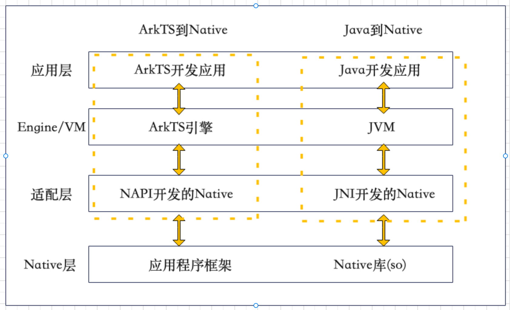
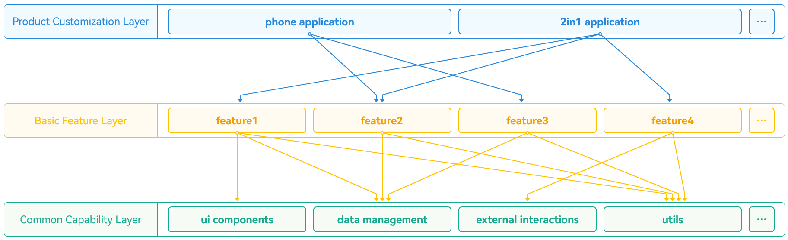
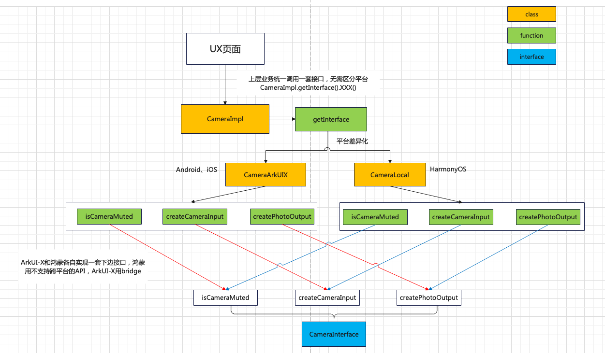

# 跨平台Bridge最佳实践

### bridge核心架构思想

&emsp;&emsp;平台桥接机制是ArkUI-X框架提供的⼀种ArkTs语⾔和平台原⽣语⾔（Java、OC）之间通信的机制，⽅便⼆者互相调⽤。需要说明的是，平台桥接机制必须在**打开ArkUI界⾯时才能进⾏，不能在⾮ArkUI界⾯触发**。平台桥接机制有两种应⽤场景：<br>
&emsp;&emsp;1）**ArkUI界⾯需要和原⽣应⽤底座进⾏业务层⾯通信**，⽐如应用中，需要借助宿主通道获取设备状态信息、下发控制命令等；<br>
&emsp;&emsp;2）**跨平台代码中⽤到了不⽀持跨平台的API**，此时⼜想跨平台可以利⽤此机制将不⽀持跨平台的API中转到原⽣实现。包括部分开源API以及全部的闭源API，当前对应API尚不⽀持跨平台，可以基于原⽣平台语⾔封装业务接⼝，通过平台桥接机制供跨平台界⾯调⽤。<br>

<div align=center>
	
</div>
<div align=center style="font-size:12px">bridge数据流架构图（Android<->ArkTS）</div>

### bridge支持的能力现状

#### **能力一：支持多种桥接模式**

&emsp;&emsp;指定桥接模式的时机是在创建平台桥接示例时，创建时的条件：需指定名称，该名称ArkTS侧与平台侧保持一致，为了满足应用不同业务场景的bridge诉求，bridge支持设置不同的桥接模式来进行两端通信（**默认为JSON编解码模式**）：

&emsp;**模式一：JSON编解码模式**

&emsp;&emsp;- **用户场景：** JSON模式可以满足用户大多数场景使用，支持基础数据类型、数组类型和结构化数据传递<br>

&emsp;**模式二：二进制编解码模式**

&emsp;&emsp;- **用户场景：** 二进制模式相比JSON模式其他能力不变，新增加Buffer数据格式，支持传输如图片等数据量大的场景<br>

&emsp;**模式三：线程并发模式**

&emsp;&emsp;- **用户场景：** 应用Bridge场景如果希望不阻塞主UI线程场景下使用线程并发模式<br>
&emsp;&emsp;- **优势：** 用户调度bridge都在Platform线程，然后由Platform线程切换到JS线程，数据编解码都会阻塞主UI线程，为了不阻塞主UI线程，将耗时处理放到后台异步线程中处理， 让Bridge调用者可连续发送数据<br>
&emsp;&emsp;- **创建方式：** 线程并发模式目前只能在原生平台侧创建平台桥接实例时指定<br>&emsp;&emsp;- **版本优化：** ArkUI-X SDK 版本大于**6.0.2.118**时，Bridge已经默认为多线程模式，无需额外设置<br>

#### **能力二：支持原生平台和ArkTS侧数据互相传递**

- **发送数据，** 接口参考: [sendMessage（ArkTS）](https://gitcode.com/arkui-x/docs/blob/master/zh-cn/application-dev/reference/apis/js-apis-bridge.md#sendmessage)（**支持直接传递callback**）， [sendMessage（Android）](https://gitcode.com/arkui-x/docs/blob/master/zh-cn/application-dev/reference/arkui-for-android/BridgePlugin.md#sendmessage)，[ sendMessage（iOS）](https://gitcode.com/arkui-x/docs/blob/master/zh-cn/application-dev/reference/arkui-for-ios/BridgePlugin.md#sendmessage)
- **接收数据，** 接口参考: [setMessageListener（ArkTS）](https://gitcode.com/arkui-x/docs/blob/master/zh-cn/application-dev/reference/apis/js-apis-bridge.md#setmessagelistener)（**接收原生平台sendMessage发送的数据**）， [setMessageListener（Android）](https://gitcode.com/arkui-x/docs/blob/master/zh-cn/application-dev/reference/arkui-for-android/BridgePlugin.md#setmessagelistener)，[ messageListener（iOS）](https://gitcode.com/arkui-x/docs/blob/master/zh-cn/application-dev/reference/arkui-for-ios/BridgePlugin.md#messagelistener) （**onMessage-&gt;接收ArkTS侧sendMessage发送的消息、onMessageResponse-&gt;原生平台sendmessage后接收ArkTS侧的响应**）
- **数据类型支持，** 参考：[数据类型支持](https://gitcode.com/arkui-x/docs/blob/master/zh-cn/application-dev/quick-start/platform-bridge-introduction.md#%E6%95%B0%E6%8D%AE%E7%B1%BB%E5%9E%8B%E6%94%AF%E6%8C%81)

#### **能力三：支持原生平台和ArkTS侧方法互相调用**

- **定义被调用方法，** Android侧定义被调用方法时需将访问修饰符定义为public
- **方法注册，** ArkTS侧需要通过方法[registerMethod](https://gitcode.com/arkui-x/docs/blob/master/zh-cn/application-dev/reference/apis/js-apis-bridge.md#registermethod)定义被原生平台侧调用的方法，原生平台侧供ArkTS侧调用的方法无需注册
- **方法移除和监听，** ArkTS侧可以通过方法[unregisterMethod](https://gitcode.com/arkui-x/docs/blob/master/zh-cn/application-dev/reference/apis/js-apis-bridge.md#unregistermethod)来移除已注册的ArkTS端的方法，原生平台侧通过实现[IMethodResult](https://gitcode.com/arkui-x/docs/blob/master/zh-cn/application-dev/reference/arkui-for-android/BridgePlugin.md#imethodresult%E6%8E%A5%E5%8F%A3)接口，基于其中的[onMethodCancel](https://gitcode.com/arkui-x/docs/blob/master/zh-cn/application-dev/reference/arkui-for-android/BridgePlugin.md#onmethodcancel)方法来监听ArkTS侧的事件注销通知
- **方法调用，** 参考: [callMethod（ArkTS）](https://gitcode.com/arkui-x/docs/blob/master/zh-cn/application-dev/reference/apis/js-apis-bridge.md#callmethod)，[callMethodWithCallback（ArkTS）](https://gitcode.com/arkui-x/docs/blob/master/zh-cn/application-dev/reference/apis/js-apis-bridge.md#callmethodwithcallback)， [callMethod（Android）](https://gitcode.com/arkui-x/docs/blob/master/zh-cn/application-dev/reference/arkui-for-android/BridgePlugin.md#callmethod)，[ callMethod（iOS）](https://gitcode.com/arkui-x/docs/blob/master/zh-cn/application-dev/reference/arkui-for-ios/BridgePlugin.md#callmethod)（**均支持带参数调用和无参数调用**）

#### **能力四：支持应用全局创建、调用**

为清晰界定Bridge的能力边界，以**ArkUI-X SDK版本6.0.2.118**为分界，将Bridge分为**旧版**（＜6.0.2.118）与**新版**（≥6.0.2.118）。核心差异在于：**仅新版Bridge支持全局调用**，彻底解决了旧版与原生组件的强绑定问题。<br>

- 背景：复杂App的组件化架构<br>

在大型App中，通常包含大量UIAbility（ArkTS），且每个UIAbility在原生侧（Android/iOS）均有对应载体，Android为**Activity**，iOS为**ViewController**。这种多组件架构对Bridge的跨组件复用能力提出了挑战。<br>

- **旧版Bridge（＜6.0.2.118）：强绑定原生组件，仅限局部使用**<br>
  - **核心规则**：Bridge实例与原生组件（Activity/ViewController）**强绑定**，其生命周期完全依赖于创建它的组件。<br>
  - **使用限制**：<br>
    - 仅能在**当前组件内**调用（如Activity A中创建的Bridge，无法在Activity A的其他方法外使用）。<br>
    - 当页面跳转至**新组件**（如从Activity A跳转到Activity B）时，原Bridge实例自动失效，需在新组件中重新创建Bridge才能继续使用。<br>
  - **举例**：若App从“首页UIAbility”（对应Activity A）跳转至“详情页UIAbility”（对应Activity B），Activity A中创建的Bridge在Activity B中无法调用，必须在Activity B中重新初始化Bridge。<br>

- **新版Bridge（≥6.0.2.118）：解除强绑定，支持全局调用**<br>

  - **核心改进**：通过**解耦Bridge与原生组件**，实现Bridge实例的全局共享。<br>
  - **使用优势**：<br>
    - 可在**任意原生组件**（如Activity A）中创建Bridge，创建后全局有效。<br>
    - 即使跳转至新组件（如Activity B），也**无需重新创建**，可直接复用已创建的Bridge实例。<br>
  - **举例**：同上场景，Activity A中创建的Bridge在跳转至Activity B后，Activity B中可直接调用该Bridge，无需重复初始化，大幅减少冗余代码。<br>

- **单例模式思想管理Bridge**<br>

  新版Bridge通过**延长生命周期至应用全局**，解决了旧版”随原生组件（Activity/ViewController）销毁而失效“的问题。为统一管理App中多个Bridge实例（如不同业务模块的桥接对象），建议采用**单例模式设计思想**：通过一个全局唯一的“容器”集中管理Bridge的创建、存储与访问，避免重复创建等问题。<br>

  以下以**Android侧**为例阐述设计细节（ArkTS侧与iOS侧思想完全一致，仅开发语言不同）<br>

  - **class BridgeUtil**，实现Bridge的核心业务逻辑，包括监听回调的实现、Android侧方法的实现等。作为“功能单元”，自身不管理生命周期，专注于业务逻辑实现（由容器类统一管控）。<br>

    ```java
    package com.example.bridge;
    
    import android.util.Log;
    import ohos.ace.adapter.capability.bridge.BridgePlugin;
    import ohos.ace.adapter.capability.bridge.IMessageListener;
    import ohos.ace.adapter.capability.bridge.IMethodResult;
    
    /**
     * BridgeUtil：实现Bridge的核心功能，包括监听回调实现、Android侧方法实现等
     */
    public class BridgeUtil extends BridgePlugin implements IMessageListener, IMethodResult {
        private static final String TAG = "LOG";
    
        private static final String LOG_TAG = "[JAVA][BridgeUtil]:: ";
    
        public BridgeUtil(String bridgeName, BridgeType bridgeType) {
            super(bridgeName, bridgeType);
            setMessageListener(this);
            setMethodResultListener(this);
        }
    
        // 监听 IMessageListener
        @Override
        public Object onMessage(Object data) {
            return "IMessageListener onMessage called";
        }
    
        @Override
        public void onMessageResponse(Object data) {
            Log.i(TAG, LOG_TAG + "IMessageListener onMessageResponse called");
        }
    
        // 监听 IMethodResult
        @Override
        public void onSuccess(Object resultValue) {
            Log.i(TAG, LOG_TAG + "IMethodResult onSuccess called");
        }
    
        @Override
        public void onError(String methodName, int errorCode, String errorMessage) {
            Log.i(TAG, LOG_TAG + "IMethodResult onError called; data is " + "{ methodName: " + methodName + "; errorCode:" +
                    " " + errorCode + "; " + "errorMessage: " + errorMessage + " }");
        }
    
        @Override
        public void onMethodCancel(String methodName) {
            Log.i(TAG, LOG_TAG + "IMethodResult onMethodCancel called; methodName is " + methodName);
        }
    
        // 方法定义 ArkTS侧通过callMethod可以调用的方法
        public String getString() {
            Log.i(TAG, LOG_TAG + "Function getString called success");
            return "";
        }
    }
    ```

  - **class BridgeObjectContainer**，单例容器类。作为**单例模式的具体实现**，承担App中所有BridgeUtil的管理，是外部访问BridgeUtil的唯一入口。解耦“功能实现”与“实例管理”，外部无需关心BridgeUtil的创建细节，仅需通过容器获取实例即可<br>

    - **单例保障**：通过私有构造、静态实例、全局`getInstance()`方法，确保容器中仅存在一个实例。<br>
    - **实例管理**：维护一个`ConcurrentHashMap<String, BridgeUtil>`（键为Bridge name，值为BridgeUtil实例），当已存在实例时可直接获取，避免重复创建。<br>

    ```java
    package com.example.bridge;
    
    import android.util.Log;
    import java.util.concurrent.ConcurrentHashMap;
    import ohos.ace.adapter.capability.bridge.BridgePlugin;
    
    /**
     * BridgeObjectContainer Bridge对象管理类，用于管理多个 BridgeUtil 实例。
     * 每个 BridgeUtil 实例通过一个唯一的 name（String）和BridgeType来标识。
     * 对外提供 get(String name, BridgePlugin.BridgeType bridgeType) 方法，用于获取对应的 BridgeUtil 对象。
     */
    public class BridgeObjectContainer {
        private static final String TAG = "LOG";
    
        private static final String LOG_TAG = "[JAVA][BridgeObjectContainer]:: ";
    
        private static final BridgeObjectContainer INSTANCE = new BridgeObjectContainer();
    
        private final ConcurrentHashMap<String, BridgeUtil> bridgeMap;
    
        private BridgeObjectContainer() {
            bridgeMap = new ConcurrentHashMap<>();
        }
    
        public static BridgeObjectContainer getInstance() {
            return INSTANCE;
        }
    
        public BridgeUtil get(String name, BridgePlugin.BridgeType bridgeType) {
            // 开发者可根据实际需要修改逻辑，这里仅作参考
            if (name == null || bridgeType == null) {
                Log.e(TAG, LOG_TAG + "Invalid argument");
                return null;
            }
    
            BridgeUtil existingBridge = bridgeMap.get(name);
            if (existingBridge == null) {
                BridgeUtil newBridge = new BridgeUtil(name, bridgeType);
                bridgeMap.put(name, newBridge);
                return newBridge;
            } else {
                if (existingBridge.getBridgeType() == bridgeType) {
                    return existingBridge;
                } else {
                    Log.e(TAG, LOG_TAG + "Bridge bridgeType incompatible");
                    return null;
                }
            }
        }
    }
    ```

  - **外部使用方式**，开发者通过`BridgeObjectContainer`的单例实例访问BridgeUtil，流程如下：<br>

    1. **获取容器实例**：调用`BridgeObjectContainer.getInstance()`（全局唯一入口）<br>
    2. **获取BridgeUtil**：通过容器的`get(String name, BridgePlugin.BridgeType bridgeType)`方法获取BridgeUtil对象<br>
    3. **使用Bridge功能**：直接调用BridgeUtil的方法（如`callMethod()`）<br>

    ```java
    package com.example.bridge;
    
    import android.os.Bundle;
    import ohos.ace.adapter.capability.bridge.BridgePlugin;
    import ohos.stage.ability.adapter.StageActivity;
    
    public class EntryEntryAbilityActivity extends StageActivity {
        @Override
        protected void onCreate(Bundle savedInstanceState) {
            setInstanceName("com.example.bridge:entry:EntryAbility:");
            super.onCreate(savedInstanceState);
            // 外部使用时，通过BridgeObjectContainer获取BridgeUtil，即可使用Bridge的sendMessage发送消息
            BridgeObjectContainer.getInstance().get("BasicBridge", BridgePlugin.BridgeType.JSON_TYPE).sendMessage("Message");
        }
    }
    ```

### bridge如何做到"一码三平台"

&emsp;&emsp;前面讲到的bridge主要是解决开发者在进行ArkTS代码开发时，需要使用的鸿蒙API不支持跨平台的问题，在Android和iOS平台上，可以借助bridge调用原生能力来完成任务。同时，对于任何跨平台框架的开发者而言，最终的目的肯定是写一套代码，能够同时运行到三个平台上，即“一码三平台”的思想，所以，如何让开发者使用Bridge适配时，修改最少量的原有架构和逻辑代码是Bridge最佳实践中需要讨论的一个重点。

&emsp;&emsp;接下来我们以调用相机管理的能力（**该能力提供的api当前不支持跨平台**），来介绍跨平台的Bridge实现“一码三平台”的推荐写法

<div align=center>
	
</div>
<div align=center style="font-size:12px">鸿蒙应用工程三层架构图</div>

&emsp;&emsp;如上图所示，HarmonyOS应用的分层架构主要包括三个层次：产品定制层、基础特性层和公共能力层，具体参考[分层架构设计](https://developer.huawei.com/consumer/cn/doc/best-practices-V5/bpta-layered-architecture-design-V5)，基础特性层包含的主要是应用中的页面UI逻辑以及其中包含的核心功能逻辑。

&emsp;&emsp;这里我们的核心思想便是，上层业务统一调用CameraImpl的一套接口，无需区分平台，CameraImpl中实现平台差异化，即鸿蒙平台getInterface返回的是CameraLocal类，安卓和iOS平台返回的是CameraArkUIX类，下层CameraInterface包含camera能力暴露出去的所有接口，CameraLocal和CameraArkUIX差异化实现了CameraInterface中的所有接口，即CameraArkUIX借助bridge调用原生能力，CameraLocal直接调用鸿蒙API完成鸿蒙应用的能力实现。

<div align=center>
	
</div>
<div align=center style="font-size:12px">Camera API的bridge改造接口类图</div>

&emsp;&emsp;上层业务，feature1的页面中有一个按钮，用来查询当前相机是否被禁用，其中“media”需要在feature1模块的oh-package.json5文件中进行依赖配置：

```shell
// feature1/src/main/ets/pages/Index.ets
import { CameraImpl, CameraInterface } from "media";

@Entry
@Component
struct Index {
  build() {
    Row() {
      Column() {
        Button('相机状态查询')
          .width(300)
          .margin({top: 30})
          .onClick(() => {
            CameraImpl.getInterface().isCameraMuted();
          })
	   }
     }
  }
}
```

&emsp;&emsp;改造时，该UI业务逻辑部分保持不变，依赖的相机管理能力统一位于commons层，commons层文件夹下有一个module包含媒体能力，暂且称为media，其中可能包含video、audio和camera等能力。

&emsp;&emsp;首先先介绍改造后media中涉及camera能力的目录结构：

```shell
├── commons
│   ├── media										// commons层级功能模块 media
│   │   ├── src\main\ets
│   │   │   ├── camera
│   │   │   │   ├── interface							// interface 文件目录
|   |   |   |   |   └── CameraInterface.ets			    // Camera 模块功能接口定义
|   |   |   |   └── impl								// class 文件目录
|   |   |   |       ├── Camera.ets					    // Camera
|   |   |   |       ├── CameraArkUIX.ets				// ArkUIX实现
|   |   |   |       └── CameraLocal.ets				    // HarmonyOS实现
|   |   |   └── 功能...
│   │   ├── Index.ets
│   │   └── oh-package.json5
│   └── 其他模块...
```

```shell
// commons/media/src/main/ets/camera/interface/CameraInterface.ets
export interface CameraInterface {
  isCameraMuted(): void;
}
```

&emsp;&emsp;这里的‘@ohos.bridge’、'utils'分别来自于下文中host_bridge、utils模块，需要在media模块的oh-package.json5文件中进行依赖配置。

```shell
// commons/media/src/main/ets/camera/impl/CameraArkUIX.ets
import { CameraInterface } from '../interface/CameraInterface';
import bridge from '@arkui-x.bridge';
import { bridgeApi } from '@ohos.bridge';

export class CameraArkUIX implements CameraInterface {
  private static instance: CameraArkUIX;

  public static getInstance(): CameraArkUIX {
    if (!CameraArkUIX.instance) {
      CameraArkUIX.instance = new CameraArkUIX();
    }
    return CameraArkUIX.instance;
  }

  public isCameraMuted(): boolean {
    console.log("getInteractive enter arkuix");
    return bridgeApi.getBridge().isCameraMuted();
  }
}
```

```shell
// commons/media/src/main/ets/camera/impl/CameraLocal.ets
import camera from '@ohos.multimedia.camera';
import { CameraInterface } from '../interface/CameraInterface';

export class CameraLocal implements CameraInterface {
  private static instance: CameraLocal;

  public static getInstance(): CameraLocal {
    if (!CameraLocal.instance) {
      CameraLocal.instance = new CameraLocal();
    }
    return CameraLocal.instance;
  }

  public isCameraMuted(): boolean {
    let cameraManager = camera.getCameraManager(getContext());
    let isMuted: boolean = cameraManager.isCameraMuted();
    return isMuted;
  }
}
```

```shell
// commons/media/src/main/ets/camera/impl/Camera.ets
import { CameraArkUIX } from './CameraArkUIX';
import { CameraLocal } from './CameraLocal';
import { CameraInterface } from './interface/CameraInterface';
import { PlatformInfo, PlatformTypeEnum } from 'utils';

export class CameraImpl {
  public static getInterface(): CameraInterface {
    let platform: PlatformTypeEnum = PlatformInfo.getPlatform();
    if (platform == PlatformTypeEnum.ANDROID || platform == PlatformTypeEnum.IOS) {
      return CameraArkUIX.getInstance();
    } else {
      return CameraLocal.getInstance();
    }
  }
}
```

&emsp;&emsp;此外，需要新建host_bridge模块，用来管理bridge的相关实现方法，具体目录结构及实现如下：

```shell
├── commons
│   ├── host_bridge								   // 定义bridge的一些公共方法模块
│   │   ├── src\main\ets
│   │   │   ├── interface								// 可以定义Callback、Response等文件接口
|   |   |   └── BridgeApi.ets							// 对外暴露的bridge实现类，在应用生命周期初始化创建
│   │   ├── Index.ets								// 对外导出组件实例文件
│   │   └── oh-package.json5						// host_bridge 依赖项配置文件
│   └── 其他模块...
```

```shell
// commons/host_bridge/src/main/ets/BridgeApi.ets
import bridge from '@arkui-x.bridge';
import { PlatformInfo, PlatformTypeEnum } from 'utils';

export class bridgeApi {
  private static bridgeImpl: bridge.BridgeObject;

  constructor() {
    let platform: PlatformTypeEnum = PlatformInfo.getPlatform();
    if (platform == PlatformTypeEnum.ANDROID || platform == PlatformTypeEnum.IOS) {
      bridgeApi.bridgeImpl = bridge.createBridge('arkuixbridge');
    }
  }

  static getBridge(): bridge.BridgeObject | null {
    return bridgeApi.bridgeImpl? bridgeApi.bridgeImpl:null;
  }
}
```

&emsp;&emsp;这里需要注意的是，bridgeApi的构造函数中创建了名为arkuixbridge的bridge实例对象，用来和安卓或者iOS原生侧进行通信，那么在什么时机去构建bridgeApi的实例对象呢，这里推荐在跨平台入口Ability的onCreate生命周期中初始化，例如：

```shell
// feature1/src/main/ets/entryability/EntryAbility.ets
import { bridgeApi } from '@ohos.bridge';

export default class EntryAbility extends UIAbility {
  onCreate(want: Want, launchParam: AbilityConstant.LaunchParam): void {
    let bridgeImpl: bridgeApi = new bridgeApi();
    hilog.info(DOMAIN, 'testTag', '%{public}s', 'Ability onCreate');
  }
  ...
}
```

&emsp;&emsp;common层中的很多能力都依赖平台差异化，所以utils中新建一个PlatformInfo.ets用来提供接口类及平台枚举，具体的目录结构及实现如下：

```shell
├── commons
│   ├── utils										// commons层级功能模块 utils 通用方法
│   │   ├── src\main\ets
│   │   │   ├── common								// 常量、数据结构等定义文件目录
|   |   |   └── utils								// class 文件目录
|   |   |        └── PlatformInfo.ets				  // 区分当前设备平台
│   │   ├── Index.ets								// utils 对外暴露接口导出文件
│   │   └── oh-package.json5						// utils 依赖项配置文件
│   └── 其他模块...
```

```shell
// commons/utils/src/main/ets/utils/PlatformInfo.ets
import deviceInfo from '@ohos.deviceInfo';

export enum PlatformTypeEnum {
  HARMONYOS = 'HarmonyOS Platform',
  ANDROID = 'Android Platform',
  IOS = 'iOS Platform',
  UNKNOWN = 'Unknown Platform',
}

export class PlatformInfo {
  static getPlatform(): PlatformTypeEnum {
    let osFullNameInfo: string = deviceInfo.osFullName;
    let platformName: string = osFullNameInfo.split(' ')[0];
    if (platformName.includes("OpenHarmony")) {
      return PlatformTypeEnum.HARMONYOS;
    } else if (platformName.includes("Android")) {
      return PlatformTypeEnum.ANDROID;
    } else if (platformName.includes('iOS')) {
      return PlatformTypeEnum.IOS;
    } else {
      return PlatformTypeEnum.UNKNOWN;
    }
  }
}
```

### FAQ

**Q1：**

&emsp;&emsp;上面讲到的都是开源API不支持跨平台时的处理策略，对于均不支持跨平台的HMS API，直接基于上述写法运行起来会直接crash，以活体检测API [interactiveLiveness](https://developer.huawei.com/consumer/cn/doc/harmonyos-references/vision-interactive-liveness)为例，运行态会报如下截图错误，该如何解决？

<div align=center>
	
</div>
<div align=center style="font-size:12px">HMS API跨平台改造报错截图</div>

**A1：**

&emsp;&emsp;1、**原因分析：** 如果应用工程中import了HMS API并涉及到具体调用，当应用运行起来后还未执行到具体业务逻辑时，方舟虚拟机就会首先遍历寻找实现这些HMS API的hsp，对于鸿蒙应用而言，这些hsp包预置到鸿蒙手机系统，因而可以成功获取，但是安卓和iOS原生平台未集成这些闭源hsp，所以会因找不到hsp直接crash。（**注：若import了HMS API，但是只存在对象声明，不调用API的情况不会初始化寻找对应hsp**）。

&emsp;&emsp;2、**解决方案：** 仍可以基于上面“一码三平台”的架构，只不过需要在commons层使用HMS API的地方引入[动态import](https://developer.huawei.com/consumer/cn/doc/harmonyos-guides/arkts-dynamic-import)的处理策略，以活体检测API为例，具体实现参考如下：

```shell
// commons/recognize/src/main/ets/Interactive/Interactive.ets
import { PlatformInfo, PlatformTypeEnum } from 'utils';
import { InteractiveInterface } from './interface/interactiveInterface';
import { InteractiveArkUIX } from './impl/interactiveArkUIX';

export class Interactive {
  public static getInterface(): InteractiveInterface {
    let platform: PlatformTypeEnum = PlatformInfo.getPlatform();
    if (platform == PlatformTypeEnum.ANDROID || platform == PlatformTypeEnum.IOS) {
      return InteractiveArkUIX.getInstance();
    } else {
	  return InteractiveLocal.getInstance();
  }
}
```

&emsp;&emsp;这里不再赘述InteractiveArkUIX的实现，和上文CameraArkUIX思想一致，直接看InteractiveLocal的实现，最重要的便是在使用startLivenessDetection该API之前，需要重新动态import一次具体的系统接口文件，但正如上述所说，函数入口处的isSilentMode、actionsNum和routerOptions只是使用API中的数据类型声明定义变量，这些仍可以直接使用文件入口处import的interactiveLiveness能力而不会带来问题：

```shell
// commons/recognize/src/main/ets/Interactive//impl/InteractiveLocal.ets
import { InteractiveInterface } from '../interface/interactiveInterface';
import { BusinessError } from '@kit.BasicServicesKit';
import { hilog } from '@kit.PerformanceAnalysisKit';
import interactiveLiveness from '@hms.ai.interactiveLiveness'

export class InteractiveLocal implements InteractiveInterface {
  public startInteractive(): void {
    let isSilentMode = "INTERACTIVE_MODE" as interactiveLiveness.DetectionMode;
    let actionsNum = 3 as interactiveLiveness.ActionsNumber;
    let routerOptions: interactiveLiveness.InteractiveLivenessConfig = {
      actionsNum: actionsNum,
      isSilentMode: isSilentMode
    };
    import('@hms.ai.interactiveLiveness').then((ns) => {
      try {
        ns.default.startLivenessDetection(routerOptions).then((DetectState: boolean) => {
          hilog.info(0x0001, "LivenessCollectionIndex", `Succeeded in jumping.`);
        }).catch((err: BusinessError) => {
          hilog.error(0x0001, "LivenessCollectionIndex", `Failed to jump. Code：${err.code}，message：${err.message}`);
        })
      } catch (err) {
        err = err as BusinessError;
        console.error(`startLivenessDetection failed. Code: ${err.code}, message: ${err.message}`);
      }
      return;
    })
  }
}
```

&emsp;&emsp;3、**更优化的解决方案：** 上述写法虽然可以解决crash的问题，但是不可避免地会在一个ets文件中的不同函数中反复多次进行动态**import API**，影响开发效率和代码整齐程度，所以可以考虑在Interactive类的平台差异化处，直接进行动态**import ets文件**的处理，处理完成后，文件内使用HMS API的地方无需再增加动态import API的侵入修改。

```shell
// commons/recognize/src/main/ets/Interactive/Interactive.ets
import { PlatformInfo, PlatformTypeEnum } from 'utils';
import { InteractiveInterface } from './interface/interactiveInterface';
import { InteractiveArkUIX } from './impl/interactiveArkUIX';

export class Interactive {
  public static async getInterface(): Promise<InteractiveInterface|null> {
    let temp: InteractiveInterface | null = null;
    let platform: PlatformTypeEnum = PlatformInfo.getPlatform();
    if (platform == PlatformTypeEnum.ANDROID || platform == PlatformTypeEnum.IOS) {
      temp = InteractiveArkUIX.getInstance();
    } else {
      await import('./impl/interactiveLocal').then((ns) => {
        temp = new ns.InteractiveLocal();
      })
    }
    return temp;
  }
}
```
