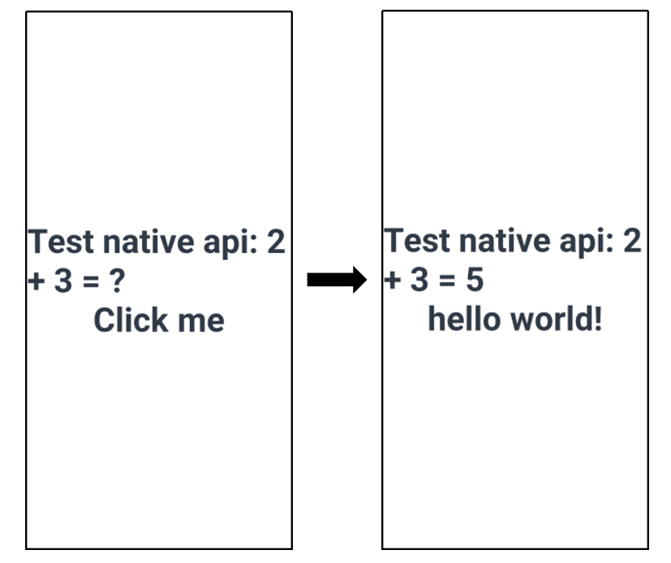

# N-API在Android平台应用的使用指导

N-API接口可以实现ArkTS/TS/JS与C/C++(Native)之间的交互，ArkUI-X中支持的N-API接口情况和使用场景请见[FFI能力(N-API)](../quick-start/ffi-napi-introduction.md)。本文档以[ArkUI-X/Samples](https://gitcode.com/arkui-x/samples)中的Native样例工程为例，介绍如何在Android平台上使用N-API能力完成跨语言调用。

## 开发流程

使用N-API完成跨语言调用的整体开发流程分为以下五步，即
1. 环境准备：获取Native工程。
2. 提供Native能力：使用N-API接口提供Native能力，同时，Native接口中还可调用ArkTS/TS/JS传入的方法。
3. 定义接口声明：添加Native侧暴露给ArkTS侧接口的声明。
4. 调用Native能力：ArkTS/TS/JS侧使用Native能力。
5. 编译与运行应用：编出应用，并在android平台上运行，观察效果。

这里通过修改样例工程，提供两个例子来介绍N-API的典型使用场景：
1. 提供一个名为`Add`的Native方法，ArkTS侧调用该方法并传入两个number，Native方法将这两个number相加并返回到ArkTS侧。以此介绍：ArkTS侧如何调用到Native侧方法。
2. 提供一个名为`NativeCallArkTS`的Native方法，ArkTS侧调用该方法并传入一个ArkTS function，Native方法中调用这个ArkTS function，并将其结果返回ArkTS侧。以此介绍：Native侧如何调用到ArkTS侧方法。

### 1. 环境准备 
从[ArkUI-X/Samples](https://gitcode.com/arkui-x/samples)中获取Native样例工程，并使用DevEco Studio(V4.0 Beta2及以上版本)打开该工程，打开后将自动进行工程初始化。

### 2. 提供Native能力

利用N-API接口，进行Native能力开发。同时，本样例中的`NativeCallArkTS`也完成了Native侧调ArkTS侧的演示。
```C++
// entry\src\main\cpp\hello.cpp，包含Native侧逻辑。
// 引入N-API相关头文件。
#include "napi/native_api.h"

// 开发者提供的Native方法，入参有且仅有如下两个，开发者不需进行变更。
// napi_env 为当前运行的上下文。
// napi_callback_info 记录了一些信息，包括从ArkTS侧传递过来参数等。
static napi_value Add(napi_env env, napi_callback_info info)
{
    // 期望从ArkTS侧获取的参数的数量，napi_value可理解为ArkTS value在Native方法中的表现形式。
    size_t argc = 2;
    napi_value args[2] = {nullptr};
    
    // 从info中，拿到从ArkTS侧传递过来的参数，此处获取了两个ArkTS参数，即arg[0]和arg[1]。
    napi_get_cb_info(env, info, &argc, args , nullptr, nullptr);

    // 获取arg[0]的类型
    napi_valuetype valuetype0 = napi_undefined;
    napi_typeof(env, args[0], &valuetype0);

    // 获取arg[1]的类型
    napi_valuetype valuetype1 = napi_undefined;
    napi_typeof(env, args[1], &valuetype1);

    // 校验入参类型，若不是number，则返回undefined
    if ((valuetype0 != napi_number) || (valuetype1 != napi_number)) {
        napi_value undefined = nullptr;
        napi_get_undefined(env, &undefined);
        return undefined;
    }

    // 将获取的ArkTS参数转换为Native信息，此处ArkTS侧传入了两个number，这里将其转换为Native侧可以操作的double类型。
    double value0;
    napi_get_value_double(env, args[0], &value0);

    double value1;
    napi_get_value_double(env, args[1], &value1);
    
    // Native侧的业务逻辑，这里简单以两数相加为例。
    double nativeSum = value0 + value1;
    
    // 此处将Native侧业务逻辑处理结果转换为ArkTS值，并返回给ArkTS。
    napi_value sum = nullptr;
    napi_create_double(env, nativeSum , &sum);
    return sum;
}

static napi_value NativeCallArkTS(napi_env env, napi_callback_info info)
{
    // 期望从ArkTS侧获取的参数的数量，napi_value可理解为ArkTS value在Native方法中的表现形式。
    size_t argc = 1;
    napi_value args[1] = {nullptr};
    
    // 从info中，拿到从ArkTS侧传递过来的参数，此处获取了一个ArkTS参数，即arg[0]。
    napi_get_cb_info(env, info, &argc, args , nullptr, nullptr);

    // 获取arg[0]的类型
    napi_valuetype valuetype = napi_undefined;
    napi_typeof(env, args[0], &valuetype);

    // 校验入参类型
    if (valuetype != napi_function) {
        napi_value undefined = nullptr;
        napi_get_undefined(env, &undefined);
        return undefined;
    }
    
    // 创建一个ArkTS string作为ArkTS function的入参。
    napi_value argv = nullptr;
    // 创建一个js string
    napi_create_string_utf8(env, "hello", NAPI_AUTO_LENGTH, &argv);
    
    napi_value result = nullptr;
    // Native方法中调用ArkTS function，其返回值保存到result中并返到ArkTS侧。
    napi_call_function(env, nullptr, args[0], 1, &argv, &result);
    
    return result;
}

EXTERN_C_START
// Init将在exports上挂上Add/NativeCallArkTS这些Native方法，此处的exports就是开发者import之后获取到的ArkTS对象。
static napi_value Init(napi_env env, napi_value exports)
{
    // 函数描述结构体，以Add为例，第三个参数"Add"为上述的Native方法，
    // 第一个参数"add"为ArkTS侧对应方法的名称。
    napi_property_descriptor desc[] = {
        { "add", nullptr, Add, nullptr, nullptr, nullptr, napi_default, nullptr },
        { "nativeCallArkTS", nullptr, NativeCallArkTS, nullptr, nullptr, nullptr, napi_default, nullptr },
    };
    // 在exports这个ArkTS对象上，挂载Native方法。
    napi_define_properties(env, exports, sizeof(desc) / sizeof(desc[0]), desc);
    return exports;
}
EXTERN_C_END

// 准备模块加载相关信息，将上述Init函数与本模块名等信息记录下来。
static napi_module demoModule = {
    .nm_version =1,
    .nm_flags = 0,
    .nm_filename = nullptr,
    .nm_register_func = Init,
    .nm_modname = "entry",
    .nm_priv = ((void*)0),
    .reserved = { 0 },
};

// 打开so时，该函数将自动被调用，使用上述demoModule模块信息，进行模块注册相关动作。
extern "C" __attribute__((constructor)) void RegisterHelloModule(void)
{
    napi_module_register(&demoModule);
}
```
### 3. 定义接口声明
在`d.ts`文件中添加暴露接口声明
```js
// entry\src\main\cpp\types\libentry\index.d.ts，包含Native侧暴露给ArkTS侧接口的声明。
// Native侧暴露给ArkTS侧接口的声明。
export const add: (a: number, b: number) => number;
export const nativeCallArkTS: (a: object) => string;
``` 

### 4. 调用Native能力
在ArkTS/TS/JS侧使用Native能力。
1. `entry.add`接口完成了`ArkTS -> Native`的调用。
2. `entry.nativeCallArkTS`接口完成了`ArkTS -> Native -> ArkTS`的调用。
```js
// entry\src\main\ets\pages\Index.ets，包含ArkTS侧逻辑。
// 通过import的方式，引入Native能力。
import entry from 'libentry.so'

function TestFunction(str) {
  let ret = str + ' world!'
  return ret;
}

@Entry
@Component
struct Index {
  @State message: string = 'Test native api: 2 + 3 = ?'
  @State message2: string = 'Click me'

  build() {
    Row() {
      Column() {
        // 第一个按钮，调用add方法，对应到Native侧的Add方法，进行两数相加。
        Text(this.message)
          .fontSize(50)
          .fontWeight(FontWeight.Bold)
          .onClick(() => {
            this.message = "Test native api: 2 + 3 = " + entry.add(2, 3);
            console.log("Test NAPI 2 + 3 = " + entry.add(2, 3));
          })
        // 第二个按钮，调用nativeCallArkTS方法，对应到Native的NativeCallArkTS，在Native中执行ArkTS function。
        Text(this.message2)
          .fontSize(50)
          .fontWeight(FontWeight.Bold)
          .onClick(() => {
            this.message2 = entry.nativeCallArkTS(TestFunction);
          })
      }
      .width('100%')
    }
    .height('100%')
  }
}
```

### 5. 编译与运行应用
点击DevEco Studio(V4.0 Beta2及以上版本)中的"Build > Build Hap(s)/APP(s) > Build APP(s)"进行编译，并利用Android Studio打开Native工程的".arkui-x\android"文件夹，点击"Run app"按钮后运行应用。应用运行后，点击页面上的两个文本，文本做出相应变换。


## 开发建议

### 注册建议

* nm_register_func对应的函数（如上述Init函数）需要加上static，防止与其他so里的符号冲突。
* 模块注册的入口，即使用\_\_attribute\_\_((constructor))修饰的函数的函数名（如上述RegisterHelloModule函数）需要确保不与其他模块重复。

### so命名规则

**so命名必须符合以下规则：**

* 每个模块对应一个so。
* 如模块名为`entry`，则so的名字为`libentry.so`，`napi_module`中`nm_modname`字段应为`entry`，大小写与模块名保持一致，应用使用时写作：`import entry from 'libentry.so'`。

### JS对象线程限制

ArkCompiler会对JS对象线程进行保护，使用不当会引起应用crash，因此需要遵循如下原则：

* N-API接口只能在JS线程使用。
* Native接口入参的env与线程绑定，不能跨线程使用。Native侧JS对象只能在创建时的线程使用，即与线程所持有的env绑定。

### 头文件引入限制

在引入头文件时，需引入"napi/native_api.h"，否则会出现N-API接口无法找到的编译报错。
