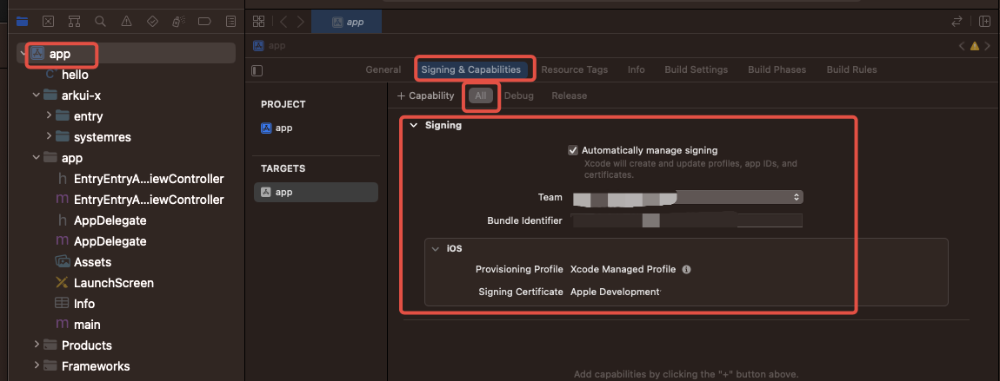
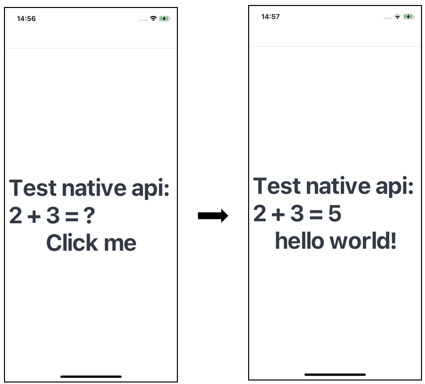

# N-API在iOS平台应用的使用指导

N-API接口可以实现ArkTS/TS/JS与C/C++(Native)之间的交互，ArkUI-X中支持的N-API接口情况和使用场景请见[FFI能力(N-API)](../quick-start/ffi-napi-introduction.md)。N-API在iOS平台上的使用方式中，除去"编译与运行应用"环节与Android平台略有差异外，其余部分均与Android平台相同。本文档将主要介绍N-API在iOS平台上的"编译与运行应用"环节，其他环节可参考[N-API在Android平台应用的使用指导](./how-to-use-napi-on-android.md)。

### 编译与运行应用
相较于Android平台，iOS平台上编译/运行Native工程时需要进行签名操作，完整步骤如下：
1. 点击DevEco Studio(V4.0 Beta2及以上版本)中的"Build > Build Hap(s)/APP(s) > Build APP(s)"进行编译。
2. 使用Xcode工具打开".arkui-x\ios"文件，在Xcode中完成签名操作。

3. 点击Xcode中的运行按钮以完成二次打包，运行应用。

