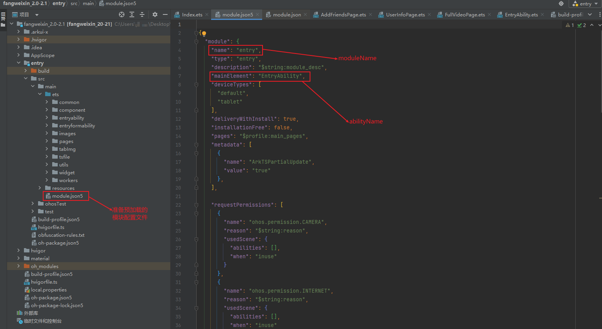

# 预加载应用特性abc开发指南

## 简介

本文介绍如何在iOS平台调用预加载API，预先加载应用特性abc文件，优化ArkUI页面首次启动时间。

## 适用场景

预加载接口适用于一级页面为iOS原生页面，二级页面为ArkUI-X技术实现的页面的应用，如[华为运动健康](https://gitcode.com/arkui-x/docs/blob/master/zh-cn/application-dev/tutorial/how-to-use-arkuix-on-huaweiHealth.md)应用。

首次一级原生页面跳转二级ArkUI页面前，调用预加载接口(预先加载ArkUI页面特性abc文件)，从而优化二级页面启动时间。

## 接口说明

### 导入模块

```java
#import <libarkui_ios/StageApplication.h>
```

### preloadEtsModule

\+ (void)preloadEtsModule:(NSString *)moduleName country:(NSString *)abilityName;

通过moduleName和abilityName预加载应用特性abc

**参数：** 

| 参数名      | 类型     | 必填 | 说明          |
| ----------- | -------- | ---- | ------------- |
| moduleName  | NSString | 是   | 模块名称。    |
| abilityName | NSString | 是   | ability名称。 |

**返回值：** void

**示例：** 

  ```objective-c
// XXX.m iOS原生业务逻辑文件
#import "XXX.h"
#import <libarkui_ios/StageApplication.h>

- (void)viewDidLoad {
    [super viewDidLoad];
    // 预先加载moduleName为entry，abilityName为EntryAbility的应用特性abc文件。
    [StageApplication preloadEtsModule:@"entry" country:@"EntryAbility"];
}
  ```

在DevEco Studio 获取moduleName和abilityName。



## 约束

> 该接口最早使用时机在 [StageApplication launchApplication]; 调用之后；<br/>
