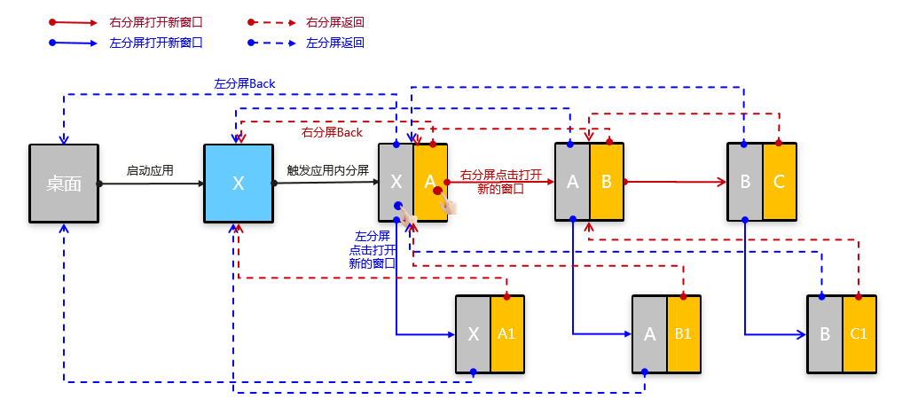
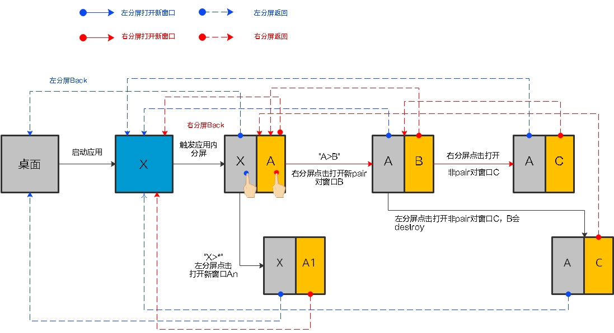
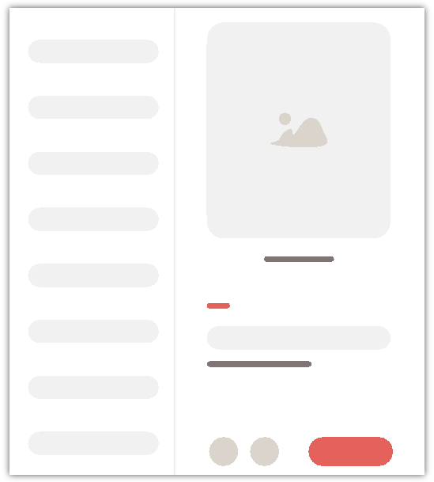
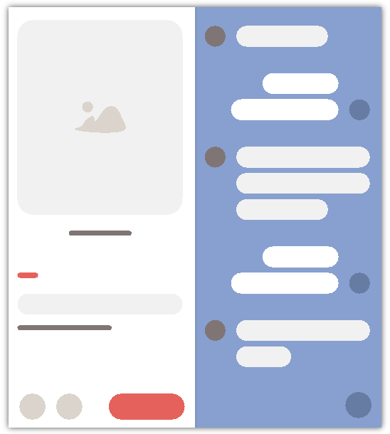
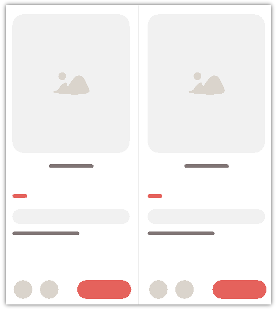
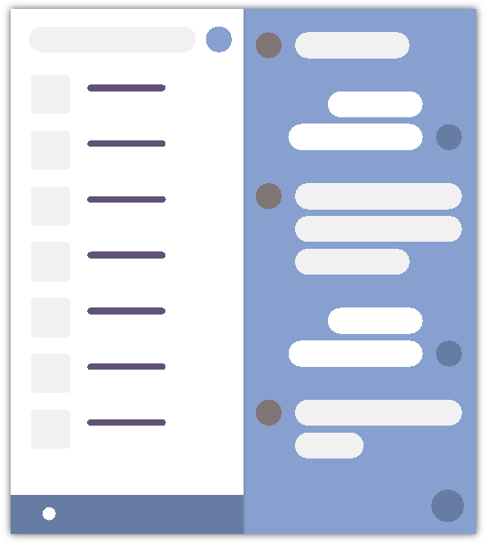
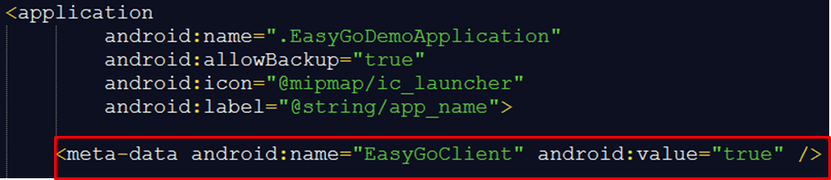

# 平行视界

## 简介

平行视界，一种针对折叠屏设备和平板设备的特殊显示模式，支持同一应用的多个Activity通过左右分屏形式同时在屏幕上展示。

## 显示模式

平行视界提供三种双屏窗口显示模式，最大程度地满足了不同应用场景下用户的需求。

- **购物模式**：屏幕会显示最新点击的窗口，左边为次新，右边为最新。适用于购物类软件。

  - 任意场景，从左分屏打开的新页面，都会将右分屏的页面替换掉。
  - 从右分屏打开新页面，原右分屏页面向左移，新页面在右分屏打开。

  - 从左分屏触发Back，右分屏的Activity会被销毁，左分屏栈顶Activity会被销毁。



- **导航栏模式**：左侧窗口始终保持应用主界面，右边窗口实时显示左边点击的内容。

  关键配置项为：

  1. logicEntities.body.mode值配置为1。
  2. activityPairs 配置策略："From X to *"。其中X为" 应用主界面 "。
  
- **自定义模式**：在这个模式下开发者可以根据业务场景对窗口显示模式进行自定义。

  - 在全屏模式下，满足activityPairs关系的Activity触发分屏。

  - 在已经分屏的情况下，触发了新的Activity，如果该Activity不命中activityPairs关系，则新Activity在右分屏显示，不论是在哪个分屏触发。

    ```json
    // 当从 Android 跳转到Main2AbilityActivity 时由于未命中activityPairs关系
    // 因最终的显示结果是：Main2AbilityActivity 将显示右侧分屏。
    
    "activityPairs": [
        {
            "from": "com.example.basicapplication.AndroidMainActivity",
            "to": "com.example.basicapplication.EntryMain1AbilityActivity"
        },
        //{
        //    "from": "com.example.basicapplication.AndroidMainActivity",
        //    "to": "com.example.basicapplication.EntryMain2AbilityActivity"
        //},
    ],
    ```
    
  - 在已经分屏的情况下，触发了新的Activity，如果该Activity命中activityPairs关系，从左分屏打开的新页面，会将右分屏的页面替换掉；从右分屏打开新页面，原右分屏页面向左移，新页面在右分屏打开。

    ```json
    // 当由 AndroidMainActivity 跳转到 EntryMain1AbilityActivity 时，命中activityPairs关系，
    // 所以最终的显示效果中：左分屏内容为 AndroidMainActivity；右分屏内容为 EntryMain1AbilityActivity。
    
    "activityPairs": [
        {
            "from": "com.example.basicapplication.AndroidMainActivity",
            "to": "com.example.basicapplication.EntryMain1AbilityActivity"
        },
        //{
        //    "from": "com.example.basicapplication.AndroidMainActivity",
        //    "to": "com.example.basicapplication.EntryMain2AbilityActivity"
        //},
    ],
    ```
    
  - 从左分屏触发Back，右分屏的所有Activity会被销毁，左分屏栈顶Activity会被销毁。

    


## 典型场景

- 典型场景一：列表+浏览

  

- 典型场景二：详情+客服

  

- 典型场景三：商品对比

  

- 典型场景四：列表+聊天

  

## 适用平台

- 仅支持Android平台。
- 仅支持折叠屏设备和平板设备，其中部分属性功能仅支持平板设备。
- 要求设备本身系统能力支持"平行视界"功能，不同手机厂家针对该功能的文本描述和系统设置方式略有不同，请以实际真机配置为准。

## 配置指南

### （一）、修改AndroidManifest文件

在 " AndroidManifest.xml " 文件的 " application " 中新增字段 " meta-data "：

```
<meta-data android:name="EasyGoClient" android:value="true" />
```



### （二）、新增easygo.json配置文件

在 " assets " 目录下新建配置文件 " easygo.json "

```json
{
  "easyGoVersion": "1.0",
  "client": "com.example.basicapplication",
  "logicEntities": [
    {
      "head": {
        "function": "magicwindow",
        "required": "true"
      },
      "body": {
        "mode": "1",
        "defaultDualActivities": {
          "mainPages": "com.example.basicapplication.Main1Activity",
          "relatedPage": "com.example.basicapplication.A0Activity"
        },
        "transActivities": [
          "com.example.basicapplication.A1Activity",
          "com.example.basicapplication.A2Activity"
        ],
        "Activities": [
          {
            "name": "com.example.basicapplication.AFullScreenActivity",
            "defaultFullScreen": "true"
          },
          {
            "name": "com.example.basicapplication.BFullScreenActivity",
            "lockSide": "primary"
          }
        ],
        "UX": {
          "supportRotationUxCompat": "false",
          "isDraggable": "false"
        }
      }
    }
  ]
}
```

" easygo.json " 文件模板以及字段详细说明：

- 其中关于配置个数的说明：
  - "?"：说明可以设置值为"0"（不设置值）或 "1"（设置1个值）
  - "*"：说明可以设置多个数值

| 参数                                                      | 描述                                                         | 是否必填 | 限制 | 取值的范例<br>仅作参考                                       |
| --------------------------------------------------------- | ------------------------------------------------------------ | -------- | ---- | ------------------------------------------------------------ |
| easyGoVersion                                             | 协议版本                                                     | 必填     | 1    | "1.0"                                                        |
| client                                                    | Android应用包名                                              | 必填     | 1    | "com.example.basicapplication"                                         |
| logicEntities. head. function                             | 调用组件名，固定值"magicwindow"                              | 必填     | 1    | "magicwindow"                                                |
| logicEntities. head. required                             | 预留字段，固定值"true"                                       | 必填     | 1    | "true"                                                       |
| logicEntities.body.mode                                   | 基础分屏模式<br>0：购物模式（activityPairs节点不生效）<br>1：自定义模式（包括导航栏模式） | 必填     | 1    | "0"                                                          |
| logicEntities.body. activityPairs                         | 自定义模式参数，配置从from页面到to页面的分屏展示             | 选填     | ?    | 表示A上启动B，触发分屏（A左B右）<br/>[{"from" ："com.xxx. ActivityA", "to" ："com.xxx. ActivityB"}] <br/>导航栏模式<br/>[{"from" ："com.xxx. ActivityA", "to" ："*"}] |
| logicEntities.body. activityPairs.from                    | 触发分屏的源Activity                                         | 选填     | *    | "com.example.basicapplication.ActivityA"                               |
| logicEntities.body. activityPairs.to                      | 触发分屏的目标Activity<br>"*"表示任意Activity                | 选填     | *    | "com.example.basicapplication.ActivityB"                               |
| logicEntities.body. defaultDualActivities                 | 应用冷启动默认打开首页双屏配置                               | 选填     | ?    | [{"mainPages":"com.example.basicapplication.ActivityA","relatedPage":"com.example.basicapplication.ActivityB"}] |
| logicEntities.body. defaultDualActivities.mainPages       | 主页面Activity，需要具体的Activity名，不支持通配符。展开态时冷启动应用打开此页面时，系统在右屏自动启动relatedPage页面 | 选填     | 1    | "com.example.basicapplication.ActivityA"                               |
| logicEntities.body.defaultDualActivities.relatedPage      | 右屏默认展示页面Activity，需要具体的Activity名，不支持通配符 | 选填     | 1    | "com.example.basicapplication.ActivityB"                               |
| logicEntities.body.transActivities                        | 过渡页面列表                                                 | 选填     | *    | ["com.example.basicapplication.ActivityA","com.example.basicapplication.ActivityB","com.example.basicapplication.ActivityC"] |
| logicEntities.body.Activities                             | 应用关键Activity属性列表                                     | 选填     | ？   |                                                              |
| logicEntities.body.Activities.name                        | Activity组件名                                               | 选填     | 1    | "com.example.splitscreenview.EntryFeature1AbilityActivity",  |
| logicEntities.body.Activities.defaultFullScreen           | Activity是否支持默认以全屏启动<br>默认值为false<br>true：支持<br>false：不支持 | 选填     | ？   | "true"                                                       |
| logicEntities.body.Activities.lockSide                    | Activity锁定方式，当前仅支持 'primary'<br/>primary：锁定在主界面那一侧，锁定后，另一侧启动新的Activity时不会轻易平推窗口过来，除非推过来的窗口也是primary锁定窗口 | 选填     | ？   | "primary"                                                    |
| logicEntities.body.Activities.isSupportDraggingToFreeform | 当前Activity是否支持拖出到悬浮窗，当logicEntities.body.UX.draggingToFreeForm配置为window时生效<br/>默认值为false<br/>true：支持<br/>false：不支持 | 选填     | ？   | "true"                                                       |
| logicEntities.body.UX                                     | 页面UX控制配置                                               | 选填     | ？   |                                                              |
| logicEntities.body.UX.supportRotationUxCompat             | 是否开启窗口缩放，仅针对平板设备生效<br/>默认值为false<br/>true：支持<br/>false：不支持 | 选填     | ？   | "true"                                                       |
| logicEntities.body.UX.isDraggable                         | 是否支持分屏窗口拖动，仅针对平板设备生效<br/>默认值为false<br/>true：支持<br/>false：不支持 | 选填     | ？   | "true"                                                       |
| logicEntities.body.UX.supportLock                         | 是否支持应用内用户锁定功能，配置为true后，双窗口显示状态会显示锁定按钮，用户点击后可以进行锁定和解锁操作，锁定后，左右窗口不再关联，即左侧打开新窗口在左侧显示，右侧打开新窗口在右侧显示。<br/>默认值为false<br/>true：支持锁定<br/>false：不支持 | 选填     | ？   | "true"                                                       |
| logicEntities.body.UX.draggingToFreeForm                  | 是否支持应用内Activity拖出到悬浮窗。<br/>app：应用内所有Activity均支持拖出到悬浮窗<br/>window：只有在logicEntities.body.Activities中配置了isSupportDraggingToFreeform为true的Activity才支持拖出到悬浮窗<br/>off：关闭应用的拖出到悬浮窗功能 | 选填     | ？   | "window"                                                     |

## FAQ

- **如何验证配置是否生效？**

  目前仅支持真机上进行测试。

- **配置好了如果不生效如何排查？**

  1. 排查"easygo.json"配置文件的格式和内容是否正确，能否正确解析，路径是否正确。
  2. client参数的配置是否正确，确认是Android应用的包名。
  3. 真机系统设置菜单中该应用的平行视界开关是否开启。
  4. 折叠屏是设备竖屏方向生效，平板是设备横屏方向生效。
  5. 真机系统系统版本是否升级到最新的版本。

- **配置Activity A B的跳转关系对（activityPairs）时，能在A页面触发打开A页面的新实例同时分屏显示吗？**

  可以，配置from A to A即可。

- **除了支持1:1的比例分屏，还支持其它的比例分屏吗？**

  目前只支持1:1的比例分屏。

- **应用能感知当前Activity是在左分屏还是右分屏吗？**

  目前三方应用无法感知。

- **支持多少跳转关系对（activityPairs）的配置？**

  目前对于整个配置文件的建议是不大于500KB，对于具体配置条目个数没有限制。

- **配置Activity A B的跳转关系对（activityPairs）时，如果即希望A打开B能分屏，也希望B打开A能分屏，配置一条关系可以吗？**

  在easygo.json中activityPairs配置中区分from和to，如果相互打开都能触发分屏，需要配置两条，分别是from A to B和from B to A。


