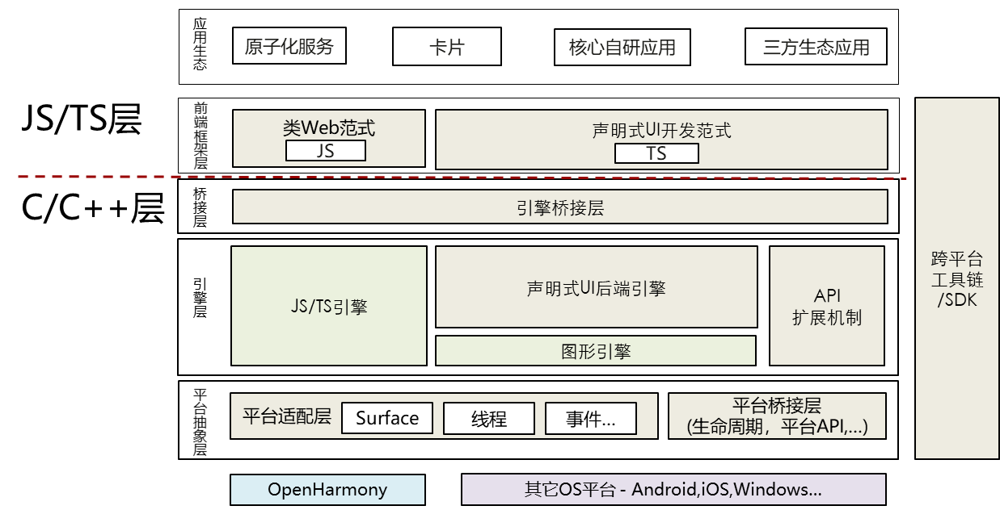
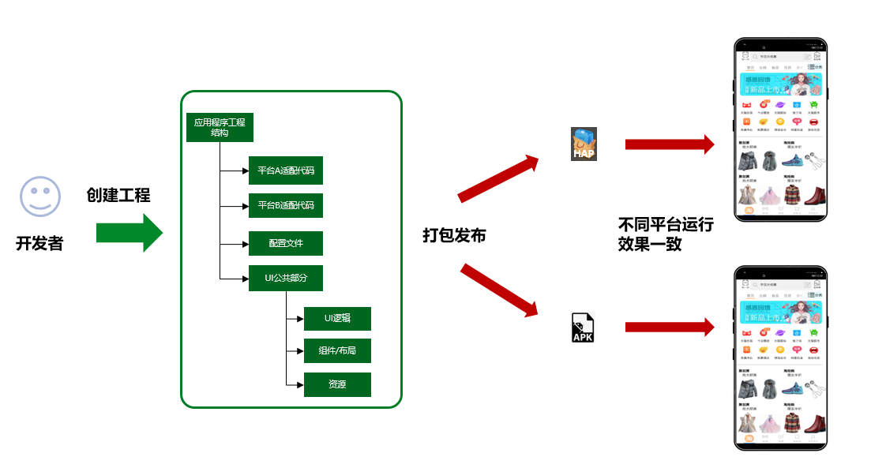
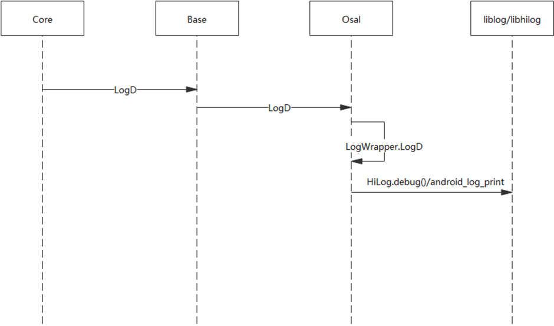
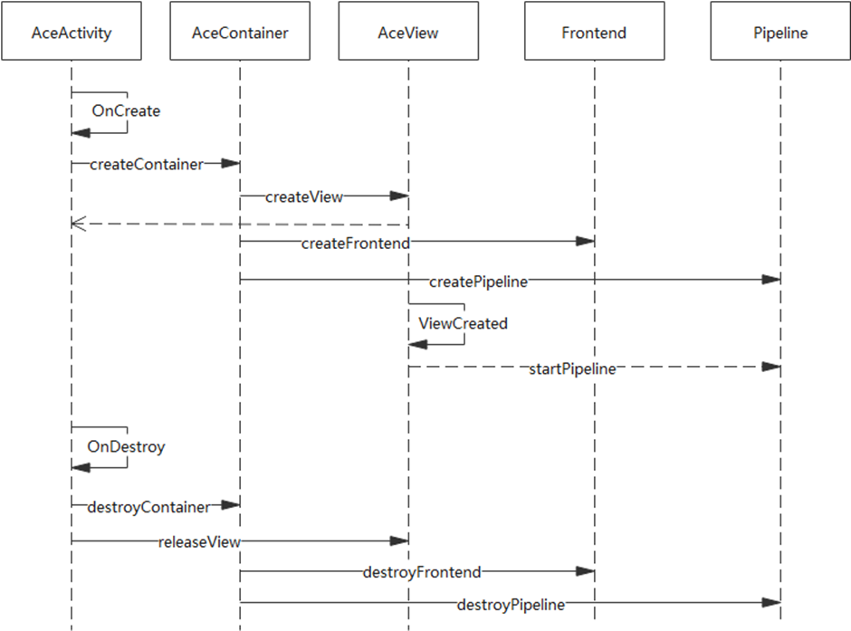
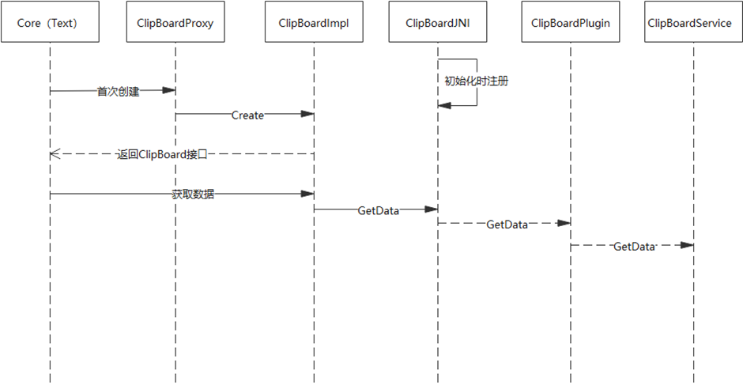

# ArkUI跨平台设计总体说明

## 简介

### 范围

本文档描述ArkUI开发框架跨平台运行能力相关的总体技术方案。

ArkUI是面向全设备的UI开发框架，已通过OpenHarmony代码仓开放，其关键组成包括：开发模型; 应用界面&交互; 扩展机制-使能三方组件&平台API扩展机制。

ArkUI-X项目旨在将ArkUI开发框架扩展至其他OS平台（Android/iOS/Windows等），使开发者能够基于ArkUI开发框架，复用绝大部分的应用代码（UI以及主要应用逻辑），即可部署到不同OS平台上。

### 假设和约束

本文提到的跨平台是指UI部分的跨平台，其UI代码可以重用，其它应用对平台依赖的能力，需要应用层面进行适配，或通过JS API封装机制（NAPI），进行实现暴露到JS层。

涉及平台能力的JS API（比如网络、存储等）请参考OpenHarmony中的定义，需要通过在不同平台的封装实现达到复用的目的。

本文主要是通用方案设计说明，并以Android平台做为示例说明，其他平台的基本设计思路类似，但相关设计需进一步细化补充。

## 总体视图 

 

从设计之初，**跨平台**就作为ArkUI最基本的设计目标之一，当前已支持基础的跨平台架构.相关的设计思路如下：

1. 采用**C++**编写整体后端引擎代码，保持在多平台的可移植性，最小化平台依赖，降低平台移植成本
2. 整体绘制采用自渲染机制，降低平台依赖，同时进一步提升绘制效果的一致性
3. 抽象出平台适配层以及平台桥接层，以便不同平台的适配

## 模块功能介绍 

ArkUI主要包括以下几个模块：

1. 前端框架层， 包括JavaScript前端框架，JS UI组件等，可跨平台
2. 声明式UI后端引擎，包括布局，渲染，C++ UI组件，事件机制等，可跨平台
3. API扩展机制，基于NAPI机制，可跨平台。 不同平台需要各自扩展具体的API实现
4. 工具链/SDK,  工具链可跨平台，SDK需基于不同平台构建

另外，ArkUI依赖的JS/TS引擎以及图形引擎，也可跨平台。

ArkUI声明式UI后端引擎，主要完成整体pipeline流程控制、视图更新、布局系统、多页面管理、事件分发和回调、焦点管理、动画机制、主题机制、资源管理/缓存/provider等。 其中的UI组件，主要通过显示相关组件细粒度化，动画、事件、焦点等机制组件化，满足适配不同前端所需要的灵活性。

整体的跨平台需求，就是扩展ArkUI开发框架到其他OS平台，帮助开发者降低多平台应用开发成本。

以Android平台为例，提供Android平台的SDK及工具，可以让开发者同时构建出OpenHarmony版本hap及Android版本的apk。




## 方案设计

### 跨平台应用结构设计

跨平台应用目录结构，包含一套为ArkUI-X开发者提供的应用工程模板，提供构建OpenHarmony应用、Android应用、iOS应用的能力。跨平台应用工程0层结构设计如下：

```
ArkUI-X AppProject
  ├── ohos              // OpenHarmony平台相关代码 0-1
  │   └── entry
  ├── android           // Android平台相关代码 0-2
  │   └── app
  ├── ios               // iOS平台相关代码 0-3
  │   └── app
  └── source            // ArkUI页面源码 0-4
      └── entry
```

项目根目录包含：ohos、android、ios、source四个目录，分别对应OpenHarmony应用、Android应用、iOS应用，ArkUI源码模块。每个目录下的entry和app目录表示创建的模块（entry/app为默认创建的模块名），每个模块对应一个编译单元（hap/apk/app）。其中，source目录是OpenHarmony默认的结构，存放公共的代码，配合上述平台的代码构建出对应平台的应用。可以使用基于eTS的声明式范式或兼容JS的类Web范式进行开发。

* OpenHarmony平台工程结构（0-1）

```
OpenHarmony平台代码
  ├── .hvigor
  ├── entry
  │   ├── src
  │   │   ├── main
  │   │   │   ├── ets
  │   │   │   ├── resources
  │   │   │   └── config.json
  │   │   └── ohosTest
  │   ├── build-profile.json5
  │   ├── hvigorfile.js
  │   └── package.json
  ├── node_modules
  ├── build-profile.json5
  ├── hvigorfile.js
  ├── local.properties
  └── package.json
```

* Android平台工程结构（0-2）

```
Android平台代码
  ├── app
  │   ├── libs
  │   │   ├── ace_android_adapter.jar               // ArkUI跨平台适配层，在SDK中发布
  │   │   └── arm64-v8a
  │   │       ├── libace_android.so                 // ArkUI引擎库，在SDK中发布
  │   │       ├── libace_napi.so                    // API接口扩展库，在SDK中发布
  │   │       ├── libace_napi_quickjs.so            // JS引擎库，在SDK中发布
  │   │       └── libxxx.so                         // 其它功能模块库
  │   ├── src
  │   │   ├── androidTest
  │   │   ├── main
  │   │   │   ├── assets                            // ArkUI编译后的JSBundle和Resources，作为资源文件存放在assets
  │   │   │   │   ├── js
  │   │   │   │   │   └── entry_MainAbility         // JSBundle，来自source目录ArkUI源码编译结果。
  │   │   │   │   └── res                           // resources资源
  │   │   │   │       ├── appres                    // 应用资源，来自source目录resources资源编译结果。
  │   │   │   │       └── systemres                 // 系统资源
  │   │   │   ├── java/com/example/myapp
  │   │   │   │   ├── MyApplication.java            // 基于AceApplication扩展MyApplication
  │   │   │   │   └── MainActivity.java             // 基于AceActivity扩展MainActivity
  │   │   │   ├── res
  │   │   │   └── AndroidManifest.xml
  │   │   └── test
  │   ├── build.gradle
  │   └── proguard-rules.pro
  ├── gradle/wrapper
  ├── build.gradle
  ├── gradle.properties
  ├── gradlew
  ├── gradlew.bat
  └── settings.gradle
```

* iOS平台工程结构（0-3）

```
iOS平台代码
  ├── myapp.xcodeproj
  │   ├── project.xcworkspace
  │   └── project.pbxproj
  ├── myapp
  │   ├── Assets.xcassets
  │   ├── base.Iproj
  │   ├── AppDelegate.h
  │   ├── AppDelegate.mm              // 实例化AceViewController, 并加载JSBundle和Resources资源。
  │   ├── Info.plist
  │   └── main.m
  ├── js                              // ArkUI JSBundle，来自source目录ArkUI源码编译结果。
  │   └── entry_MainAbility
  ├── res                             // Resources资源
  │   ├── appres                      // 应用资源，来自source目录resources资源编译结果。
  │   └── systemres                   // 系统资源
  └── framework                       // ArkUI跨平台Framework动态库
      └── libace_ios.xcframework
```

* ArkUI源码目录（0-4）

```
source
  └── entry/src
      ├── main
      │   ├── ets
      │   │   └── MainAbility
      │   │       ├── app.ets
      │   │       ├── manifest.json
      │   │       └── pages
      │   └── resources
      └── ohosTest
``` 

### 跨平台SDK结构设计
ArkUI-X项目编译构建提供了一套基于GN和Ninja的编译构建框架，基础构建流程Fork OpenHarmony build仓，并在OpenHarmony构建基础上新增Android和iOS编译工具链，以支持ArkUI跨平台SDK编译输出。跨平台SDK主要用于支持CLI命令行跨平台应用构建和DevEco Studio\Android Studio\Xcode集成跨平台应用开发。内容范围主要包括：
1. 提供ArkUI跨平台开发框架基础引擎动态库和JS运行时动态库。
2. 提供ArkUI跨平台Native接口，比如：NAPI，XComponent，Plugins等。
3. 提供ArkUI跨平台应用构建命令行工具。
4. 提供ArkUI开发范式JS2Bundle编译解析工具链。
5. 提供ArkUI组件渲染一致性系统资源包，应用资源编译工具。
6. 提供@ohos基础接口跨平台适配动态库以及d.ts接口声明文件。

* ArkUI-X项目跨平台SDK组成示意图

```
ArkUI-X项目SDK组成
  ├── libs                                                               // ArkUI跨平台引擎及平台适配层
  │   ├── android-arm64
  │   │   ├── engine
  │   │   │   ├── ace_android.jar                                        // ArkUI-X Android平台适配层
  │   │   │   ├── arm64-v8a
  │   │   │   └── libace_android.so                                      // ArkUI跨平台引擎动态库
  │   │   └── plugins
  │   │       ├── ${module-name}
  │   │       │   ├── ace_ohos_${module-name}.jar
  │   │       │   └── libace_ohos_${module-name}.so
  │   │       └── ${module-name2}
  │   └── ios-arm64
  │       ├── engine
  │       │   ├── xcframework                                            // ArkUI跨平台XCFramework动态库
  │       │   │   └── libace_ios.xcframework
  │       │   │       ├── Info.plist
  │       │   │       └── ios-arm64
  │       │   │           └── libace_ios.framework
  │       │   │               ├── Headers
  │       │   │               │   ├── Ace.h
  │       │   │               │   ├── AceViewController.h
  │       │   │               │   └── FlutterPlugin.h
  │       │   │               ├── Info.plist
  │       │   │               ├── libace_ios
  │       │   │               ├── libace_ios.podspec
  │       │   │               └── Modules
  │       │   │                   └── module.modulemap
  │       │   └── framework
  │       │       └── libace_ios.framework
  │       └── plugins
  │           ├── ${module-name}
  │           │   ├── xcframework
  │           │   │   └── libace_ohos_${module-name}.xcframework
  │           │   └── framework
  │           │       └── libace_ohos_${module-name}.framework
  │           └── ${module-name2}
  ├── ets                                                                // 基于eTS的声明式范式JSBundle编译工具链
  │   ├── api
  │   └── build-tools
  ├── js                                                                 // 兼容JS的类Web范式JSBundle编译工具链
  │   ├── api
  │   └── build-tools
  ├── native                                                             // ArkUI跨平台Android侧Native接口，比如NAPI和XComponent。
  │   └── include
  │       ├── napi
  │       └── ace
  ├── toolchains                                                         // ArkUI-X项目跨平台应用构建命令行工具
  │   ├── cli
  │   └── restool
  ├── systemres                                                          // ArkUI组件渲染一致性系统资源包
  ├── licenses
  └── readme.md
```

### 操作系统抽象层

基于C++实现的OS Abstract Layer，屏蔽不同平台的OS相关的实现，主要包含功能列表：

- 日志、Trace抽象层
- 网络接口抽象层
- 文件/资源读写抽象层
- 基础线程抽象层
- 系统资源管理抽象及实现
- 系统Prop配置读取抽象层
- 打点能力抽象层

以Log调用流程为例，整体交互流程如下：




如上述流程，Core模块直接使用Base提供的接口，Base模块对接口进行定义，对于依赖平台的能力，在编译期就选择了对应OS的平台抽象层OSAL。运行时，直接通过OSAL的实现，调用到具体平台相关的库中。

 
### 跨平台启动入口

对应平台语言实现的Entrance，提供不同平台的基础入口环境，功能列表：

提供多个平台的加载入口，如OpenHarmony侧为一个Ability，Android侧为一个Activity；

声明式范式抽象Android的TS入口接口

对接不同平台的生命周期、事件输入、Vsync；

对接不同平台的窗口系统、硬件渲染加速；

对接不同平台的应用信息

不同平台的原生语言转换到统一的C++后端，公共代码复用；

以Android的启动流程为例，整体交互流程如下：




### 跨平台能力桥接

跨平台能力桥接包含框架内部需要用到的不同的平台能力模块，如：剪切板、输入法、视频等，提供基础能力模块的定义，不同平台按照定义实现对应的功能模块。功能列表：

- 剪切板抽象接口，及不同平台的实现；
- 输入法抽象接口，及不同平台的实现；
- 视频媒体、Camera抽象接口，及不同平台的实现；
- WebView抽象接口，及不同平台的实现；
- RichText抽象接口，及不同平台的实现；
- XComponent不同平台的实现；
- 其它框架内部需要用到的不同的平台能力模块

以剪切板ClipBoard为例，整体交互流程如下：





如上图，例如在框架核心层的TextField组件中，需要用到剪切板的能力，通过Proxy创建具体的ClipBoard实现，返回抽象的ClipBoard接口。在组件实现层即可实现平台无关的调用。以Android平台为例，GetData的调用会通过JNI调用到平台实现的Plugin中，然后Plugin通过访问剪切板服务实现对应的功能。


### API扩展机制

1、JS API的通用封装机制，提供多JS引擎抽象封装，用于Native接口能力暴露到JS层的统一封装机制该能力直接复用OpenHarmony上的统一封装机制，扩展API （C++实现），并实现部分内置API，NAPI的整体结构如下图。

对于不同平台，**JS API需要遵循OpenHarmony的API定义**，在不同平台上通过API扩展机制进行扩展。


NAPI需求列表如下：

NAPI的Android平台编译

支持应用通过NAPI扩展接口，并通过apk运行时动态加载

扩展部分内置API，支持apk运行时动态加载 (按照OpenHarmony的API定义实现)

NAPI快速扩展Android平台系统API的能力（JS-&gt;C++-&gt;Java）

### 跨平台命令行工具CLI

CLI作为ArkUI-X项目跨平台应用构建工具，具有创建/编译/安装/运行调试OpenHarmony、Android和iOS应用的能力。

```
CLI代码结构
  ├── cli
  │   ├── src                  // 各命令行代码实现
  │   │   ├── ace-check        // 查验ArkUI跨平台应用开发依赖的的库和工具链是否完整
  │   │   ├── ace-config       // 配置ArkUI跨平台应用开发环境
  │   │   ├── ace-devices      // 列出当前PC所链接的各平台设备
  │   │   ├── ace-create       // 创建ArkUI跨平台应用工程
  │   │   ├── ace-build        // 构建跨平台应用安装包
  │   │   ├── ace-install      // 将跨平台应用安装到连接的设备上
  │   │   ├── ace-launch       // 在设备上运行跨平台应用。
  │   │   ├── ace-run          // 运行跨平台应用包。
  │   │   ├── ace-clean        // 清理跨平台应用编译结果。
  │   │   ├── ace-uninstall    // 将跨平台应用从设备上卸载。
  │   │   └── ace-log          // 滚动展示正在运行的跨平台应用的 log。
  │   ├── templates            // 跨平台模板，包含OH、Android、iOS、source。
  │   ├── bin                  // 命令行入口脚本
  │   ├── package.json
  │   ├── rollup.config.js
  │   └── README.md
  ├── README.md
  └── LICENSE
```