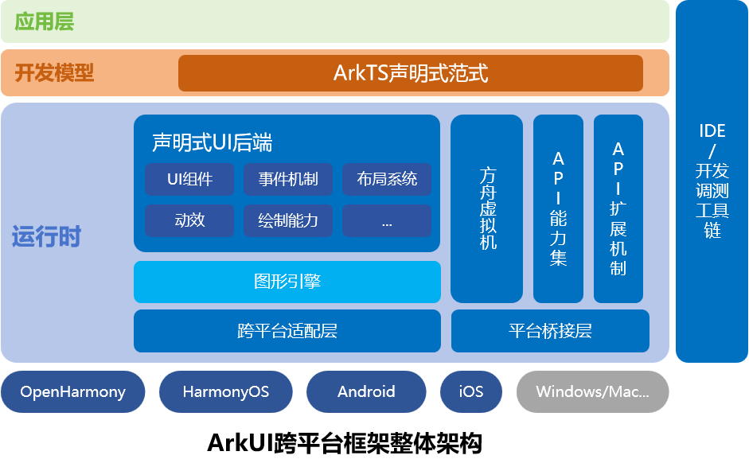

# ArkUI跨平台设计总体说明

## 简介

本文档描述ArkUI开发框架跨平台运行能力相关的总体技术方案。

### 范围

ArkUI是面向全设备的UI开发框架，已通过OpenHarmony代码仓开源，其关键组成包括：
  - 开发模型;
  - 应用界面&交互;
  - 扩展机制-使能三方组件&平台API扩展机制。

ArkUI-X项目旨在将ArkUI开发框架扩展至其他OS平台（Android/iOS/Windows等），使开发者能够基于ArkUI开发框架，复用绝大部分的应用代码（UI以及主要应用逻辑），即可部署到不同OS平台上。

### 假设和约束

本文提到的跨平台是指UI部分的跨平台，其UI代码可以重用，其它应用对平台依赖的能力，需要应用层面进行适配，或通过JS API封装机制（NAPI），进行实现暴露到JS层。

涉及平台能力的JS API（比如网络、存储等）请参考OpenHarmony中的定义，需要通过在不同平台的封装实现达到复用的目的。

本文主要是通用方案设计说明，并以Android平台做为示例说明，其他平台的基本设计思路类似，但相关设计需进一步细化补充。

## 总体视图 

 

从设计之初，**跨平台**就作为ArkUI最基本的设计目标之一，当前已支持基础的跨平台架构。相关的设计思路如下：

1. 采用 **C++** 编写整体后端引擎代码，保持在多平台的可移植性，最小化平台依赖，降低平台移植成本。
2. 整体绘制采用自渲染机制，降低平台依赖，同时进一步提升绘制效果的一致性。
3. 抽象出平台适配层以及平台桥接层，以便不同平台的适配。

## 模块功能介绍 

ArkUI主要包括以下几个模块：

1. 研发模型，兼容OpenHarmony应用的Stage开发模型，支持基于ArkTS的声明式开发范式，可跨平台。
2. 声明式UI后端引擎，包括布局，渲染，C++ UI组件，事件机制等，可跨平台。
3. API扩展机制，基于NAPI机制，可跨平台。 不同平台需要各自扩展具体的API实现。
4. 工具链/SDK,  工具链可跨平台，SDK需基于不同平台构建。

另外，ArkUI依赖的ArkTS引擎以及图形引擎，也可跨平台。

ArkUI声明式UI后端引擎，主要完成整体pipeline流程控制、视图更新、布局系统、多页面管理、事件分发和回调、焦点管理、动画机制、主题机制、资源管理/缓存/provider等。 其中的UI组件，主要通过显示相关组件细粒度化，动画、事件、焦点等机制组件化，满足适配不同前端所需要的灵活性。

整体的跨平台需求，就是扩展ArkUI开发框架到其他OS平台，帮助开发者降低多平台应用开发成本。

通过ACE Tools命令行工具创建跨平台应用工程，开发者基于一套主代码，就可以构建支持多平台的精美、高性能应用。


## 方案设计

### 跨平台应用包结构设计

跨平台应用目录结构，包含一套为ArkUI-X开发者提供的应用工程模板，提供构建OpenHarmony应用、Android应用、iOS应用的能力。跨平台应用工程0层结构设计如下：

```
ArkUI-X AppProject
  ├── ohos              // OpenHarmony平台相关代码 0-1
  │   └── entry
  ├── android           // Android平台相关代码 0-2
  │   └── app
  ├── ios               // iOS平台相关代码 0-3
  │   └── app
  └── source            // ArkUI页面源码 0-4
      └── entry
```

项目根目录包含：ohos、android、ios、source四个目录，分别对应OpenHarmony应用、Android应用、iOS应用，ArkUI源码模块。每个目录下的entry和app目录表示创建的模块（entry/app为默认创建的模块名），每个模块对应一个编译单元（hap/apk/app）。其中，source目录是OpenHarmony默认的结构，存放公共的基于ArkTS的声明式开发范式代码，配合上述平台的代码构建出对应平台的应用。

* OpenHarmony平台工程结构（0-1）

  ```
  OpenHarmony平台代码
    ├── .hvigor
    ├── AppScope
    ├── entry
    │   ├── src
    │   │   ├── main
    │   │   │   ├── ets
    │   │   │   └── resources
    │   │   └── ohosTest
    │   ├── build-profile.json5
    │   ├── hvigorfile.js
    │   └── package.json
    ├── hvigor
    ├── oh_modulesß
    ├── build-profile.json5
    ├── hvigorfile.ts
    ├── hvigorw
    ├── hvigorw.bat
    ├── local.properties
    └── oh-package.json5
  ```

* Android平台工程结构（0-2）

  ```
  Android平台代码
    ├── app
    │   ├── libs
    │   │   ├── ace_android_adapter.jar               // ArkUI跨平台适配层，在SDK中发布
    │   │   └── arm64-v8a
    │   │       ├── libarkui_android.so               // ArkUI引擎库，在SDK中发布
    │   │       └── libxxx.so                         // 其它功能模块库，在SDK中发布
    │   ├── src
    │   │   ├── androidTest
    │   │   ├── main
    │   │   │   ├── assets
    │   │   │   │     └─arkui-x                       // ArkUI应用编译后的字节码文件和Resources，作为资源文件存放在assets/arkui-x中
    │   │   │   │        ├─entry                      // ArkUI单个模块的编译结果
    │   │   │   │        │   ├─ets                    // ArkUI单个模块代码的编译结果：包括字节码文件以及sourceMap文件
    │   │   │   │        │   └─resources              // ArkUI单个模块资源的编译结果：source目录下resources资源的编译结果
    │   │   │   │        └─systemres                  // ArkUI框架自带的系统资源
    │   │   │   │             └─resources
    │   │   │   ├── java/com/example/myapp
    │   │   │   │   ├── MyApplication.java            // 基于StageApplication扩展MyApplication
    │   │   │   │   └── EntryMainAbilityActivity.java // 基于StageActivity扩展EntryMainAbilityActivity
    │   │   │   ├── res
    │   │   │   └── AndroidManifest.xml
    │   │   └── test
    │   ├── build.gradle
    │   └── proguard-rules.pro
    ├── gradle/wrapper
    ├── build.gradle
    ├── gradle.properties
    ├── gradlew
    ├── gradlew.bat
    └── settings.gradle
  ```

* iOS平台工程结构（0-3）

  ```
  iOS平台代码
    ├── app.xcodeproj
    │   ├── project.xcworkspace
    │   └── project.pbxproj
    ├── app
    │   ├── Assets.xcassets
    │   ├── base.Iproj
    │   ├── AppDelegate.h
    │   ├── AppDelegate.mm              // 应用入口, 驱动StageApplication的生命周期
    │   ├── EntryMainViewController.h
    │   ├── EntryMainViewController.mm  // 基于StageViewController扩展EntryMainViewController
    │   ├── Info.plist
    │   └── main.m
    ├─arkui-x                           // ArkUI应用编译后的字节码文件和Resources，作为资源文件存放在arkui-x目录
    │  ├─entry                          // ArkUI单个模块的编译结果    
    │  │  ├─ets                         // ArkUI单个模块代码的编译结果：包括字节码文件以及sourceMap文件
    │  │  └─resources                   // ArkUI单个模块资源的编译结果：source目录下resources资源的编译结果
    │  └─systemres                      // ArkUI框架自带的系统资源
    │      └─resources
    └─frameworks                        // ArkUI跨平台Framework动态库：包含ArkUI-X的框架以及插件
  ```

* ArkUI源码目录（0-4）

  ```
  source
    └── entry/src
        ├── main
        │   ├── etsß
        │   │    ├─Application
        │   │    ├─mainability
        │   │    └─pages
        │   └── resources
        └── ohosTest
  ``` 

### 跨平台框架构建系统
ArkUI-X项目编译构建提供了一套基于GN和Ninja的编译构建框架，基础构建基于OpenHarmony的build仓，并在OpenHarmony构建基础上新增Android和iOS编译工具链，以支持ArkUI跨平台SDK编译输出。

### 跨平台SDK结构设计
跨平台SDK主要用于支持ACE Tools命令行跨平台应用构建和DevEco Studio\Android Studio\Xcode集成跨平台应用开发。内容范围主要包括：
1. 提供ArkUI跨平台开发框架基础引擎动态库。
2. 提供ArkUI跨平台应用构建命令行工具。
3. 提供ArkUI组件渲染一致性系统资源包，应用资源编译工具。

ArkUI-X项目跨平台SDK组成结构如下：

```
arkui-x
  ├─engine                                           // ArkUI-X的引擎库
  │  ├─ets
  │  ├─lib                                           // ArkUI-X的引擎库：包括Android平台及架构的动态库
  │  │  ├─arkui
  │  │  │  └─android-${target-arch}-${runtime_mode}
  │  │  ├─include
  │  │  │  └─napi
  │  │  ├─third_party
  │  │  └─utils
  |  ├── framework                                   // ArkUI-X的引擎库：包括iOS平台及架构的framework库
  │  |  └── arkui
  │  |      └── ios-${target-arch}-${runtime_mode}
  │  |          └── libarkui_ios.framework
  │  ├─systemres                                    // ArkUI-X框架自带的资源
  │  |   └─resources
  |  └── xcframework                                // ArkUI-X的引擎库：包括iOS平台及架构的xcframework库
  |      └── arkui
  |        └── ios-${runtime_mode}
  |             └── libarkui_ios.xcframework
  ├─plugins                                         // ArkUI-X官方提供的插件库
  │  ├─api
  │  │  ├─lib
  │  │  │   ├─${module-name}
  │  │  │   │  └─android-${target-arch}-${runtime_mode}
  │  │  │   ├─...
  │  │  │   └─...
  |  |  ├─framework
  │  │  | └── ios-${target-arch}-${runtime_mode}
  │  │  |     ├── ${module-name}.framework
  │  │  │     └─...
  |  |  └─xcframework
  │  │    └── ios-${runtime_mode}
  │  │        ├── ${module-name}.xcframework
  │  │        └─...
  │  └─component
  ├─toolchains                                      // ArkUI-X应用开发工具
  │   └─ace_tools
  │       ├─src
  │       └─templates
  ├── arkui-x.json
  ├── NOTICE.txt
  └── sdkConfig.json
```

### 操作系统抽象层

基于C++实现的OS Abstract Layer (下文缩写为OSAL)，屏蔽不同平台的OS相关的实现，主要包含功能列表：

- 日志、Trace抽象层
- 网络接口抽象层
- 文件/资源读写抽象层
- 基础线程抽象层
- 系统资源管理抽象及实现
- 系统Prop配置读取抽象层
- 打点能力抽象层

以Log调用流程为例，整体交互流程如下：


如上述流程，Core模块直接使用Base提供的接口，Base模块对接口进行定义，对于依赖平台的能力，在编译期就选择了对应OS的平台抽象层OSAL。运行时，直接通过OSAL的实现，调用到具体平台相关的库中。

 
### 跨平台启动入口

开发框架对应平台语言实现的Entrance，提供不同平台的基础入口环境，跨平台启动入口功能列表：

- 提供多个平台的加载入口，如OpenHarmony侧为一个Ability，Android侧为一个Activity。

- 对接不同平台的生命周期、事件输入、Vsync。

- 对接不同平台的窗口系统、硬件渲染加速。

- 对接不同平台的应用信息。

- 不同平台的原生语言转换到统一的C++后端，公共代码复用。

以Android的启动流程为例，整体交互流程如下：


Stage模型下，Ability声明周期的入口为StageAbility，生命周期一直会通知到JsAbility，执行用户的生命周期回调方法，UI的页面是在`onWindowStageCreated`的生命周期中，调用Window的`loadContent`接口进行加载，创建ArkUI的实例并初始化渲染管线，将页面进行渲染显示。


### 跨平台能力桥接

跨平台能力桥接包含框架内部需要用到的不同的平台能力模块，如：剪切板、输入法、视频等，提供基础能力模块的定义，不同平台按照定义实现对应的功能模块。功能列表：

- 剪切板抽象接口，及不同平台的实现。
- 输入法抽象接口，及不同平台的实现。
- 视频媒体等抽象接口，及不同平台的实现。
- 其它框架内部需要用到的不同的平台能力模块。

以剪切板ClipBoard为例，整体交互流程如下：


如上图，例如在框架核心层的TextField组件中，需要用到剪切板的能力，通过Proxy创建具体的ClipBoard实现，返回抽象的ClipBoard接口。在组件实现层即可实现平台无关的调用。以Android平台为例，GetData的调用会通过JNI调用到平台实现的Plugin中，然后Plugin通过访问剪切板服务实现对应的功能。


### API扩展机制

1、JS API扩展机制，用于Native接口能力暴露到JS层，该机制直接复用OpenHarmony上的统一封装机制，扩展API （C++实现），并实现部分内置API，NAPI的整体结构如下图。

对于不同平台，**JS API需要遵循OpenHarmony的API定义**，在不同平台上通过API扩展机制进行扩展。


### 跨平台命令行工具ACE Tools

ACE Tools命令行工具作为ArkUI-X项目跨平台应用构建工具，具有创建/编译/安装/运行调试OpenHarmony、Android和iOS应用的能力。

```
ACE Tools代码结构
 cli
  ├─node_modules
  ├─src
  │  ├─ace-build                 // 构建跨平台应用安装包
  │  │  ├─ace-compiler
  │  │  └─ace-packager
  │  ├─ace-check                 // 查验ArkUI跨平台应用开发依赖的的库和工具链是否完整
  │  ├─ace-clean                 // 清理跨平台应用编译结果
  │  ├─ace-config                // 配置ArkUI跨平台应用开发环境
  │  ├─ace-create                // 创建ArkUI跨平台应用工程
  │  │  ├─aar
  │  │  ├─ability
  │  │  ├─component
  │  │  ├─framework
  │  │  ├─module
  │  │  └─project
  │  ├─ace-devices               // 列出当前PC所链接的各平台设备
  │  ├─ace-install               // 将跨平台应用安装到连接的设备上
  │  ├─ace-launch                // 在设备上运行跨平台应用
  │  ├─ace-log                   // 滚动展示正在运行的跨平台应用的日志
  │  ├─ace-run                   // 运行跨平台应用包
  │  ├─ace-test                  // 执行测试代码
  │  ├─ace-uninstall             // 将跨平台应用从设备上卸载
  │  ├─bin                       // 命令行入口脚本
  │  └─util
  └─templates                    // 跨平台应用工程模板
```
