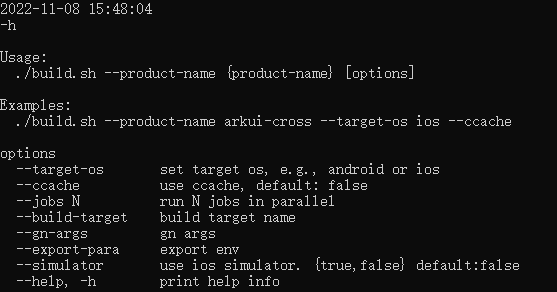

# ArkUI-X项目编译

- 编译命令支持选项

  ```shell
  --product-name    # 必须  编译的产品名称，如：arkui-cross
  --target-os       # 必须  编译的跨平台目标，如：android或ios
  --build-target    # 可选  指定编译目标，可以指定多个
  --gn-args         # 可选  gn参数，支持指定多个
  --ccache          # 可选  编译使用ccache，需要本地安装ccache
  --help, -h        # 可选  命令行help辅助命令
  ```
  - 命令行辅助查询

  ```shell
  ./build.sh -h
  ```
   

- 示例展示

  - ArkUI-X项目Android平台编译命令：

  ```shell
  ./build.sh --product-name arkui-cross --target-os android --ccache
  ```

  - ArkUI-X项目iOS平台编译命令：

  ```shell
  ./build.sh --product-name arkui-cross --target-os ios --ccache
  ```